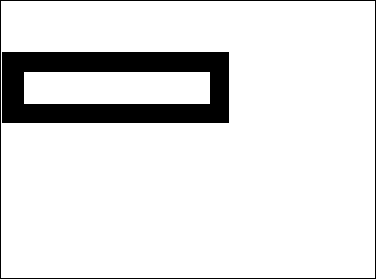

A Picture field, variable or expression can be any Windows or Macintosh picture. In general, this includes any picture that can be put on the pasteboard or read from the disk using 4D commands such as `READ PICTURE FILE`.

4D uses native APIs to encode (write) and decode (read) picture fields and variables under both Windows and macOS. These implementations provide access to numerous native formats, including the RAW format, currently used by digital cameras.

*	on Windows, 4D uses WIC (Windows Imaging Component).
*	on macOS, 4D uses ImageIO.

WIC and ImageIO permit the use of metadata in pictures. Two commands, `SET PICTURE METADATA` and `GET PICTURE METADATA`, let you benefit from metadata in your developments.

## Picture Codec IDs  

4D supports natively a wide set of [picture formats](FormEditor/pictures.md#native-formats-supported), such as .jpeg, .png, or .svg.

Picture formats recognized by 4D are returned by the `PICTURE CODEC LIST` command as picture Codec IDs.  They can be returned in the following forms:

*	As an extension (for example “.gif”)
*	As a MIME type (for example “image/jpeg”)

The form returned for each format will depend on the way the Codec is recorded at the operating system level. Note that the list of available codecs for reading and writing can be different since encoding codecs may require specific licenses.

Most of the [4D picture management commands](https://doc.4d.com/4Dv18/4D/18/Pictures.201-4504337.en.html) can receive a Codec ID as a parameter. It is therefore imperative to use the system ID returned by the `PICTURE CODEC LIST` command.
Picture formats recognized by 4D are returned by the `PICTURE CODEC LIST` command.


## Picture operators

|Operation	|Syntax	|Returns	|Action|
|---|---|---|---|
|Horizontal concatenation	|Pict1 + Pict2	|Picture	|Add Pict2 to the right of Pict1
|Vertical concatenation	|Pict1 / Pict2	|Picture	|Add Pict2 to the bottom of Pict1|
|Exclusive superimposition	|Pict1 & Pict2	|Picture	|Superimposes Pict2 on top of Pict1 (Pict2 in foreground). Produces the same result as `COMBINE PICTURES(pict3;pict1;Superimposition;pict2)`
|Inclusive superimposition	|Pict1 &#124; Pict2	|Picture	|Superimposes Pict2 on Pict1 and returns resulting mask if both pictures are the same size. Produces the same result as `$equal:=Equal pictures(Pict1;Pict2;Pict3)`|
|Horizontal move	|Picture + Number	|Picture	|Move Picture horizontally Number pixels|
|Vertical move	|Picture / Number	|Picture	|Move Picture vertically Number pixels|
|Resizing	|Picture * Number	|Picture	|Resize Picture by Number ratio|
|Horizontal scaling	|Picture *+ Number	|Picture	|Resize Picture horizontally by Number ratio|
|Vertical scaling	|Picture *&#124; Number	|Picture	|Resize Picture vertically by Number ratio|
|Contains keyword |Picture % String |Boolean |Returns true if the string is associated with the picture stored in the picture expression. See `GET PICTURE KEYWORDS`|


**Notes :**  

- In order to use the | operator, Pict1 and Pict2 must have exactly the same dimension. If both pictures are a different size, the operation Pict1 | Pict2 produces a blank picture.
- The `COMBINE PICTURES` command can be used to superimpose pictures while keeping the characteristics of each source picture in the resulting picture.
- Additional operations can be performed on pictures using the `TRANSFORM PICTURE` command.
- There is no comparison operators on pictures, however 4D proposes the `Equal picture` command to compare two pictures.


### Examples

Horizontal concatenation
```4d
 circle+rectangle //Place the rectangle to the right of the circle
 rectangle+circle //Place the circle to the right of the rectangle
```


Vertical concatenation
```4d
 circle/rectangle //Place the rectangle under the circle
 rectangle/circle //Place the circle under the rectangle
```


Exclusive superimposition
```4d
Pict3:=Pict1 & Pict2 // Superimposes Pict2 on top of  Pict1
```


Inclusive superimposition
```4d
Pict3:=Pict1|Pict2 // Recovers resulting mask from superimposing two pictures of the same size
```


Horizontal move
```4d
rectangle+50 //Move the rectangle 50 pixels to the right
rectangle-50 //Move the rectangle 50 pixels to the left
```


Vertical move

```4d
rectangle/50 //Move the rectangle down by 50 pixels
rectangle/-20 //Move the rectangle up by 20 pixels
```


Resize

```4d
rectangle*1.5 //The rectangle becomes 50% bigger
rectangle*0.5 //The rectangle becomes 50% smaller
```


Horizontal scaling

```4d
circle*+3 //The circle becomes 3 times wider
circle*+0.25 //The circle's width becomes a quarter of what it was
```


Vertical scaling

```4d
circle*|2 //The circle becomes twice as tall
circle*|0.25 //The circle's height becomes a quarter of what it was
```


