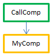
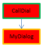
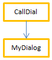

The compiled 4D code can be executed in **preemptive processes**. Thanks to this feature, your 4D compiled applications can take full advantage of multi-core computers so that their execution is faster and they can support more connected users.

## What is a preemptive process?

When run in *preemptive* mode, a process is dedicated to a CPU. Process management is then delegated to the system, which can allocate each CPU separately on a multi-core machine.

When run in *cooperative* mode, all processes are managed by the parent application thread and share the same CPU, even on a multi-core machine.

As a result, in preemptive mode, overall performance of the application is improved, especially on multi-core machines, since multiple processes (threads) can truly run simultaneously. However, actual gains depend on the operations being executed. In return, since each thread is independent from the others in preemptive mode, and not managed directly by the application, there are specific constraints applied to code that you want to be compliant with preemptive use. Additionally, preemptive execution is only available in certain specific contexts.

## Availability of preemptive mode   

The use of preemptive mode is supported in the following execution contexts:

|Context|Preemptive execution|
|---|----|
|4D Server|yes|
|4D remote|yes, with [ServerNet or QUIC](../settings/client-server#network-layer)|
|4D single-user|yes|
|Compiled mode|yes|
|Interpreted mode|no|

If the execution context supports preemptive mode and if the method is "thread-safe", a new 4D process launched using the `New process` or `CALL WORKER` commands, or the "Run method" menu item, will be executed in a preemptive thread.

Otherwise, if you call `New process` or `CALL WORKER` from an execution context that is not supported (i.e. from interpreted mode), the process is always cooperative.


## Thread-safe vs thread-unsafe code

4D code can only be run in a preemptive thread when certain specific conditions are met. Each part of the code being executed (commands, methods, variables, functions, etc.) must be compliant with preemptive use. Elements that can be run in preemptive threads are called thread-safe and those that cannot be run in preemptive threads are called thread-unsafe.

:::note

Since a thread is handled independently starting from the parent process method, the entire call chain must not include any thread-unsafe code; otherwise, preemptive execution will not be possible. This point is discussed [in this paragraph](#when-is-a-process-started-preemptively).

:::

The "thread safety" property of each element depends on the element itself:

- 4D commands: thread safety is an internal property. In the [4D Language Reference manual](https://doc.4d.com/4Dv20/4D/20.1/4D-Language-Reference.100-6479538.en.html), thread-safe commands are identified by the  icon. You can also use the [`Command name`](https://doc.4d.com/4dv20/help/command/en/page538.html) command to know if a command is thread-safe. A large part of 4D commands can run in preemptive mode.
- Project methods: conditions for being thread-safe are listed in [this paragraph](#writing-a-thread-safe-method).

Basically, code to be run in preemptive threads cannot call parts with external interactions, such as plug-in code or interprocess variables. Accessing data, however, is allowed since the 4D data server and ORDA support preemptive execution.


## Declaring a preemptive method

By default, 4D executes all the project methods of your application in cooperative mode. If you want to benefit from the preemptive mode feature, the first step consists of explicitly declaring all methods that you want to be started in preemptive mode whenever possible -- that is, methods that you consider capable of being run in a preemptive process. The compiler will [check that these methods are actually thread-safe](#writing-a-thread-safe-method) at compile time. You can also disallow preemptive mode for some methods, if necessary.

Keep in mind that declaring a method "capable" of preemptive use makes it eligible for preemptive execution but does not guarantee that it will actually be executed in preemptive mode at runtime. Starting a process in preemptive mode results from an [evaluation performed by 4D](#when-is-a-process-started-preemptively) regarding the properties of all the methods in the call chain of the process.

To declare your method eligible for use in preemptive mode, you need to use the "Execution mode" declaration option in the Method Properties dialog box:


The following options are provided:

- **Can be run in preemptive processes**: By checking this option, you declare that the method is able of being run in a preemptive process and therefore should be run in preemptive mode whenever possible. The "preemptive" property of the method is set to "capable".

	When this option is checked, the 4D compiler will verify that the method is actually capable and will return errors if this is not the case -- for example, if it directly or indirectly calls commands or methods that cannot be run in preemptive mode (the entire call chain is parsed but errors are only reported to the first sublevel). You can then edit the method so that it becomes thread-safe, or select another option.

	If the method's preemptive capability is approved, it is tagged "thread-safe" internally and will be executed in preemptive mode whenever the required conditions are met. This property defines its eligibility for preemptive mode but does not guarantee that the method will actually be run in preemptive mode, since this execution mode requires a [specific context](#when-is-a-process-started-preemptively).

- **Cannot be run in preemptive processes**: By checking this option, you declare that the method must never be run in preemptive mode, and therefore must always be run in cooperative mode, as in previous 4D versions. The "preemptive" property of the method is set to "incapable".

	When this option is checked, the 4D compiler will not verify the ability of the method to run preemptively; it is automatically tagged "thread-unsafe" internally (even if it is theoretically capable). When called at runtime, this method will "contaminate" any other methods in the same thread, thus forcing this thread to be executed in cooperative mode, even if the other methods are thread-safe.

- **Indifferent**(default): By checking this option, you declare that you do not want to handle the preemptive property for the method. The "preemptive" property of the method is set to "indifferent".

	When this option is checked, the 4D compiler will evaluate the preemptive capability of the method and will tag it internally as "thread-safe" or "thread-unsafe". No error related to preemptive execution is returned. If the method is evaluated as thread-safe, at runtime it will not prevent preemptive thread execution when called in a preemptive context. Conversely, if the method is evaluated "thread-unsafe", at runtime it will prevent any preemptive thread execution when called.

Note that with this option, whatever the internal thread safety evaluation, the method will always be executed in cooperative mode when called directly by 4D as the first parent method (for example through the `New process` command). If tagged "thread-safe" internally, it is only taken into account when called from other methods inside a call chain.

:::note Particular case

If the method has also the [**Shared by components and host database**](../Project/code-overview.md#shared-by-components-and-host-database) property, setting the **Indifferent** option will automatically tag the method as thread-unsafe. If you want a shared component method to be thread-safe, you must explicitely set it to **Can be run in preemptive processes**.

:::

## When is a process started preemptively?

:::info Reminder

Preemptive execution is only available in compiled mode.

:::

In compiled mode, when starting a process created by either `New process` or `CALL WORKER` commands, 4D reads the preemptive property of the process method (also named *parent* method) and executes the process in preemptive or cooperative mode, depending on this property:

- If the process method is thread-safe (validated during compilation), the process is executed in a preemptive thread.
- If the process method is thread-unsafe, the process is run in a cooperative thread.
- If the preemptive property of the process method was set to "indifferent", by compatibility the process is run in a cooperative thread (even if the method is actually capable of preemptive use). Note however that this compatibility feature is only applied when the method is used as a process method: a method declared "indifferent" but internally tagged "thread-safe" by the compiler can be called preemptively by another method (see below).

The actual thread-safe property depends on the call chain. If a method with the property declared as "capable" calls a thread-unsafe method at either of its sublevels, a compilation error will be returned: if a single method in the entire call chain is thread-unsafe, it will "contaminate" all other methods and preemptive execution will be rejected by the compiler. A preemptive thread can be created only when the entire chain is thread-safe and the process method has been declared "Can be run in preemptive process".
On the other hand, the same thread-safe method may be executed in a preemptive thread when it is in one call chain, and in a cooperative thread when it is in another call chain.

For example, consider the following project methods:

```4d
  //MyDialog project method
  //contains interface calls: will be internally thread unsafe
 $win:=Open form window("tools";Palette form window)
 DIALOG("tools")
```

```4d  
  //MyComp project method
  //contains simple computing: will be internally thread safe
 #DECLARE($value : Integer) -> $result : Integer
 $result:=$value*2
```

```4d
  //CallDial project method
 var $vName : Text
 MyDialog
```

```4d
  //CallComp project method
 var $vAge : Integer
 MyComp($vAge)
```

Executing a method in preemptive mode will depend on its "execution" property and the call chain. The following table illustrates these various situations:


|Declaration and call chain|Compilation|Resulting thread safety|Execution	|Comment|
|---|----|----|---|---|
||	OK||Preemptive|CallComp is the parent method, declared "capable" of preemptive use; since MyComp is thread-safe internally, CallComp is thread-safe and the process is preemptive
||Error||Execution is impossible|CallDial is the parent method, declared "capable"; MyDialog is "indifferent". However, since MyDialog is thread-unsafe internally, it contaminates the call chain. The compilation fails because of a conflict between the declaration of CallDial and its actual capability. The solution is either to modify MyDialog so that it becomes thread-safe so that execution is preemptive, or to change the declaration of CallDial 's property in order to run as cooperative
||OK||Cooperative|Since CallDial is declared "incapable" of preemptive use, compilation is thread-unsafe internally; thus execution will always be cooperative, regardless of the status of MyDialog
||OK||Cooperative|Since CallComp is the parent method with property "Indifferent", then the process is cooperative even if the entire chain is thread-safe.
||OK||Cooperative|Since CallDial is the parent method (property was "Indifferent"), then the process is cooperative and compilation is successful|


### How to find out the actual execution mode

4D allows you to identify the execution mode of processes in compiled mode:

- The [`PROCESS PROPERTIES`](https://doc.4d.com/4dv20/help/command/en/page336.html) command allows you to find out whether a process is run in preemptive or cooperative mode.
- Both the Runtime Explorer and the [4D Server administration window](../ServerWindow/processes.md#process-type) display specific icons for preemptive processes.


## Writing a thread-safe method

To be thread-safe, a method must respect the following rules:

- It must have either the "Can be run in preemptive processes" or "Indifferent" property
- It must not call a 4D command or function that is thread-unsafe.
- It must not call another project method or function that is thread-unsafe
- It must not call a plug-in that is thread-unsafe.
- It must not use any interprocess variables(1)
- It must not call interface objects(2) (there are exceptions however, see below).

(1) To exchange data between preemptive processes (and between all processes), you can pass [shared collections or shared objects](../Concepts/shared.md) as parameters to processes, and/or use the [`Storage`](https://doc.4d.com/4dv20/help/command/en/page1525.html) catalog.
[Worker processes](processes.md#worker-processes) also allow you to exchange messages between any processes, including preemptive processes.

(2) The [`CALL FORM`](https://doc.4d.com/4dv20/help/command/en/page1391.html) command provides an elegant solution to call interface objects from a preemptive process.

:::note Notes

- In the case of a "Shared by components and host databases" method, the "Can be run in preemptive processes" property must be selected.
- All SQL statements are thread-safe. SQL code inserted in `Begin SQL`/`End SQL` blocks must comply with the following conditions:
	+ It must apply to the 4D Server or 4D local database (ODBC or remote databases via `SQL LOGIN` are thread-unsafe. However, local databases used with `USE DATABASE` are thread-safe).
	- Any trigger called by SQL statements must be thread-safe (see [Triggers](#triggers) below).

:::


Methods with the "Can be run in preemptive processes" property will be checked by 4D during compilation. A compilation error is issued whenever the compiler finds something that prevents it from being thread-safe:


:::info

It is possible to [disable locally the thread-safety verification](#).

:::

The [symbol file](../Project/compiler.md#complete-list-of-methods), if enabled, also contains the thread safety status for each method.

### User interface  

Since they are "external" accesses, calls to user interface objects such as forms, as well as to the Debugger, are not allowed in preemptive threads.

The only possible accesses to the user interface from a preemptive thread are:

- [Standard error dialog](../Debugging/basics). The dialog is displayed in the user mode process (on 4D) or the server user interface process (4D Server). The **Trace** button is disabled.
- Standard progress indicators
- `ALERT`, `Request` and `CONFIRM` dialogs. The dialog is displayed in the user mode process (on 4D) or the server user interface process (4D Server). Note that if 4D Server has been launched as a service on Windows with no user interaction allowed, the dialogs will not be displayed.


### Triggers

When a method uses a command that can call a [trigger](https://doc.4d.com/4Dv20R6/4D/20-R6/Triggers.300-6958353.en.html), the 4D compiler evaluates the thread safety of the trigger in order to check the thread safety of the method:

```4d
 SAVE RECORD([Table_1]) //trigger on Table_1, if it exists, must be thread-safe
```

Here is the list of commands that are checked at compilation time for trigger thread safety:

`SAVE RECORD`, `SAVE RELATED ONE`, `DELETE RECORD`, `DELETE SELECTION`, `ARRAY TO SELECTION`, `JSON TO SELECTION`, `APPLY TO SELECTION`, `IMPORT DATA`, `IMPORT DIF`, `IMPORT ODBC`, `IMPORT SYLK`, `IMPORT TEXT`.

If the table is passed dynamically, the compiler may sometimes not be able to find out which trigger it needs to evaluate. Here are some examples of such situations:

```4d
 DEFAULT TABLE([Table_1])
 SAVE RECORD
 SAVE RECORD($ptrOnTable->)
 SAVE RECORD(Table(myMethodThatReturnsATableNumber())->)
```

In this case, all triggers are evaluated. If a thread-unsafe command is detected in at least one trigger, the whole group is rejected and the method is declared thread-unsafe.

:::note

In [client/server applications](../Desktop/clientServer.md), triggers may be executed in cooperative mode, even if their code is thread-safe. This happens when a trigger is activated from a remote process: in this case, the trigger is executed in the ["twinned" process of the client process](https://doc.4d.com/4Dv20R6/4D/20-R6/4D-Server-and-the-4D-Language.300-7182872.en.html#68966) on the server machine. Since this process is used for all calls from the client, it is always executed in cooperative mode.

:::

### Error-handling methods

[Error-catching methods](../Concepts/error-handling.md) installed by the `ON ERR CALL` command must be thread-safe if they are likely to be called from a preemptive process. In order to handle this case, the compiler checks the thread safety property of error-catching project methods passed to the `ON ERR CALL` command during compilation and returns appropriate errors if they do not comply with preemptive execution.

Note that this checking is only possible when the method name is passed as a constant, and is not computed, as shown below:

```4d
 ON ERR CALL("myErrMethod1") //will be checked by the compiler
 ON ERR CALL("myErrMethod"+String($vNum)) //will not be checked by the compiler
```

In addition, if an error-catching project method cannot be called at runtime (following a thread safety issue, or for any reason like "method not found"), the error -10532 "Cannot call error handling project method 'methodName'" is generated.


### Pointers compatibility

A process can dereference a pointer to access the value of another process variable only if both processes are cooperative; otherwise, 4D will throw an error. In a preemptive process, if some 4D code tries to dereference a pointer to an interprocess variable, 4D will throw an error.

Example with the following methods:

Method1:

```4d
 myVar:=42
 $pid:=New process("Method2";0;"process name";->myVar)
```

Method2:

```4d
 $value:=$1->
```

If either the process running Method1 or the process running Method2 is preemptive, then the expression `$value:=$1->` will throw an execution error.

### DocRef document reference

The use of DocRef type parameters (opened document reference, used or returned by `Open document`, `Create document`, `Append document`, `CLOSE DOCUMENT`, `RECEIVE PACKET`, `SEND PACKET`) is limited to the following contexts:

- When called from a preemptive process, a `DocRef` reference is only usable from that preemptive process.
- When called from a cooperative process, a `DocRef` reference is usable from any other cooperative process.


## Disabling thread safety checking locally

There may be some cases where you prefer that thread safety checking of commands not be applied to certain parts of code, for example when it contains thread-unsafe commands that you know to be never called.

To do this, you must surround the code to be excluded from command thread safety checking with the special directives `%T-` and `%T+` as comments. The `//%T-` comment disables thread safety checking and `//%T+` enables it again:

```4d
  // %T- to disable thread safety checking

  // Place the code containing commands to be excluded from thread safety checking here
 $w:=Open window(10;10;100;100) //for example

  // %T+ to enable thread safety checking again for the rest of the method
```

Of course, the 4D developer is responsible for the preemptive mode compatibility of the code between the deactivation and reactivation directives. Runtime errors will be generated if thread-unsafe code is executed in a preemptive thread.
