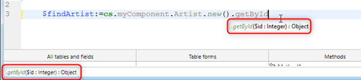

A 4D component is a set of 4D functions, methods, and forms representing one or more functionalities that can be [installed and used in 4D applications](Concepts/components.md). For example, you can develop a 4D e-mail component that manages every aspect of sending, receiving and storing e-mails in 4D applications.

You can develop 4D components for your own needs and keep them private. You can also [share your components with the 4D community](https://github.com/topics/4d-component).


## Definitions

- **Matrix Project**: 4D project used for developing the component. The matrix project is a standard project with no specific attributes. A matrix project forms a single component.
- **Host Project**: Application project in which a component is installed and used.
- **Component**: Matrix project that can be compiled and [built](Desktop/building.md#build-component), [installed in the host application](../Project/components.md#basics) and whose contents are used in the host application.  

## Basics

Creating and installing 4D components is carried out directly from 4D:

- To use a component, you simply need to [install it in your application](../Project/components.md#basics).
- A project can be both a matrix and a host, in other words, a matrix project can itself use one or more components. However, a component cannot use "sub-components" itself.
- A component can call on most of the 4D elements: classes, functions, project methods, project forms, menu bars, choice lists, and so on. It cannot call database methods and triggers.
- You cannot use the datastore, standard tables, or data files in 4D components. However, a component can create and/or use tables, fields and data files using mechanisms of external databases. These are separate 4D databases that you work with using SQL commands.
- A host project running in interpreted mode can use either interpreted or compiled components. A host project running in compiled mode cannot use interpreted components. In this case, only compiled components can be used.


## Scope of language commands

Except for [Unusable commands](#unusable-commands), a component can use any command of the 4D language.

When commands are called from a component, they are executed in the context of the component, except for the [`EXECUTE METHOD`](https://doc.4d.com/4dv20/help/command/en/page1007.html) or [`EXECUTE FORMULA`](https://doc.4d.com/4dv20/help/command/en/page63.html) command that use the context of the method specified by the command. Also note that the read commands of the “Users and Groups” theme can be used from a component but will read the users and groups of the host project (a component does not have its own users and groups).

The [`SET DATABASE PARAMETER`](https://doc.4d.com/4dv20/help/command/en/page642.html) and [`Get database parameter`](https://doc.4d.com/4dv20/help/command/en/page643.html) commands are an exception: their scope is global to the application. When these commands are called from a component, they are applied to the host application project.

Furthermore, specific measures have been specified for the `Structure file` and `Get 4D folder` commands when they are used in the framework of components.

The [`COMPONENT LIST`](https://doc.4d.com/4dv20/help/command/en/page1001.html) command can be used to obtain the list of components that are loaded by the host project.


### Unusable commands

The following commands are not compatible for use within a component because they modify the structure file — which is open in read-only. Their execution in a component will generate the error -10511, "The CommandName command cannot be called from a component":

- `ON EVENT CALL`
- `Method called on event`
- `SET PICTURE TO LIBRARY`
- `REMOVE PICTURE FROM LIBRARY`
- `SAVE LIST`
- `ARRAY TO LIST`
- `EDIT FORM`
- `CREATE USER FORM`
- `DELETE USER FORM`
- `CHANGE PASSWORD`
- `EDIT ACCESS`
- `Set group properties`
- `Set user properties`
- `DELETE USER`
- `CHANGE LICENSES`
- `BLOB TO USERS`
- `SET PLUGIN ACCESS`

**Notes:**

- The `Current form table` command returns `Nil` when it is called in the context of a project form. Consequently, it cannot be used in a component.
- SQL data definition language commands (`CREATE TABLE`, `DROP TABLE`, etc.) cannot be used on the component project. However, they are supported with external databases (see `CREATE DATABASE` SQL command).


## Sharing of project methods

All the project methods of a matrix project are by definition included in the component (the project is the component), which means that they can be called and executed within the component.

On the other hand, by default these project methods will not be visible, and they can't be called in the host project. In the matrix project, you must explicitly designate the methods that you want to share with the host project and its components by checking the **Shared by components and host project** box in the method properties dialog box:


Shared project methods can be called in the code of the host project (but they cannot be modified in the Code Editor of the host project). These methods are **entry points** of the component.

Conversely, for security reasons, by default a component cannot execute project methods belonging to the host project. In certain cases, you may need to allow a component to access the project methods of your host project. To do this, you must explicitly designate which project methods of the host project you want to make accessible to the components (in the method properties, check the **Shared by components and host project** box).


Once the project methods of the host projects are available to the components, you can execute a host method from inside a component using the [`EXECUTE FORMULA`](https://doc.4d.com/4dv20/help/command/en/page63.html) or [`EXECUTE METHOD`](https://doc.4d.com/4dv20/help/command/en/page1007.html) command. For example:

```4d
// Host Method
component_method("host_method_name")
```


```4d
// component_method
#DECLARE ($param : Text)
EXECUTE METHOD($param)
```

> An interpreted host database that contains interpreted components can be compiled or syntax checked if it does not call methods of the interpreted component. Otherwise, a warning dialog box appears when you attempt to launch the compilation or a syntax check and it will not be possible to carry out the operation.   
> Keep in mind that an interpreted method can call a compiled method, but not the reverse, except via the use of the `EXECUTE METHOD` and `EXECUTE FORMULA` commands.


## Sharing of classes

By default, component classes cannot be called from the 4D Code Editor of the host project. If you want your component classes to be exposed in the host project and its loaded components, you need to **declare a component namespace**. Additionally, you can control how component classes are suggested in the host Code Editor.

### Declaring the component namespace

To allow classes of your component to be exposed in the host projects and their loaded components, enter a value in the [**Component namespace in the class store** option in the General page](../settings/general.md#component-namespace-in-the-class-store) of the matrix project Settings. By default, the area is empty: component classes are not available outside of the component context.


:::note

A *namespace* ensures that no conflict emerges when a host project uses different components that have classes or functions with identical names. A component namespace must be compliant with [property naming rules](../Concepts/identifiers.md#object-properties).

:::

When you enter a value, you declare that component classes will be available in the [user class store (**cs**)](../Concepts/classes.md#cs) of the host project as well as its loaded components, through the `cs.<value>` namespace. For example, if you enter "eGeometry" as component namespace, assuming that you have created a `Rectangle` class containing a `getArea()` function, once your project is installed as a component, the developer of the host project can write:

```4d
//in host project or one of its components
var $rect: cs.eGeometry.Rectangle
$rect:=cs.eGeometry.Rectangle.new(10;20)
$area:=$rect.getArea()
```

:::info

The namespace of a [compiled](#protection-of-components-compilation) component is added between parentheses after the component name in the [Component Methods page](../Concepts/components.md#using-components) of the host projects:


:::

Of course, it is recommended to use a distinguished name to avoid any conflict. If a user class with the same name as a component namespace already exists in the project, the user class is taken into account and the component classes are ignored.

A component's ORDA classes are not available in its host project. For example, if there is a dataclass called Employees in your component, you will not be able to use a "cs.Mycomponent.Employee" class in the host project.

### Hidden classes

Just like in any project, you can create hidden classes and functions in the component by prefixing names with an underscore ("_"). When a [component namespace is defined](#declaring-the-component-namespace), hidden classes and functions of the component will not appear as suggestions when using code completion.

Note however that they can still be used if you know their names. For example, the following syntax is valid even if the `_Rectangle` class is hidden:

```4d
$rect:=cs.eGeometry._Rectangle.new(10;20)
```

> Non-hidden functions inside a hidden class appear as suggestions when you use code completion with a class that [inherits](../Concepts/classes.md#inheritance) from it. For example, if a component has a `Teacher` class that inherits from a `_Person` class, code completion for `Teacher` suggests non-hidden functions from `_Person`.


## Code completion for compiled components

To make your component easier to use for developers, you can check the [**Generate syntax file for code completion when compiled** option in the General page](../settings/general.md#component-namespace-in-the-class-store) of the matrix project Settings.

A syntax file (JSON format) is then automatically created during the compilation phase, filled with the syntax of your component's classes, functions, and [exposed methods](#sharing-of-project-methods), and placed in the `\Resources\en.lproj` folder of the component project. 4D uses the contents of that syntax file to generate contextual help in the code editor, such as code completion and function syntax:




If you don't enter a [component namespace](#declaring-the-component-namespace), the resources for the classes and exposed methods are not generated even if the syntax file option is checked.


## Passing variables  

The local, process and interprocess variables are not shared between components and host projects. The only way to modify component variables from the host project and vice versa is using pointers.

Example using an array:

```4d
//In the host project:
     ARRAY INTEGER(MyArray;10)
     AMethod(->MyArray)

//In the component, the AMethod project method contains:
     APPEND TO ARRAY($1->;2)
```

Examples using variables:

```4d
C_TEXT(myvariable)
component_method1(->myvariable)
```

```4d
C_POINTER($p)
$p:=component_method2(...)
```

Without a pointer, a component can still access the value of a host database variable (but not the variable itself) and vice versa:

```4d
//In the host database
C_TEXT($input_t)
$input_t:="DoSomething"
component_method($input_t)
// component_method gets "DoSomething" in $1 (but not the $input_t variable)
```


When you use pointers to allow components and the host project to communicate, you need to take the following specificities into account:

- The `Get pointer` command will not return a pointer to a variable of the host project if it is called from a component and vice versa.

- The component architecture allows the coexistence, within the same interpreted project, of both interpreted and compiled components (conversely, only compiled components can be used in a compiled project). In order to use pointers in this case, you must respect the following principle: the interpreter can unpoint a pointer built in compiled mode; however, in compiled mode, you cannot unpoint a pointer built in interpreted mode.
Let’s illustrate this principle with the following example: given two components, C (compiled) and I (interpreted), installed in the same host project.
 - If component C defines the `myCvar` variable, component I can access the value of this variable by using the pointer `->myCvar`.
 - If component I defines the `myIvar` variable, component C cannot access this variable by using the pointer `->myIvar`. This syntax causes an execution error.

- The comparison of pointers using the `RESOLVE POINTER` command is not recommended with components since the principle of partitioning variables allows the coexistence of variables having the same name but with radically different contents in a component and the host project (or another component). The type of the variable can even be different in both contexts. If the `myptr1` and `myptr2` pointers each point to a variable, the following comparison will produce an incorrect result:

```4d
     RESOLVE POINTER(myptr1;vVarName1;vtablenum1;vfieldnum1)
     RESOLVE POINTER(myptr2;vVarName2;vtablenum2;vfieldnum2)
     If(vVarName1=vVarName2)
      //This test returns True even though the variables are different
```
In this case, it is necessary to use the comparison of pointers:
```4d
     If(myptr1=myptr2) //This test returns False
```

## Error handling

An [error-handling method](Concepts/error-handling.md) installed by the `ON ERR CALL` command only applies to the running application. In the case of an error generated by a component, the `ON ERR CALL` error-handling method of the host project is not called, and vice versa.


## Access to tables of the host project

Although components cannot use tables, pointers can allow host projects and components to communicate with each other. For example, here is a method that could be called from a component:

```4d
// calling a component method
methCreateRec(->[PEOPLE];->[PEOPLE]Name;"Julie Andrews")
```

Within the component, the code of the `methCreateRec` method:

```4d
C_POINTER($1) //Pointer on a table in host project
C_POINTER($2) //Pointer on a field in host project
C_TEXT($3) // Value to insert

$tablepointer:=$1
$fieldpointer:=$2
CREATE RECORD($tablepointer->)

$fieldpointer->:=$3
SAVE RECORD($tablepointer->)
```

> In the context of a component, 4D assumes that a reference to a table form is a reference to the host table form (as components can't have tables.)

## Use of tables and fields

A component cannot use the tables and fields defined in the 4D structure of the matrix project. However, you can create and use external databases, and then use their tables and fields according to your needs. You can create and manage external databases using SQL. An external database is a 4D project that is independent from the main 4D project, but that you can work with from the main 4D project. Using an external database means temporarily designating this database as the current database, in other words, as the target database for the SQL queries executed by 4D. You create external databases using the SQL `CREATE DATABASE` command.

### Example

The following code is included in a component and performs three basic actions with an external database:

- creates the external database if it does not already exist,
- adds data to the external database,
- reads data from the external database.

Creating the external database:

```4d
<>MyDatabase:=Get 4D folder+"\MyDB" // (Windows) stores the data in an authorized directory
 Begin SQL
        CREATE DATABASE IF NOT EXISTS DATAFILE :[<>MyDatabase];
        USE DATABASE DATAFILE :[<>MyDatabase];
        CREATE TABLE IF NOT EXISTS KEEPIT
        (
        ID INT32 PRIMARY KEY,
        kind VARCHAR,
        name VARCHAR,
        code TEXT,
        sort_order INT32
        );

        CREATE UNIQUE INDEX id_index ON KEEPIT (ID);

        USE DATABASE SQL_INTERNAL;

 End SQL
```

Writing in the external database:

```4d
 $Ptr_1:=$2 // retrieves data from the host project through pointers
 $Ptr_2:=$3
 $Ptr_3:=$4
 $Ptr_4:=$5
 $Ptr_5:=$6
 Begin SQL

        USE DATABASE DATAFILE :[<>MyDatabase];

        INSERT INTO KEEPIT
        (ID, kind, name, code, sort_order)
        VALUES
        (:[$Ptr_1], :[$Ptr_2], :[$Ptr_3], :[$Ptr_4], :[$Ptr_5]);

        USE DATABASE SQL_INTERNAL;


 End SQL
```

Reading from an external database:

```4d
 $Ptr_1:=$2 // accesses data of the host project through pointers
 $Ptr_2:=$3
 $Ptr_3:=$4
 $Ptr_4:=$5
 $Ptr_5:=$6

 Begin SQL

    USE DATABASE DATAFILE :[<>MyDatabase];

    SELECT ALL ID, kind, name, code, sort_order
    FROM KEEPIT
    INTO :$Ptr_1, :$Ptr_2, :$Ptr_3, :$Ptr_4, :$Ptr_5;

    USE DATABASE SQL_INTERNAL;

 End SQL
```


## Use of forms

- Only “project forms” (forms that are not associated with any specific table) can be used in a component. Any project forms present in the matrix project can be used by the component.
- A component can call table forms of the host project. Note that in this case it is necessary to use pointers rather than table names between brackets [] to specify the forms in the code of the component.

> If a component uses the `ADD RECORD` command, the current Input form of the host project will be displayed, in the context of the host project. Consequently, if the form includes variables, the component will not have access to them.

- You can [publish component forms as subforms](../FormEditor/properties_FormProperties.md#published-as-subform) in the host projects. This means that you can, more particularly, develop components offering graphic objects. For example, Widgets provided by 4D are based on the use of subforms in components.

> In the context of a component, any referenced project form must belong to the component. For example, inside a component, referencing a host project form using `DIALOG` or `Open form window` will throw an error.


## Use of resources

Components can use resources located in the Resources folder of the component.

Automatic mechanisms are operational: the XLIFF files found in the Resources folder of a component will be loaded by this component.

In a host project containing one or more components, each component as well as the host projects has its own “resources string.” Resources are partitioned between the different projects: it is not possible to access the resources of component A from component B or the host project.


## Executing initialization code

A component can execute 4D code automatically when opening or closing the host database, for example in order to load and/or save the preferences or user states related to the operation of the host database.

Executing initialization or closing code is done by means of the `On Host Database Event` database method.

> For security reasons, you must explicitly authorize the execution of the `On Host Database Event` database method in the host database in order to be able to call it. To do this, you must check the [**Execute "On Host Database Event" method of the components** option](../settings/security.md#options) in the Security page of the Settings.


## Protection of components: compilation  

By default, all the code of a matrix project installed as a component is potentially visible from the host project. In particular:

- The shared project methods are found on the Methods Page of the Explorer and can be called in the methods of the host project. Their contents can be selected and copied in the preview area of the Explorer. They can also be viewed in the debugger. However, it's not possible to open them in the Code Editor or modify them.
- The other project methods of the matrix project do not appear in the Explorer but they too can be viewed in the debugger of the host project.
- The non-hidden classes and functions can be viewed in the debugger [if a namespace is declared](#declaring-the-component-namespace).

To protect the code of a component effectively, simply [compile and build](Desktop/building.md#build-component) the matrix project and provide it in the form of a .4dz file. When a compiled matrix project is installed as a component:

- The shared project methods, classes and functions can be called in the methods of the host project and are also visible on the Methods Page of the Explorer. However, their contents will not appear in the preview area and in the debugger.
- The other project methods of the matrix project will never appear.


## Sharing components

We encourage you to support the 4D developer community by sharing your components, preferably on the [GitHub platform](https://github.com/topics/4d-component). We recommend that you use the **`4d-component`** topic to be correctly referenced.  
