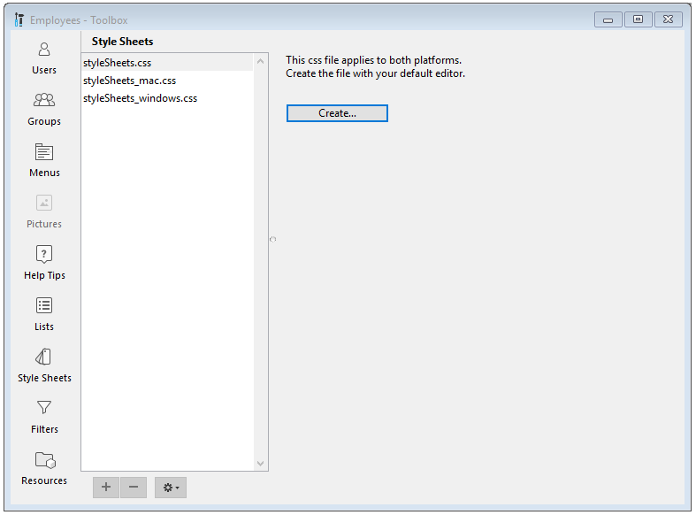

A style sheet groups together a combination of attributes for form objects —  from text attributes to nearly any available object attribute.

In addition to harmonizing an application's interface, style sheets provide three major advantages:

* Saves time during development: Each object has specific group of settings within a single operation.
* Facilitates maintenance: Style sheets modify the appearance of any objects that uses them, so changing the font size in a style sheet will change the font size for all of the objects that use this same style sheet.
* Controls multi-platform development: You can have a style sheets that apply to both macOS and Windows platforms, only macOS, or only Windows. When a style sheet is applied, 4D automatically uses the appropriate style sheet.

## Creating or Editing Style Sheets

You can create style sheets using your preferred text editor and saving the file with a ".css" extension in the project's "/SOURCES" folder.

The 4D Tool Box provides a **Style Sheets** page as a shortcut option to create and edit one of three platform-specific named style sheets.

1. Open the **Style Sheets** page by choosing the **Tool Box > Style Sheet** from the Design menu or click on the **Tool Box** icon in the Form Editor toolbar.

 
 
2. Select the type of style sheet to create and click on the **Create** or **Edit** button: 

3. The style sheet will open in your default text editor.  

## Style Sheet Files

4D accepts three, specific style sheet files:

|Style Sheet|Platform|
|---|---|
|styleSheets.css|Default global style sheet for both macOS and Windows|
|styleSheets_mac.css|For defining macOS only specific attribute styles|
|styleSheets_windows.css|For defining Windows only specific attribute styles|

These files are stored in the project's "/SOURCES" folder. They can also be accessed directly via the [CSS Preview](formEditor.md#css-preview) in the Form editor toobar.

## Style Sheet Architecture

While adapted to meet the specific needs of 4D forms, style sheets for application projects generally follow CSS2 syntax and grammar.

Every style rule in a style sheet contains two parts:

* a *Selector* - A selector defines where to apply the style. 4D supports "object type", "object name", "class", "all objects", as well as "attribute value" selectors.

* a *Declaration* - The declaration defines the actual style to apply. Multiple declaration lines can be grouped together to form a declaration block. Each line in a CSS declaration block must end with a semicolon, and the entire block must be surrounded by curly braces.

## Style Sheet Selectors

### Object Type

Corresponding to the CSS element selector, the object type defines the type of object to style.

Specify the object type, then in curly braces, declare the style(s) to apply.

> The object type corresponds to the JSON [type](FormObjects/properties_Object.md#type) property of form objects.

In the following example, all objects of the *button* type will display text in the Helvetica Neue font, with a size of 20 pixels:

```
button {
    font-family: Helvetica Neue;
    font-size: 20px;
}
```

To apply the same style to multiple types of objects, specify the object types separated by a "," then in curly braces, declare the style(s) to apply:

```
text, input {
  text-align: left;
  stroke: grey;
}
```

### Object Name

Corresponding to the CSS **ID selector**, the object name defines a specific object to style since the object's name is unique within the form.

Designate the object with a "#" character before the object's name, then in curly braces, declare the style(s) to apply.

In the following example, the text of the object with the name "okButton" will be displayed in Helvetica Neue font, with a size of 20 pixels:

```
#okButton {
    font-family: Helvetica Neue;
    font-size: 20px;
}
```

### Class

Corresponding to the CSS **class selector**, the class defines the style for all form objects with the `class` attribute.

You can specify the classes to use with a "." character followed by the name of the class, and in curly braces, declare the style(s) to apply.

In the following example, the text of all objects with the `okButtons` class will be displayed in Helvetica Neue font, with a size of 20 pixels, aligned in the center:

```
.okButtons {
    font-family: Helvetica Neue;
    font-size: 20px;
    text-align: center;
}
```

To designate that a style should be applied only to objects of a distinct type, specify the type followed by "." and the name of the class, then in curly braces, declare the style(s) to apply.

```
text.center {
  text-align: center;
  stroke: red;
}
```

In the 4D form description, you associate a class name to an object using the `class` attribute. This attribute contains one or several class names, separated by a space character:

```
class: "okButtons important"       
```

### All Objects

Corresponding to the CSS **universal selector**, the "*" character indicates that the following style will be applied to all objects on the form.

Designate that a style should apply to all form objects with the "*" character, then in curly braces, declare the style(s) to apply.

In the following example, all objects will have a gray fill:

```
* {
  fill: gray;
}
```

### Specific Attribute

Corresponding to the CSS **attribute selectors**, styles can be applied to all form objects with a specific attribute.

Specify the attribute within brackets, then in curly braces, declare the style(s) to apply.

#### Supported syntaxes

|Syntax|Description|
|---|---|
|[attribute]|matches objects with the `attribute`|
|[attribute="value"]|matches objects with the `attribute` value containing exactly the specified "value"|
|[attribute~="value"]|matches objects with the `attribute` value containing the "value" among a space-separated list of words|
|[attribute|="value"]|matches objects with an `attribute` whose value starts with "value"|

#### Examples

All objects with the `borderStyle` attribute will have purple lines:

```
[borderStyle]
{
     stroke: purple;
}
```

All objects of the text type with a text attribute whose value is "Hello" will have blue letters:

```
text[text=Hello]
{
     stroke: blue;
}
```

All objects with a text attribute whose value contains "Hello" will have blue lines:

```
[text~=Hello]
{
     stroke: blue;
}

```

All objects of the text type with a text attribute whose value starts with "Hello" will have yellow letters:

```
text[text|=Hello]
{
     stroke: yellow;


}
```

## Style Sheet Declarations

### Media Queries

Media queries are used to apply color schemes to an application.  

A media query is composed of a media feature and a value (e.g., `\<media feature>:\<value>` ).

Available media features:

* `prefers-color-scheme`

Available media feature expressions:

* **light**<br/>For using a light scheme
* **dark**<br/>For using a dark scheme

> Color schemes are only supported on macOS.

##### Example

This CSS defines a color combination for text and text background in the light scheme (default) and another combination when the dark scheme is selected:

```
@media (prefers-color-scheme: light) {
 .textScheme {
   fill: LightGrey;
   stroke: Black;
  }
}

@media (prefers-color-scheme: dark) {
  .textScheme {
    fill: DarkSlateGray;
    stroke: LightGrey;
  }
}
```

### Object Attributes

The majority of form object attributes can be defined within a style sheet, except the following attributes:
 - `method`
 - `type`
 - `class`
 - `event`
 - `choiceList`, `excludedList`, `labels`, `list`, `requiredList` (list type)
 
Form object attributes can be declared with their [JSON name](FormObjects/properties_Reference.md) as CSS attributes (not including object types, methods, events, and lists).

#### Attribute Mapping

The attributes listed below are able to accept either the 4D name or the CSS name.

|4D|CSS|
|---|---|
|`borderStyle`|`border-style`|
|`fill`|`background-color`|
|`fontFamily`|`font-family`|
|`fontSize`|`font-size`|
|`fontStyle`|`font-style`|
|`fontWeight`|`font-weight`|
|`stroke`|`color`|
|`textAlign`|`text-align`|
|`textDecoration`|`text-decoration`|
|`verticalAlign`|`vertical-align`|

>4D-specific values (*e.g.*, `sunken`) are not supported when using CSS attribute names.

#### Specific Attribute Values

* For `icon`, `picture`, and `customBackgroundPicture` attributes that support a path to an image, the syntax is:

```
icon: url("/RESOURCES/Images/Buttons/edit.png"); /* absolute path */
icon: url("edit.png"); /* relative path to the form file */
```

* For `fill`, `stroke` , `alternateFill` , `horizontalLineStroke` and `verticalLineStroke`, three syntaxes are supported:

  * CSS color name: `fill: red;`
  * Hexa value: `fill: #FF0000;`
  * the `rgb()` function: `fill:rgb(255,0,0)`

* If a string uses forbidden characters in CSS, you can surround the string with simple or double quotes. For example:
  * a xliff reference: `tooltip: ":xliff:CommonMenuFile";`
  * a datasource with a field expression: `dataSource: "[Table_1:1]ID:1";`

## Priority Order

4D projects prioritizes conflicting style definitions first by the form definition, then by the style sheets.

### JSON vs Style Sheet

If an attribute is defined in the JSON form description and a style sheet, 4D will use the value in the JSON file.

To override this behavior, the style value must be followed with an `!important` declaration.

**Example 1:**

|JSON form description|Style Sheet|4D displays|
|---|---|---|
|`"text": "Button",`|`text: Edit;`| `"Button"`|

**Example 2:**

|JSON form description|Style Sheet|4D displays|
|---|---|---|
|`"text": "Button",`|`text: Edit !important;`| `"Edit"`|

### Multiple Style Sheets

At runtime, 4D automatically prioritizes style sheets in the following order:

1. The 4D form will first load the default CSS file `/SOURCES/styleSheets.css`.
2. It will then load the CSS file for the current platform `/SOURCES/styleSheets_mac.css` or `/SOURCES/styleSheets_windows.css`.
3. If it exists, it will then load a specific CSS file defined in the JSON form:

 * a file for both platforms:
 
 ```
 "css": "<path>" 
 ```

 * or a list of files for both platforms:

 ```
 "css": [
      "<path1>",
      "<path2>" 
       ],
 ```

 * or a list of files per platform:

 ```
  "css": [
         {"path": "<path>", "media": "mac"},
         {"path": "<path>", "media": "windows"},
     ],
 ```

> Filepaths can be relative or absolute.
>
>* Relative paths are resolved relative to the JSON form description file.
>* For security reasons, only filesystem paths are accepted for absolute paths. (*e.g.*, "/RESOURCES", "/DATA")

## See also

See the [**CSS for 4D Forms**](https://www.youtube.com/watch?v=3Hk4FUQENyQ) video presentation.
