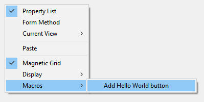

The 4D Form editor supports macros. A macro is a set of instructions to perform an action or a sequence of actions. When called upon, the macro will execute its instructions and automatically perform the action(s). 

For example if you have a recurring report with specific formatting (e.g., certain text must appear in red and certain text must appear in green), you can create a macro to automatically set the color. You can create macros for the 4D Form editor that can:  

*	Create and execute 4D code
*	Display dialogs
*	Select form objects
*	Add / delete / modify forms, form objects as well as their properties
*	Modify project files (update, delete)

Macros code supports [class functions](Concepts/classes.md) and [form object properties in JSON](FormObjects/properties_Reference.md) to let you define any custom feature in the Form editor. 

Macros can been defined for the host project or for components within the project. Usually, you will create a macro and install it within the components you use for development. 

When called, a macro overrides any previously specified behaviors.

## Hands-on example

In this short example, you'll see how to create and call a macro that adds a "Hello World!" alert button in the top left corner of your form. 

1. In a `formMacros.json` file within the `Sources` folder of your project, you write:

```js
{
   "macros": {
      "Add Hello World button": {
       "class": "AddButton"
     }
   }
}
```

2. Create a 4D class named `AddButton`.

3. Within the `AddButton` class, write the following function:

```4d
Function onInvoke($editor : Object)->$result : Object
	
	var $btnHello : Object
	
	// Create a "Hello" button
	$btnHello:=New object("type"; "button"; \
	"text"; "Hello World!"; \
	"method"; New object("source"; "ALERT(\"Hello World!\")"); \
	"events"; New collection("onClick"); \
	"width"; 120; \
	"height"; 20; \
	"top"; 0; \
	"left"; 0)	
	
	// Add button in the current page
	$editor.editor.currentPage.objects.btnHello:=$btnHello	
	
	// Select the new button in the form editor
	$editor.editor.currentSelection.clear() //unselect elements
	$editor.editor.currentSelection.push("btnHello")	
	
	// Notify the modification to the 4D Form editor
	$result:=New object("currentSelection"; $editor.editor.currentSelection;\  
		"currentPage"; $editor.editor.currentPage)
```

You can then call the macro:


 

## Calling macros in the Form editor

When macros are defined in your 4D project, you can call a macro using the contextual menu of the Form editor:


This menu is built upon the `formMacros.json` [macro definition file(s)](#location-of-macros). Macro items are sorted in alphabetical order. 

This menu can be called in an empty area or a selection in the form. Selected object are passed to `$editor.currentSelection` or `$editor.target` in the [`onInvoke`](#oninvoke) function of the macro. 

A single macro can execute several operations. If selected, the **Undo** feature of the Form editor can be used to reverse macro operations globally. 

## Location of macro file

All 4D Form Editor macros are defined within a single JSON file per project or component: `FormMacros.json`. 

This file must be located in the host or component's **Project** > **Sources** folder:


## Declaring macros

The structure of the `formMacros.json` file is the following:

```js
{
    "macros": {
            <macroName>: {
                "class": <className>,
                <customProperty> : <value>
        }
    }
}
```

Here is the description of the JSON file contents:
 
|Attribute|||Type|Description|
|---|---|---|---|---|
|macros|||object|list of defined macros|
||`<macroName>`||object|macro definition|
|||class|string|macro class name|
|||`<customProperty>`|any|(optional) custom value to retrieve in the constructor

Custom properties, when used, are passed to the [constructor](#class-constructor) function of the macro.

### Example 

```js
{
   "macros": {
     "Open Macros file": {
       "class": "OpenMacro"
     },
     "Align to Right on Target Object": {
       "class": "AlignOnTarget",
       "myParam": "right"
     },
     "Align to Left on Target Object": {
       "class": "AlignOnTarget",
       "myParam": "left"
     }
   }
}
```


## Instantiating macros in 4D

Each macro you want to instantiate in your project or component must be declared as a [4D class](Concepts/classes.md). 

The class name must match the name defined using the [class](#creating-macros) attribute of the `formMacros.json` file. 

Macros are instantiated at application startup. Consequently, if you modify the macro class structure (add a function, modify a parameter...) or the [constructor](#class-constructor), you will have to restart the application to apply the changes. 


## Macro Functions

Every macro class can contain a `Class constructor` and two functions: `onInvoke()` and `onError()`.


### Class constructor

#### Class constructor($macro : Object)

|Parameter|Type|Description|
|---|---|---|
|$macro|Object|Macro declaration object (in the `formMacros.json` file)|

Macros are instantiated using a [class constructor](Concepts/classes.md#class-constructor) function, if it exists. 

The class constructor is called once during class instantiation, which occurs at application startup. 

Custom properties added to the [macro declaration](#declaring-macros) are returned in the parameter of the class contructor function.


#### Example

In the `formMacros.json` file:

```js
{
   "macros": {
     "Align to Left on Target Object": {
       "class": "AlignOnTarget",
       "myParam": "left"
     }
   }
}
```

You can write: 

```4d  
// Class "AlignOnTarget"
Class constructor($macro : Object)
    This.myParameter:=$macro.myParam //left
    ...
```


### onInvoke()

#### onInvoke($editor : Object) -> $result : Object

|Parameter|Type|Description|
|---|---|---|
|$editor|Object|Form Editor Macro Proxy object containing the form properties|
|$result|Object|Form Editor Macro Proxy object returning properties modified by the macro (optional)|

The `onInvoke` function is automatically executed each time the macro is called. 

When the function is called, it receives in the `$editor.editor` property a copy of all the elements of the form with their current values. You can then execute any operation on these properties. 

Once operations are completed, if the macro results in modifying, adding, or removing objects, you can pass the resulting edited properties in `$result`. The macro processor will parse the returned properties and apply necessary operations in the form. Obviously, the less properties you return, the less time processing will require. 

Here are the properties returned in the *$editor* parameter:

|Property|Type|Description|
|---|---|---|
|$editor.editor.form|Object|The entire form
|$editor.editor.file|File|File object of the form file|
|$editor.editor.name|Text|Name of the form|
|$editor.editor.table|number|Table number of the form, 0 for project form|
|$editor.editor.currentPageNumber|number|The number of the current page|
|$editor.editor.currentPage|Object|The current page, containing all the form objects and the entry order of the page|
|$editor.editor.currentSelection|Collection|Collection of names of selected objects|
|$editor.editor.formProperties|Object|Properties of the current form|
|$editor.editor.target|string|Name of the object under the mouse when clicked on a macro|

Here are the properties that you can pass in the `$result` object if you want the macro processor to execute a modification. All properties are optional:

|Property|Type|Description|
|---|---|---|
|currentPage |Object |currentPage including objects modified by the macro, if any|
|currentSelection |Collection |currentSelection if modified by the macro|
|formProperties |Object |formProperties if modified by the macro|
|editor.groups |Object |group info, if groups are modified by the macro|
|editor.views |Object |view info, if views are modified by the macro|
|editor.activeView |Text |Active view name|


For example, if objects of the current page and groups have been modified, you can write:

```4d
	$result:=New object("currentPage"; $editor.editor.currentPage ; \ 
			"editor"; New object("groups"; $editor.editor.form.editor.groups))

``` 


#### `method` attribute

When handling the `method` attribute of form objects, you can define the attribute value in two ways in macros:

- Using a [string containing the method file name/path](FormObjects/properties_Action.md#method).

- Using an object with the following structure:

|Property|Type|Description|
|---|---|---|
source|Text|method code|

4D will create a file using the object name in the "objectMethods" folder with the content of `source` attribute. This feature is only available for macro code.  

#### `$4dId` property in `currentPage.objects`

The `$4dId` property defines a unique ID for each object in the current page. This key is used by the macro processor to control changes in `$result.currentPage`: 

- if the `$4dId` key is missing in both the form and an object in `$result`, the object is created.
- if the `$4dId` key exists in the form but is missing in `$result`, the object is deleted.
- if the `$4dId` key exists in both the form and an object in `$result`, the object is modified.
 

#### Example

You want to define a macro function that will apply the red color and italic font style to any selected object(s).

```4d
Function onInvoke($editor : Object)->$result : Object
	var $name : Text
	
	If ($editor.editor.currentSelection.length>0)		
		// Set stroke to red and style to italic for each selected object
		For each ($name; $editor.editor.currentSelection)
			$editor.editor.currentPage.objects[$name].stroke:="red"
			$editor.editor.currentPage.objects[$name].fontStyle:="italic"

		End for each 
		
	Else 
		ALERT("Please select a form object.")
	End if 
	
	// Notify to 4D the modification
	$result:=New object("currentPage"; $editor.editor.currentPage)
```


### onError()

#### onError($editor : Object; $resultMacro : Object ; $error : Collection)

|Parameter||Type|Description|
|---|---|---|---|
|$editor||Object|Object send to [onInvoke](#oninvoke)|
|$resultMacro||Object|Object returned by [onInvoke](#oninvoke)|
|$error||Collection|Error stack |
||[].errCode|Number|Error code |
||[].message|Text|Description of the error |
||[].componentSignature|Text|Internal component signature |

The `onError` function is executed when the macros processor encounters an error. 

When executing a macro, if 4D encounters an error which prevents the macro from being cancelled, it does not execute the macro. It is the case for example if executing a macro would result in:

- deleting or modifying a script whose file is read-only.
- creating two objects with the same internal ID.

#### Example

In a macro class definition, you can write the following generic error code:

```4d
Function onError($editor : Object; $resultMacro : Object; $error : Collection)
	var $obj : Object
	var $txt : Text
	$txt:=""
	
	For each ($obj; $error)
		$txt:=$txt+$obj.message+" \n"
	End for each 
	
	ALERT($txt)
```
