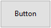

A button is an active object that can be assigned an action (*e.g.*, a database task or an interface function) to perform when a user clicks on it. 



Buttons can fulfill a variety of roles, depending on their style and the action assigned to it. For example, buttons could lead a user through a questionnaire or form to complete, or to make choices. Depending on its settings, a button may be designed to be clicked only once and execute a command, while others may require the user to click more than once to receive the desired result.

## Handling buttons

The actions assigned to buttons can originate from predefined [standard actions](properties_Action.md#standard-action) or from custom object methods. Examples of typical actions include letting the user accept, cancel, or delete records, copy or paste data, move from page to page in a multi-page form, open, delete, or add records in a subform, handle font attributes in text areas, etc. 

Buttons with standard actions are dimmed when appropriate during form execution. For example, if the first record of a table is displayed, a button with the `firstRecord` standard action would appear dimmed. 

If you want a button to perform an action that's not available as a standard action, leave the standard action field empty and write an object method to specify the button’s action. For more information about object methods and how to create and associate them, see [Using object methods](https://doc.4d.com/4Dv17R5/4D/17-R5/Using-object-methods.300-4163733.en.html).
Normally, you would activate the `On Clicked` event and the method would run only when the button is clicked. You can associate a method with any button.

The [variable](properties_Object.md#variable-or-expression) associated with a button is automatically set to **0** when the form is executed for the first time in Design or Application mode. When the user clicks a button, its variable is set to **1**. 


> A button can be assigned both a standard action and a method. In this case, if the button is not disabled by the standard action, the method is executed before the standard action.


## Button Styles

Button styles control a button's general appearance as well as its available properties. It is possible to apply different predefined styles to buttons or to associate pop-up menus with them. A great number of variations can be obtained by combining these properties / behaviors. 

With the exception of the [available properties](#supported-properties), many button objects are *structurally* identical. The difference is in the processing of their associated variables. 

4D provides buttons in the following predefined styles: 


### Regular

The Regular button style is a standard system button (*i.e.*, a rectangle with a descriptive label) which executes code when a user clicks on it.


By default, the Regular style has a light gray background with a label in the center. When the cursor hovers over the Regular button style, the border and background color change to demonstrate that it has the focus. In addition to initiating code execution, the Regular button style mimics a mechanical button by quickly changing background color when being clicked.

#### JSON Example:    

```4d

	"myButton": {
		"type": "button",	//define the type of object
		"style":"regular",	//define the style of the button
		"defaultButton":"true"	//define button as the default choice
		"text": "OK",	//text to appear on the button
		"action": "Cancel", //action to be be performed 
		"left": 60,	 //left position on the form  
		"top": 160, //top position on the form 
	  	"width": 100,  //width of the button
		"height": 20 //height of the button
		}
``` 


Only the Regular and Flat styles offer the [Default Button](properties_Appearance.md#default-button) property.


### Flat

The Flat button style is a standard system button (*i.e.*, a rectangle with a descriptive label) which executes code when a user clicks on it.


By default, the Flat style has a white background with a label in the center, rounded corners, and a minimalist appearance. The Flat button style's graphic nature is particularly useful for forms that will be printed.

#### JSON Example:    

```4d

	"myButton": {
                "type": "button",	
                "style":"flat",	
                "defaultButton":"true"	
                "text": "OK",	
                "action": "Cancel", 
                "left": 60,			
                "top": 160,			
                "width": 100,	
                "height": 20	
                }
``` 


Only the Regular and Flat styles offer the [Default Button](properties_Appearance.md#default-button) property.

### Toolbar

The Toolbar button style is primarily intended for integration in a toolbar. It includes the option to add a pop-up menu (indicated by an inverted triangle) which is generally used to display additional choices for the user to select.

By default, the Toolbar style has a transparent background with a label in the center. The appearance of the button can be different when the cursor hovers over it depending on the OS:

 - *Windows* - the button is highlighted when it uses the “With Pop-up Menu” property, a triangle is displayed to the right and in the center of the button. 


 - *macOS* - the highlight of the button never appears. When it uses the “With Pop-up Menu” property, a triangle is displayed to the right and at the bottom of the button.
 
#### JSON Example:    

```4d
	"myButton": {
                "type": "button",	
                "style":"toolbar",	
                "text": "OK",		
                "popupPlacement":"separated"	
                "action": "Cancel", 	
                "left": 60,				
                "top": 160,				
                "width": 100,			
                "height": 20		
                }
``` 


### Bevel

The Bevel button style combines the appearance of the [Regular](#regular) (*i.e.*, a rectangle with a descriptive label) style with the [Toolbar](#toolbar) style's pop-up menu property option. 

By default, the Bevel style has a light gray background with a label in the center. The appearance of the button can be different when the cursor hovers over it depending on the OS:

 - *Windows* - the button is highlighted. When it uses the “With Pop-up Menu” property, a triangle is displayed to the right and in the center of the button. 


 - *macOS* - the highlight of the button never appears. When it uses the “With Pop-up Menu” property, a triangle is displayed to the right and at the bottom of the button. 
 
#### JSON Example:    

```4d
	"myButton": {
                "type": "button",
                "style":"bevel",	
                "text": "OK",		
                "popupPlacement":"linked"	
                "action": "Cancel", 
                "left": 60,		
                "top": 160,		
                "width": 100,	
                "height": 20	
                }
``` 

 

### Rounded Bevel

The Rounded Bevel button style is nearly identical to the [Bevel](#bevel) style except, depending on the OS, the corners of the button may be rounded. As with the Bevel style, the Rounded Bevel style combines the appearance of the [Regular](#regular) style with the [Toolbar](#toolbar) style's pop-up menu property option. 

By default, the Rounded Bevel style has a light gray background with a label in the center. The appearance of the button can be different when the cursor hovers over it depending on the OS:

 - *Windows* - the button is identical to the Bevel style. When it uses the “With Pop-up Menu” property, a triangle is displayed to the right and in the center of the button.   

  

 - *macOS* - the corners of the button are rounded. When it uses the “With Pop-up Menu” property, a triangle is displayed to the right and at the bottom of the button. 

#### JSON Example:    

```4d
	"myButton": {
                "type": "button",
                "style":"roundedBevel",	
                "text": "OK",	
                "popupPlacement":"none"	/
                "action": "Cancel", 
                "left": 60,			
                "top": 160,	
                "width": 100,	
                "height": 20	
                }
``` 
 
 

### OS X Gradient

The OS X Gradient button style is nearly identical to the [Bevel](#bevel) style. As with the Bevel style, the OS X Gradient style combines the appearance of the [Regular](#regular) style with the [Toolbar](#toolbar) style's pop-up menu property option. 

By default, the OS X Gradient style has a light gray background with a label in the center. The appearance of the button can be different when the cursor hovers over it depending on the OS:

 - *Windows* - the button is identical to the Bevel style. When it uses the “With Pop-up Menu” property, a triangle is displayed on the right side of the button. 


 - *macOS* - the button is displayed as a two-tone system button. When it uses the “With Pop-up Menu” property, a triangle is displayed to the right and at the bottom of the button.
 
#### JSON Example:    

```4d
	"myButton": {
                "type": "button",	
                "style":"gradientBevel",
                "text": "OK",	
                "popupPlacement":"linked"
                "action": "Cancel", 	
                "left": 60,		
                "top": 160,	
                "width": 100,	
                "height": 20	
                }
``` 
 

### OS X Textured

The OS X Textured button style is nearly identical to the [Bevel](#bevel) style but with a smaller size (maximum size is the size of a standard macOS system button). As with the Bevel style, the OS X Textured style combines the appearance of the [Regular](#regular) style with the [Toolbar](#toolbar) style's pop-up menu property option. 

By default, the OS X Textured style appears as:

 - *Windows* - a standard system button with a light gray background with a label in the center. It has the special feature of being transparent in Vista.
 
 
 
 - *macOS* - a standard system button displaying a color change from light to dark gray. Its height is predefined: it is not possible to enlarge or reduce it.

#### JSON Example:    

```4d
	"myButton": {
                "type": "button",	
                "style":"texturedBevel",	
                "text": "OK",	
                "popupPlacement":"separated"	
                "action": "Cancel", 
                "left": 60,			
                "top": 160,		
                "width": 100,	
                "height": 20	
                }
``` 
 


### Office XP

The Office XP button style combines the appearance of the [Regular](#regular) style with the [Toolbar](#toolbar) style's transparency and pop-up menu property option. 

The colors (highlight and background) of a button with the Office XP style are based on the system colors. The appearance of the button can be different when the cursor hovers over it depending on the OS:

 - *Windows* - its background only appears when the mouse rolls over it.


 - *macOS* - its background is always displayed.

#### JSON Example:    

```4d
	"myButton": {
                "type": "button",	
                "style":"office",
                "text": "OK",
                "popupPlacement":"none"	
                "action": "Cancel", 
                "left": 60,		
                "top": 160,	
                "width": 100,
                "height": 20	
                }
``` 


### Help 


The Help button style can be used to display a standard system help button. By default, the Help style is displayed as a question mark within a circle.


#### JSON Example:    

```4d
	"myButton": {
                "type": "button",
                "style":"help",		
                "text": "OK",	
                "dropping": "custom", 
                "left": 60,	
                "top": 160,		
                "width": 100,	
                "height": 20	
                }
``` 

> The Help style does not support [Number of States](properties_TextAndPicture.md#number-of-states), [Picture pathname](properties_TextAndPicture.md#picture-pathname), and [Title/Picture Position](properties_TextAndPicture.md#titlepicture-position) basic properties.  


### Circle

The Circle button style appears as a round system button. This button style is designed for macOS. 


On Windows, it is identical to the “None” style (the circle in the background is not taken into account).

 
#### JSON Example:    

```
	"myButton": {
                "type": "button",	
                "style":"circular",	
                "text": "OK",	
                "dropping": "custom", 
                "left": 60,	
                "top": 160,		
                "width": 100,
                "height": 20	
                }
``` 


### Custom

The Custom button style accepts a personalized background picture and allows managing additional parameters such as icon and margin offset. 


 
#### JSON Example:    

```code
	"myButton": {
                "type": "button",	
                "style":"custom",	
                "text": "",	
                "customBackgroundPicture": "/RESOURCES/bkgnd.png",
                "icon": "/RESOURCES/custom.png",  
                "textPlacement": "center",
                "left": 60,	
                "top": 160,		
                "width": 100,	
                "height": 20
                }
``` 


## Supported Properties

All buttons share the same set of basic properties:  


[Bold](properties_Text.md#bold) - [Border Line Style](properties_BackgroundAndBorder.md#border-line-style) - [Bottom](properties_CoordinatesAndSizing.md#bottom) - [Button Style](properties_TextAndPicture.md#button-style) - [Class](properties_Object.md#css-class) - [Droppable](properties_Action.md#droppable) - [Focusable](properties_Entry.md#focusable) - [Font](properties_Text.md#font) - [Font Color](properties_Text.md#font-color) - [Font Size](properties_Text.md#font-size) - [Height](properties_CoordinatesAndSizing.md#height) - [Help Tip](properties_Help.md#help-tip) - [Horizontal Alignment](properties_Text.md#horizontal-alignment) - [Horizontal Sizing](properties_ResizingOptions.md#horizontal-sizing) - [Italic](properties_Text.md#italic) - [Image hugs title](properties_TextAndPicture.md#image-hugs-title)(1) - [Left](properties_CoordinatesAndSizing.md#left) - [Not rendered](properties_Display.md#not-rendered) - [Number of States](properties_TextAndPicture.md#number-of-states)(1) - [Object Name](properties_Object.md#object-name) - [Picture pathname](properties_TextAndPicture.md#picture-pathname)(1) - [Right](properties_CoordinatesAndSizing.md#right) - [Shortcut](properties_Entry.md#shortcut) - [Standard action](properties_Action.md#standard-action) - [Title](properties_Object.md#title) - [Title/Picture Position](properties_TextAndPicture.md#titlepicture-position)(1) - [Top](properties_CoordinatesAndSizing.md#top) - [Type](properties_Object.md#type) - [Underline](properties_Text.md#underline) - [Variable or Expression](properties_Object.md#variable-or-expression) - [Vertical Sizing](properties_ResizingOptions.md#vertical-sizing) - [Visibility](properties_Display.md#visibility) - [Width](properties_CoordinatesAndSizing.md#width) - [With pop-up menu](properties_TextAndPicture.md#with-pop-up-menu)(2)

> (1) Not supported by the [Help](#help) style.<br/>
> (2) Not supported by the [Help](#help), [Flat](#flat) and [Regular](#regular) styles.


Additional specific properties are available, depending on the [button style](#button-styles):

- Custom: [Background pathname](properties_TextAndPicture.md#background-pathname) - [Horizontal Margin](properties_TextAndPicture.md#horizontal-margin) - [Icon Offset](properties_TextAndPicture.md#icon-offset) - [Vertical Margin](properties_TextAndPicture.md#vertical-margin)
- Flat, Regular: [Default Button](properties_Appearance.md#default-button)
