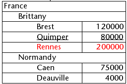

List boxes are complex active objects that allow displaying and entering data as synchronized columns. They can be bound to database contents such as entity selections and record sections, or to any language contents such as collections and arrays. They include advanced features regarding data entry, column sorting, event management, customized appearance, moving of columns, etc.


A list box contains one or more columns whose contents are automatically synchronized. The number of columns is, in theory, unlimited (it depends on the machine resources).

## Overview

### Basic user features

During execution, list boxes allow displaying and entering data as lists. To make a cell editable ([if entry is allowed for the column](#managing-entry)), simply click twice on the value that it contains:


Users can enter and display the text on several lines within a list box cell. To add a line break, press **Ctrl+Carriage return** on Windows or **Option+Carriage return** on macOS.

Booleans and pictures can be displayed in cells, as well as dates, times, or numbers. It is possible to sort column values by clicking on a header ([standard sort](#managing-sorts)). All columns are automatically synchronized.

It is also possible to resize each column, and the user can modify the order of [columns](properties_ListBox.md#locked-columns-and-static-columns) and [rows](properties_Action.md#movable-rows) by moving them using the mouse, if this action is authorized. Note that list boxes can be used in [hierarchical mode](#hierarchical-list-boxes).

The user can select one or more rows using the standard shortcuts: **Shift+click** for an adjacent selection and **Ctrl+click** (Windows) or **Command+click** (macOS) for a non-adjacent selection.


### List box parts

A list box is composed of four distinct parts:

*	the list box object in its entirety,
*	columns,
*	column headers, and
*	column footers.


Each part has its own name as well as specific properties. For example, the number of columns or the alternating color of each row is set in the list box object properties, the width of each column is set in the column properties, and the font of the header is set in the header properties.

It is possible to add an object method to the list box object and/or to each column of the list box. Object methods are called in the following order:

1. Object method of each column
2. Object method of the list box

The column object method gets events that occur in its [header](#list-box-headers) and [footer](#list-box-footers).


### List box types  

There are several types of list boxes, with their own specific behaviors and properties. The list box type depends on its [Data Source property](properties_Object.md#data-source):

- **Arrays**: each column is bound to a 4D array. Array-based list boxes can be displayed as [hierarchical list boxes](listbox_overview.md#hierarchical-list-boxes).
- **Selection** (**Current selection** or **Named selection**): each column is bound to an expression (e.g. a field) which is evaluated for every record of the selection.
- **Collection or Entity selection**: each column is bound to an expression which is evaluated for every element of the collection or every entity of the entity selection.

>It is not possible to combine different list box types in the same list box object. The data source is set when the list box is created. It is then no longer possible to modify it by programming.


### Managing list boxes

You can completely configure a list box object through its properties, and you can also manage it dynamically through programming.

The 4D Language includes a dedicated "List Box" theme for list box commands, but commands from various other themes, such as "Object properties" commands or `EDIT ITEM`, `Displayed line number` commands can also be used. Refer to the [List Box Commands Summary](https://doc.4d.com/4Dv17R6/4D/17-R6/List-Box-Commands-Summary.300-4311159.en.html) page of the *4D Language reference* for more information.


## List box objects

### Array list boxes

In an array list box, each column must be associated with a one-dimensional 4D array; all array types can be used, with the exception of pointer arrays. The number of rows is based on the number of array elements.

By default, 4D assigns the name "ColumnX" to each column. You can change it, as well as other column properties, in the [column properties](listbox_overview.md#column-specific-properties). The display format for each column can also be defined using the `OBJECT SET FORMAT` command.

>Array type list boxes can be displayed in [hierarchical mode](listbox_overview.md#hierarchical-list-boxes), with specific mechanisms.

With array type list box, the values entered or displayed are managed using the 4D language. You can also associate a [choice list](properties_DataSource.md#choice-list) with a column in order to control data entry.
The values of columns are managed using high-level List box commands (such as `LISTBOX INSERT ROWS` or `LISTBOX DELETE ROWS`) as well as array manipulation commands. For example, to initialize the contents of a column, you can use the following instruction:

```4d
ARRAY TEXT(varCol;size)
```

You can also use a list:

```4d
LIST TO ARRAY("ListName";varCol)
```

>**Warning**: When a list box contains several columns of different sizes, only the number of items of the smallest array (column) will be displayed. You should make sure that each array has the same number of elements as the others. Also, if a list box column is empty (this occurs when the associated array was not correctly declared or sized using the language), the list box displays nothing.


### Selection list boxes

In this type of list box, each column can be associated with a field (for example `[Employees]LastName)` or an expression. The expression can be based on one or more fields (for example, `[Employees]FirstName+" "[Employees]LastName`) or it may simply be a formula (for example `String(Milliseconds)`). The expression can also be a project method, a variable or an array item. You can use the `LISTBOX SET COLUMN FORMULA` and `LISTBOX INSERT COLUMN FORMULA` commands to modify columns programmatically.

The contents of each row is then evaluated according to a selection of records: the **current selection** of a table or a **named selection**.

In the case of a list box based on the current selection of a table, any modification done from the database side is automatically reflected in the list box, and vice versa. The current selection is therefore always the same in both places.  


### Collection or Entity selection list boxes

In this type of list box, each column must be associated to an expression. The contents of each row is then evaluated per collection element or per entity of the entity selection.

Each element of the collection or each entity is available as an object that can be accessed through the [This](../Concepts/classes.md#this) keyword. A column expression can be a property path, a project method, a variable, or any formula, accessing each entity or collection element object through `This`, for example `This.<propertyPath>` (or `This.value` in case of a collection of scalar values). You can use the `LISTBOX SET COLUMN FORMULA` and `LISTBOX INSERT COLUMN FORMULA` commands to modify columns programmatically.

When the data source is an entity selection, any modifications made on the list box side are automatically saved in the database. On the other hand, modifications made on the database side are visible in the list box after touched entities have been reloaded.

:::note

When entities are deleted, their references remain in the entity selection with an *undefined* value, thus displaying blank rows in the list box. In this case, you can call the [`.clean()`](API/EntitySelectionClass.md#clean) function to get a new entity selection but without the deleted entity references.

:::

When the data source is a collection, any modifications made in the list box values are reflected in the collection. On the other hand, if modifications are done on the collection using for example the various functions of the [Collection class](../API/CollectionClass.md), you will need to explicitely notify 4D by reassigning the collection variable to itself, so that the list box contents is refreshed. For example:

```4d
myCol:=myCol.push("new value") //display new value in list box
```


### Supported Properties

Supported properties depend on the list box type.


|Property|Array list box|Selection list box|Collection or Entity Selection list box|
|---|----|---|---|  
|[Alternate Background Color](properties_BackgroundAndBorder.md#alternate-background-color)|X|X|X|  
|[Background Color](properties_BackgroundAndBorder.md#background-color--fill-color)|X|X|X|
|[Bold](properties_Text.md#bold)|X|X|X|
|[Background Color Expression](properties_BackgroundAndBorder.md#background-color-expression)||X|X|
|[Border Line Style](properties_BackgroundAndBorder.md#border-line-style)|X|X|X|
|[Bottom](properties_CoordinatesAndSizing.md#bottom)|X|X|X|
|[Class](properties_Object.md#css-class)|X|X|X|
|[Collection or entity selection](properties_Object.md#collection-or-entity-selection)||X|X|
|[Column Auto-Resizing](properties_ResizingOptions.md#column-auto-resizing)|X|X|X|
|[Current item](properties_DataSource.md#current-item)|||X|
|[Current item position](properties_DataSource.md#current-item-position)|||X|
|[Data Source](properties_Object.md#data-source)|X|X|X|
|[Detail Form Name](properties_ListBox.md#detail-form-name)||X||
|[Display Headers](properties_Headers.md#display-headers)|X|X|X|
|[Display Footers](properties_Footers.md#display-footers)|X|X|X|
|[Double-click on row](properties_ListBox.md#double-click-on-row)||X||
|[Draggable](properties_Action.md#droppable)|X|X|X|
|[Droppable](properties_Action.md#droppable)|X|X|X|
|[Focusable](properties_Entry.md#focusable)|X|X|X|
|[Font](properties_Text.md#font)|X|X|X|
|[Font Color](properties_Text.md#font-color)|X|X|X|
|[Font Color Expression](properties_Text.md#font-color-expression)||X|X|
|[Font Size](properties_Text.md#font-size)|X|X|X|
|[Height (list box)](properties_CoordinatesAndSizing.md#height)|X|X|X|
|[Height (headers)](properties_Headers.md#height)|X|X|X|
|[Height (footers)](properties_Footers.md#height)|X|X|X|
|[Hide extra blank rows](properties_BackgroundAndBorder.md#hide-extra-blank-rows)|X|X|X|
|[Hide focus rectangle](properties_Appearance.md#hide-focus-rectangle)|X|X|X|
|[Hide selection highlight](properties_Appearance.md#hide-selection-highlight)|X|X|X|
|[Hierarchical List Box](properties_Object.md#array-list-box)|X|||
|[Highlight Set](properties_ListBox.md#highlight-set)||X||
|[Horizontal Alignment](properties_Text.md#horizontal-alignment)|X|X|X|
|[Horizontal Line Color](properties_Gridlines.md#horizontal-line-color)|X|X|X|
|[Horizontal Padding](properties_CoordinatesAndSizing.md#horizontal-padding)|X|X|X|
|[Horizontal Scroll Bar](properties_Appearance.md#horizontal-scroll-bar)|X|X|X|
|[Horizontal Sizing](properties_ResizingOptions.md#horizontal-sizing)|X|X|X|
|[Italic](properties_Text.md#italic)|X|X|X|
|[Left](properties_CoordinatesAndSizing.md#left)|X|X|X|
|[Master Table](properties_DataSource.md#master-table)||X||
|[Meta info expression](properties_Text.md#meta-info-expression)|||X|
|[Method](properties_Action.md#method)|X|X|X|
|[Movable Rows](properties_Action.md#movable-rows)|X|||
|[Named Selection](properties_DataSource.md#selection-name)||X||
|[Number of Columns](properties_ListBox.md#number-of-columns)|X|X|X|
|[Number of Locked Columns](properties_ListBox.md#number-of-locked-columns)|X|X|X|
|[Number of Static Columns](properties_ListBox.md#number-of-static-columns)|X|X|X|
|[Object Name](properties_Object.md#object-name)|X|X|X|
|[Right](properties_CoordinatesAndSizing.md#right)|X|X|X|
|[Row Background Color Array](properties_BackgroundAndBorder.md#row-background-color-array)|X|||
|[Row Control Array](properties_ListBox.md#row-control-array)|X|||
|[Row Font Color Array](properties_Text.md#row-font-color-array)|X|||
|[Row Height](properties_CoordinatesAndSizing.md#row-height)|X|||
|[Row Height Array](properties_CoordinatesAndSizing.md#row-height-array)|X|||
|[Row Style Array](properties_Text.md#row-style-array)|X|||
|[Selected Items](properties_DataSource.md#selected-items)|||X|
|[Selection Mode](properties_ListBox.md#selection-mode)|X|X|X|
|[Single-Click Edit](properties_Entry.md#single-click-edit)|X|X|X|
|[Sortable](properties_Action.md#sortable)|X|X|X|
|[Standard action](properties_Action.md#standard-action)|X|||
|[Style Expression](properties_Text.md#style-expression)||X|X|
|[Top](properties_CoordinatesAndSizing.md#top)|X|X|X|
|[Transparent](properties_BackgroundAndBorder.md#transparent)|X|X|X|
|[Type](properties_Object.md#type)|X|X|X|
|[Underline](properties_Text.md#underline)|X|X|X|
|[Variable or Expression](properties_Object.md#variable-or-expression)|X|X||
|[Vertical Alignment](properties_Text.md#vertical-alignment)|X|X|X|
|[Vertical Line Color](properties_Gridlines.md#vertical-line-color)|X|X|X|
|[Vertical Padding](properties_CoordinatesAndSizing.md#vertical-padding)|X|X|X|
|[Vertical Scroll Bar](properties_Appearance.md#vertical-scroll-bar)|X|X|X|
|[Vertical Sizing](properties_ResizingOptions.md#vertical-sizing)|X|X|X|
|[Visibility](properties_Display.md#visibility)|X|X|X|
|[Width](properties_CoordinatesAndSizing.md#width)|X|X|X|


> List box columns, headers and footers support specific properties.


### Supported Form Events


|Form event|Additional Properties Returned (see [Form event](https://doc.4d.com/4Dv18/4D/18/FORM-Event.301-4522191.en.html) for main properties)| Comments|
|---|---|---|
|On After Edit|<li>[column](#additional-properties)</li><li>[columnName](#additional-properties)</li><li>[row](#additional-properties)</li>||
|On After Keystroke|<li>[column](#additional-properties)</li><li>[columnName](#additional-properties)</li><li>[row](#additional-properties)</li>||
|On After Sort|<li>[column](#additional-properties)</li><li>[columnName](#additional-properties)</li><li>[headerName](#additional-properties)</li>|*Compound formulas cannot be sorted. <br/>(e.g., This.firstName + This.lastName)*|
|On Alternative Click|<li>[column](#additional-properties)</li><li>[columnName](#additional-properties)</li><li>[row](#additional-properties)</li>|*Arrays list boxes only*|
|On Before Data Entry|<li>[column](#additional-properties)</li><li>[columnName](#additional-properties)</li><li>[row](#additional-properties)</li>||
|On Before Keystroke|<li>[column](#additional-properties)</li><li>[columnName](#additional-properties)</li><li>[row](#additional-properties)</li>||
|On Begin Drag Over|<li>[column](#additional-properties)</li><li>[columnName](#additional-properties)</li><li>[row](#additional-properties)</li>||
|On Clicked|<li>[column](#additional-properties)</li><li>[columnName](#additional-properties)</li><li>[row](#additional-properties)</li>||
|On Close Detail|<li>[row](#additional-properties)</li>|*Current Selection & Named Selection list boxes only*|
|On Collapse|<li>[column](#additional-properties)</li><li>[columnName](#additional-properties)</li><li>[row](#additional-properties)</li>|*Hierarchical list box only*|
|On Column Moved|<li>[columnName](#additional-properties)</li><li>[newPosition](#additional-properties)</li><li>[oldPosition](#additional-properties)</li>||
|On Column Resize|<li>[column](#additional-properties)</li><li>[columnName](#additional-properties)</li><li>[newSize](#additional-properties)</li><li>[oldSize](#additional-properties)</li>||
|On Data Change|<li>[column](#additional-properties)</li><li>[columnName](#additional-properties)</li><li>[row](#additional-properties)</li>||
|On Delete Action|<li>[row](#additional-properties)</li>||
|On Display Detail|<li>[isRowSelected](#additional-properties)</li><li>[row](#additional-properties)</li>||
|On Double Clicked|<li>[column](#additional-properties)</li><li>[columnName](#additional-properties)</li><li>[row](#additional-properties)</li>||
|On Drag Over|<li>[area](#additional-properties)</li><li>[areaName](#additional-properties)</li><li>[column](#additional-properties)</li><li>[columnName](#additional-properties)</li><li>[row](#additional-properties)</li>||
|On Drop|<li>[column](#additional-properties)</li><li>[columnName](#additional-properties)</li><li>[row](#additional-properties)</li>||
|On Expand|<li>[column](#additional-properties)</li><li>[columnName](#additional-properties)</li><li>[row](#additional-properties)</li>|*Hierarchical list box only*|
|On Footer Click|<li>[column](#additional-properties)</li><li>[columnName](#additional-properties)</li><li>[footerName](#additional-properties)</li>|*Arrays, Current Selection & Named Selection list boxes only*|
|On Getting Focus|<li>[column](#additional-properties)</li><li>[columnName](#additional-properties)</li><li>[row](#additional-properties)</li>|*Additional properties returned only when editing a cell*|
|On Header Click|<li>[column](#additional-properties)</li><li>[columnName](#additional-properties)</li><li>[headerName](#additional-properties)</li>||
|On Load||
|On Losing Focus|<li>[column](#additional-properties)</li><li>[columnName](#additional-properties)</li><li>[row](#additional-properties)</li>|*Additional properties returned only when editing a cell has been completed*|
|On Mouse Enter|<li>[area](#additional-properties)</li><li>[areaName](#additional-properties)</li><li>[column](#additional-properties)</li><li>[columnName](#additional-properties)</li><li>[row](#additional-properties)</li>||
|On Mouse Leave|||
|On Mouse Move|<li>[area](#additional-properties)</li><li>[areaName](#additional-properties)</li><li>[column](#additional-properties)</li><li>[columnName](#additional-properties)</li><li>[row](#additional-properties)</li>||
|On Open Detail|<li>[row](#additional-properties)</li>|*Current Selection & Named Selection list boxes only*|
|On Row Moved|<li>[newPosition](#additional-properties)</li><li>[oldPosition](#additional-properties)</li>|*Arrays list boxes only*|
|On Selection Change|||
|On Scroll|<li>[horizontalScroll](#additional-properties)</li><li>[verticalScroll](#additional-properties)</li>||
|On Unload|||


#### Additional Properties

Form events on list box or list box column objects may return the following additional properties:

|Property|	Type|	Description|
|---|---|---|
|area|text|List box object area ("header", "footer", "cell")|
|areaName|text|Name of the area|
|column|longint|Column number|
|columnName|text|Name of the column|
|footerName|text|Name of the footer|
|headerName|text|Name of the header|
|horizontalScroll|longint|Positive if scroll is towards the right, negative if towards the left|
|isRowSelected|boolean|True if row is selected, else False|
|newPosition|longint|New position of the column or row|
|newSize|longint|New size (in pixels) of the column or row|
|oldPosition|longint|Previous position of the column or row|
|oldSize|longint|Previous size (in pixels) of the column or row|
|row|longint|Row number|
|verticalScroll|longint|Positive if scroll is towards the bottom, negative if towards the top|

>If an event occurs on a "fake" column or row that doesn't exist, an empty string is typically returned.


##  List box columns {#list-box-columns}

A list box is made of one or more column object(s) which have specific properties. You can select a list box column in the Form editor by clicking on it when the list box object is selected:


You can set standard properties (text, background color, etc.) for each column of the list box; these properties take priority over those of the list box object properties.

>You can define the [Expression type](properties_Object.md#expression-type) for array list box columns (String, Text, Number, Date, Time, Picture, Boolean, or Object).


### Column Specific Properties

[Alpha Format](properties_Display.md#alpha-format) - [Alternate Background Color](properties_BackgroundAndBorder.md#alternate-background-color) - [Automatic Row Height](properties_CoordinatesAndSizing.md#automatic-row-height) - [Background Color](properties_BackgroundAndBorder.md#background-color--fill-color) - [Background Color Expression](properties_BackgroundAndBorder.md#background-color-expression) - [Bold](properties_Text.md#bold) - [Choice List](properties_DataSource.md#choice-list) - [Class](properties_Object.md#css-class) - [Data Type (selection and collection list box column)](properties_DataSource.md#data-type) - [Date Format](properties_Display.md#date-format) - [Default Values](properties_DataSource.md#default-list-of-values) - [Display Type](properties_Display.md#display-type) - [Enterable](properties_Entry.md#enterable) - [Entry Filter](properties_Entry.md#entry-filter) - [Excluded List](properties_RangeOfValues.md#excluded-list) - [Expression](properties_DataSource.md#expression) - [Expression Type (array list box column)](properties_Object.md#expression-type) - [Font](properties_Text.md#font) - [Font Color](properties_Text.md#font-color) - [Horizontal Alignment](properties_Text.md#horizontal-alignment) - [Horizontal Padding](properties_CoordinatesAndSizing.md#horizontal-padding) - [Italic](properties_Text.md#italic) - [Invisible](properties_Display.md#visibility) - [Maximum Width](properties_CoordinatesAndSizing.md#maximum-width) - [Method](properties_Action.md#method) - [Minimum Width](properties_CoordinatesAndSizing.md#minimum-width) - [Multi-style](properties_Text.md#multi-style) - [Number Format](properties_Display.md#number-format) - [Object Name](properties_Object.md#object-name) - [Picture Format](properties_Display.md#picture-format) - [Resizable](properties_ResizingOptions.md#resizable) - [Required List](properties_RangeOfValues.md#required-list) - [Row Background Color Array](properties_BackgroundAndBorder.md#row-background-color-array) - [Row Font Color Array](properties_Text.md#row-font-color-array) - [Row Style Array](properties_Text.md#row-style-array) - [Save as](properties_DataSource.md#save-as) - [Style Expression](properties_Text.md#style-expression) - [Text when False/Text when True](properties_Display.md#text-when-falsetext-when-true) - [Time Format](properties_Display.md#time-format) - [Truncate with ellipsis](properties_Display.md#truncate-with-ellipsis) - [Underline](properties_Text.md#underline) - [Variable or Expression](properties_Object.md#variable-or-expression) - [Vertical Alignment](properties_Text.md#vertical-alignment) - [Vertical Padding](properties_CoordinatesAndSizing.md#vertical-padding) - [Width](properties_CoordinatesAndSizing.md#width) - [Wordwrap](properties_Display.md#wordwrap)

### Supported Form Events

|Form event|Additional Properties Returned (see [Form event](https://doc.4d.com/4Dv18/4D/18/FORM-Event.301-4522191.en.html) for main properties)| Comments|
|---|---|---|
|On After Edit|<li>[column](#additional-properties)</li><li>[columnName](#additional-properties)</li><li>[row](#additional-properties)</li>||
|On After Keystroke|<li>[column](#additional-properties)</li><li>[columnName](#additional-properties)</li><li>[row](#additional-properties)</li>||
|On After Sort|<li>[column](#additional-properties)</li><li>[columnName](#additional-properties)</li><li>[headerName](#additional-properties)</li>|*Compound formulas cannot be sorted. <br/>(e.g., This.firstName + This.lastName)*|
|On Alternative Click|<li>[column](#additional-properties)</li><li>[columnName](#additional-properties)</li><li>[row](#additional-properties)</li>|*Arrays list boxes only*|
|On Before Data Entry|<li>[column](#additional-properties)</li><li>[columnName](#additional-properties)</li><li>[row](#additional-properties)</li>||
|On Before Keystroke|<li>[column](#additional-properties)</li><li>[columnName](#additional-properties)</li><li>[row](#additional-properties)</li>||
|On Begin Drag Over|<li>[column](#additional-properties)</li><li>[columnName](#additional-properties)</li><li>[row](#additional-properties)</li>||
|On Clicked|<li>[column](#additional-properties)</li><li>[columnName](#additional-properties)</li><li>[row](#additional-properties)</li>||
|On Column Moved|<li>[columnName](#additional-properties)</li><li>[newPosition](#additional-properties)</li><li>[oldPosition](#additional-properties)</li>||
|On Column Resize|<li>[column](#additional-properties)</li><li>[columnName](#additional-properties)</li><li>[newSize](#additional-properties)</li><li>[oldSize](#additional-properties)</li>||
|On Data Change|<li>[column](#additional-properties)</li><li>[columnName](#additional-properties)</li><li>[row](#additional-properties)</li>||
|On Double Clicked|<li>[column](#additional-properties)</li><li>[columnName](#additional-properties)</li><li>[row](#additional-properties)</li>||
|On Drag Over|<li>[area](#additional-properties)</li><li>[areaName](#additional-properties)</li><li>[column](#additional-properties)</li><li>[columnName](#additional-properties)</li><li>[row](#additional-properties)</li>||
|On Drop|<li>[column](#additional-properties)</li><li>[columnName](#additional-properties)</li><li>[row](#additional-properties)</li>||
|On Footer Click|<li>[column](#additional-properties)</li><li>[columnName](#additional-properties)</li><li>[footerName](#additional-properties)</li>|*Arrays, Current Selection & Named Selection list boxes only*|
|On Getting Focus|<li>[column](#additional-properties)</li><li>[columnName](#additional-properties)</li><li>[row](#additional-properties)</li>|*Additional properties returned only when editing a cell*|
|On Header Click|<li>[column](#additional-properties)</li><li>[columnName](#additional-properties)</li><li>[headerName](#additional-properties)</li>||
|On Load||
|On Losing Focus|<li>[column](#additional-properties)</li><li>[columnName](#additional-properties)</li><li>[row](#additional-properties)</li>|*Additional properties returned only when editing a cell has been completed*|
|On Row Moved|<li>[newPosition](#additional-properties)</li><li>[oldPosition](#additional-properties)</li>|*Arrays list boxes only*|
|On Scroll|<li>[horizontalScroll](#additional-properties)</li><li>[verticalScroll](#additional-properties)</li>||
|On Unload|||


## List box headers

> To be able to access the header properties of a list box, you must enable the [Display Headers](properties_Headers.md#display-headers) option of the list box.

When headers are displayed, you can select a header in the Form editor by clicking it when the list box object is selected:


You can set standard text properties for each column header of the list box; in this case, these properties have priority over those of the column or of the list box itself.


In addition, you have access to the specific properties for headers. Specifically, an icon can be displayed in the header next to or in place of the column title, for example when performing [customized sorts](#managing-sorts).


At runtime, events that occur in a header are generated in the [list box column object method](#object-methods).

When the `OBJECT SET VISIBLE` command is used with a header, it is applied to all headers, regardless of the individual element set by the command. For example, `OBJECT SET VISIBLE(*;"header3";False)` will hide all headers in the list box object to which *header3* belongs and not simply this header.

### Header Specific Properties

[Bold](properties_Text.md#bold) - [Class](properties_Object.md#css-class) - [Font](properties_Text.md#font) - [Font Color](properties_Text.md#font-color) - [Help Tip](properties_Help.md#help-tip) - [Horizontal Alignment](properties_Text.md#horizontal-alignment) - [Horizontal Padding](properties_CoordinatesAndSizing.md#horizontal-padding) - [Icon Location](properties_TextAndPicture.md#icon-location) - [Italic](properties_Text.md#italic) - [Object Name](properties_Object.md#object-name) - [Pathname](properties_TextAndPicture.md#picture-pathname) - [Title](properties_Object.md#title) - [Underline](properties_Text.md#underline) - [Variable or Expression](properties_Object.md#variable-or-expression) - [Vertical Alignment](properties_Text.md#vertical-alignment) - [Vertical Padding](properties_CoordinatesAndSizing.md#vertical-padding) - [Width](properties_CoordinatesAndSizing.md#width)


## List box footers

>To be able to access footer properties for a list box, you must enable the [Display Footers](properties_Footers.md#display-footers) option.

List boxes can contain non-enterable "footers" displaying additional information. For data shown in table form, footers are usually used to display calculations such as totals or averages.

When footers are displayed, you can click to select one when the list box object is selected in the Form editor:


For each List box column footer, you can set standard text properties: in this case, these properties take priority over those of the column or of the list box. You can also access specific properties for footers. In particular, you can insert a [custom or automatic calculation](properties_Object.md#variable-calculation).

At runtime, events that occur in a footer are generated in the [list box column object method](#object-methods).

When the `OBJECT SET VISIBLE` command is used with a footer, it is applied to all footers, regardless of the individual element set by the command. For example, `OBJECT SET VISIBLE(*;"footer3";False)` will hide all footers in the list box object to which *footer3* belongs and not simply this footer.

### Footer Specific Properties


[Alpha Format](properties_Display.md#alpha-format) - [Background Color](properties_BackgroundAndBorder.md#background-color--fill-color) - [Bold](properties_Text.md#bold) - [Class](properties_Object.md#css-class) - [Date Format](properties_Display.md#date-format) - [Expression Type](properties_Object.md#expression-type) - [Font](properties_Text.md#font) - [Font Color](properties_Text.md#font-color) - [Help Tip](properties_Help.md#help-tip) - [Horizontal Alignment](properties_Text.md#horizontal-alignment) - [Horizontal Padding](properties_CoordinatesAndSizing.md#horizontal-padding) - [Italic](properties_Text.md#italic) - [Number Format](properties_Display.md#number-format) - [Object Name](properties_Object.md#object-name) - [Picture Format](properties_Display.md#picture-format) - [Time Format](properties_Display.md#time-format) - [Truncate with ellipsis](properties_Display.md#truncate-with-ellipsis) - [Underline](properties_Text.md#underline) - [Variable Calculation](properties_Object.md#variable-calculation) - [Variable or Expression](properties_Object.md#variable-or-expression) - [Vertical Alignment](properties_Text.md#vertical-alignment) - [Vertical Padding](properties_CoordinatesAndSizing.md#vertical-padding) - [Width](properties_CoordinatesAndSizing.md#width) - [Wordwrap](properties_Display.md#wordwrap)


## Managing entry  

For a list box cell to be enterable, both of the following conditions must be met:

- The cell’s column must have been set as [Enterable](properties_Entry.md#enterable) (otherwise, the cells of the column can never be enterable).
- In the `On Before Data Entry` event, $0 does not return -1. When the cursor arrives in the cell, the `On Before Data Entry` event is generated in the column method. If, in the context of this event, $0 is set to -1, the cell is considered as not enterable. If the event was generated after **Tab** or **Shift+Tab** was pressed, the focus goes to either the next cell or the previous one, respectively. If $0 is not -1 (by default $0 is 0), the cell is enterable and switches to editing mode.

Let’s consider the example of a list box containing two arrays, one date and one text. The date array is not enterable but the text array is enterable if the date has not already past.


Here is the method of the *arrText* column:

```4d
 Case of
    :(FORM event.code=On Before Data Entry) // a cell gets the focus
       LISTBOX GET CELL POSITION(*;"lb";$col;$row)
  // identification of cell
       If(arrDate{$row}<Current date) // if date is earlier than today
          $0:=-1 // cell is NOT enterable
       Else
  // otherwise, cell is enterable
       End if
 End case
```

The `On Before Data Entry` event is returned before `On Getting Focus`.

In order to preserve data consistency for selection type and entity selection type list boxes, any modified record/entity is automatically saved as soon as the cell is validated, i.e.:

- when the the cell is deactivated (user presses tab, clicks, etc.)
- when the listbox is no longer focused,
- when the form is no longer focused.

The typical sequence of events generated during data entry or modification is as follows:

|Action|Listbox type(s)|Sequence of events|
|---|---|---|
|A cell switches to edit mode (user action or a call to the `EDIT ITEM` command)|All|On Before Data Entry|
||All|On Getting Focus|
|Its value is modified|All|On Before Keystroke|
||All|On After Keystroke|
||All|On After Edit|
|A user validates and leaves the cell|Selection list boxes|	Save|
||Record selection list boxes|On saving an existing record trigger (if set)|
||Selection list boxes|On Data Change(*)|
||Entity selection list boxes|Entity is saved with automerge option, optimistic lock (see entity.save( )). In case of successful save, the entity is refreshed with the last update done. If the save operation fails, an error is displayed|
||All|On Losing Focus

(*) With entity selection list boxes, in the On Data Change event:
- the [Current item](properties_DataSource.md#current-item) object contains the value before modification.
- the `This` object contains the modified value.

> Data entry in collection/entity selection type list boxes has a limitation when the expression evaluates to null. In this case, it is not possible to edit or remove the null value in the cell.


## Managing selections  

Selections are managed differently depending on whether the list box is based on an array, on a selection of records, or on a collection/entity selection:

- **Selection list box**: Selections are managed by a set, which you can modify if necessary, called `$ListboxSetX` by default (where X starts at 0 and is incremented based on the number of list boxes in the form). This set is [defined in the properties](properties_ListBox.md#highlight-set) of the list box. It is automatically maintained by 4D: If the user selects one or more rows in the list box, the set is immediately updated. On the other hand, it is also possible to use the commands of the "Sets" theme in order to modify the selection of the list box via programming.

- **Collection/Entity selection list box**: Selections are managed through dedicated list box properties:
	- [Current item](properties_DataSource.md#current-item) is an object that will receive the selected element/entity
	- [Selected Items](properties_DataSource.md#selected-items) is a collection/entity selection object of selected items
	- [Current item position](properties_DataSource.md#current-item-position) returns the position of the selected element or entity.

- **Array list box**: The `LISTBOX SELECT ROW` command can be used to select one or more rows of the list box by programming.
The [variable linked to the List box object](properties_Object.md#variable-or-expression) is used to get, set or store selections of object rows. This variable corresponds to a Boolean array that is automatically created and maintained by 4D. The size of this array is determined by the size of the list box: it contains the same number of elements as the smallest array linked to the columns.
Each element of this array contains `True` if the corresponding line is selected and `False` otherwise. 4D updates the contents of this array depending on user actions. Inversely, you can change the value of array elements to change the selection in the list box.
On the other hand, you can neither insert nor delete rows in this array; you cannot retype rows either. The `Count in array` command can be used to find out the number of selected lines.
For example, this method allows inverting the selection of the first row of the (array type) list box:
```4d
 ARRAY BOOLEAN(tBListBox;10)
  //tBListBox is the name of the list box variable in the form
 If(tBListBox{1}=True)
    tBListBox{1}:=False
 Else
    tBListBox{1}:=True
 End if
```

> The `OBJECT SET SCROLL POSITION` command scrolls the list box rows so that the first selected row or a specified row is displayed.


### Customizing appearance of selected rows

When the [Hide selection highlight](properties_Appearance.md#hide-selection-highlight) option is selected, you need to make list box selections visible using available interface options. Since selections are still fully managed by 4D, this means:

- For array type list boxes, you must parse the Boolean array variable associated with the list box to determine which rows are selected or not.
- For selection type list boxes, you have to check whether the current record (row) belongs to the set specified in the [Highlight Set](properties_ListBox.md#highlight-set) property of the list box.

You can then define specific background colors, font colors and/or font styles by programming to customize the appearance of selected rows. This can be done using arrays or expressions, depending on the type of list box being displayed (see the following sections).

> You can use the `lk inherited` constant to mimic the current appearance of the list box (e.g., font color, background color, font style, etc.).

#### Selection list boxes  

To determine which rows are selected, you have to check whether they are included in the set indicated in the [Highlight Set](properties_ListBox.md#highlight-set) property of the list box. You can then define the appearance of selected rows using one or more of the relevant [color or style expression property](#using-arrays-and-expressions).

Keep in mind that expressions are automatically re-evaluated each time the:
- list box selection changes.
- list box gets or loses the focus.
- form window containing the list box becomes, or ceases to be, the frontmost window.


#### Array list boxes  
You have to parse the Boolean array [Variable or Expression](properties_Object.md#variable-or-expression) associated with the list box to determine whether rows are selected or not selected.

You can then define the appearance of selected rows using one or more of the relevant [color or style array property](#using-arrays-and-expressions).

Note that list box arrays used for defining the appearance of selected rows must be recalculated during the `On Selection Change` form event; however, you can also modify these arrays based on the following additional form events:
- `On Getting Focus` (list box property)
- `On Losing Focus` (list box property)
- `On Activate` (form property)
- `On Deactivate` (form property)
...depending on whether and how you want to visually represent changes of focus in selections.

##### Example  

You have chosen to hide the system highlight and want to display list box selections with a green background color, as shown here:


For an array type list box, you need to update the [Row Background Color Array](properties_BackgroundAndBorder.md#row-background-color-array) by programming. In the JSON form, you have defined the following Row Background Color Array for the list box:

```
	"rowFillSource": "_ListboxBackground",
```

In the object method of the list box, you can write:

```4d
 Case of
    :(FORM event.code=On Selection Change)
       $n:=Size of array(LB_Arrays)
       ARRAY LONGINT(_ListboxBackground;$n) // row background colors
       For($i;1;$n)
          If(LB_Arrays{$i}=True) // selected
             _ListboxBackground{$i}:=0x0080C080 // green background
          Else // not selected
             _ListboxBackground{$i}:=lk inherited
          End if
       End for
 End case
```

For a selection type list box, to produce the same effect you can use a method to update the [Background Color Expression](properties_BackgroundAndBorder.md#background-color-expression) based on the set specified in the [Highlight Set](properties_ListBox.md#highlight-set) property.

For example, in the JSON form, you have defined the following Highlight Set and Background Color Expression for the list box:

```
	"highlightSet": "$SampleSet",
	"rowFillSource": "UI_SetColor",
```
You can write in the *UI_SetColor* method:

```4d
 If(Is in set("$SampleSet"))
    $color:=0x0080C080 // green background
 Else
    $color:=lk inherited
 End if

 $0:=$color
```

> In hierarchical list boxes, break rows cannot be highlighted when the [Hide selection highlight](properties_Appearance.md#hide-selection-highlight) option is checked. Since it is not possible to have distinct colors for headers of the same level, there is no way to highlight a specific break row by programming.


## Managing sorts

A sort in a list box can be standard or custom. When a column of a list box is sorted, all other columns are always synchronized automatically.

### Standard sort

By default, a list box provides standard column sorts when the header is clicked. A standard sort is an alphanumeric sort of evaluated column values, alternately ascending/descending with each successive click.

You can enable or disable standard user sorts by disabling the [Sortable](properties_Action.md#sortable) property of the list box (enabled by default).

Standard sort support depends on the list box type:

|List box type|Support of standard sort|Comments|
|---|---|---|
|Collection of objects|Yes|<ul><li>"This.a" or "This.a.b" columns are sortable.</li><li>The [list box source property](properties_Object.md#variable-or-expression) must be an [assignable expression](../Concepts/quick-tour.md#assignable-vs-non-assignable-expressions).</li></ul>|
|Collection of scalar values|No|Use custom sort with [`orderBy()`](../API/CollectionClass.md#orderby) function|
|Entity selection|Yes|<li>The [list box source property](properties_Object.md#variable-or-expression) must be an [assignable expression](../Concepts/quick-tour.md#assignable-vs-non-assignable-expressions).</li><li>Supported: sorts on object attribute properties (e.g. "This.data.city" when "data" is an object attribute)</li><li>Supported: sorts on related attributes (e.g. "This.company.name")</li><li>Not supported: sorts on object attribute properties through related attributes (e.g. "This.company.data.city"). For this, you need to use custom sort with [`orderByFormula()`](../API/EntitySelectionClass.md#orderbyformula) function (see example below)</li>|
|Current selection|Yes|Only simple expressions are sortable (e.g. `[Table_1]Field_2`)|
|Named selection|No||
|Arrays|Yes|Columns bound to picture and pointer arrays are not sortable|


### Custom sort

The developer can set up custom sorts, for example using the [`LISTBOX SORT COLUMNS`](https://doc.4d.com/4dv19/help/command/en/page916.html) command and/or combining the [`On Header Click`](../Events/onHeaderClick) and [`On After Sort`](../Events/onAfterSort) form events and relevant 4D commands.

Custom sorts allow you to:

- carry out multi-level sorts on several columns, thanks to the [`LISTBOX SORT COLUMNS`](https://doc.4d.com/4dv19/help/command/en/page916.html) command,
- use functions such as [`collection.orderByFormula()`](../API/CollectionClass.md#orderbyformula) or [`entitySelection.orderByFormula()`](../API/EntitySelectionClass.md#orderbyformula) to sort columns on complex criteria.

#### Example

You want to sort a list box using values of a property stored in a related object attribute. You have the following structure:


You design a list box of the entity selection type, bound to the `Form.child` expression. In the `On Load` form event, you execute `Form.child:=ds.Child.all()`.

You display two columns:

|Child name|Parent's nickname|
|----|---|
|`This.name`|`This.parent.extra.nickname`

If you want to sort the list box using the values of the second column, you have to write:

```4d
If (Form event code=On Header Click)
	Form.child:=Form.child.orderByFormula("This.parent.extra.nickname"; dk ascending)
End if
```

### Column header variable

The value of the [column header variable](properties_Object.md#variable-or-expression) allows you to manage additional information: the current sort of the column (read) and the display of the sort arrow.

- If the variable is set to 0, the column is not sorted and the sort arrow is not displayed.  


- If the variable is set to 1, the column is sorted in ascending order and the sort arrow is displayed.


- If the variable is set to 2, the column is sorted in descending order and the sort arrow is displayed.


> Only declared or dynamic [variables](Concepts/variables.md) can be used as header column variables. Other kinds of [expressions](Concepts/quick-tour.md#expressions) such as `Form.sortValue` are not supported.  

You can set the value of the variable (for example, Header2:=2) in order to "force" the sort arrow display. The column sort itself is not modified in this case; it is up to the developer to handle it.

> The [`OBJECT SET FORMAT`](https://doc.4d.com/4dv19/help/command/en/page236.html) command offers specific support for icons in list box headers, which can be useful when you want to work with a customized sort icon.


## Managing row colors, styles, and display

There are several different ways to set background colors, font colors and font styles for list boxes:

- at the level of the [list box object properties](#list-box-objects),
- at the level of the [column properties](#list-box-columns),
- using [arrays or expressions properties](#using-arrays-and-expressions) for the list box and/or for each column,
- at the level of the text of each cell (if [multi-style text](properties_Text.md#multi-style)).


### Priority & inheritance

Priority and inheritance principles are observed when the same property is set at more than one level.

|Priority level|Setting location|
|---|---|
|high priority|Cell (if multi-style text)|
||Column arrays/methods|
||List box arrays/methods|
||Column properties|
||List box properties|
|low priority|Meta Info expression (for collection or entity selection list boxes)|

For example, if you set a font style in the list box properties and another using a style array for the column, the latter one will be taken into account.

For each attribute (style, color and background color), an **inheritance** is implemented when the default value is used:

- for cell attributes: attribute values of rows
- for row attributes: attribute values of columns
- for column attributes: attribute values of the list box

This way, if you want an object to inherit the attribute value from a higher level, you can use pass the `lk inherited` constant (default value) to the definition command or directly in the element of the corresponding style/color array. For example, given an array list box containing a standard font style with alternating colors:


You perform the following modifications:

- change the background of row 2 to red using the [Row Background Color Array](properties_BackgroundAndBorder.md#row-background-color-array) property of the list box object,
- change the style of row 4 to italics using the [Row Style Array](properties_Text.md#row-style-array) property of the list box object,
- two elements in column 5 are changed to bold using the [Row Style Array](properties_Text.md#row-style-array) property of the column 5 object,
- the 2 elements for column 1 and 2 are changed to dark blue using the [Row Background Color Array](properties_BackgroundAndBorder.md#row-background-color-array) property for the column 1 and 2 objects:


To restore the original appearance of the list box, you can:

- pass the `lk inherited` constant in element 2 of the background color arrays for columns 1 and 2: then they inherit the red background color of the row.
- pass the `lk inherited` constant in elements 3 and 4 of the style array for column 5: then they inherit the standard style, except for element 4, which changes to italics as specified in the style array of the list box.
- pass the `lk inherited` constant in element 4 of the style array for the list box in order to remove the italics style.
- pass the `lk inherited` constant in element 2 of the background color array for the list box in order to restore the original alternating color of the list box.


### Using arrays and expressions

Depending of the list box type, you can use different properties to customize row colors, styles and display:

|Property|Array list box|Selection list box|Collection or Entity Selection list box|
|---|----|---|---|
|Background color|[Row Background Color Array](properties_BackgroundAndBorder.md#row-background-color-array)|[Background Color Expression](properties_BackgroundAndBorder.md#background-color-expression)|[Background Color Expression](properties_BackgroundAndBorder.md#background-color-expression) or [Meta info expression](properties_Text.md#meta-info-expression)|
|Font color|[Row Font Color Array](properties_Text.md#row-font-color-array)|[Font Color Expression](properties_Text.md#font-color-expression)|[Font Color Expression](properties_Text.md#font-color-expression) or [Meta info expression](properties_Text.md#meta-info-expression)|
|Font style|[Row Style Array](properties_Text.md#row-style-array)|[Style Expression](properties_Text.md#style-expression)|[Style Expression](properties_Text.md#style-expression) or [Meta info expression](properties_Text.md#meta-info-expression)|
|Display|[Row Control Array](properties_ListBox.md#row-control-array)|-|-|


## Printing list boxes

Two printing modes are available: **preview mode** - which can be used to print a list box like a form object, and **advanced mode** - which lets you control the printing of the list box object itself within the form. Note that the "Printing" appearance is available for list box objects in the Form editor.

### Preview mode  

Printing a list box in preview mode consists of directly printing the list box and the form that contains it using the standard print commands or the **Print** menu command. The list box is printed as it is in the form. This mode does not allow precise control of the printing of the object; in particular, it does not allow you to print all the rows of a list box that contains more rows than it can display.

### Advanced mode  

In this mode, the printing of list boxes is carried out by programming, via the `Print object` command (project forms and table forms are supported). The `LISTBOX GET PRINT INFORMATION` command is used to control the printing of the object.

In this mode:

- The height of the list box object is automatically reduced when the number of rows to be printed is less than the original height of the object (there are no "blank" rows printed). On the other hand, the height does not automatically increase according to the contents of the object. The size of the object actually printed can be obtained via the `LISTBOX GET PRINT INFORMATION` command.
- The list box object is printed "as is", in other words, taking its current display parameters into account: visibility of headers and gridlines, hidden and displayed rows, etc.
These parameters also include the first row to be printed: if you call the `OBJECT SET SCROLL POSITION` command before launching the printing, the first row printed in the list box will be the one designated by the command.
- An automatic mechanism facilitates the printing of list boxes that contain more rows than it is possible to display: successive calls to `Print object` can be used to print a new set of rows each time. The `LISTBOX GET PRINT INFORMATION` command can be used to check the status of the printing while it is underway.


## Hierarchical list boxes

A hierarchical list box is a list box in which the contents of the first column appears in hierarchical form. This type of representation is adapted to the presentation of information that includes repeated values and/or values that are hierarchically dependent (country/region/city and so on).

> Only [array type list boxes](#array-list-boxes) can be hierarchical.

Hierarchical list boxes are a particular way of representing data but they do not modify the data structure (arrays). Hierarchical list boxes are managed exactly the same way as regular list boxes.


### Defining the hierarchy

To specify a hierarchical list box, there are several possibilities:

*	Manually configure hierarchical elements using the Property list of the form editor (or edit the JSON form).
*	Visually generate the hierarchy using the list box management pop-up menu, in the form editor.
*	Use the [LISTBOX SET HIERARCHY](https://doc.4d.com/4Dv17R5/4D/17-R5/LISTBOX-SET-HIERARCHY.301-4127969.en.html) and [LISTBOX GET HIERARCHY](https://doc.4d.com/4Dv17R5/4D/17-R5/LISTBOX-GET-HIERARCHY.301-4127970.en.html) commands, described in the *4D Language Reference* manual.


#### Hierarchical List Box property

This property specifies that the list box must be displayed in hierarchical form. In the JSON form, this feature is triggered [when the column *dataSource* property value is an array](properties_Object.md#array-list-box), i.e. a collection.

Additional options (**Variable 1...10**) are available when the *Hierarchical List Box* option is selected, corresponding to each element of the *dataSource* array to use as break column. Each time a value is entered in a field, a new row is added. Up to 10 variables can be specified. These variables set the hierarchical levels to be displayed in the first column.

The first variable always corresponds to the name of the variable for the first column of the list box (the two values are automatically bound). This first variable is always visible and enterable. For example: country.
The second variable is also always visible and enterable; it specifies the second hierarchical level. For example: regions.
Beginning with the third field, each variable depends on the one preceding it. For example: counties, cities, and so on. A maximum of ten hierarchical levels can be specified. If you remove a value, the whole hierarchy moves up a level.

The last variable is never hierarchical even if several identical values exists at this level. For example, referring to the configuration illustrated above, imagine that arr1 contains the values A A A B B B, arr2 has the values 1 1 1 2 2 2 and arr3 the values X X Y Y Y Z. In this case, A, B, 1 and 2 could appear in collapsed form, but not X and Y:


This principle is not applied when only one variable is specified in the hierarchy: in this case, identical values may be grouped.

>If you specify a hierarchy based on the first columns of an existing list box, you must then remove or hide these columns (except for the first), otherwise they will appear in duplicate in the list box. If you specify the hierarchy via the pop-up menu of the editor (see below), the unnecessary columns are automatically removed from the list box.


#### Create hierarchy using the contextual menu

When you select at least one column in addition to the first one in a list box object (of the array type) in the form editor, the **Create hierarchy** command is available in the context menu:


This command is a shortcut to define a hierarchy. When it is selected, the following actions are carried out:

*	The **Hierarchical list box** option is checked for the object in the Property List.
*	The variables of the columns are used to specify the hierarchy. They replace any variables already specified.
*	The columns selected no longer appear in the list box (except for the title of the first one).

Example: given a list box whose first columns contain Country, Region, City and Population. When Country, Region and City are selected, if you choose **Create hierarchy** in the context menu, a three-level hierarchy is created in the first column, columns 2 and 3 are removed and the Population column becomes the second:


##### Cancel hierarchy  
When the first column is selected and already specified as hierarchical, you can use the **Cancel hierarchy** command. When you choose this command, the following actions are carried out:

*	The **Hierarchical list box** option is deselected for the object,
*	The hierarchical levels 2 to X are removed and transformed into columns added to the list box.


### How it works

When a form containing a hierarchical list box is opened for the first time, by default all the rows are expanded.

A break row and a hierarchical "node" are automatically added in the list box when values are repeated in the arrays. For example, imagine a list box containing four arrays specifying cities, each city being characterized by its country, its region, its name and its number of inhabitants:


If this list box is displayed in hierarchical form (the first three arrays being included in the hierarchy), you obtain:


The arrays are not sorted before the hierarchy is constructed. If, for example, an array contains the data AAABBAACC, the hierarchy obtained is:
    >    A
    >    B
    >    A
    >    C

To expand or collapse a hierarchical "node," you can just click on it. If you **Alt+click** (Windows) or **Option+click** (macOS) on the node, all its sub-elements will be expanded or collapsed as well. These operations can also be carried out by programming using the `LISTBOX EXPAND` and `LISTBOX COLLAPSE` commands.

When values of the date or time type are included in a hierarchical list box, they are displayed in the short system format.

#### Sorts in hierarchical list boxes

In a list box in hierarchical mode, a standard sort (carried out by clicking on the header of a list box column) is always constructed as follows:

- In the first place, all the levels of the hierarchical column (first column) are automatically sorted by ascending order.
- The sort is then carried out by ascending or descending order (according to the user action) on the values of the column that was clicked.
- All the columns are synchronized.   
- During subsequent sorts carried out on non-hierarchical columns of the list box, only the last level of the first column is sorted. It is possible to modify the sorting of this column by clicking on its header.

Given for example the following list box, in which no specific sort is specified:


If you click on the "Population" header to sort the populations by ascending (or alternately descending) order, the data appear as follows:


As for all list boxes, you can [disable the standard sort mechanism](properties_Action.md#sortable) and manage sorts using programming.


#### Selections and positions in hierarchical list boxes

A hierarchical list box displays a variable number of rows on screen according to the expanded/collapsed state of the hierarchical nodes. This does not however mean that the number of rows of the arrays vary. Only the display is modified, not the data. It is important to understand this principle because programmed management of hierarchical list boxes is always based on the data of the arrays, not on the displayed data. In particular, the break rows added automatically are not taken into account in the display options arrays (see below).

Let’s look at the following arrays for example:


If these arrays are represented hierarchically, the row "Quimper" will not be displayed on the second row, but on the fourth, because of the two break rows that are added:


Regardless of how the data are displayed in the list box (hierarchically or not), if you want to change the row containing "Quimper" to bold, you must use the statement Style{2} = bold. Only the position of the row in the arrays is taken into account.

This principle is implemented for internal arrays that can be used to manage:

- colors
- background colors


- styles
- hidden rows
- selections

For example, if you want to select the row containing Rennes, you must pass:

```4d
 ->MyListbox{3}:=True
```

Non-hierarchical representation:

Hierarchical representation:


> If one or more rows are hidden because their parents are collapsed, they are no longer selected. Only the rows that are visible (either directly or by scrolling) can be selected. In other words, rows cannot be both hidden and selected.

As with selections, the `LISTBOX GET CELL POSITION` command will return the same values for a hierarchical list box and a non-hierarchical list box. This means that in both of the examples below, `LISTBOX GET CELL POSITION` will return the same position: (3;2).

*Non-hierarchical representation:*


*Hierarchical representation:*


When all the rows of a sub-hierarchy are hidden, the break line is automatically hidden. In the above example, if rows 1 to 3 are hidden, the "Brittany" break row will not appear.

#### Break rows  

If the user selects a break row, `LISTBOX GET CELL POSITION` returns the first occurrence of the row in the corresponding array. In the following case:


... `LISTBOX GET CELL POSITION` returns (2;4). To select a break row by programming, you will need to use the `LISTBOX SELECT BREAK` command.

Break rows are not taken into account in the internal arrays used to manage the graphic appearance of list boxes (styles and colors). It is however possible to modify these characteristics for break rows via the graphic management commands for objects. You simply need to execute the appropriate commands on the arrays that constitute the hierarchy.

Given for example the following list box (the names of the associated arrays are specified in parentheses):

*Non-hierarchical representation:*


*Hierarchical representation:*


In hierarchical mode, break levels are not taken into account by the style modification arrays named `tStyle` and `tColors`. To modify the color or style of break levels, you must execute the following statements:

```4d
 OBJECT SET RGB COLORS(T1;0x0000FF;0xB0B0B0)
 OBJECT SET FONT STYLE(T2;Bold)
```

>In this context, only the syntax using the array variable can function with the object property commands because the arrays do not have any associated object.

Result:


#### Optimized management of expand/collapse  

You can optimize hierarchical list boxes display and management using the `On Expand` and `On Collapse` form events.

A hierarchical list box is built from the contents of its arrays so it can only be displayed when all these arrays are loaded into memory. This makes it difficult to build large hierarchical list boxes based on arrays generated from data (through the `SELECTION TO ARRAY` command), not only because of the display speed but also the memory used.


Using the `On Expand` and `On Collapse` form events can overcome these constraints: for example, you can display only part of the hierarchy and load/unload the arrays on the fly, based on user actions. In the context of these events, the `LISTBOX GET CELL POSITION` command returns the cell where the user clicked in order to expand or collapse a row.

In this case, you must fill and empty arrays through the code. The principles to be implemented are:
- When the list box is displayed, only the first array must be filled. However, you must create a second array with empty values so that the list box displays the expand/collapse buttons:


- When a user clicks on an expand button, you can process the `On Expand` event. The `LISTBOX GET CELL POSITION` command returns the cell concerned and lets you build the appropriate hierarchy: you fill the first array with the repeated values and the second with the values sent from the `SELECTION TO ARRAY` command and you insert as many rows as needed in the list box using the `LISTBOX INSERT ROWS` command.


- When a user clicks on a collapse button, you can process the `On Collapse` event. The `LISTBOX GET CELL POSITION` command returns the cell concerned: you remove as many rows as needed from the list box using the `LISTBOX DELETE ROWS` command.


## Object arrays in columns  

List box columns can handle object arrays. Since object arrays can contain different kinds of data, this powerful new feature allows you to mix different input types in the rows of a single column, and display various widgets as well. For example, you could insert a text input in the first row, a check box in the second, and a drop-down list in the third. Object arrays also provide access to new kinds of widgets, such as buttons or color pickers.

The following list box was designed using an object array:


### Configuring an object array column  

To assign an object array to a list box column, you just need to set the object array name in either the Property list ("Variable Name" field), or using the [LISTBOX INSERT COLUMN](https://doc.4d.com/4Dv17R6/4D/17-R6/LISTBOX-INSERT-COLUMN.301-4311153.en.html) command, like with any array-based column. In the Property list, you can now select Object as a "Expression Type" for the column:


Standard properties related to coordinates, size, and style are available for object columns. You can define them using the Property list, or by programming the style, font color, background color and visibility for each row of an object-type list box column. These types of columns can also be hidden.

However, the Data Source theme is not available for object-type list box columns. In fact, the contents of each column cell are based on attributes found in the corresponding element of the object array. Each array element can define:

the value type (mandatory): text, color, event, etc.
the value itself (optional): used for input/output.
the cell content display (optional): button, list, etc.
additional settings (optional): depend on the value type
To define these properties, you need to set the appropriate attributes in the object (available attributes are listed below). For example, you can write "Hello World!" in an object column using this simple code:

```4d  
ARRAY OBJECT(obColumn;0) //column array
 C_OBJECT($ob) //first element
 OB SET($ob;"valueType";"text") //defines the value type (mandatory)
 OB SET($ob;"value";"Hello World!") //defines the value
 APPEND TO ARRAY(obColumn;$ob)  
```


>Display format and entry filters cannot be set for an object column. They automatically depend on the value type.

#### valueType and data display  

When a list box column is associated with an object array, the way a cell is displayed, entered, or edited, is based on the valueType attribute of the array element. Supported valueType values are:

*	"text": for a text value
*	"real": for a numeric value that can include separators like a `\<space>`, `<.>`, or `<,>`
*	"integer": for an integer value
*	"boolean": for a True/False value
*	"color": to define a background color
*	"event": to display a button with a label.

4D uses default widgets with regards to the "valueType" value (i.e., a "text" is displayed as a text input widget, a "boolean" as a check box), but alternate displays are also available through options (*e.g.*, a real can also be represented as a drop-down menu). The following table shows the default display as well as alternatives for each type of value:

|valueType|	Default widget	|Alternative widget(s)|
|---|---|---|
|text|	text input	|drop-down menu (required list) or combo box (choice list)|
|real|	controlled text input (numbers and separators)	|drop-down menu (required list) or combo box (choice list)|
|integer|	controlled text input (numbers only)|	drop-down menu (required list) or combo box (choice list) or three-states check box
|boolean|	check box	|drop-down menu (required list)|
|color|	background color|	text|
|event	|button with label|
|||All widgets can have an additional unit toggle button or ellipsis button attached to the cell.|

You set the cell display and options using specific attributes in each object (see below).

#### Display formats and entry filters  

You cannot set display formats or entry filters for columns of object-type list boxes. They are automatically defined according to the value type. These are listed in the following table:

|Value type	|Default format	|Entry control|
|---|---|---|
|text|	same as defined in object	|any (no control)|
|real|	same as defined in object (using system decimal separator)	|"0-9" and "." and "-"
|||"0-9" and "." if min>=0|
|integer|	same as defined in object	|"0-9" and "-"|
|||"0-9" if min>=0|
|Boolean|	check box|	N/A|
|color	|N/A	|N/A|
|event	|N/A	|N/A|

### Attributes  

Each element of the object array is an object that can contain one or more attributes that will define the cell contents and data display (see example above).

The only mandatory attribute is "valueType" and its supported values are "text", "real", "integer", "boolean", "color", and "event". The following table lists all the attributes supported in list box object arrays, depending on the "valueType" value (any other attributes are ignored). Display formats are detailed and examples are provided below.

| |valueType|	text|	real	|integer|	boolean|	color|	event|
|---|---|---|---|---|---|---|---|
|*Attributes*	|*Description*	| | | | | | |				
|value|	cell value (input or output)|x|	x|	x|	| | |
|min|	minimum value|	|x|	x|	| | |
|max|	maximum value|	|x|	x|	| | |
|behavior|	"threeStates" value |  | |x	|	| | |
|requiredList|	drop-down list defined in object|x|	x|x	|| | |
|choiceList|	combo box defined in object|x|x|x|		| | |
|requiredListReference|	4D list ref, depends on "saveAs" value|x|x|x|		| | |
|requiredListName|	4D list name, depends on "saveAs" value|x|x|x|		| | |
|saveAs|	"reference" or "value"|	x|x|x|		| | |
|choiceListReference|	4D list ref, display combo box|	x|	x|	x|		| | |
|choiceListName|	4D list name, display combo box|x|x|x|		| | |
|unitList|	array of X elements|x|x|x|		| | |
|unitReference|	index of selected element|x|x|	x	|		| | |
|unitsListReference|	4D list ref for units|x	|x|	x	|		| | |
|unitsListName|	4D list name for units|	x|x|	x|		| | |
|alternateButton|	add an alternate button|x|x|x|x|x|	|

#### value  

Cell values are stored in the "value" attribute. This attribute is used for input as well as output. It can also be used to define default values when using lists (see below).

````4d
 ARRAY OBJECT(obColumn;0) //column array
 C_OBJECT($ob1)
 $entry:="Hello world!"
 OB SET($ob1;"valueType";"text")
 OB SET($ob1;"value";$entry) // if the user enters a new value, $entry will contain the edited value
 C_OBJECT($ob2)
 OB SET($ob2;"valueType";"real")
 OB SET($ob2;"value";2/3)
 C_OBJECT($ob3)
 OB SET($ob3;"valueType";"boolean")
 OB SET($ob3;"value";True)

 APPEND TO ARRAY(obColumn;$ob1)
 APPEND TO ARRAY(obColumn;$ob2)
 APPEND TO ARRAY(obColumn;$ob3)
````


>Null values are supported and result in an empty cell.

#### min and max  

When the "valueType" is "real" or "integer", the object also accepts min and max attributes with appropriate values (values must be of the same type as the valueType).

These attributes can be used to control the range of input values. When a cell is validated (when it loses the focus), if the input value is lower than the min value or greater than the max value, then it is rejected. In this case, the previous value is maintained and a tip displays an explanation.

````4d
 C_OBJECT($ob3)
 $entry3:=2015
 OB SET($ob3;"valueType";"integer")
 OB SET($ob3;"value";$entry3)
 OB SET($ob3;"min";2000)
 OB SET($ob3;"max";3000)
````


#### behavior  

The behavior attribute provides variations to the regular representation of values. In 4D v15, a single variation is proposed:

|Attribute	|Available value(s)|	valueType(s)|	Description|
|---|---|---|---|
|behavior|	threeStates	|integer|	Represents a numeric value as a three-states check box.<br/> 2=semi-checked, 1=checked, 0=unchecked, -1=invisible, -2=unchecked disabled, -3=checked disabled, -4=semi-checked disabled|

```4d
 C_OBJECT($ob3)
 OB SET($ob3;"valueType";"integer")

 OB SET($ob3;"value";-3)
 C_OBJECT($ob4)
 OB SET($ob4;"valueType";"integer")
 OB SET($ob4;"value";-3)
 OB SET($ob4;"behavior";"threeStates")
```


#### requiredList and choiceList  

When a "choiceList" or a "requiredList" attribute is present inside the object, the text input is replaced by a drop-down list or a combo box, depending of the attribute:

*	If the attribute is "choiceList", the cell is displayed as a combo box. This means that the user can select or type a value.
*	If the attribute is "requiredList" then the cell is displayed as a drop-down list and the user can only select one of the values provided in the list.

In both cases, a "value" attribute can be used to preselect a value in the widget.

>The widget values are defined through an array. If you want to assign an existing 4D list to the widget, you need to use the "requiredListReference", "requiredListName", "choiceListReference", or "choiceListName" attributes.

Examples:

*	You want to display a drop-down list with only two options: "Open" or "Closed". "Closed" must be preselected:

```4d
	ARRAY TEXT($RequiredList;0)
	APPEND TO ARRAY($RequiredList;"Open")
	APPEND TO ARRAY($RequiredList;"Closed")
	C_OBJECT($ob)
	OB SET($ob;"valueType";"text")
	OB SET($ob;"value";"Closed")
	OB SET ARRAY($ob;"requiredList";$RequiredList)
```


*	You want to accept any integer value, but display a combo box to suggest the most common values:

```4d
	ARRAY LONGINT($ChoiceList;0)
	APPEND TO ARRAY($ChoiceList;5)
	APPEND TO ARRAY($ChoiceList;10)
	APPEND TO ARRAY($ChoiceList;20)
	APPEND TO ARRAY($ChoiceList;50)
	APPEND TO ARRAY($ChoiceList;100)
	C_OBJECT($ob)
	OB SET($ob;"valueType";"integer")
	OB SET($ob;"value";10) //10 as default value
	OB SET ARRAY($ob;"choiceList";$ChoiceList)
```


#### requiredListName and requiredListReference  

The "requiredListName" and "requiredListReference" attributes allow you to use, in a list box cell, a list defined in 4D either in Design mode (in the Lists editor of the Tool box) or by programming (using the New list command). The cell will then be displayed as a drop-down list. This means that the user can only select one of the values provided in the list.

Use "requiredListName" or "requiredListReference" depending on the origin of the list: if the list comes from the Tool box, you pass a name; otherwise, if the list has been defined by programming, you pass a reference. In both cases, a "value" attribute can be used to preselect a value in the widget.

>*	If you want to define these values through a simple array, you need to use the "requiredList" attribute.
>*	If the list contains text items representing real values, the decimal separator must be a period ("."), regardless of the local settings, e.g.: "17.6" "1234.456".

Examples:

*	You want to display a drop-down list based on a "colors" list defined in the Tool box (containing the values "blue", "yellow", and "green"), save it as a value and display "blue" by default:


```4d
	C_OBJECT($ob)
	OB SET($ob;"valueType";"text")
	OB SET($ob;"saveAs";"value")
	OB SET($ob;"value";"blue")
	OB SET($ob;"requiredListName";"colors")
```


*	You want to display a drop-down list based on a list defined by programming and save it as a reference:

```4d
	<>List:=New list
	APPEND TO LIST(<>List;"Paris";1)
	APPEND TO LIST(<>List;"London";2)
	APPEND TO LIST(<>List;"Berlin";3)
	APPEND TO LIST(<>List;"Madrid";4)
	C_OBJECT($ob)
	OB SET($ob;"valueType";"integer")
	OB SET($ob;"saveAs";"reference")
	OB SET($ob;"value";2) //displays London by default
	OB SET($ob;"requiredListReference";<>List)
```
	

#### choiceListName and choiceListReference  

The "choiceListName" and "choiceListReference" attributes allow you to use, in a list box cell, a list defined in 4D either in Design mode (in the Tool box) or by programming (using the New list command). The cell is then displayed as a combo box, which means that the user can select or type a value.

Use "choiceListName" or "choiceListReference" depending on the origin of the list: if the list comes from the Tool box, you pass a name; otherwise, if the list has been defined by programming, you pass a reference. In both cases, a "value" attribute can be used to preselect a value in the widget.

>*	If you want to define these values through a simple array, you need to use the "choiceList" attribute.
>*	If the list contains text items representing real values, the decimal separator must be a period ("."), regardless of the local settings, e.g.: "17.6" "1234.456".

Example:

You want to display a combo box based on a "colors" list defined in the Tool box (containing the values "blue", "yellow", and "green") and display "green" by default:


````4d
 C_OBJECT($ob)
 OB SET($ob;"valueType";"text")

 OB SET($ob;"value";"blue")
 OB SET($ob;"choiceListName";"colors")
````


#### unitsList, unitsListName, unitsListReference and unitReference  

You can use specific attributes to add units associated with cell values (*e.g.*: "10 cm", "20 pixels", etc.). To define the unit list, you can use one of the following attributes:

*	"unitsList": an array containing the x elements used to define the available units (e.g.: "cm", "inches", "km", "miles", etc.). Use this attribute to define units within the object.
*	"unitsListReference": a reference to a 4D list containing available units. Use this attribute to define units with a 4D list created with the [New list](https://doc.4d.com/4Dv15/4D/15.6/New-list.301-3818474.en.html) command.
*	"unitsListName": a name of a design-based 4D list that contains available units. Use this attribute to define units with a 4D list created in the Tool box.

Regardless of the way the unit list is defined, it can be associated with the following attribute:

*	"unitReference": a single value that contains the index (from 1 to x) of the selected item in the "unitList", "unitsListReference" or "unitsListName" values list.

The current unit is displayed as a button that cycles through the "unitList", "unitsListReference" or "unitsListName" values each time it is clicked (e.g., "pixels" -> "rows" -> "cm" -> "pixels" -> etc.)

Example:

We want to set up a numeric input followed by two possible units: "rows" or "pixels". The current value is "2" + "lines". We use values defined directly in the object ("unitsList" attribute):

````4d
ARRAY TEXT($_units;0)
APPEND TO ARRAY($_units;"lines")
APPEND TO ARRAY($_units;"pixels")
C_OBJECT($ob)
OB SET($ob;"valueType";"integer")
OB SET($ob;"value";2) // 2 "units"
OB SET($ob;"unitReference";1) //"lines"
OB SET ARRAY($ob;"unitsList";$_units)
````


#### alternateButton  

If you want to add an ellipsis button [...] to a cell, you just need to pass the "alternateButton" with the True value in the object. The button will be displayed in the cell automatically.

When this button is clicked by a user, an `On Alternate Click` event will be generated, and you will be able to handle it however you want (see the "Event management" paragraph for more information).

Example:

```4d
C_OBJECT($ob1)
$entry:="Hello world!"
OB SET($ob;"valueType";"text")
OB SET($ob;"alternateButton";True)
OB SET($ob;"value";$entry)
```


#### color valueType  

The "color" valueType allows you to display either a color or a text.

*	If the value is a number, a colored rectangle is drawn inside the cell. Example:

	````4d
	C_OBJECT($ob4)
	OB SET($ob4;"valueType";"color")
	OB SET($ob4;"value";0x00FF0000)
	````


*	If the value is a text, then the text is displayed (*e.g.*: "value";"Automatic").


#### event valueType  

The "event" valueType displays a simple button that generates an `On Clicked` event when clicked. No data or value can be passed or returned.

Optionally, you can pass a "label" attribute.

Example:

````4d
C_OBJECT($ob)
OB SET($ob;"valueType";"event")
OB SET($ob;"label";"Edit...")
````


### Event management  
Several events can be handled while using an object list box array:

*	**On Data Change**: An `On Data Change` event is triggered when any value has been modified either:
	*	in a text input zone
	*	in a drop-down list
	*	in a combo box area
	*	in a unit button (switch from value x to value x+1)
	*	in a check box (switch between checked/unchecked)
*	**On Clicked**: When the user clicks on a button installed using the "event" *valueType* attribute, an `On Clicked` event will be generated. This event is managed by the programmer.
*	**On Alternative Click**: When the user clicks on an ellipsis button ("alternateButton" attribute), an `On Alternative Click` event will be generated. This event is managed by the programmer.
