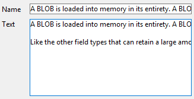
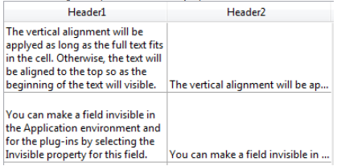

---

## Alpha Format

Alpha formats control the way the alphanumeric fields and variables appear when displayed or printed. Here is a list of formats provided for alphanumeric fields:

You can choose a format from this list or use any custom format. The default list contains formats for some of the most common alpha fields that require formats: US telephone numbers (local and long distance), Social Security numbers, and zip codes. You can also enter a custom format name set in the Filters and formats editor of the tool box. In this case, the format cannot be modified in the object properties.
Any custom formats or filters that you have created are automatically available, preceded by a vertical bar (|).

The number sign (#) is the placeholder for an alphanumeric display format. You can include the appropriate dashes, hyphens, spaces, and any other punctuation marks that you want to display. You use the actual punctuation marks you want and the number sign for each character you want to display.

For example, consider a part number with a format such as "RB-1762-1".

The alpha format would be:

 ##-####-#

When the user enters "RB17621," the field displays:

 RB-1762-1

The field actually contains "RB17621".

If the user enters more characters than the format allows, 4D displays the last characters. For example, if the format is:

 (#######)

and the user enters "proportion", the field displays:

 (portion)

The field actually contains "proportion". 4D accepts and stores the entire entry no matter what the display format. No information is lost.

#### JSON Grammar

|Name|Data Type|Possible Values|
|---|---|---|
|textFormat|string|"### ####", "(###) ### ####", "### ### ####", "### ## ####", "00000", custom formats|

#### Objects Supported

[Drop-down List](dropdownList_Overview.md) - [Combo Box](comboBox_overview.md) - [List Box Column](listbox_overview.md#list-box-columns) - [List Box Footer](listbox_overview.md#list-box-footers)

---

## Date Format

Date formats control the way dates appear when displayed or printed. For data entry, you enter dates in the MM/DD/YYYY format, regardless of the display format you have chosen.

Display formats for dates can be defined:

- using a 4D built-in format,
- using a custom pattern.

### Built-in formats

The table below shows choices available:

|Format name|JSON String|Example (US system)|
|---|---|---|
|System date short|systemShort (default)|03/25/20     |
|System date abbreviated *(1)*|systemMedium|Wed, Mar 25, 2020  |
|System date long|systemLong|Wednesday, March 25, 2020 |
|RFC 822|rfc822|Tue, 25 Mar 2020 22:00:00 GMT |
|Short Century|shortCentury |03/25/20 but 04/25/2032 *(2)*|
|Internal date long|long  |March 25, 2020 |
|Internal date abbreviated *(1)*|abbreviated|Mar 25, 2020|
|Internal date short|short  |03/25/2020 |
|ISO Date Time *(3)*|iso8601 |2020-03-25T00:00:00|

*(1)* To avoid ambiguity and in accordance with current practice, the abbreviated date formats display "jun" for June and "jul" for July. This particularity only applies to French versions of 4D.

*(2)* The year is displayed using two digits when it belongs to the interval (1930;2029) otherwise it will be displayed using four digits. This is by default but it can be modified using the [SET DEFAULT CENTURY](https://doc.4d.com/4dv20/help/command/en/page392.html) command.

*(3)* The `ISO Date Time` format corresponds to the XML date and time representation standard (ISO8601). It is mainly intended to be used when importing/exporting data in XML format and in Web Services.

>Regardless of the display format, if the year is entered with two digits then 4D assumes the century to be the 21st if the year belongs to the interval (00;29) and the 20th if it belongs to the interval (30;99). This is the default setting but it can be modified using the [SET DEFAULT CENTURY](https://doc.4d.com/4dv20/help/command/en/page392.html) command.

### Custom formats

Customized date formats can be built using several patterns described in the [**Date and Time Formats**](../Project/date-time-formats.md) page. For example:

|Pattern|Example (US system)|
|---|---|
|"eeee, dd"|Wednesday, 29 |
|"'Day' #D 'of the year'"|Day #333 of the year|

#### JSON Grammar

|Name|Data Type|Possible Values|
|---|---|---|
|dateFormat|string|<li>Built-in formats: "systemShort", "systemMedium", "systemLong", "iso8601", "rfc822", "short", "shortCentury", "abbreviated", "long" + " blankIfNull"</li><li>Custom formats: any format built using a [supported pattern](../Project/date-time-formats.md) + " blankIfNull"</li>|

:::note blankIfNull

- By default, a null date is displayed with zeros, e.g. 00/00/00. With the "blankIfNull" option, a null date is displayed as an empty area. The "blankIfNull" string (case sensitive) must be combined with the selected format value. Ex: "systemShort blankIfNull" or "ee dd LL blankIfNull".
- [List box columns](listbox_overview.md#list-box-columns) and [list box footers](listbox_overview.md#list-box-footers) of type date always use the "blank if null" behavior (it cannot be disengaged).

:::

#### Objects Supported

[Combo Box](comboBox_overview.md) - [Drop-down List](dropdownList_Overview.md) - [Input](input_overview.md) - [List Box Column](listbox_overview.md#list-box-columns) - [List Box Footer](listbox_overview.md#list-box-footers)

---

## Number Format

>Number fields include the Integer, Long integer, Integer 64 bits, Real and Float types.

Number formats control the way numbers appear when displayed or printed. For data entry, you enter only the numbers (including a decimal point or minus sign if necessary), regardless of the display format you have chosen.

4D provides various default number formats.

### Placeholders  

In each of the number display formats, the number sign (#), zero (0), caret (^), and asterisk (*) are used as placeholders. You create your own number formats by using one placeholder for each digit you expect to display.

|Placeholder |Effect for leading or trailing zero|
|---|---|
|# |Displays nothing|
|0| Displays 0|
|^| Displays a space (1)|
|*| Displays an asterisk|

(1) The caret (^) generates a space character that occupies the same width as a digit in most fonts.

For example, if you want to display three-digit numbers, you could use the format ###. If the user enters more digits than the format allows, 4D displays <<< in the field to indicate that more digits were entered than the number of digits specified in the display format.

If the user enters a negative number, the leftmost character is displayed as a minus sign (unless a negative display format has been specified). If ##0 is the format, minus 26 is displayed as –26 and minus 260 is displayed as <<< because the minus sign occupies a placeholder and there are only three placeholders.

>No matter what the display format, 4D accepts and stores the number entered in the field. No information is lost.

Each placeholder character has a different effect on the display of leading or trailing zeros. A leading zero is a zero that starts a number before the decimal point; a trailing zero is a zero that ends a number after the decimal point.

Suppose you use the format ##0 to display three digits. If the user enters nothing in the field, the field displays 0. If the user enters 26, the field displays 26.

### Separator characters  

The numeric display formats (except for scientific notations) are automatically based on regional system parameters. 4D replaces the “.” and “,” characters by, respectively, the decimal separator and the thousand separator defined in the operating system. The period and comma are thus considered as placeholder characters, following the example of 0 or #.

>On Windows, when using the decimal separator key of the numeric keypad, 4D makes a distinction depending on the type of field where the cursor is located:
>
> * in a Real type field, using this key will insert the decimal separator defined in the system,
> * in any other type of field, this key inserts the character associated with the key, usually a period (.) or comma (,).

### Decimal points and other display characters

You can use a decimal point in a number display format. If you want the decimal to display regardless of whether the user types it in, it must be placed between zeros.

You can use any other characters in the format. When used alone, or placed before or after placeholders, the characters always appear. For example, if you use the following format:

 $##0

a dollar sign always appears because it is placed before the placeholders.

If characters are placed between placeholders, they appear only if digits are displayed on both sides. For example, if you define the format:

 ###.##0

the point appears only if the user enters at least four digits.

Spaces are treated as characters in number display formats.

### Formats for positive, negative, and zero  

A number display format can have up to three parts allowing you to specify display formats for positive, negative, and zero values. You specify the three parts by separating them with semicolons as shown below:

 Positive;Negative;Zero

You do not have to specify all three parts of the format. If you use just one part, 4D uses it for all numbers, placing a minus sign in front of negative numbers.

If you use two parts, 4D uses the first part for positive numbers and zero and the second part for negative numbers. If you use three parts, the first is for positive numbers, the second for negative numbers, and the third for zero.

>The third part (zero) is not interpreted and does not accept replacement characters. If you enter `###;###;#`, the zero value will be displayed “#”. In other words, what you actually enter is what will be displayed for the zero value.

Here is an example of a number display format that shows dollar signs and commas, places negative values in parentheses, and does not display zeros:

 $###,##0.00;($###,##0.00);

Notice that the presence of the second semicolon instructs 4D to use nothing to display zero. The following format is similar except that the absence of the second semicolon instructs 4D to use the positive number format for zero:

 $###,##0.00;($###,##0.00)

In this case, the display for zero would be $0.00.

### Scientific notation  

If you want to display numbers in scientific notation, use the **ampersand** (&) followed by a number to specify the number of digits you want to display. For example, the format:

 &3

would display 759.62 as:

 7.60e+2

The scientific notation format is the only format that will automatically round the displayed number. Note in the example above that the number is rounded up to 7.60e+2 instead of truncating to 7.59e+2.

### Hexadecimal formats  

You can display a number in hexadecimal using the following display formats:

* `&x`: This format displays hexadecimal numbers using the “0xFFFF” format.
* `&$`: This format displays hexadecimal numbers using the “$FFFF” format.

### XML notation  

The `&xml` format will make a number compliant with XML standard rules. In particular, the decimal separator character will be a period "." in all cases, regardless of the system settings.

### Displaying a number as a time  

You can display a number as a time (with a time format) by using `&/` followed by a digit. Time is determined by calculating the number of seconds since midnight that the value represents. The digit in the format corresponds to the order in which the time format appears in the Format drop-down menu.

For example, the format:

 &/5

corresponds to the 5th time format in the pop-up menu, specifically the AM/PM time. A number field with this format would display 25000 as:

 6:56 AM

### Examples

The following table shows how different formats affect the display of numbers. The three columns — Positive, Negative, and Zero — each show how 1,234.50, –1,234.50, and 0 would be displayed.

|Format Entered |Positive| Negative |Zero|
|---|---|---|---|
|###   | <<<  | <<<  |   |
|####   | 1234 |<<<<  |  |
|#######  | 1234 |-1234  |  |
|#####.##  | 1234.5 |-1234.5 |  |
|####0.00  |1234.50 |-1234.50 |0.00 |
|#####0   |1234  |-1234  | 0 |
|+#####0;–#####0;0| +1234 |-1234  |0  |
|#####0DB;#####0CR;0|1234DB |1234CR  |0  |
|#####0;(#####0)| 1234 |(1234)  |0  |
|###,##0  | 1,234 |-1,234  |0  |
|##,##0.00  | 1,234.50|-1,234.50 |0.00 |
|\^\^\^\^\^\^\^ | 1234 |-1234  |  |
|\^\^\^\^\^\^0 | 1234 |-1234  |0  |
|\^\^\^,\^\^0 |1,234  |-1,234  |0  |
|\^\^,\^\^0.00 | 1,234.50|-1,234.50 |0.00 |
|\*\*\*\*\*\*\* |\*\*\*1234 |\*\*-1234 |\*\*\*\*\*\*\*|
|\*\*\**\*\*0 |\*\*\*1234 |\*\*-1234 |\*\*\*\*\*\*0|
|\*\*\*,*\*0 |\*\*1,234 |\*-1,234 |\*\*\*\*\*\*0|
|\*\*,\*\*0.00 |\*1,234.50 |-1,234.50 |\*\*\*\*\*0.00|
|$\*,\*\*0.00;–$\*,\*\*0.00|$1,234.50|-$1,234.50|$\*\*\*\*0.00|
|$\^\^\^\^0  | $ 1234 |$–1234  |$    0 |
|$\^\^\^0;–$\^\^\^0|$1234 |–$1234  |$   0 |
|$\^\^\^0 ;($\^\^\^0)|$1234 |($1234) |$   0 |
|$\^,\^\^0.00 ;($\^,\^\^0.00)|$1,234.50 | ($1,234.50)|$    0.00|
|&2    |1.2e+3  |-1.2e+3 |0.0e+0 |
|&5    |1.23450e+3 |-1.23450e+3|0.00000|
|&xml   | 1234.5 |-1234.5 | 0 |

#### JSON Grammar

|Name|Data Type|Possible Values|
|---|---|---|
|numberFormat|string|Numbers (including a decimal point or minus sign if necessary)|

#### Objects Supported

[Combo Box](comboBox_overview.md) - [Drop-down List](dropdownList_Overview.md) - [Input](input_overview.md) - [List Box Column](listbox_overview.md#list-box-columns) - [List Box Footer](listbox_overview.md#list-box-footers) - [Progress Indicators](progressIndicator.md)

---

## Picture Format

Picture formats control how pictures appear when displayed or printed. For data entry, the user always enters pictures by pasting them from the Clipboard or by drag and drop, regardless of the display format.

The truncation and scaling options do not affect the picture itself. The contents of a Picture field are always saved. Only the display on the particular form is affected by the picture display format.

### Scaled to fit

`JSON grammar: "scaled"`

The **Scaled to fit** format causes 4D to resize the picture to fit the dimensions of the area.

### Truncated (centered and non-centered)  

`JSON grammar: "truncatedCenter" / "truncatedTopLeft"`

The **Truncated (centered)** format causes 4D to center the picture in the area and crop any portion that does not fit within the area. 4D crops equally from each edge and from the top and bottom.

The **Truncated (non-centered)** format causes 4D to place the upper-left corner of the picture in the upper-left corner of the area and crop any portion that does not fit within the area. 4D crops from the right and bottom.

>When the picture format is **Truncated (non-centered)**, it is possible to add scroll bars to the input area.

### Scaled to fit (proportional) and Scaled to fit centered (proportional)  

`JSON grammar: "proportionalTopLeft" / "proportionalCenter"`

When you use **Scaled to fit (proportional)**, the picture is reduced proportionally on all sides to fit the area created for the picture. The **Scaled to fit centered (proportional)** option does the same, but centers the picture in the picture area.

If the picture is smaller than the area set in the form, it will not be modified. If the picture is bigger than the area set in the form, it is proportionally reduced. Since it is proportionally reduced, the picture will not appear distorted.

If you have applied the **Scaled to fit centered (proportional)** format, the picture is also centered in the area:

### Replicated  

`JSON grammar: "tiled"`

When the area that contains a picture with the **Replicated** format is enlarged, the picture is not deformed but is replicated as many times as necessary in order to fill the area entirely.

If the field is reduced to a size smaller than that of the original picture, the picture is truncated (non-centered).

#### JSON Grammar

|Name|Data Type|Possible Values|
|---|---|---|
|pictureFormat|string|"truncatedTopLeft", "scaled", "truncatedCenter", "tiled", "proportionalTopLeft", "proportionalCenter"|

#### Objects Supported

[Input](input_overview.md) - [List Box Column](listbox_overview.md#list-box-columns) - [List Box Footer](listbox_overview.md#list-box-footers)

---

## Time Format

Time formats control the way times appear when displayed or printed. For data entry, you enter times in the 24-hour HH:MM:SS format or the 12-hour HH:MM:SS AM/PM format, regardless of the display format you have chosen.

Display formats for times can be defined:

- using a 4D built-in format,
- using a custom pattern.

### Built-in formats

The table below shows the Time field display formats and gives examples:

|Format name|JSON string| Comments|Example for 04:30:25|
|---|---|---|---|
|HH:MM:SS|hh_mm_ss|    |04:30:25      |
|HH:MM|hh_mm|   |04:30       |
|Hour Min Sec|HH_MM_SS|   |4 hours 30 minutes 25 seconds |
|Hour Min|HH_MM|   |4 hours 30 minutes |
|HH:MM AM/PM|hh_mm_am|   |4:30 a.m. |
|MM SS|mm_ss   |Time expressed as a duration from 00:00:00 |270:25|
|Min Sec|MM_SS|Time expressed as a duration from 00:00:00 |270 Minutes 25 Seconds|
|ISO Date Time|iso8601|Corresponds to the XML standard for representing time-related data. It is mainly intended to be used when importing/exporting data in XML format| 0000-00-00T04:30:25|
|System time short|- (default)| Standard time format defined in the system|04:30:25|
|System time long abbreviated|systemMedium |macOS only: Abbreviated time format defined in the system.  Windows: this format is the same as the System time short format| 4•30•25 AM|
|System time long|systemLong| macOS only: Long time format defined in the system.  Windows: this format is the same as the System time short format |4:30:25 AM HNEC|

### Custom formats

Customized time formats can be built using several patterns described in the [**Date and Time Formats**](../Project/date-time-formats.md) page. For example:

|Pattern|Example (US system)|
|---|---|
|"HH 'hours' mm 'minutes' ss 'seconds'"|13 hours 25 minutes 12 seconds |
|"hh:mm aa"|01:25 PM|

#### JSON Grammar

|Name|Data Type|Possible Values|
|---|---|---|
|timeFormat|string |<li>Built-in formats: "systemShort", "systemMedium", "systemLong", "iso8601", "hh_mm_ss", "hh_mm", "hh_mm_am", "mm_ss", "HH_MM_SS", "HH_MM", "MM_SS" + " blankIfNull"</li><li>Custom formats: any format built using [a supported pattern](../Project/date-time-formats.md) + "blankIfNull"</li>|

:::note blankIfNull

By default, a null time is displayed with zeros, e.g. "00:00:00". With the "blankIfNull" option, a null time is displayed as an empty area. The "blankIfNull" string (case sensitive) must be combined with the selected format value. Ex: "MM_SS blankIfNull" or "hh:mm aa blankIfNull"

:::

#### Objects Supported

[Combo Box](comboBox_overview.md) - [Drop-down List](dropdownList_Overview.md) - [Input](input_overview.md) - [List Box Column](listbox_overview.md#list-box-columns) - [List Box Footer](listbox_overview.md#list-box-footers)

---

## Text when False/Text when True

When a [boolean expression](properties_Object.md#expression-type) is displayed as:

* a text in an [input object](input_overview.md)
* a ["popup"](properties_Display.md#display-type) in a [list box column](listbox_overview.md#list-box-columns),

... you can select the text to display for each value:

* **Text when True** - the text to be displayed when the value is "true"
* **Text when False** - the text to be displayed when the value is "false"

#### JSON Grammar

|Name|Data Type|Possible Values|
|---|---|---|
|booleanFormat|string|"\<*textWhenTrue*\>;\<*textWhenFalse*\>", e.g. "Assigned;Unassigned"|

#### Objects Supported

[List Box Column](listbox_overview.md#list-box-columns) - [Input](input_overview.md)

---

## Display Type

Used to associate a display format with the column data. The formats provided depends on the variable type (array type list box) or the data/field type (selection and collection type list boxes).

Boolean and number (numeric or integer) columns can be displayed as check boxes. In this case, the [Title](#title) property can be defined.

Boolean columns can also be displayed as pop-up menus. In this case, the [Text when False and Text when True](#text-when-falsetext-when-true) properties must be defined.

#### JSON Grammar

|Name|Data Type|Possible Values|
|---|---|---|
|controlType|string|<li>**number columns**: "automatic" (default) or "checkbox"</li><li>**boolean columns**: "checkbox" (default) or "popup"</li>|

#### Objects Supported

[List Box Column](listbox_overview.md#list-box-columns)

---

## Not rendered

When this property is enabled, the object is not drawn on the form, however it can still be activated.

In particular, this property allows implementing "invisible" buttons.  Non-rendered buttons can be placed on top of graphic objects. They remain invisible and do not highlight when clicked, however their action is triggered when they are clicked.  

#### JSON Grammar

|Name|Data Type|Possible Values|
|---|---|---|
|display| boolean|true, false|

#### Objects Supported

[Button](button_overview.md) - [Drop-down List](dropdownList_Overview.md)

---

## Three-States

Allows a check box object to accept a third state. The variable associated with the check box returns the value 2 when the check box is in the third state.

#### Three-states check boxes in list box columns

List box columns with a numeric [data type](properties_Object.md#expression-type) can be displayed as three-states check boxes. If chosen, the following values are displayed:

* 0 = unchecked box,
* 1 = checked box,
* 2 (or any value >0) = semi-checked box (third state). For data entry, this state returns the value 2.
* -1 = invisible check box,
* -2 = unchecked box, not enterable,
* -3 = checked box, not enterable,
* -4 = semi-checked box, not enterable

In this case as well, the [Title](#title) property is also available so that the title of the check box can be entered.  

#### JSON Grammar

|Name|Data Type|Possible Values|
|---|---|---|
|threeState| boolean|true, false|

#### Objects Supported

[Check box](checkbox_overview.md) - [List Box Column](listbox_overview.md#list-box-columns)

---

## Title

This property is available for a list box column if:

* the [column type](properties_Object.md#expression-type) is **boolean** and its [display type](properties_Display.md#display-type) is "Check Box"
* the [column type](properties_Object.md#expression-type) is **number** (numeric or integer) and its [display type](properties_Display.md#display-type) is "Three-states Checkbox".

In that cases, the title of the check box can be entered using this property.  

#### JSON Grammar

|Name|Data Type|Possible Values|
|---|---|---|
|controlTitle|string |Any custom label for the check box |

#### Objects Supported

[List Box Column](listbox_overview.md#list-box-columns)

---

## Truncate with ellipsis

Controls the display of values when list box columns are too narrow to show their full contents.

This option is available for columns with any type of contents, except pictures and objects.

* When the property is enabled (default), if the contents of a list box cell exceed the width of the column, they are truncated and an ellipsis is displayed:

 

>The position of the ellipsis depends on the OS. In the above example (Windows), it is added on the right side of the text. On macOS, the ellipsis is added in the middle of the text.

* When the property is disabled, if the contents of a cell exceed the width of the column, they are simply clipped with no ellipsis added:

 

The Truncate with ellipsis option is enabled by default and can be specified with list boxes of the Array, Selection, or Collection type.

> When applied to Text type columns, the Truncate with ellipsis option is available only if the [Wordwrap](#wordwrap) option is not selected. When the Wordwrap property is selected, extra contents in cells are handled through the word-wrapping features so the Truncate with ellipsis property is not available.

The Truncate with ellipsis property can be applied to Boolean type columns; however, the result differs depending on the [cell format](#display-type):

* For Pop-up type Boolean formats, labels are truncated with an ellipsis,
* For Check box type Boolean formats, labels are always clipped.

#### JSON Grammar

|Name|Data Type|Possible Values|
|---|---|---|
|truncateMode | string|"withEllipsis", "none" |

#### Objects Supported

[List Box Column](listbox_overview.md#list-box-columns) - [List Box Footer](listbox_overview.md#list-box-footers)

---

## Visibility

This property allows hiding the object in the Application environment.

You can handle the Visibility property for most form objects. This property is mainly used to simplify dynamic interface development. In this context, it is often necessary to hide objects programatically during the `On load` event of the form then to display certain objects afterwards. The Visibility property allows inverting this logic by making certain objects invisible by default. The developer can then program their display using the [`OBJECT SET VISIBLE`](https://doc.4d.com/4dv19/help/command/en/page603.html) command when needed.

#### Automatic visibility in list forms

In the context of ["list" forms](FormEditor/properties_FormProperties.md#form-type), the Visibility property supports two specific values:

* **If record selected** (JSON name: "selectedRows")
* **If record not selected** (JSON name: "unselectedRows")

This property is only used when drawing objects located in the body of a list form. It tells 4D whether or not to draw the object depending on whether the record being processed is selected/not selected. It allows you to represent a selection of records using visual attributes other than highlight colors:

4D does not take this property into account if the object was hidden using the [`OBJECT SET VISIBLE`](https://doc.4d.com/4dv20/help/command/en/page603.html) command; in this case, the object remains invisible regardless of whether or not the record is selected.

#### JSON Grammar

|Name|Data Type|Possible Values|
|---|---|---|
|visibility|string|"visible", "hidden", "selectedRows" (list form only), "unselectedRows" (list form only)|

#### Objects Supported

[4D View Pro area](viewProArea_overview.md) - [4D Write Pro area](writeProArea_overview.md) - [Button](button_overview.md) - [Button Grid](buttonGrid_overview.md) - [Check Box](checkbox_overview.md) - [Combo Box](comboBox_overview.md) - [Drop-down List](dropdownList_Overview.md) - [Group Box](groupBox.md) - [Hierarchical List](list_overview.md) - [List Box](listbox_overview.md) - [List Box Column](listbox_overview.md#list-box-columns) - [List Box Footer](listbox_overview.md#list-box-footers) - [List Box Header](listbox_overview.md#list-box-headers) - [Picture Button](pictureButton_overview.md) - [Picture Pop-up Menu](picturePopupMenu_overview.md) - [Plug-in Area](pluginArea_overview.md) - [Progress indicator](progressIndicator.md) - [Radio Button](radio_overview.md) - [Spinner](spinner.md) - [Splitter](splitters.md) - [Static Picture](staticPicture.md) - [Stepper](stepper.md) - [Subform](subform_overview.md) - [Tab control](tabControl.md) - [Text Area](text.md) - [Web Area](webArea_overview.md)

---

## Wordwrap

> For [input](input_overview.md) objects, available when the [Multiline](properties_Entry.md#multiline) property is set to "yes" .

Manages the display of contents when it exceeds the width of the object.

#### Checked for list box/Yes for input

`JSON grammar: "normal"`

When this option is selected, text automatically wraps to the next line whenever its width exceeds that of the column/area, if the column/area height permits it.

* In single-line columns/areas, only the last word that can be displayed entirely is displayed. 4D inserts line returns; it is possible to scroll the contents of the area by pressing the down arrow key.

* In multiline columns/areas, 4D carries out automatic line returns.

#### Unchecked for list box/No for input

`JSON grammar: "none"`

When this option is selected, 4D does not do any automatic line returns and the last word that can be displayed may be truncated. In text type areas, carriage returns are supported:

In list boxes, any text that is too long is truncated and displayed with an ellipse (...). In the following example, the Wordwrap option is **checked for the left column** and **unchecked for the right column**:

Note that regardless of the Wordwrap option’s value, the row height is not changed. If the text with line breaks cannot be entirely displayed in the column, it is truncated (without an ellipse). In the case of list boxes displaying just a single row, only the first line of text is displayed:

#### Automatic for input (default option)

`JSON grammar: "automatic"`

* In single-line areas, words located at the end of lines are truncated and there are no line returns.
* In multiline areas, 4D carries out automatic line returns.

#### JSON Grammar

|Name|Data Type|Possible Values|
|---|---|---|
|wordwrap |string | "automatic" (excluding list box), "normal", "none"|

#### Objects Supported

[Input](input_overview.md) - [List Box Column](listbox_overview.md#list-box-columns) - [List Box Footer](listbox_overview.md#list-box-footers)
