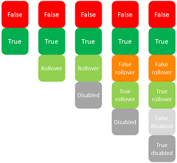

## Background pathname

Sets the path of the picture that will be drawn in the background of the object. If the object uses an [icon](#picture-pathname) with [different states](#number-of-states), the background picture will automatically support the same number of states.

The pathname to enter is similar as for the [Pathname property for static pictures](properties_Picture.md#pathname).

#### JSON Grammar

|Name|Data Type|Possible Values|
|---|---|---|
|customBackgroundPicture |string |Relative path in POSIX syntax. Must be used in conjunction with the style property with the "custom" option.|

#### Objects Supported

[Custom Button](button_overview.md#custom) - [Custom Check Box](checkbox_overview.md#custom) - [Custom Radio Button](radio_overview.md#custom)

---

## Button Style

General appearance of the button. The button style also plays a part in the availability of certain options.

#### JSON Grammar

|Name|Data Type|Possible Values|
|:---:|:---:|---|
|style|text |"regular", "flat", "toolbar", "bevel", "roundedBevel", "gradientBevel", "texturedBevel", "office", "help", "circular", "disclosure", "roundedDisclosure", "custom"|

#### Objects Supported

[Button](button_overview.md) - [Radio Button](radio_overview.md) - [Check Box](checkbox_overview.md) - [Radio Button](radio_overview.md)

---

## Horizontal Margin

This property allows setting the size (in pixels) of the horizontal margins of the button. This margin delimits the area that the button icon and title must not surpass.

This parameter is useful, for example, when the background picture contains borders:

|With / Without | Example |
|---|---|
|Without margin||
|With 13-pixel margin||

>This property works in conjunction with the [Vertical Margin](#vertical-margin) property.

#### JSON Grammar

|Name|Data Type|Possible Values|
|---|---|---|
|customBorderX|number|For use with "custom" style. Minimum: 0

#### Objects Supported

[Custom Button](button_overview.md#custom) - [Custom Check Box](checkbox_overview.md#custom) - [Custom Radio Button](radio_overview.md#custom)

---

## Icon Location

Designates the placement of an icon in relation to the form object.

#### JSON Grammar

|Name|Data Type|Possible Values|
|---|---|---|
|iconPlacement|string|"none", "left", "right"|

#### Objects Supported

[List Box Header](listbox_overview.md#list-box-headers)

---

## Icon Offset

Sets a custom offset value in pixels, which will be used when the button is clicked

The title of the button will be shifted to the right and toward the bottom for the number of pixels entered. This allows applying a customized 3D effect when the button is clicked.

#### JSON Grammar

|Name|Data Type|Possible Values|
|---|---|---|
|customOffset|number |minimum: 0|

#### Objects Supported

[Custom Button](button_overview.md#custom) - [Custom Check Box](checkbox_overview.md#custom) - [Custom Radio Button](radio_overview.md#custom)

---

## Number of States

This property sets the exact number of states present in the picture used as the icon for a [button with icon](button_overview.md), a [check box](checkbox_overview.md) or a custom [radio button](radio_overview.md). 

The picture can contain from 2 to 6 states.

- 2 states: false, true
- 3 states: false, true, rollover,
- 4 states: false, true, rollover, disabled,
- 5 states (check box and radio button only): false, true, false rollover, true rollover, disabled
- 6 states (check box and radio button only): false, true, false rollover, true rollover, false disabled, true disable. 

:::note

- "false" means button not clicked/not selected or check box unchecked (variable value=0)
- "true" means button clicked/selected or check box checked (variable value=1)

:::

Each state is represented by a different picture. In the source picture, the states must be stacked vertically:

#### JSON Grammar

|Name|Data Type|Possible Values|
|---|---|---|
|iconFrames|number|Number of states in the icon picture. Minimum: 1|

#### Objects Supported

[Button](button_overview.md) (all styles except [Help](button_overview.md#help)) - [Check Box](checkbox_overview.md) - [Radio Button](radio_overview.md)

---

## Picture pathname

Sets the path of the picture that will be used as icon for the object.

The pathname to enter is similar as for the [Pathname property for static pictures](properties_Picture.md#pathname).

> When used as icon for active objects, the picture must be designed to support a variable [number of states](#number-of-states).

#### JSON Grammar

|Name|Data Type|Possible Values|
|---|---|---|
|icon|picture |Relative or filesystem path in POSIX syntax.|

#### Objects Supported

[Button](button_overview.md) (all styles except [Help](button_overview.md#help)) - [Check Box](checkbox_overview.md) - [List Box Header](listbox_overview.md#list-box-headers) - [Radio Button](radio_overview.md)

---

## Title/Picture Position

This property allows modifying the relative location of the button title in relation to the associated icon. This property has no effect when the button contains only a title (no associated picture) or a picture (no title). By default, when a button contains a title and a picture, the text is placed below the picture.

Here are the results using the various options for this property:

|Option|Description|Example|
|---|---|---|
|**Left**|The text is placed to the left of the icon. The contents of the button are aligned to the right.||
|**Top**|The text is placed above the icon. The contents of the button are centered.|    |
|**Right**|The text is placed to the right of the icon. The contents of the button are aligned to the left.| |
|**Bottom**|The text is placed below the icon. The contents of the button are centered.| |
|**Centered**|The text of the icon is centered vertically and horizontally in the button. This parameter is useful, for example, for text included in an icon.| |

#### JSON Grammar

|Name|Data Type|Possible Values|
|---|---|---|
|textPlacement|string|"left", "top", "right", "bottom", "center"|

#### Objects Supported

[Button](button_overview.md) (all styles except [Help](button_overview.md#help)) - [Check Box](checkbox_overview.md) - [Radio Button](radio_overview.md)

---

## Image hugs title

This property allows you to define whether the title and the picture of the button should be visually adjoined or separated, according to the [Title/Picture position](#titlepicture-position) and [Horizontal Alignment](#horizontal-alignment) properties.

This property has no effect when the button contains only a title (no associated picture) or a picture (no title). 

By default, when a button contains a title and a picture, the elements are joined. The following graphic shows the effect of the `imageHugsTitle` property (true when property is enabled) with different button alignments:

#### JSON Grammar

|Name|Data Type|Possible Values|
|---|---|---|
|imageHugsTitle|boolean|true (default), false|

#### Objects Supported

[Button](button_overview.md) (all styles except Help) - [Check Box](checkbox_overview.md) (all styles except Regular, Flat, Disclosure and Collapse/Expand) - [Radio Button](radio_overview.md) (all styles except Regular, Flat, Disclosure and Collapse/Expand).

---

## Vertical Margin

This property allows setting the size (in pixels) of the vertical margins of the button. This margin delimits the area that the button icon and title must not surpass.

This parameter is useful, for example, when the background picture contains borders.

> This property works in conjunction with the [Horizontal Margin](#horizontal-margin) property.

#### JSON Grammar

|Name|Data Type|Possible Values|
|---|---|---|
|customBorderY|number|For use with "custom" style. Minimum: 0|

#### Objects Supported

[Custom Button](button_overview.md#custom) - [Custom Check Box](checkbox_overview.md#custom) - [Custom Radio Button](radio_overview.md#custom)

---

## With pop-up menu

This property allows displaying a symbol that appears as a triangle in the button to indicate the presence of an attached pop-up menu:

The appearance and location of this symbol depends on the button style and the current platform.

### Linked and Separated

To attach a pop-up menu symbol to a button, there are two display options available:

|Linked|Separated|
|:---:|:---:|
| ||

>The actual availability of a "separated" mode depends on the style of the button and the platform.

Each option specifies the relation between the button and the attached pop-up menu:

- When the pop-up menu is **separated**, clicking on the left part of the button directly executes the current action of the button; this action can be modified using the pop-up menu accessible in the right part of the button.
- When the pop-up menu is **linked**, a simple click on the button only displays the pop-up menu. Only the selection of the action in the pop-up menu causes its execution.

:::info

Refer to the [`On Alternative Click` event description](../Events/onAlternativeClick.md) for more information on the handling of events in this case.

:::

### Managing the pop-up menu

It is important to note that the "With Pop-up Menu" property only manages the graphic aspect of the button. The display of the pop-up menu and its values must be handled entirely by the developer, more particularly using `form events` and the [`Dynamic pop up menu`](https://doc.4d.com/4dv19R7/help/command/en/page1006.html) and [`Pop up menu`](https://doc.4d.com/4dv19R7/help/command/en/page542.html) commands.

#### JSON Grammar

|Name|Data Type|Possible Values|
|:---|---|---|
|popupPlacement |string |<li>"none"</li><li>"linked"</li><li>"separated"</li> |

#### Objects Supported

[Toolbar Button](button_overview.md#toolbar) - [Bevel Button](button_overview.md#bevel) - [Rounded Bevel Button](button_overview.md#rounded-bevel) - [OS X Gradient Button](button_overview.md#os-x-gradient) - [OS X Textured Button](button_overview.md#os-x-textured) - [Office XP Button](button_overview.md#office-xp) - [Circle Button](button_overview.md#circle) - [Custom](button_overview.md#custom)
