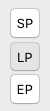

Radio buttons are objects that allow the user to select one of a group of buttons.

Usually, a radio button shows a small bullseye with text. However, radio buttons can have [various appearances](#button-styles).

A radio button is selected:
- when the user clicks on it
- when it has the focus and the user presses the **Space bar** key.

## Configuring radio buttons

Radio buttons are used in coordinated sets: only one button at a time can be selected in the set. In order to operate in a coordinated manner, a set of radio buttons must share the same [Radio Group](properties_Object.md#radio-group) property. 

Radio buttons are controlled with methods. Like all buttons, a radio button is set to 0 when the form is first opened. A method associated with a radio button executes when the button is selected. The following is an example of a group of radio buttons used in a video collection database to enter the speed of the recording (SP, LP, or EP):

Selecting one radio button in a group sets that button to 1 and all of the others in the group to 0. Only one radio button can be selected at a time.

>You can associate [Boolean type expressions](properties_Object.md#variable-or-expression) with radio buttons. In this case, when a radio button in a group is selected, its variable is True and the variables for the group's other radio buttons are False.

The value contained in a radio button object is not saved automatically (except if it is the representation of a Boolean field); radio button values must be stored in their variables and managed with methods.

## Button Styles

Radio [button styles](properties_TextAndPicture.md#button-style) control radio button's general appearance as well as its available properties. It is possible to apply different predefined styles to radio buttons. However, the same button style must be applied to all radio buttons in a group so that they work as expected. 

4D provides radio buttons in the following predefined styles: 

### Regular

The Regular radio button style is a standard system button (*i.e.*, a small bullseye with text) which executes code when a user clicks on it.

In addition to initiating code execution, the Regular radio button style changes bullsey color when being hovered.

### Flat

The Flat radio button style is a standard system button (*i.e.*, a small bullseye with text) which executes code when a user clicks on it.

By default, the Flat style has a minimalist appearance. The Flat button style's graphic nature is particularly useful for forms that will be printed.

### Toolbar

The Toolbar radio button style is primarily intended for integration in a toolbar. 

By default, the Toolbar style has a transparent background with a label in the center. The appearance of the button can be different when the cursor hovers over it depending on the OS:

 - *Windows* - the button is highlighted. 

 - *macOS* - the highlight of the button never appears. 
 

### Bevel

The Bevel radio button style is similar to the [Toolbar](#toolbar) style's behavior, except that it has a light gray background and a gray outline. The appearance of the button can be different when the cursor hovers over it depending on the OS:

 - *Windows* - the button is highlighted. 

  

 - *macOS* - the highlight of the button never appears. 
 

### Rounded Bevel

The Rounded Bevel button style is nearly identical to the [Bevel](#bevel) style except, depending on the OS, the corners of the button may be rounded. 

 - *Windows* - the button is identical to the [Bevel](#bevel) style. 

 - *macOS* - the corners of the button are rounded. 
  

### OS X Gradient

The OS X Gradient button style is nearly identical to the [Bevel](#bevel) style except, depending on the OS, it may have a two-toned appearance. 

 - *Windows* - the button is identical to the [Bevel](#bevel) style. 

 - *macOS* - the button is displayed as a two-tone system button. 
 

### OS X Textured

The OS X Textured radio button style is nearly identical to the [Toolbar](#toolbar) style except, depending on the OS, it may have a different appearance and does not display hover. 

By default, the OS X Textured style appears as:

 - *Windows* - a toolbar-like button with a label in the center and the background is always displayed. 
  
 - *macOS* - a standard system button displaying a color change from light to dark gray. Its height is predefined: it is not possible to enlarge or reduce it.
 
  

### Office XP

The Office XP button style combines the appearance of the [Regular](#regular) style (standard system button) with the [Toolbar](#toolbar) style's behavior. 

The colors (highlight and background) of a button with the Office XP style are based on the system colors. The appearance of the button can be different when the cursor hovers over it depending on the OS:

 - *Windows* - its background only appears when the mouse rolls over it.

  

 - *macOS* - its background is always displayed.

### Collapse/Expand

This button style can be used to add a standard collapse/expand icon. These buttons are used natively in hierarchical lists. In Windows, the button looks like a [+] or a [-]; in macOS, it looks like a triangle pointing right or down. 

:::info

The Collapse/Expand style is named "disclosure" in the [button style JSON Grammar](properties_TextAndPicture.md#button-style).

:::

### Disclosure

The disclosure radio button style displays the radio button as a standard disclosure button, usually used to show/hide additional information. The button symbol points downwards with value 0 and upwards with value 1. 

:::info

The Disclosure style is named "roundedDisclosure" in the [button style JSON Grammar](properties_TextAndPicture.md#button-style).

:::

### Custom

The Custom radio button style accepts a personalized background picture and allows managing additional parameters such as [icon offset](properties_TextAndPicture.md#icon-offset) and [margins](properties_TextAndPicture.md#horizontal-margin). 

## Supported properties

All radio buttons share the same set of basic properties:  

[Bold](properties_Text.md#bold) - [Bottom](properties_CoordinatesAndSizing.md#bottom) - [Button Style](properties_TextAndPicture.md#button-style) - [Class](properties_Object.md#css-class) - [Expression Type](properties_Object.md#expression-type) - [Focusable](properties_Entry.md#focusable) - [Font](properties_Text.md#font) - [Font Color](properties_Text.md#font-color) - [Height](properties_CoordinatesAndSizing.md#height) - [Help Tip](properties_Help.md#help-tip) - [Horizontal Alignment](properties_Text.md#horizontal-alignment)(1) - [Horizontal Sizing](properties_ResizingOptions.md#horizontal-sizing) - [Image hugs title](properties_TextAndPicture.md#image-hugs-title)(2) - [Italic](properties_Text.md#italic) - [Left](properties_CoordinatesAndSizing.md#left) - [Number of States](properties_TextAndPicture.md#number-of-states)(2) - [Method](properties_Action.md#method) - [Object Name](properties_Object.md#object-name) - [Radio Group](properties_Object.md#radio-group) - [Picture pathname](properties_TextAndPicture.md#picture-pathname)(2) - [Right](properties_CoordinatesAndSizing.md#right) - [Save value](properties_Object.md#save-value) - [Shortcut](properties_Entry.md#shortcut) - [Title](properties_Object.md#title) - [Title/Picture Position](properties_TextAndPicture.md#titlepicture-position)(2) - [Top](properties_CoordinatesAndSizing.md#top) - [Type](properties_Object.md#type) - [Underline](properties_Text.md#underline) - [Variable or Expression](properties_Object.md#variable-or-expression) - [Vertical Sizing](properties_ResizingOptions.md#vertical-sizing) - [Visibility](properties_Display.md#visibility) - [Width](properties_CoordinatesAndSizing.md#width)

> (1) Not supported by the [Regular](#regular) and [Flat](#flat) styles. 
> (2) Not supported by the [Regular](#regular), [Flat](#flat), [Disclosure](#disclosure) and [Collapse/Expand](#collapseexpand) styles.

Additional specific properties are available depending on the [button style](#button-styles):

- Custom: [Background pathname](properties_TextAndPicture.md#background-pathname) - [Horizontal Margin](properties_TextAndPicture.md#horizontal-margin) - [Icon Offset](properties_TextAndPicture.md#icon-offset) - [Vertical Margin](properties_TextAndPicture.md#vertical-margin)