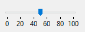

The ruler is a standard interface object used to set or get values using a cursor moved along its graduations. 

You can assign its [associated variable or expression](properties_Object.md#expression-type) to an enterable area (field or variable) to store or modify the current value of the object.

For more information, please refer to [Using indicators](progressIndicator.md#using-indicators) in the "Progress Indicator" page.

### Supported Properties

[Bold](properties_Text.md#bold) - [Border Line Style](properties_BackgroundAndBorder.md#border-line-style) -[Bottom](properties_CoordinatesAndSizing.md#bottom) - [Class](properties_Object.md#css-class) - [Display graduation](properties_Scale.md#display-graduation) - [Enterable](properties_Entry.md#enterable) - [Execute object method](properties_Action.md#execute-object-method) - [Expression Type](properties_Object.md#expression-type) - [Height](properties_CoordinatesAndSizing.md#height) - [Graduation step](properties_Scale.md#graduation-step) -[Help Tip](properties_Help.md#help-tip) - [Horizontal Sizing](properties_ResizingOptions.md#horizontal-sizing) - [Label Location](properties_Scale.md#label-location) - [Left](properties_CoordinatesAndSizing.md#left) - [Maximum](properties_Scale.md#maximum) - [Minimum](properties_Scale.md#minimum) - [Number Format](properties_Display.md#number-format) - [Object Name](properties_Object.md#object-name) - [Right](properties_CoordinatesAndSizing.md#right) - [Step](properties_Scale.md#step) - [Top](properties_CoordinatesAndSizing.md#top) - [Type](properties_Object.md#type) - [Variable or Expression](properties_Object.md#variable-or-expression) - [Vertical Sizing](properties_ResizingOptions.md#vertical-sizing) - [Visibility](properties_Display.md#visibility) - [Width](properties_CoordinatesAndSizing.md#width)   

## See also

- [progress indicators](progressIndicator.md) 
- [steppers](stepper.md)