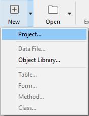

4D projects are created and developed using the **4D** application, which provides a comprehensive Integrated Development Environment (IDE). **4D Server** can also create new, empty projects.

## Creating a project

New 4D application projects can be created from **4D** or **4D Server**. In any case, project files are stored on the local machine.

To create a new project:

1. Launch 4D or 4D Server.
2. Do one of the following:
    * Select **New > Project...** from the **File** menu: 
    * (4D only) Select **Project...** from the **New** toolbar button:

A standard **Save** dialog appears so you can choose the name and location of the 4D project's main folder.

3. Enter the name of your project folder and click **Save**. This name will be used:

	* as the name of the entire project folder,
	* as the name of the .4DProject file at the first level of the ["Project" folder](../Project/architecture.md#project-folder).

 You can choose any name allowed by your operating system. However, if your project is intended to work on other systems or to be saved via a source control tool, you must take their specific naming recommendations into account.

When you validate the **Save** dialog, 4D closes the current project (if any), creates a project folder at the indicated location, and puts all files needed for the project into it. For more information, refer to [Architecture of a 4D Project](Project/architecture.md).

You can then start developing your project.

## Opening a project

To open an existing project from 4D:

1. Do one of the following:

    * Select **Open/Local Project...** from the **File** menu or the **Open** toolbar button.
    * Select **Open a local application project** in the Welcome Wizard dialog

The standard Open dialog appears.

2. Select the project's `.4dproject` file (located inside the ["Project" folder of the project](../Project/architecture.md#project-folder)) and click **Open**. 

	By default, the project is opened with its current data file. Other file types are suggested:

	* *Packed project files*: `.4dz` extension  - deployment projects
	* *Shortcut files*: `.4DLink` extension - store additional parameters needed for opening projects or applications (addresses, identifiers, etc.)
	* *Binary files*: `.4db` or `.4dc` extension - legacy 4D database formats

### Options

In addition to standard system options, the *Open* dialog in 4D provides two menus with specific options that are available using the **Open** button and the **Data file** menu.

* **Open** - opening mode of the project:
  * **Interpreted** or **Compiled**: These options are available when the selected project contains both [interpreted and compiled code](Concepts/interpreted.md).
  * **[Maintenance Security Center](MSC/overview.md)**: Opening in secure mode allowing access to damaged projects in order to perform any necessary repairs.

* **Data file** - specifies the data file to be used with the project. By default, the **Current data file** option is selected.

## Project opening shortcuts

4D offers several ways to open projects directly and bypass the Open dialog:

* via menu options:
  * *Menu bar* - **File** > **Open Recent Projects / {project name}**
  * *4D Tool bar* -  Select the project from the menu associated with the **Open** button

* via preferences:
  * Set the **At startup** general preference to **Open last used project**.

* using a `.4DLink` file.

### Opening a Project with a 4DLink file

You can use a [`.4DLink` file](#about-4DLink-files) to launch the 4D application and open the target 4D project. There are two ways to do this:

* double-click or drag and drop the `.4DLink` file onto the 4D application
* go to **File** > **Open Recent Projects** and select a project

A .4DLink file of "remote project" type can be copied and used on several machines.

>It's also possible to select a 4DLink file in the 4D and 4D Server opening dialog box (opening local project only).

## About 4DLink Files

Files with the `.4DLink` extension are XML files that contain parameters intended to automate and simplify opening local or remote 4D projects.

`.4DLink` files can save the address of a 4D project as well as its connection identifiers and opening mode, saving you time when opening projects.

4D automatically generates a `.4DLink` file when a local project is opened for the first time or when connecting to a server for the first time. The file is stored in the local preferences folder at the following location:

* Windows: C:\Users\UserName\AppData\Roaming\4D\Favorites vXX\
* macOS: Users/UserName/Library/Application Support/4D/Favorites vXX/

XX represents the version number of the application. For example, "Favorites v19" for 4D v19.

That folder is divided into two subfolders:

* the **Local** folder contains the `.4DLink` files that can be used to open local projects
* the **Remote** folder contains the `.4DLink` files of recent remote projects

`.4DLink` files can also be created with an XML editor.

4D provides a DTD describing the XML keys that can be used to build a `.4DLink` file. This DTD is named database_link.dtd and is found in the `\Resources\DTD\` subfolder of the 4D application.

