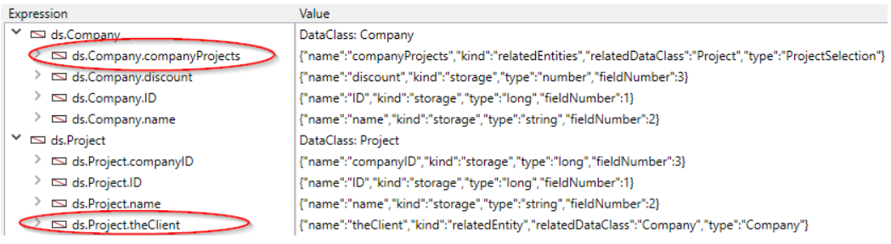

The ORDA technology is based upon an automatic mapping of an underlying database structure. It also provides access to data through entity and entity selection objects. As a result, ORDA exposes the whole database as a set of data model objects. 
 

## Structure mapping 

When you call a datastore using the [`ds`](commands/ds.md) or the [`Open datastore`](commands/open-datastore.md) command, 4D automatically references tables and fields of the corresponding 4D structure as properties of the returned [datastore](#datastore) object:

*	Tables are mapped to dataclasses.
*	Fields are mapped to storage attributes.
*	Relations are mapped to relation attributes - relation names, defined in the Structure editor, are used as relation attribute names.


 

### General rules

The following rules are applied for any conversions:

* Table, field, and relation names are mapped to object property names. Make sure that such names comply with general object naming rules, as explained in the [object naming conventions](Concepts/identifiers.md) section.
*	A datastore only references tables with a single primary key. The following tables are not referenced:
	*	Tables without a primary key
	*	Tables with composite primary keys.
*	BLOB fields are automatically available as attributes of the [Blob object](Concepts/dt_blob.md#blob-types) type. 

> ORDA mapping does not take into account:  
> - the "Invisible" option for tables or fields, 
> - the virtual structure defined through `SET TABLE TITLES` or `SET FIELD TITLES`,
> - the "Manual" or "Automatic" property of relations.


### Rules for remote access control

When accessing a remote datastore through the `Open datastore` command or [REST requests](REST/gettingStarted.md), only tables and fields with the **Expose as REST resource** property are available remotely. 

This option must be selected at the 4D structure level for each table and each field that you want to be exposed as dataclass and attribute in the datastore:


### Data model update  

Any modifications applied at the level of the database structure invalidate the current ORDA model layer. These modifications include:

*	adding or removing a table, a field, or a relation
*	renaming of a table, a field, or a relation
*	changing a core property of a field (type, unique, index, autoincrement, null value support)

When the current ORDA model layer has been invalidated, it is automatically reloaded and updated in subsequent calls of the local `ds` datastore on 4D and 4D Server. Note that existing references to ORDA objects such as entities or entity selections will continue to use the model from which they have been created, until they are regenerated.

However, the updated ORDA model layer is not automatically available in the following contexts:

*	a remote 4D application connected to 4D Server -- the remote application must reconnect to the server. 
*	a remote datastore opened using `Open datastore` or through [REST calls](REST/gettingStarted.md) -- a new session must be opened. 


## Object definition

### Datastore

The datastore is the interface object to a database. It builds a representation of the whole database as object. A datastore is made of a **model** and **data**:

- The model contains and describes all the dataclasses that make up the datastore. It is independant from the underlying database itself.
- Data refers to the information that is going to be used and stored in this model. For example, names, addresses, and birthdates of employees are pieces of data that you can work with in a datastore.

When handled through the code, the datastore is an object whose properties are all of the [dataclasses](#dataclass) which have been specifically exposed. 

4D allows you to handle the following datastores:

- the local datastore, based on the current 4D database, returned by the `ds` command (the main datastore).
- one or more remote datastore(s) exposed as REST resources in remote 4D databases, returned by the `Open datastore` command. 

A datastore references only a single local or remote database.

The datastore object itself cannot be copied as an object:

```4d 
$mydatastore:=OB Copy(ds) //returns null
```


The datastore properties are however enumerable:


```4d 
 ARRAY TEXT($prop;0)
 OB GET PROPERTY NAMES(ds;$prop)
  //$prop contains the names of all the dataclasses
```


The main (default) datastore is always available through the `ds` command, but the `Open datastore` command allows referencing any remote datastore. 

### Dataclass

A dataclass is the equivalent of a table. It is used as an object model and references all fields as attributes, including relational attributes (attributes built upon relations between dataclasses). Relational attributes can be used in queries like any other attribute.

All dataclasses in a 4D project are available as a property of the `ds` datastore. For remote datastores accessed through `Open datastore` or [REST requests](REST/gettingStarted.md), the **Expose as REST resource** option must be selected at the 4D structure level for each exposed table that you want to be exposed as dataclass in the datastore. 

For example, consider the following table in the 4D structure:


The `Company` table is automatically available as a dataclass in the `ds` datastore. You can write:

```4d 
var $compClass : cs.Company //declares a $compClass object variable of the Company class
$compClass:=ds.Company //assigns the Company dataclass reference to $compClass
```

A dataclass object can contain:

*	attributes
*	relation attributes

The dataclass offers an abstraction of the physical database and allows handling a conceptual data model. The dataclass is the only means to query the datastore. A query is done from a single dataclass. Queries are built around attributes and relation attribute names of the dataclasses. So the relation attributes are the means to involve several linked tables in a query.

The dataclass object itself cannot be copied as an object:

```4d 
$mydataclass:=OB Copy(ds.Employee) //returns null
```

The dataclass properties are however enumerable:

```code4d 
ARRAY TEXT($prop;0)
OB GET PROPERTY NAMES(ds.Employee;$prop)
//$prop contains the names of all the dataclass attributes
```


### Attribute

Dataclass properties are attribute objects describing the underlying fields or relations. For example:

```4d 
 $nameAttribute:=ds.Company.name //reference to class attribute
 $revenuesAttribute:=ds.Company["revenues"] //alternate way
```

This code assigns to `$nameAttribute` and `$revenuesAttribute` references to the name and revenues attributes of the `Company` class. This syntax does NOT return values held inside of the attribute, but instead returns references to the attributes themselves. To handle values, you need to go through [Entities](#entity).

All eligible fields in a table are available as attributes of their parent [dataclass](#dataclass). For remote datastores accessed through `Open datastore` or [REST requests](REST/gettingStarted.md), the **Expose as REST resource** option must be selected at the 4D structure level for each field that you want to be exposed as a dataclass attribute. 


#### Storage and Relation attributes  

Dataclass attributes come in several kinds: storage, relatedEntity, and relatedEntities. Attributes that are scalar (*i.e.*, provide only a single value) support all the standard 4D data types (integer, text, object, etc.).

*	A **storage attribute** is equivalent to a field in the 4D database and can be indexed. Values assigned to a storage attribute are stored as part of the entity when it is saved. When a storage attribute is accessed, its value comes directly from the datastore. Storage attributes are the most basic building block of an entity and are defined by name and data type.
*	A **relation attribute** provides access to other entities. Relation attributes can result in either a single entity (or no entity) or an entity selection (0 to N entities). Relation attributes are built upon "classic" relations in the relational structure to provide direct access to related entity or related entities. Relation attributes are directy available in ORDA using their names.

For example, consider the following partial database structure and the relation properties:


All storage attributes will be automatically available:

*	in the Project dataclass: "ID", "name", and "companyID"
*	in the Company dataclass: "ID", "name", and "discount"

In addition, the following relation attributes will also be automatically available:

*	in the Project dataclass: **theClient** attribute, of the "relatedEntity" kind; there is at most one Company for each Project (the client)
*	in the Company dataclass: **companyProjects** attribute, of the "relatedEntities" kind; for each Company there is any number of related Projects.

>The Manual or Automatic property of a database relation has no effect in ORDA.

All dataclass attributes are exposed as properties of the dataclass:



Keep in mind that these objects describe attributes, but do not give access to data. Reading or writing data is done through [entity objects](entities.md#using-entity-attributes).

#### Computed and Alias attributes

[Computed attributes](ordaClasses.md#computed-attributes) and [alias attributes](ordaClasses.md#alias-attributes) are "virtual" attributes. Their value is not stored but evaluated each time they are accessed. They do not belong to the underlying database structure, but are built upon it and can be used as any attribute of the data model.


### Entity

An entity is the equivalent of a record. It is actually an object that references a record in the database. It can be seen as an instance of a [dataclass](#dataclass), like a record of the table matching the dataclass. However, an entity also contains data correlated to the database related to the datastore. 

The purpose of the entity is to manage data (create, update, delete). When an entity reference is obtained by means of an entity selection, it also retains information about the entity selection which allows iteration through the selection.

The entity object itself cannot be copied as an object:

```4d
 $myentity:=OB Copy(ds.Employee.get(1)) //returns null
```

The entity properties are however enumerable:

```4d
 ARRAY TEXT($prop;0)
 OB GET PROPERTY NAMES(ds.Employee.get(1);$prop)
  //$prop contains the names of all the entity attributes
```


### Entity selection

An entity selection is an object containing one or more reference(s) to entities belonging to the same dataclass. It is usually created as a result of a query or returned from a relation attribute. An entity selection can contain 0, 1 or X entities from the dataclass -- where X can represent the total number of entities contained in the dataclass.

Example:

```4d
var $e : cs.EmployeeSelection //declares a $e object variable of the EmployeeSelection class type
$e:=ds.Employee.all() //assigns the resulting entity selection reference to the $e variable
``` 
 
Entity selections can be "sorted" or "unsorted" ([see below](#ordered-or-unordered-entity-selection)). 

> Entity selections can also be "shareable" or "non-shareable", depending on [how they have been created](entities.md#shareable-or-alterable-entity-selections). 

The entity selection object itself cannot be copied as an object:

```4d
 $myentitysel:=OB Copy(ds.Employee.all()) //returns null
``` 
 
The entity selection properties are however enumerable:

```4d
 ARRAY TEXT($prop;0)
 OB GET PROPERTY NAMES(ds.Employee.all();$prop)
  //$prop contains the names of the entity selection properties
  //("length", 00", "01"...)
```


#### Ordered or unordered entity selection

For optimization reasons, by default 4D ORDA usually creates unordered entity selections, except when you use the `orderBy( )` method or use specific options. In this documentation, unless specified, "entity selection" usually refers to an "unordered entity selection".

Ordered entity selections are created only when necessary or when specifically requested using options, i.e. in the following cases:

*	result of an `orderBy()` on a selection (of any type) or an `orderBy()` on a dataclass
*	result of the `newSelection()` method with the `dk keep ordered` option

Unordered entity selections are created in the following cases:

*	result of a standard `query()` on a selection (of any type) or a `query()` on a dataclass,
*	result of the `newSelection()` method without option,
*	result of any of the comparison methods, whatever the input selection types: `or()`, `and()`, `minus()`.

>The following entity selections are always **ordered**:
>
>*	entity selections returned by 4D Server to a remote client 
>*	entity selections built upon remote datastores.

Note that when an ordered entity selection becomes an unordered entity selection, any repeated entity references are removed.
