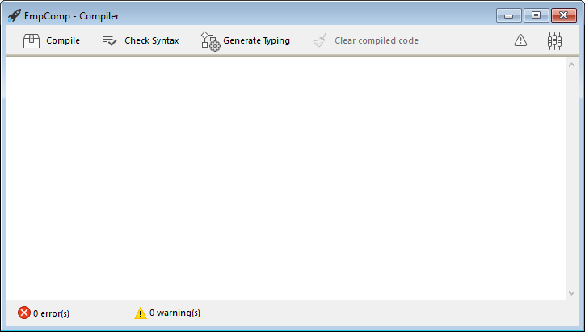

You can compile your projects, i.e., translate all of your methods into machine language. Compiling a project lets you check the consistency of the code and accelerate its execution, as well as making it possible to obfuscate the code in its entirety. Compilation is an indispensable step between the development of projects using 4D and their deployment as stand-alone applications. 


## Compile

The compilation is handled from your 4D application and is entirely automatic. 

> On macOS, the compilation requires that you install `Xcode`. See [this section](#silicon-compiler) for more information about this requirement.

1. Open the compiler window by selecting the **Compiler...** command in the **Design** menu or the **Compiler** toolbar button.

	  
	
	
	  
> You can also launch directly the compilation by selecting the **Start Compilation** menu item from the **Design** menu. 

2. Click the **Compile** button to launch the compilation using the current [compilation settings](#compiler-settings). 

If no errors are detected, the actual compilation begins and the "Compilation successful" message is displayed at the bottom of the window when the compilation is completed:


You can immediately [run your application in compiled mode](#run-compiled) and see how faster it is. 

If errors are detected, the process is stopped and the "Compilation failed" message is displayed. The information area of the window displays the method names and line numbers concerned in a hierarchical list:


Double-click on each error detected to open the method or class concerned directly in the 4D Code Editor. The line containing the error is highlighted and the type of error is displayed in the syntax area of the window. 

Use the **Previous Error** / **Next Error** commands of the **Method** menu to navigate from one error to the next.

The number of errors found during your first compilations may be daunting, but do not let this put you off. You will soon discover that they often spring from the same source, i.e., non-compliance with certain project conventions. The compiler always provides a [precise diagnosis](#error-file) of the errors in order to help you correct them.

> Compilation requires an appropriate license. Without this license, it is not possible to carry out a compilation (buttons are disabled). Nevertheless, it is still possible to check the syntax and generate Typing methods.

## Run Compiled 

Once a project is compiled, it is possible to switch from [interpreted mode to compiled mode](Concepts/interpreted.md), and vice versa, at any time and without having to quit the 4D application (except when the interpreted code has been removed). To do this, use the **Restart Interpreted** and **Restart Compiled** commands of the **Run** menu. The [Open project dialog box](GettingStarted/creating.md#options) also offers a choice between interpreted or compiled mode for database startup. 

When you switch from one mode to the other, 4D closes the current mode and opens the new one. This is equivalent to exiting and reopening the application. Each time you change from one mode to another, 4D executes the two following database methods (if specified) in this order: `On Exit` -> `On Startup`.

If you modify your project in interpreted mode, you must recompile it in order to have your edits taken into account in compiled mode. 

## Compiler window features 

In addition to the [**Compile** button](#compile), the Compiler window provides additional features that are useful during the project development phase. 

### Check Syntax

The **Check Syntax** button starts the execution of the syntax-checking phase. At the end of the checking process, any errors detected are listed in the information area. You can double–click on an error line in order to display the corresponding method or form object.

Syntax checking can also be launched directly using the **Check Syntax** command associated with the **Compiler** toolbar button. This option is the only one available if you do not have a suitable license to allow the compilation of applications.

### Generate Typing


:::info Compatibility

This button is only displayed in converted projects if the **All variables are typed (Direct typing)** [compilation path option](#enabling-direct-typing) is not selected. For information about this button, please refer to the [documentation of previous 4D releases](../Project/compiler.md#generate-typing).

:::


### Clear compiled code

The **Clear compiled code** button deletes the compiled code of the project. When you click on it, all of the [code generated during compilation](#classic-compiler) is deleted, the **Restart Compiled** command of the **Run** menu is disabled and the "Compiled Project" option is not available at startup.  


### Show/Hide Warnings

You can toggle the [warnings](#warnings) display in the Compiler window by clicking the **Show/Hide Warnings** button:


When this option is checked, the warnings (if any) are displayed in the window, after the other error types. They appear in italics:


Double-clicking a warning opens the corresponding method.

## Compiler Settings

The "Compiler" tab of the Settings dialog box lets you set parameters related to project compilation. You can directly open this page from the [compiler window](#compiler-window) by clicking on the **Compiler Settings** button:


### Compilation options

This area groups the generic options used during the compilation process.

#### Generate the symbol file

Used to generate the symbol file (see [symbol file](#symbol-file)). The symbol file is created in the in the [Logs folder](Project/architecture.md#logs) of the project with the name `ProjectName_symbols.txt`. 

#### Generate error file

Used to generate the error file (see [error file](#error-file)) at the time of syntax checking. The error file is created in the [Logs folder](Project/architecture.md#logs) of the project with the name `ProjectName_errors.xml`.


#### Compilation Target

<details><summary>History</summary>

|Release|Changes|
|---|---|
|19|Added|

</details>

This setting allows you to select the processor family for which your 4D project must be natively compiled. The 4D compiler can build native code for two processor families:

- **Intel/AMD** processors (all machines),
- **Apple Silicon** processors.

Two target options are proposed. The result depends on the processor of the machine on which 4D is running.

|*Option*|*on Windows Intel/AMD*|*on macOS Intel*|*on macOS Silicon*|  
|---|---|---|---|
|**All processors (Intel/AMD and Apple Silicon)**|Code for Intel/AMD<br/>*It is not possible to produce Apple Silicon code on Windows*|Code for Apple Silicon + Code for Intel/AMD<br/>*Two compiled codes will be available*|Code for Apple Silicon + Code for Intel/AMD<br/>*Two compiled codes will be available*|
|**My processor (processor)**|Code for Intel/AMD|Code for Intel/AMD|Code for Apple Silicon|

> Apple Silicon compiler target requires that the **Clang** application be installed on your machine. Clang comes with the latest version of Xcode. See the [Silicon compiler requirements](#requirements) for more information.


### Additional options (Compatibility)

In projects converted from 4D versions prior to 20 R7, additional compilation options are available:

- **Compilation Path**
- **Default typing**
- **Compiler Methods for...**

These options are only maintained for compatibility with legacy code. For more information, please refer to the [documentation of previous 4D releases](../Project/compiler.md#compiler-settings). 

In converted projects, it is recommended to [enable the direct typing mode](#enabling-direct-typing) and to write compliant declaration code, i.e.:

- declare explicitely all variables [using `var` keywords](../Concepts/variables.md#declaring-variables)
- declare explicitely all parameters in function prototypes (i.e. using the `Function` or `Class Constructor` keywords) or with `#DECLARE` keywords in methods (see [Declaring parameters](../Concepts/parameters.md#declaring-parameters).

#### Enabling direct typing

:::info

The direct typing mode is optional in converted projects only. It is natively used in projects created with 4D 20 R7 and higher. 

:::

Select **All variables are typed (Direct typing)** option in the **Compilation Path** menu to enable the direct typing mode. When this option is selected, other compatibility options become useless and are no longer displayed. 

Using this option is recommended since it provides flexibility and efficiency. The direct typing concept assumes that all elements are directly declared where they are defined in your code. You just have to make sure that all your variables are declared using the regular [`var` syntax](../Concepts/variables.md#declaring-variables) and that your method and function parameters are declared [in their prototypes](../Concepts/parameters.md) (the [Check Syntax](#check-syntax) feature can help you detecting missing or invalid declarations).


## Warnings

Warnings are specific messages generated by the compiler when it checks the syntax. These messages are intended to draw your attention to statements that might lead to execution errors. They do not prevent compilation.

Depending on circumstances and the programming style used, warnings may be more or less relevant. You can enable or disable warnings, in the compiler dialog, and in the code editors (4D code editor and VS Code), globally through the [warnings tab](#warnings-tab) or locally using [``//%W``](#disabling-and-enabling-warnings-locally).

### Warnings tab


This tab allows you to define which warnings should be displayed globally. From the list of all possible warnings with their types, their code and their localized label, ordered by warning code. 

To reduce the list, you can search words by warning labels and codes using the **Search in codes and labels** textbox or the magnifying glass icon on the left.

By default, all warning types are checked and enabled.

When you modify a warning display status, the information is stored in the "warnings.json" file, placed in the project Settings folder. 

The **Reset to factory settings** button sets all the warning display status checkboxes to default values and deletes the "warnings.json" file.


### Disabling and enabling warnings locally

You can control warnings in specific parts of your code by using special comments to disable or enable them.

To disable warnings, insert the following comments before and after the code section where you want to disable warnings:

```4d
// Before the selected code part use
  //%W-<warning number>

// After the selected code part use
  //%W+<warning number>
```

To re-enable warnings in a code section, use the following comments:

```4d
// Before the selected code part use
  //%W+<warning number>

// After the selected code part use
  //%W-<warning number>
```

Only warnings with numbers can be disabled or enabled. Warning numbers are specified at the end of each message in the list of compilation errors or in the list found in the warning tab. 
For example, to disable the following warning: 

*1: Redefinition of variable $a (550.10)*

... you just need to write the following comments in your 4D method:

```4d
  var $a : Text
  $a:="hello world"
  
  //%W-550.10
  var $a : Text
  //%W+550.10
  
```

:::note

The special warnings comments have priority over the warnings display settings set in the warning tab.

:::

## Compilation tools

### Symbol file

If you check the [**Generate the symbol file**](#generate-the-symbol-file) option in the compiler settings, a symbol file called `ProjectName_symbols.txt` is created in the [Logs folder](Project/architecture.md#logs) of the project during compilation. It is divided into several parts:

#### List of process and interprocess variables


These two lists contain four columns:

- Names of process and interprocess variables and arrays used in your project. These variables are listed in alphabetical order.
- Type of the variable. Types are set by compiler directive commands or are determined by the compiler based on the use of the variable. If the type of a variable cannot be determined, the column is empty.
- Number of dimensions if the variable is an array.
- Reference to the context in which the compiler established the type of the variable. If the variable is used in several contexts, the context mentioned is the one used by the compiler to determine its type.
	- If the variable was found in a database method, the database method name is given, preceded by (M)*.
	- If the variable was found in a project method, the method is identified as it has been defined in 4D, preceded by (M).
	- If the variable was found in a trigger, the table name is given, preceded by (TM).
	- If the variable was found in a form method, the form name is given, preceded by the table name and (FM).
	- If the variable was found in an object method, the object method’s name is given, preceded by the form name, table name, and by (OM).
	- If the variable is an object in a form and does not appear in any project, form, object method, or trigger, the name of the form in which it appears is given, preceded by (F).
At the end of each list, you can find the sizes of the process and interprocess variables in bytes.

> When compiling, the compiler cannot determine in which process a given process variable is used. A process variable can have a different value in each process. Consequently, all process variables are systematically duplicated as each new process is launched: it is thus advisable to watch out for the amount of memory that they will take up. Also, keep in mind that the space for process variables is not related to the stack size for the process.

#### List of local variables

The list of local variables is sorted by database method, project method, trigger, form method, and object method, in the same order as in 4D.

This list is divided into three columns:

- list of local variables used in the method;
- type of the variable;
- number of dimensions if the variable is an array.

#### Complete list of methods

A complete list of your database and project methods is given at the end of the file with:

- their type (procedure or function returning a value)
- the data types of their parameters and the returned result
- the number of calls
- the Thread Safe or Thread Unsafe property.

This information appears as follows:

```
Procedure or Function <Method name>(parameter data types):
result data type, number of calls, Thread Safe or Thread Unsafe
```

### Error file

You can choose whether or not to generate an error file during compilation using the [**Generate error file**](#generate-error-file) option in the compiler settings. The error file is automatically named `projectName_errors.xml` and is placed in the [Logs folder](Project/architecture.md#logs) of the project. 

Although the errors can be accessed directly via the [compiler window](#compile), it can be useful to have an error file that can be transmitted from one machine to another. The error file is generated in XML format in order to facilitate automatic parsing of its contents. It also allows the creation of customized error display interfaces.

The length of the error file depends on the number of errors and warnings issued by the compiler. 

The structure of the error file is as follows:

- At the top of the file is the list of errors and warnings, sorted by method and in their order of creation in 4D. 
- In the ***General errors*** section, all the typing impossibilities and identity ambiguities are grouped together. These errors and warnings are listed using the following format:
	- line number in the method (0 indicates general errors)
	- warning attribute indicating whether the detected anomaly is a warning (warning="true") or an error (warning="false")
	- diagnostic describing the error

If your project does not have any general errors, the file will not have a *General errors* section.

An error file may contain three types of messages:

- **Errors linked to a specific line**: these errors are displayed in context — the line in which they were found — with an explanation. The compiler reports this type of error when it encounters an expression in which it sees an inconsistency related to data type or syntax. In the compiler window, double–click on each error detected in order to open the method concerned directly in the 4D Code Editor, with the line containing the error highlighted.

- **General errors**: These are errors that make it impossible to compile the project. There are two cases in which the compiler reports a general error:
	- The data type of a process variable could not be determined.
	- Two different kinds of objects have the same name.

General errors are so named because they cannot be linked to any specific method. In the first case, the compiler could not perform a specified typing anywhere in the project. In the second, it was unable to decide whether to associate a given name with one object rather than with another.

- **Warnings**: Warnings are not errors. They do not prevent the project from being compiled, but simply point out potential code errors. In the compiler window, warnings appear in italics. Double-click on each warning to open the method concerned directly in the 4D Code Editor, with the line containing the warning highlighted.


### Range checking

The code generated by the 4D compiler automatically checks that every access to an array element or a character reference is done within the actual range of array elements or string characters. Out of range accesses will provoke runtime execution errors.

In some cases, you might prefer range checking not to apply to certain parts of the code that are considered to be reliable. More particularly, in the case of loops that are repeated a great number of times, and when running the compiled database on older machines, range checking can significantly slow down processing. If you are absolutely certain that the code concerned is reliable and cannot cause system errors, you can disable range checking locally.

To do this, you must surround the code to be excluded from range checking with the special comments `//%R-` and `//%R+`. The `//%R-` comment disables range checking and `//%R+` enables it again:

```4d
  // %R-   to disable range checking
 
 ... //Place the code to be excluded from range checking here
 
  // %R+   to enable range checking again for the rest
```

## About Compilers

4D contains two compilers:

- a "classic" compiler, used to compile native code for Intel/AMD processors;
- a Silicon compiler, used to compile native code for Apple Silicon processors.

The classic compiler can be used on any platform, while the Silicon compiler can only be used on a Mac machine:

||Compile for Windows|Compile for Intel Mac|Compile for Silicon Mac|
|---|:---:|:---:|:---:|
|On Windows|&#10003;|&#10003;|&#10007;|
|On Intel Mac|&#10003;|&#10003;|&#10003;|
|On Silicon Mac|&#10003;|&#10003;|&#10003;|


Both compilers are integrated into 4D. The appropriate compiler is automatically selected depending on the [compilation target](#compilation-target) option. 


### Classic Compiler

The classic compiler generates native compiled code for Intel/AMD processors on any machines. It does not require any specific configuration. 

Resulting compiled code is stored in the [DerivedData](architecture.md#deriveddata) folder of the project.  


### Silicon Compiler

The Silicon compiler generates native compiled code for Apple Silicon processors, such as *Apple M1*. 

Resulting compiled code is stored in the [Libraries](architecture.md#libraries) folder of the project.


#### Requirements

- **Apple machine**: The Silicon compiler can only be run from an Apple machine. 
- **4D Project architecture**: The Silicon compiler is only available for 4D developments using [project architecture](architecture.md).
- **Xcode or Developer Tools**: The Silicon compiler calls the **Clang** open-source macOS compiler to compile the project from C++ code at the [second step](#incremental-compiler) of compilation. *clang* requires Apple native libraries, which are provided by either the **Xcode** or **Developer Tools** package.
	- **If you already have** Xcode or Developer Tools installed on your computer, you only need to make sure that its version is compliant with 4D requirements. 
	- **If you do not have** any of these tools installed on your computer, you will need to download one of them from the Apple Developer web site.
	
> We recommend to install **Xcode**, which is quite simple to install. You can decide to install **Developer Tools** which is more compact, however its installation is a little more complex. 

In any cases, the 4D Silicon compiler will warn you if your configuration does not comply with its requirements. 


#### Incremental compiler

The Silicon compiler is incremental, which means that:

- During the very first compilation, **all 4D methods** are compiled. This step could take a certain time. However it only occurs once.
- During all subsequent compilations, only **new or modified methods** are processed, thus reducing drastically the compilation time. 