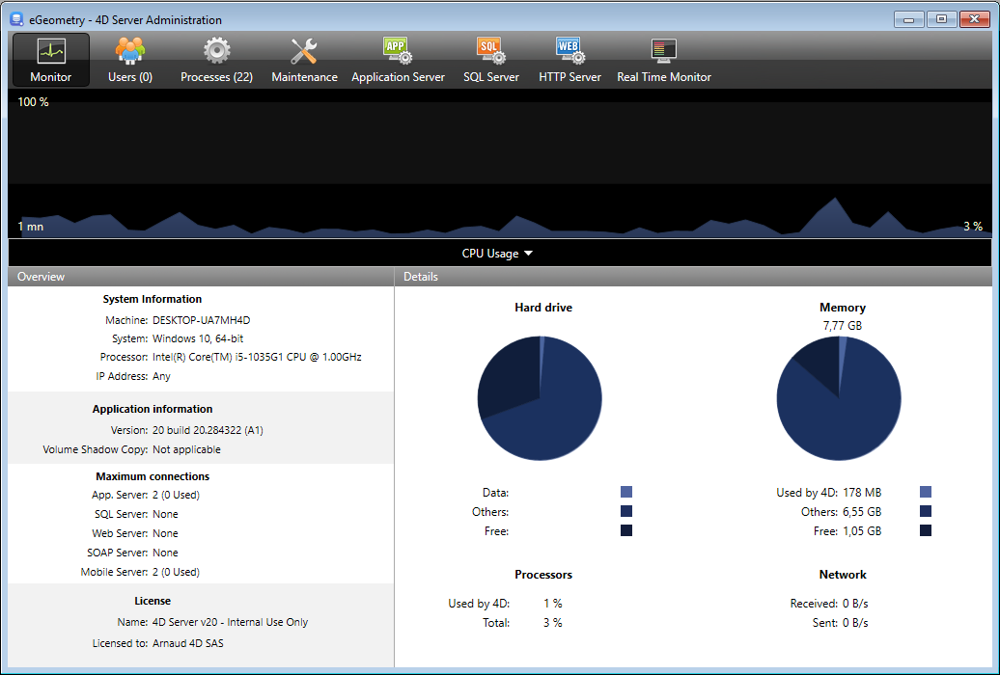
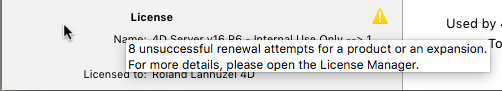

The **Monitor** page displays dynamic information concerning database use as well as information about the system and the 4D Server application.

> On Windows, some of the system information displayed on this page are retrieved via the Windows "Performance Analyzer" tools. These tools can only be accessed when the user that opened the session where 4D Server was launched has the necessary administration authorization.

## Graphic area

The graphic area lets you see the evolution in real time of several parameters: the CPU usage, network traffic and memory. You select the parameter to be displayed via a menu found in the center of the window:

- **CPU Usage**: Overall CPU usage of the machine, for all applications taken together. The specific part of 4D Server in this usage rate is provided in the "Processors" information area.
- **Network**: Number of bytes received per second by the machine (server or client). The number of bytes sent is provided in the "Network" information area.
- **Physical memory**: Quantity of RAM memory of machine used by 4D Server. A more detailed view of memory use is provided in the "Memory" information area.
- **Virtual memory**: Quantity of virtual memory used by the 4D Server application. This memory is allocated by the system according to the application needs. The value found at the bottom right of the area indicates the quantity of memory currently being used. The value found at the top left indicates the maximum quantity of usable virtual memory. The maximum value is calculated dynamically according to the general memory settings of the application.
- **Cache**: Quantity of cache memory used by the 4D Server application. The value found at the bottom right of the area indicates the quantity of memory currently being used. The value found at the top left indicates the total size of the cache memory, as set via the Settings.

Note that when this option is selected, the graph area scrolling is slowed down since an efficient analysis of the cache is generally carried out over a fairly long observation period.

## Overview Area

The "Overview" area provides various information concerning the system, application and licenses installed on the 4D Server machine.

- **System Information**: Computer, system and IP address of server
- **Application Information**: Internal version number of 4D Server and Volume Shadow Copy status
- **Maximum connections**: Number of simultaneous connections allowed by type of server
- **License**: Description of license. When the product license or one of its attached expansions expires in less than 10 days, e.g. in case of a subscription-license, 4D Server tries to automatically renew the license from the 4D user account. In this case, if the automatic renewal failed for some reason (connection error, invalid account status, non-prolongated contract...), a warning icon is displayed next to the license to alert the server administrator. Additional information about the license renewal status can be displayed in a tip when you hover the mouse over the area:

Usually, you will need to check the [**Licences Manager**](Admin/licenses.md).

## Details Area

The "Details" area repeats part of the information displayed in the graphic area and provides additional information as well.

- **Hard drive**: Overall capacity of the hard disk and distribution of the space used by the database data (data file + data index), the space used by other files and the free space available.
- **Memory**: RAM memory installed on the machine and amount of memory used by 4D Server, by other applications or that is free. The memory used by 4D Server can also be displayed dynamically in the graphic area.
- **Processors**: Instant occupancy rate for processor(s) of the machine by 4D Server and by other applications. This rate is constantly recalculated. The occupancy rate by 4D Server can also be displayed dynamically in the graphic area.
- **Network**: Instantaneous number of bytes sent and received by the machine (server or client). This value is updated constantly. The number of bytes received by can also be displayed dynamically in the graphic area.
