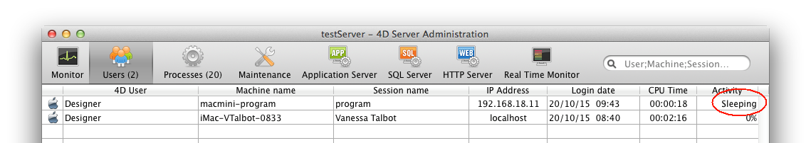

The **Users** page lists the 4D users connected to the server.

The "Users" button indicates, in parentheses, the total number of users connected to the server (this number does not take into account any display filters applied to the window). The page also contains a dynamic search area and control buttons. You can modify the order of the columns by dragging and dropping their header areas.

You can also sort the list of column values by clicking on its header. Click several times to specify in turn an ascending/descending order.

## List of Users

For each user connected to the server, the list provides the following information:

- System of the client machine (macOS or Windows) as an icon.
- **4D User**: Name of the 4D user, or alias if set with the [`SET USER ALIAS`](https://doc.4d.com/4dv19/help/command/en/page1666.html) command on the user machine. If passwords are not activated and no alias has been set, all users are named "Designer".
- **Machine name**: Name of the remote machine.
- **Session name**: Name of the session opened on the remote machine.
- **IP Address**: IP address of the remote machine.
- **Login date**: Date and time of the remote machine connection.
- **CPU Time**: CPU time consumed by this user since connecting.
- **Activity**: Ratio of time that 4D Server devotes to this user (dynamic display). "Sleeping" if the remote machine has switched to sleep mode (see below).

### Managing sleeping users

4D Server specifically handles cases where a machine running a 4D remote application switches to sleep mode while its connection to the server machine is still active. In this case, the connected 4D remote application automatically notifies 4D Server of its imminent disconnection. On the server, the connected user changes to a **Sleeping** activity status:

This status frees up resources on the server. In addition, the 4D remote application reconnects to 4D Server automatically after waking up from sleep mode.

The following scenario is supported: a remote user stops working for awhile, for example during a lunch break, but keeps the connection to the server open. The machine switches to sleep mode. When the user returns, they wake the machine up and the 4D remote application automatically recovers its connection to the server as well as the session context.

> A sleeping remote session is automatically dropped by the server after 48 hours of inactivity. You can modify this default timeout using the [`SET DATABASE PARAMETER`](https://doc.4d.com/4dv19/help/command/en/page642.html) command with the `Remote connection sleep timeout` selector. 

## Search/filtering Area

This feature can be used to reduce the number of rows displayed in the list to those that correspond to the text entered in the search area. The area indicates the columns where the search/filtering will be carried out. On the Users page, it will be the 4D User, Machine name and Session name columns.

The list is updated in real time as you enter text in the area. It is possible to enter more than one value to be searched for: separate the values with a semi-colon. The `OR` type operator is used in this case. For example, if you enter "John;Mary;Peter," only rows with John OR Mary OR Peter in the target columns will be kept.

## Administration Buttons

This page includes three control buttons. These are active if at least one row is selected. You can select several rows by holding down the **Shift** key for an adjacent selection or **Ctrl** (Windows) / **Command** (macOS) key for a non-adjacent selection.

### Send message

This button can be used to send a message to the 4D users selected in the window. If no user is selected, the button is not active. When you click on this button, a dialog box appears that lets you enter the message. The dialog box indicates the number of users that will receive this message:

The message will be displayed as an alert on the remote machines.

> You can perfom the same action for remote users with the [`SEND MESSAGE TO REMOTE USER`](https://doc.4d.com/4dv19/help/command/en/page1632.html) command.

### Watch Processes

This button can be used to directly show the processes of the user(s) selected on the [**Processes** page](processes.md) of the window. When you click on this button, 4D Server switches to the Processes page and enters the selected user names in the search/filtering area.

### Drop user

This button can be used to force the selected user(s) to disconnect. When you click on this button, a warning dialog box appears so that you can confirm or cancel this operation (hold down **Alt** key while clicking on the **Drop user** button to disconnect the selected user(s) directly without displaying the confirmation dialog box).

> You can perfom the same action for remote users with the [`DROP REMOTE USER`](https://doc.4d.com/4dv19/help/command/en/page1633.html) command.

