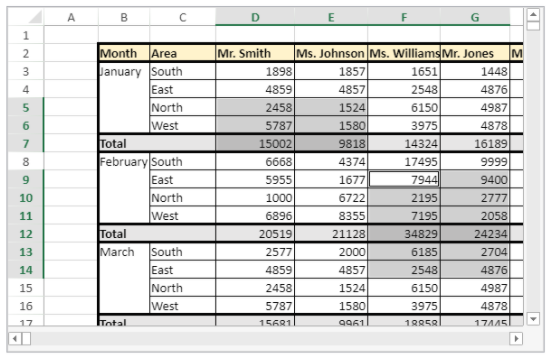

<!-- REF #_method_.VP ADD SELECTION.Syntax -->

**VP ADD SELECTION** ( *rangeObj* : Object )<!-- END REF -->

<!-- REF #_method_.VP ADD SELECTION.Params -->

|Parameter|Type| |Description|
|---|---|---|---|
|rangeObj| Object|->|Range object |<!-- END REF -->

#### Description

The `VP ADD SELECTION` command <!-- REF #_method_.VP ADD SELECTION.Summary -->adds the specified cells to the currently selected cells<!-- END REF -->.

In *rangeObj*, pass a range object of cells to add to the current selection.

>The active cell is not modified.

#### Example  

You have cells currently selected:


The following code will add cells to your selection:

```4d
$currentSelection:=VP Cells("myVPArea";3;4;2;3)
VP ADD SELECTION($currentSelection)
```

Result:



#### See also

[VP Get active cell](vp-get-active-cell.md)<br/>
[VP Get selection](vp-get-selection.md)<br/>
[VP RESET SELECTION](vp-reset-selection.md)<br/>
[VP SET ACTIVE CELL](vp-set-active-cell.md)<br/>
[VP SET SELECTION](vp-set-selection.md)<br/>
[VP SHOW CELL](vp-show-cell.md)