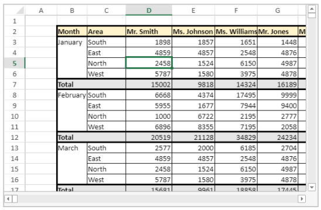

<!-- REF #_method_.VP Get active cell.Syntax -->
**VP Get active cell** (  *vpAreaName* : Text { ; *sheet* : Integer } ) : Object<!-- END REF -->

<!-- REF #_method_.VP Get active cell.Params -->

|Parameter|Type| |Description|
|---|---|---|---|
|vpAreaName  |Text|->|4D View Pro area form object name|
|sheet  |Integer|->|Sheet index (current sheet if omitted)|
|Result  |Object|<-|Range object of single cell|<!-- END REF -->

#### Description

The `VP Get active cell` command <!-- REF #_method_.VP Get active cell.Summary -->returns a new range object referencing the cell which has the focus and where new data will be entered (the active cell)<!-- END REF -->.

In *vpAreaName*, pass the name of the 4D View Pro area. If you pass a name that does not exist, an error is returned.

In the optional *sheet* parameter, you can designate a specific spreadsheet where the range will be defined (counting begins at 0). If omitted or if you pass `vk current sheet`, the current spreadsheet is used.

#### Example



The following code will retrieve the coordinates of the active cell:

```4d
$activeCell:=VP Get active cell("myVPArea")
 
  //returns a range object containing: 
  //$activeCell.ranges[0].column=3
  //$activeCell.ranges[0].row=4
  //$activeCell.ranges[0].sheet=0
```

#### See also

[VP ADD SELECTION](vp-add-selection.md)<br/>
[VP Get selection](vp-get-selection.md)<br/>
[VP RESET SELECTION](vp-reset-selection.md)<br/>
[VP SET ACTIVE CELL](vp-set-active-cell.md)<br/>
[VP SET SELECTION](vp-set-selection.md)<br/>
[VP SHOW CELL](vp-show-cell.md)
