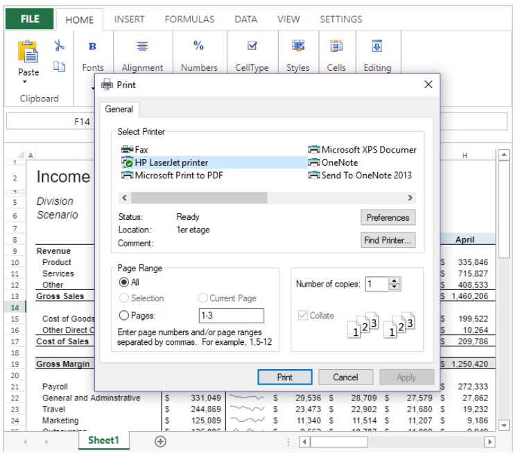

<!-- REF #_method_.VP PRINT.Syntax -->
**VP PRINT** ( *vpAreaName* : Text  { ; *sheet* : Integer } ) <!-- END REF -->

<!-- REF #_method_.VP PRINT.Params -->

|Parameter|Type||Description|
|---|---|---|---|
|vpAreaName   |Text|->|4D View Pro area form object name|
|sheet   |Integer|->|Sheet index (current sheet if omitted)|<!-- END REF -->

#### Description

The `VP PRINT` command <!-- REF #_method_.VP PRINT.Summary -->opens a print dialog window to print *vpAreaName*<!-- END REF -->.

Pass the 4D View Pro area to be printed in *vpAreaName*. The command will open the system print dialog window where the printer can be specified and the page properties can be defined.

>The properties defined in the print dialog window are for the printer paper, they are not the printing properties for the 4D View Pro area. Printing properties for 4D View Pro areas are defined using the [VP SET PRINT INFO](vp-set-print-info.md) command. It is highly recommended that the properties for both the printer and the 4D View Pro area match, otherwise the printed document may not correspond to your expectations.

In the optional *sheet* parameter, you can designate a specific spreadsheet to print (counting begins at 0). If omitted, the current sheet is used by default. You can explicitly select the current spreadsheet or entire workbook with the following constants:

* `vk current sheet`
* `vk workbook`  

> * 4D View Pro areas can only be printed with the `VP PRINT` command.
> * Commands from the 4D **Printing** language theme are not supported by `VP PRINT`.
> * This command is intended for individual printing by the final end user. For automated print jobs, it is advised to export the 4D View Pro area as a PDF with the [VP EXPORT DOCUMENT](vp-export-document.md) method.

#### Example

The following code:

```4d
 VP PRINT("myVPArea")
```

... will open a print dialog window:



#### See also

[VP EXPORT DOCUMENT](vp-export-document.md)<br/>
[VP SET PRINT INFO](vp-set-print-info.md)
