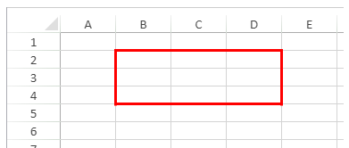

<!-- REF #_method_.VP SET BORDER.Syntax -->
**VP SET BORDER** ( *rangeObj* : Object ; *borderStyleObj* : Object  ; *borderPosObj* : Object ) <!-- END REF -->

<!-- REF #_method_.VP SET BORDER.Params -->

|Parameter|Type||Description|
|---|---|---|---|
|rangeObj   |Object|->|Range object|
|borderStyleObj    |Object|->|Object containing border line style|
|borderPosObj    |Object|->|Object containing border placement|<!-- END REF -->

#### Description

The `VP SET BORDER` command <!-- REF #_method_.VP SET BORDER.Summary -->applies the border style(s) defined in *borderStyleObj* and *borderPosObj* to the range defined in the *rangeObj*<!-- END REF -->.

In *rangeObj*, pass a range of cells where the border style will be applied. If the *rangeObj* contains multiple cells, borders applied with `VP SET BORDER` will be applied to the *rangeObj* as a whole (as opposed to the [`VP SET CELL STYLE`](vp-set-cell-style.md) command which applies borders to each cell of the *rangeObj*). If a style sheet has already been applied, `VP SET BORDER` will override the previously applied border settings for the *rangeObj*.

The *borderStyleObj* parameter allows you to define the style for the lines of the border. The *borderStyleObj* supports the following properties:

|Property| Type| Description |Possible values|
|---|---|---|---|
|color| text| Defines the color of the border. Default = black.| CSS color "#rrggbb" syntax (preferred syntax), CSS color "rgb(r,g,b)" syntax (alternate syntax), CSS color name (alternate syntax)|
|style| Integer| Defines the style of the border. Default = empty.|<li>`vk line style dash dot`</li><li>`vk line style dash dot dot`</li><li>`vk line style dashed`</li> <li>`vk line style dotted`</li><li>`vk line style double`</li><li>`vk line style empty`</li><li>`vk line style hair`</li> <li>`vk line style medium`</li><li>`vk line style medium dash dot`</li><li>`vk line style medium dash dot dot`</li><li>`vk line style medium dashed`</li><li>`vk line style slanted dash dot`</li><li>`vk line style thick`</li><li>`vk line style thin`</li>|

You can define the position of the *borderStyleObj* (i.e., where the line is applied) with the *borderPosObj*:

|Property| Type| Description|
|---|---|---|
|all|boolean|Border line style applied to all borders.|
|left|boolean|Border line style applied to left border. |
|top|boolean|Border line style applied to top border. |
|right |boolean|Border line style applied to right border.|
|bottom |boolean|Border line style applied to bottom border.|
|outline|boolean|Border line style applied to outer borders only.|
|inside |boolean|Border line style applied to inner borders only. |
|innerHorizontal|boolean|Border line style applied to inner horizontal borders only. |
|innerVertical| boolean|Border line style applied to inner vertical borders only.|
  
#### Example 1

This code produces a border around the entire range:

```4d
$border:=New object("color";"red";"style";vk line style thick)
$option:=New object("outline";True)
VP SET BORDER(VP Cells("ViewProArea";1;1;3;3);$border;$option)
```



#### Example 2

This code demonstrates the difference between `VP SET BORDER` and setting borders with the [`VP SET CELL STYLE`](vp-set-cell-style.md) command:

```4d
// Set borders using VP SET BORDER
$border:=New object("color";"red";"style";vk line style thick)
$option:=New object("outline";True)
VP SET BORDER(VP Cells("ViewProArea";1;1;3;3);$border;$option)
 
// // Set borders using VP SET CELL STYLE
$cellStyle:=New object
$cellStyle.borderBottom:=New object("color";"blue";"style";vk line style thick)
$cellStyle.borderRight:=New object("color";"blue";"style";vk line style thick)
VP SET CELL STYLE(VP Cells("ViewProArea";4;4;3;3);$cellStyle)
```


#### See also

[VP SET CELL STYLE](vp-set-cell-style.md)
