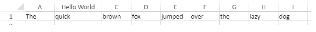

<!-- REF #_method_.VP SET COLUMN ATTRIBUTES.Syntax -->
**VP SET COLUMN ATTRIBUTES** ( *rangeObj* : Object  ; *propertyObj* : Object) <!-- END REF -->

<!-- REF #_method_.VP SET COLUMN ATTRIBUTES.Params -->

|Parameter|Type||Description|
|---|---|---|---|
|rangeObj   |Object|->|Range object|
|propertyObj |Object|->|Object containing column properties|<!-- END REF -->

#### Description

The `VP SET COLUMN ATTRIBUTES` command <!-- REF #_method_.VP SET COLUMN ATTRIBUTES.Summary --> applies the attributes defined in the *propertyObj* to the columns in the *rangeObj*<!-- END REF -->.

In *rangeObj*, pass an object containing a range. If the range contains both columns and rows, attributes are applied only to the columns.

The *propertyObj* parameter lets you specify the attributes to apply to the columns in the *rangeObj*. These attributes are:

|Property|  Type  |Description |
|---|---|---|
|width  |number| Column width expressed in pixels |
|pageBreak  |boolean|  True to insert a page break before the first column of the range, else false |
|visible| boolean | True if the column is visible, else false |
|resizable | boolean | True if the column can be resized, else false |
|header|  text | Column header text|
  
#### Example

To change the size of the second column and set the header, you write:

```4d
C_OBJECT($column;$properties)
 
$column:=VP Column("ViewProArea";1) //column B
$properties:=New object("width";100;"header";"Hello World")
 
VP SET COLUMN ATTRIBUTES($column;$properties)
```




#### See also

[VP Column](vp-column.md)<br/>
[VP Get column attributes](vp-get-column-attributes.md)<br/>
[VP Get row attributes](vp-get-row-attributes.md)<br/>
[VP SET ROW ATTRIBUTES](vp-set-row-attributes.md)