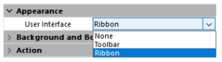

The 4D View Pro area properties can be configured using the Property list. Spreadsheet properties are available through the language.

## Form area properties

Using the area's property list, you can set [4D View Pro object properties](FormObjects/viewProArea_overview.md#supported-properties) such as **Object Name**, [**Variable or Expression**](#4d-view-pro-form-object-variable), **Appearance**, **Action**, and **Events**.


### Selecting a user interface

You can select the interface to use with your 4D View Pro form areas in the **Property List**, under **Appearance**:  



> You can also use the [`userInterface`](FormObjects/properties_Appearance.md#user-interface) and [`withFormulaBar`](FormObjects/properties_Appearance.md#show-formula-bar)(only with the "toolbar" interface) JSON properties.  

Interfaces allow for basic modifications and data manipulation. User-defined modifications are saved in the 4D View Pro object when the user saves the document.

#### Ribbon


#### Toolbar

Enabling the Toolbar interface displays the [**Show Formula Bar**](FormObjects/properties_Appearance.md#show-formula-bar) option. When selected, the formula bar is visible below the Toolbar interface.

With visible formula bar:


#### Features

Both the Ribbon and the Toolbar interfaces group related features into tabs:  

|Tab|  Actions |Ribbon Interface| Toolbar Interface|
|---|---|:---:|:---:|
|File|File manipulation|X| |  
|Home|Text appearance|X|X|
|Insert|Add items| X| X|
|Formulas|Formula calculation and library|  X|X|
|Data|Data manipulation|X| X|
|View|Visual presentation| X| X|
|Settings|Sheet presentation reference|X| |  

## Form Events

The following form events are available in the Property List for 4D View Pro areas.

Some of the events are standard form events (available to all active objects) and some are specific 4D View Pro form events. Some standard form events provide extended information in the object returned by the [`FORM Event`](https://doc.4d.com/4dv19/help/command/en/page1606.html) command when they are generated for 4D View Pro areas. The following table shows which events are standard and which are specific or provide additional information to 4D View Pro areas:

|Standard 4D events|Specific and extended 4D View Pro events|
|---|---|
|[On Load](../Events/onLoad.md)  |[On VP Ready](../Events/onVpReady.md)|
|[On Getting Focus](../Events/onGettingFocus.md) |[On Clicked](../Events/onClicked.md)|
|[On Losing Focus](../Events/onLosingFocus.md)  |[On Double Clicked](../Events/onDoubleClicked.md)|
|[On Unload](../Events/onUnload.md)  |[On Header Click](../Events/onHeaderClick.md)|
|  |[On After Edit](../Events/onAfterEdit.md)|
|  |[On Selection Change](../Events/onSelectionChange.md)|
|  |[On Column Resize](../Events/onColumnResize.md)|
|  |[On Row Resize](../Events/onRowResize.md)|
|  |[On VP Range Changed](../Events/onVpRangeChanged.md)|

## Sheet Options

The 4D View Pro sheet options object allows you to control various options of your 4D View Pro areas. This object is handled by the following commands:

* [VP SET SHEET OPTIONS](commands/vp-set-sheet-options.md)
* [VP Get sheet options](commands/vp-get-sheet-options.md)

### Sheet appearance  

|Property| | Type| Description|
|---|---|---|---|
|allowCellOverflow| | boolean| Specifies whether data can overflow into adjacent empty cells.|
|sheetTabColor| | string| A color string used to represent the sheet tab color, such as "red", "#FFFF00", "rgb(255,0,0)", "Accent 5", and so on.|
|frozenlineColor| | string| A color string used to represent the frozen line color, such as "red", "#FFFF00", "rgb(255,0,0)", "Accent 5", and so on.|
|clipBoardOptions| | longint| The clipboard option. Available values: `vk clipboard paste options all`, `vk clipboard paste options formatting`, `vk clipboard paste options formulas`, `vk clipboard paste options formulas and formatting`, `vk clipboard paste options values`, `vk clipboard paste options values and formatting`|
|gridline| | object| The grid line's options.|
||color| string| A color string used to represent the grid line color, such as "red", "#FFFF00", "rgb(255,0,0)", "Accent 5", and so on.|
||showVerticalGridline| boolean| Specifies whether to show the vertical grid line.
||showHorizontalGridline| boolean| Specifies whether to show the horizontal grid line.|
|rowHeaderVisible| | boolean| Specifies whether the row header is visible.|
|colHeaderVisible| | boolean| Specifies whether the column header is visible.|
|rowHeaderAutoText|  |longint| Specifies whether the row header displays letters or numbers or is blank. Available values: `vk header auto text blank`, `vk header auto text letters`, `vk header auto text numbers`|
|colHeaderAutoText|  |longint| Specifies whether the column header displays letters or numbers or is blank. Available values: `vk header auto text blank`, `vk header auto text letters`, `vk header auto text numbers`|
|selectionBackColor| | string| The selection's background color for the sheet. (preferred RGBA format)
|selectionBorderColor|  |string| The selection's border color for the sheet.|
|sheetAreaOffset|  |object| The sheetAreaOffset's options.|
||left| longint| The offset left of sheet from host.|
||top| longint| The offset top of sheet from host.|

>All properties are optional.

### Sheet protection  

To lock the whole sheet, you only need to set the *isProtected* property to **true**. You can then unlock cells individually by setting the [locked](#layout) cell style property.

|Property| | Type| Description|
|---|---|---|---|
|isProtected|  |boolean |Specifies whether cells on this sheet that are marked as protected cannot be edited.|
|protectionOptions|  |object |A value that indicates the elements that you want users to be able to change. If null : the protectionOptions parameter is reset.|
||allowSelectLockedCells |boolean |Specifies whether the user can select locked cells, optional. True by default.|
||allowSelectUnlockedCells |boolean |Specifies whether the user can select unlocked cells, optional. True by default.|
||allowSort |boolean |Specifies whether the user can sort ranges, optional. False by default.|
||allowFilter |boolean |Specifies whether the user can filter ranges, optional. False by default.|
||allowEditObjects |boolean |Specifies whether the user can edit floating objects, optional. False by default.|
||allowResizeRows |boolean |Specifies whether the user can resize rows, optional. False by default.|
||allowResizeColumns |boolean |Specifies whether the user can resize columns, optional. False by default.|
||allowDragInsertRows |boolean |Specifies whether the user can perform the drag operation to insert rows, optional. False by default.|
||allowDragInsertColumns |boolean |Specifies whether the user can perform the drag operation to insert columns, optional. False by default.|
||allowInsertRows |boolean |Specifies whether the user can insert rows, optional. False by default.|
||allowInsertColumns |boolean |Specifies whether the user can insert columns, optional. False by default.|
||allowDeleteRows |boolean |Specifies whether the user can delete rows, optional. False by default.|
||allowDeleteColumns |boolean |Specifies whether the user can delete columns, optional. False by default.|

>All properties are optional.

## Cell Format

Defining a format pattern ensures that the content of your 4D View Pro documents is displayed the way you intended. Formats can be set using the selected 4D View Pro [interface](#selecting-a-user-interface), or using the [VP SET VALUE](commands/vp-set-value.md) or [VP SET NUM VALUE](commands/vp-set-num-value.md) commands.

4D View Pro has built-in formats for numbers, dates, times, and text, but you can also create your own patterns to format the contents of cells using special characters and codes.

For example, when using the [VP SET VALUE](commands/vp-set-value.md) or [VP SET NUM VALUE](commands/vp-set-num-value.md) commands to enter amounts in an invoice, you may want the currency symbols ($, €, ¥, etc.) to be aligned regardless of the space required by the number (i.e., whether the amount is $5.00 or $5,000.00). You could use formatting characters and spectify the pattern _($* #,##0.00_) which would display amounts as shown:


Note that when creating your own format patterns, only the display of the data is modified. The value of the data remains unchanged.

### Number and text formats  

Number formats apply to all number types (e.g., positive, negative, and zeros).

|Character| Description| Example|
|---|---|---|
|0| Placeholder that displays zeros.| #.00 will display 1.1 as 1.10  |
|.| Displays a decimal point| 0.00 will display 1999 as 1999.00|
|, |Displays the thousands separator in a number. Thousands are separated by commas if the format contains a comma enclosed by number signs "#" or by zeros. A comma following a digit placeholder scales the number by 1,000.| #,0 will display 12200000 as 12,200,000|
|\_ |Skips the width of the next character. |Usually used in combination with parentheses to add left and right indents, \_( and _) respectively.|
|@| Formatter for text. Applies the format to all text in the cell| "\[Red]@" applies the red font color for text values.|
|* |Repeats the next character to fill the column width.| 0*- will include enough dashes after a number to fill the cell, whereas *0 before any format will include leading zeros.|
|" " |Displays the text within the quotes without interpreting it.| "8%" will display as: 8%|
|% |Displays numbers as a percentage of 100.| 8% will be displayed as .08|
|\# |Digit placeholder that does not display extra zeros. If a number has more digits to the right of the decimal than there are placeholders, the number is rounded up.| #.# will display 1.54 as 1.5 |
|?| Digit placeholder that leaves space for extra zeros, but does not display them. Typically used to align numbers by decimal point.| $?? displays a maximum of 2 decimals and causes dollar signs to line up for varying amounts.|
|\ |Displays the character following it.| #.00\? will display 123 as 123.00?|
|/ |When used with numbers, displays them as fractions. When used with text, date or time codes, displayed "as-is". |#/# will display .75 as 3/4|
|\[ ] |Creates conditional formats. |\[>100]\[GREEN]#,##0;\[`<=-100`]\[YELLOW]#,##0;\[BLUE]#,##0|
|E| Scientific notation format. |#E+# - will display 1,500,500 as 2E+6|
|\[color] |Formats the text or number in the color specified| \[Green]###.##\[Red]-###.###|

#### Example  

```4d
//Set the cell value as $125,571.35
VP SET VALUE(VP Cell("ViewProArea";3;2);New object("value";125571.35;"format";"_($* #,##0.00_)")
```

### Date and time formats  

4D View Pro provides the following constants for ISO 8601 date and time patterns:

|Constant| Value| Comment|
|---|---|---|
|`vk pattern full date time`| "*fullDateTimePattern*" |ISO 8601 format for the full date and time in current localization.USA default pattern: "dddd, dd MMMM yyyy HH:mm:ss"|
|`vk pattern long date`| "*longDatePattern*" |ISO 8601 format for the full date in current localization.USA default pattern: "dddd, dd MMMM yyyy"|
|`vk pattern long time`| "*longTimePattern*" |ISO 8601 format for the time in current localization.USA default pattern: "HH:mm:ss"|
|`vk pattern month day`| "*monthDayPattern*" |ISO 8601 format for the month and day in current localization.USA default pattern: "MMMM dd"|
|`vk pattern short date`| "*shortDatePattern*" |Abbreviated ISO 8601 format for the date in current localization.USA default pattern: "MM/dd/yyyy"|
|`vk pattern short time`| "*shortTimePattern*"| Abbreviated ISO 8601 format for the time in current localization.USA default pattern: "HH:mm"|
|`vk pattern sortable date time`| "*sortableDateTimePattern*" |ISO 8601 format for the date and time in current localization which can be sorted.USA default pattern: "yyyy\'-\'MM\'-\'dd\'T\'HH\':\'mm\':\'ss"|
|`vk pattern universal sortable date time`| "*universalSortableDateTimePattern*" |ISO 8601 format for the date and time in current localization using UTC which can be sorted.USA default pattern: "yyyy\'-\'MM\'-\'dd HH\':\'mm\':\'ss\'Z\'"|
|`vk pattern year month`|"*yearMonthPattern*"| ISO 8601 format for the month and year in current localization.USA default pattern: "yyyy MMMM"|

#### Example  

```4d
//Set the cell value as specific date and time
VP SET VALUE(VP Cell("ViewProArea";3;9);New object("value";!2024-12-18!);"time";?14:30:10?;"format";vk pattern full date time))
```

### Custom date and time formats  

To create your own date and time patterns, in your current localization, you can use combinations of the following codes:

||Code<br/>(not case-sensitive)| Description|Example|
|---|---|---|---|
|Date|  | |(January 1, 2019)|
||m |Month number without leading zero| 1|
||mm |Month number with leading zero |01|
||mmm |Month name, short |Jan|
||mmmm |Month name, long |January|
||d |Day number without leading zero| 1|
||dd |Day number with leading zero| 01|
||ddd |Day of week, short |Tue|
||dddd |Day of week, long| Tuesday|
||yy |Year, short |19|
||yyyy |Year, long| 2019|
|Time ||  |(2:03:05 PM)|
||h |Hour without leading zero. 0-23| 2|
||hh |Hour with leading zero. 00-23| 02|
||m |Minutes without leading zero. 0-59| 3|
||mm| Minutes with leading zero. 00-59| 03|
||s |Seconds without leading zero. 0-59| 5|
||ss |Seconds with leading zero. 00-59| 05|
||\[h] |Elapsed time in hours |14 (can exceed 24)|
||\[mm]| Elapsed time in minutes| 843|
||\[ss]| Elapsed time in seconds| 50585|
||AM/PM| Periods of day. 24 hour fomat used if omitted.| PM|

>The code 'm' is interpreted depending on its position in the pattern. If it's immediately after 'h' or 'hh' or immediately before 's' or 'ss', it will be interpreted as minutes, otherwise it will be interpreted as months.

### Additional symbols  

In addition to the special characters and codes described in the previous sections, there are additional characters and symbols that can be used in your format patterns. These additional characters and symbols do not require a \ or "" and do not impact the interpretation of the format pattern. They appear "as-is" within the pattern.

|Character| Description|Example|
|---|---|---|
|+ and - |Plus and minus signs| ### + ### = ###,###|
|( ) |Left and right parenthesis| (-###.##)|
|: |Colon| hh:mm:ss|
|^ |Caret| #\^#|
|' |Apostrophe| '######|
|{ } |Curly brackets| {###,###,###}|
|`< >` |Less-than and greater than signs| ## >##|
|= |Equal sign| #+#=##|
|/ |Forward slash. When used with numbers, displays them as fractions.| mm/dd/yyyy|
|! |Exclamation point| $###.00!|
|& |Ampersand| "Hello" & "Welcome"|
|~ |Tilde| ~##|
|  |Space character| |
|€ |Euro| €###.00|
|£ |British Pound| £###.00|
|¥ |Japanese Yen| ¥###.00|
|$ |Dollar sign| $###.00|
|¢ |Cent sign| .00¢|

## Print Attributes

4D View Pro print attributes allow you to control all aspects of printing 4D View Pro areas. These attributes are handled by the following commands:

* [VP SET PRINT INFO](commands/vp-set-print-info.md)
* [VP Get print info](commands/vp-get-print-info.md)

### Columns / Rows  

Column and row attributes are used to specify the beginning, end, and repetition of columns and rows.

|Property| Type| Description|
|---|---|---|
|columnEnd| longint| The last column to print in a cell range. Default value = -1 (all columns)|
|columnStart| longint| The first column to print in a cell range. Default value = -1 (all columns)|
|repeatColumnEnd| longint |The last column of a range of columns to print on the left of each page. Default value = -1 (all columns)|
|repeatColumnStart| longint |The first column of a range of columns to print on the left of each page. Default value = -1 (all columns)|
|repeatRowEnd| longint |The last row of a range of rows to print on the top of each page. Default value = -1 (all rows)|
|repeatRowStart| longint |The first row of a range of rows to print at the top of each page. Default value = -1 (all rows)|
|rowEnd| longint |The last row to print in a cell range. Default value = -1 (all rows)|
|rowStart| longint |The first row to print in a cell range. Default value = -1 (all rows)|

### Headers / Footers  

Header and footer attributes are used to specify text or images in the left, right, and center header/footer sections.

|Property| Type| Description|
|---|---|---|
|footerCenter| text |The text and format of the center footer on printed pages.|
|footerCenterImage| picture &#124; text*| The image for the center section of the footer.|
|footerLeft |text |The text and format of the left footer on printed pages.|
|footerLeftImage| picture &#124; text*| The image for the left section of the footer.|
|footerRight| text| The text and format of the right footer on printed pages.|
|footerRightImage| picture &#124; text*| The image for the right section of the footer. |
|headerCenter| text| The text and format of the center header on printed pages.|
|headerCenterImage| picture &#124; text*| The image for the center section of the header.|
|headerLeft| text |The text and format of the left header on printed pages. |
|headerLeftImage| picture &#124; text* |The image for the left section of the header.|
|headerRight| text |The text and format of the right header on printed pages.|
|headerRightImage| picture &#124; text*| The image for the right section of the header.|

\* If using text type, pass the filepath (absolute or relative) of the image. If you pass a relative path, the file should be located next to the database structure file. In Windows, the file extension must be indicated. No matter the type used to set an image, the image itself (not a reference) is stored in the 4D View Pro area and is returned by [VP Get print info](commands/vp-get-print-info.md).

### Special Characters  

The following special characters allow the automatic addition or formatting of information in the header and footer when the 4D View Pro area is printed.

|Character| Description |Example| Result|
|---|---|---|---|
|& |Escape character| (see examples below)   |  |
|P| Current page| printInfo.headerLeft:="This is page &P."| This is page 5.||
|N |Page count| printInfo.headerLeft:="There are &N pages."| There are 10 pages. |
|D |Current date (yyyy/mm/dd format)| printInfo.headerLeft:="It is &D."| It is 2015/6/19. |
|T |Current time| printInfo.headerLeft:="It is &T."| It is 16:30:36.|
|G |Image| printInfo.headerLeftImage:=smiley<br/>printInfo.headerLeft:="&G" | |
|S |Strikethrough| printInfo.headerLeft:="&SThis is text." |~~This is text.~~|
|U |Underline |printInfo.headerLeft:="&UThis is text."| This is text. (Underlined)|
|B| Bold| printInfo.headerLeft:="&BThis is text." |**This is text.**|
|I |Italic| printInfo.headerLeft:="&IThis is text." |*This is text.*|
|" |Font prefix| printInfo.headerLeft:="&\"Lucida Console\"&14This is text." ||
|K| Text Color prefix| printInfo.headerLeft:="&KFF0000This is text."| This is text (in red).
|F| Workbook name| printInfo.headerLeft:="&F"| 2019 Monthly Revenue Forecasts|
|A| Spreadsheet name| printInfo.headerLeft:="&A"| June 2019 revenue forecast |

### Margins  

Margin attributes are used to specify the 4D View Pro area margins for printing. Expressed in hundreds of an inch.  

|Property| |Type| Description|
|---|---|---|---|
|margin ||object |The print margins|
||top|longint|Top margin, in hundredths of an inch. Default value = 75|
||bottom|longint|Bottom margin, in hundredths of an inch. Default value = 75|
||left|longint|Left margin, in hundredths of an inch. Default value = 70|
||right|longint|Right margin, in hundredths of an inch. Default value = 70|
||header|longint|Header offset, in hundredths of an inch. Default value = 30|
||footer|longint|Footer offset, in hundredths of an inch. Default value = 30|

### Orientation  

Orientation attributes are used to specify the direction the printed page layout.

>This attribute defines rendering information only.

|Property| Type| Description|
|---|---|---|
|orientation| longint| Page orientation. Available values: `vk print page orientation landscape`, `vk print page orientation portrait` (default)|

### Page  

Page attributes are used to specify general document print settings.

|Property| Type| Description|
|---|---|---|
|blackAndWhite| boolean |Printing in black and white only. <p>Default value = false</p><p>**Note**: PDFs are not affected by this attribute. Colors in PDFs remain.</p>|
|centering| longint| How the contents are centered on the printed page. Available values: `vk print centering both`, `vk print centering horizontal`, `vk print centering none` (default), `vk print centering vertical`|
|firstPageNumber|longint|The page number to print on the first page.Default value = 1|
|pageOrder| longint |The order pages are printed. Available values: `vk print page order auto` (default), `vk print page order down then over`, `vk print page order over then down`.|
|pageRange |text| The range of pages for printing|
|qualityFactor |longint| The quality factor for printing (1 - 8).  The higher the quality factor, the better the printing quality, however printing performance may be affected.<p>Default value = 2</p>|
|useMax |boolean| Only columns and rows with data are printed.<p>Default value = true</p>|
|zoomFactor |real| The amount to enlarge or reduce the printed page.<p>Default value = 1</p>|

### Paper Size  

Paper size attributes are used to specify the dimensions or model of paper to use for printing. There are two ways to define paper size:

* Custom size - height and width attributes
* Standard size - kind attribute

|Property|| Type| Description|
|---|---|---|---|
|paperSize ||object |Paper dimensions (height, width) or specific format (kind) for printing.|  
||height|longint|Height of the paper, in hundredths of an inch.|
||width|longint|Width of the paper, in hundredths of an inch.|
||kind|text|Name of standard paper size (e.g., A2, A4, legal, etc.) returned by `Get Print Option`. Default value = "letter"|

* If the paper size is specified using the `height` and `width` properties,  [`VP Get print info`](./commands/vp-get-print-info.md) returns a paper size with `custom` as value for `kind`.

* If you set the paper size using the `kind` property, you can use either:
  * one of the formats in the [SpreadJS format list](https://developer.mescius.com/spreadjs/api/enums/GC.Spread.Sheets.Print.PaperKind)
  * one of the formats returned by the [`PRINT OPTION VALUES`](https://doc.4d.com/4dv19/help/command/en/page785.html) command.
    In that case, [`VP Get print info`](./commands/vp-get-print-info.md) returns the corresponding format with the height and width.

### Scale
  
Scale attributes are used to specify printing optimization and adjustments.

|Property| Type| Description|
|---|---|---|
|bestFitColumns| boolean| Column width is adjusted to fit the largest text width for printing. Default value = "false"|
|bestFitRows| boolean| Row height is adjusted to fit the tallest text height for printing. Default value = "false"  |
|fitPagesTall| longint| The number of vertical pages (portrait orientation) to check when optimizing printing. Default value = -1|
|fitPagesWide |longint| The number of horizontal pages (landscape orientation) to check when optimizing printing. Default value = -1|

### Show / Hide

Show / Hide attributes are used to specify the visibility (printing) of 4D View Pro area elements.  

|Property| Type| Description|
|---|---|---|
|showBorder| boolean |Prints the outline border.Default value = "true"|
|showColumnHeader |longint |Column header print settings. Available values: `vk print visibility hide`, `vk print visibility inherit` (default), `vk print visibility show`, `vk print visibility show once`|
|showGridLine| boolean |Prints the gridlines. Default value = "false"|
|showRowHeader |longint |Row headers print settings. Available values: `vk print visibility hide`, `vk print visibility inherit` (default), `vk print visibility show`, `vk print visibility show once`|

### Watermark  

Watermark attributes are used to superimpose text or an image onto the 4D View Pro area.

|Property|| Type| Description|
|---|---|---|---|
|watermark|| collection |Collection of watermark settings.  Default value: undefined|
||\[ ].height|longint|The height of the watermark text / image.|
||\[ ].imageSrc|picture &#124; text*|The watermark text / image.|
||\[ ].page|text|The page(s) where the watermark is printed. For all pages: "all". For specific pages: page numbers or page ranges separated by commas. Ex.: "1,3,5-12"|
||\[ ].width|longint|The width of the watermark text / image.
||\[ ].x|longint|The horizontal coordinate of the top left point of the watermark text / image.|
||\[ ].y|longint|The vertical coordinate of the top left point of the watermark text / image.|

\* If using text type, pass the filepath (absolute or relative) of the image. If you pass a relative path, the file should be located next to the database structure file. In Windows, the file extension must be indicated. No matter the type used to set an image, the image itself (not a reference) is stored in the 4D View Pro area and is returned by [VP Get print info](commands/vp-get-print-info.md).

## Style Objects

4D View Pro style objects and style sheets allow you to control the graphical aspects and the look of your 4D View Pro documents.

### Style objects & Style sheets

Style objects contain the style settings. They can be used either in a style sheet or on their own. Style objects can also be used in addition to a style sheet so that different settings can be specified for individual cell ranges without affecting the rest of the document. You can use style objects directly with the [VP SET CELL STYLE](commands/vp-set-cell-style.md) and [VP SET DEFAULT STYLE](commands/vp-set-default-style.md) commands. You can also use style objects when defining custom table themes using the [VP SET TABLE THEME](commands/vp-set-table-theme.md) or [VP CREATE TABLE](commands/vp-create-table.md) commands. 

A **style sheet** groups together a combination of properties in a style object to specify the look of all of the cells in your 4D View Pro documents. Style sheets saved with the document can be used to set the properties for a single sheet, multiple sheets, or an entire workbook. When created, a 4D View Pro style sheet is given a name which is saved within the style sheet in the "name" property. This allows a style sheet to be easily used and, if thoughtfully selected, can facilitate its identification and purpose (e.g., Letterhead\_internal, Letterhead_external).

Style sheets are created with the [VP ADD STYLESHEET](commands/vp-add-stylesheet.md) command and applied with the the [VP SET DEFAULT STYLE](commands/vp-set-default-style.md) or [VP SET CELL STYLE](commands/vp-set-cell-style.md) commands. You can  remove a style sheet with the [VP REMOVE STYLESHEET](commands/vp-remove-stylesheet.md) command.

The [VP Get stylesheet](commands/vp-get-stylesheet.md) command can be used to return the style object of a single style sheet or you can use the [VP Get stylesheets](commands/vp-get-stylesheets.md) command to retrieve a collection of style objects for multiple style sheets.

### Style object properties

Example:

```4d
 $style:=New object
 $style.hAlign:=vk horizontal align left
 $style.font:="12pt papyrus"
 $style.backColor:="#E6E6FA" //light purple color
 
 VP SET DEFAULT STYLE("myDoc";$style)
```

#### Background & Foreground  

|Property| Type| Description| Possible values|
|---|---|---|---|
|backColor| text|Defines the color of the background.|CSS color "#rrggbb" syntax (preferred syntax), CSS color "rgb(r,g,b)" syntax (alternate syntax), CSS color name (alternate syntax)|
|backgroundImage|picture, text|Specifies a background image.|Can be specified directly or via the image path (full path or file name only). If the file name only is used, the file must be located next to the database structure file. No matter how set (picture or text), a picture is saved with the document. This could impact the size of a document if the image is large. Note for Windows: File extension must be included.|
|backgroundImageLayout| longint| Defines the layout for the background image.|`vk image layout center`, `vk image layout none`, `vk image layout stretch`, `vk image layout zoom`|
|foreColor| text|Defines the color of the foreground.|CSS color "#rrggbb" syntax (preferred syntax), CSS color "rgb(r,g,b)" syntax (alternate syntax), CSS color name (alternate syntax)|

#### Borders  

|Property| |Type| Description| Possible values|
|---|---|---|---|---|
|borderBottom, borderLeft, borderRight, borderTop, diagonalDown, diagonalUp||object| Defines the corresponding border line|  |
||color| text| Defines the color of the border. Default = black.|CSS color "#rrggbb" syntax (preferred syntax), CSS color "rgb(r,g,b)" syntax (alternate syntax), CSS color name (alternate syntax)|
||style| longint| Defines the style of the border. Default = empty. Cannot be null or undefined.| `vk line style dash dot`, `vk line style dash dot dot`, `vk line style dashed`, `vk line style dotted`, `vk line style double`, `vk line style empty`, `vk line style hair`, `vk line style medium`, `vk line style medium dash dot`, `vk line style medium dash dot dot`,`vk line style medium dashed`, `vk line style slanted dash dot`, `vk line style thick`|

#### Fonts and text

|Property|| Type| Description| Possible values|
|---|---|---|---|---|
|font|  |text| Specifies the font characteristics in CSS font shorthand ("font-style font-variant font-weight font-size/line-height font-family"). Example: "14pt Century Gothic". The font-size and font-family values are mandatory. If one of the other values is missing, their default values are used. Note: If a font name contains a space, the name must be within quotes.| A CSS font shorthand. 4D provides utility commands to handle font characteristics as objects: [`VP Font to object`](commands/vp-font-to-object.md) and [`VP Object to font`](commands/vp-object-to-font.md)|
|formatter|  |text|Pattern for value/time property.|Number/text/date/time formats, special characters. See [Cell Format](#cell-format).|
|isVerticalText|  |boolean|Specifies text direction.|True = vertical text, False = horizontal text.|
|labelOptions|  |object| Defines cell label options (watermark options).| |
||alignment| longint|Specifies the position of the cell label. Optional property.|`vk label alignment top left`, `vk label alignment bottom left`, `vk label alignment top center`, `vk label alignment bottom center`, `vk label alignment top right`, `vk label alignment bottom right`|
||visibility| longint| Specifies the visibility of the cell label. Optional property.| `vk label visibility auto`, `vk label visibility hidden`, `vk label visibility visible`|
||foreColor| text|Defines the color of the foreground. Optional property.| CSS color "#rrggbb" syntax (preferred syntax), CSS color "rgb(r,g,b)" syntax (alternate syntax), CSS color name (alternate syntax)|
||font| text|Specifies the font characteristics with CSS font shorthand ("font-style font-variant font-weight font-size/line-height font-family"). The font-size and font-family values are mandatory.| |
|textDecoration|  |longint|Specifies the decoration added to text.|`vk text decoration double underline`, `vk text decoration line through`, `vk text decoration none`, `vk text decoration overline`, `vk text decoration underline`|
|textIndent|  |longint|Defines the unit of text indention. 1 = 8 pixels ||
|textOrientation|  |longint| Defines the rotation angle of the text in a cell. Number between -90 and 90| |
|watermark|  |text|Defines the watermark (cell label) content| |
|wordWrap|  |boolean|Specifies if text should be wrapped.|True = wrapped text, False = unwrapped text|

#### Layout  

|Property| Type| Description| Possible values|
|---|---|---|---|
|cellPadding |text |Defines the cell padding| |
|hAlign |longint |Defines the horizontal alignment of cell contents. |`vk horizontal align center`, `vk horizontal align general`, `vk horizontal align left`, `vk horizontal align right`|
|locked |boolean |Specifies cell protection status. Note, this is only available if [sheet protection](#sheet-protection) is enabled.|True = locked, False = unlocked.|
|shrinkToFit |boolean |Specifies if the contents of the cell should be reduced. |True = reduced content, False = no reduction.|
|tabStop |boolean |Specifies if the focus to the cell can be set using the Tab key. |True = Tab key sets focus, False = Tab key does not set focus.|
|vAlign |longint |Specifies the vertical alignment of cell contents. |`vk vertical align bottom`, `vk vertical align center`, `vk vertical align top`|

#### Style information  

|Property| Type| Description|
|---|---|---|
|name |text |Defines the name of the style|
|parentName |text |Specifies the style that the current style is based on. Values from the parent style will be applied, then any values from the current style are applied. Changes made in the current style will not be refelected in the parent style. Only available when using a style sheet.|

## 4D View Pro Object

The 4D View Pro [object](Concepts/dt_object.md) stores the whole spreadsheet contents. It is automatically handled by 4D View Pro. You can set or get this object using the [VP IMPORT FROM OBJECT](commands/vp-import-from-object.md) or [VP Export to object](commands/vp-export-to-object.md) commands.

It contains the following properties:

|Property| Value type| Description|
|---|---|---|
|version|Integer|Internal component version|
|dateCreation|Timestamp|Creation date|
|dateModified|Timestamp|Last modification date|
|meta|Object|Free contents, reserved for the 4D developer|
|spreadJS|Object|Reserved for the 4D View Pro component|

## 4D View Pro Form Object Variable  

The 4D View Pro form object variable is the [object](Concepts/dt_object.md) variable associated to the 4D View Pro form area. It manages information used by the 4D View Pro object.

>The 4D View Pro form object variable is for information purposes only (i.e., debugging). Under no circumstances should it be modified.

It contains the following properties:

|Property| Value type| Description|
|---|---|---|
|ViewPro.area| Text| 4D View Pro area name
|ViewPro.callbacks| Object| Stores temporary information necessary for commands requiring callbacks such as importing and exporting.|
|ViewPro.commandBuffers| Collection| Stores sequentially the commands called by the method and executes them as a batch (rather than individually) when exiting the method, when a command returns a value, or when the [VP FLUSH COMMANDS](commands/vp-flush-commands.md) is called. This mechanism increases performance by reducing the number of requests sent.|
|ViewPro.events| Object| [Event](#form-events) list.|
|ViewPro.formulaBar| Boolean| Indicates whether or not the formula bar is displayed. Available only for the "toolbar" interface.|
|ViewPro.inited| Boolean| Indicates whether or not the 4D View Pro area has been initialized (see [On VP Ready](Events/onVpReady.md) event).|
|ViewPro.interface| Text| Specifies the type of user interface:"ribbon", "toolbar", "none".|
