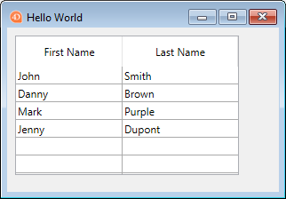
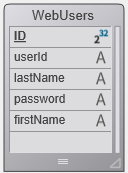
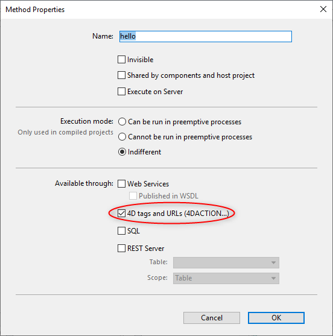

This "Getting started" section is geared at first-time users who want an overall overview on how to go from zero to a 4D website that handles data from the database. Let's start!


## Hello World Example

Let's start by making the web server send "Hello World" to the browser. The most simple way to do this is to create a project, start the web server and write a small code that returns a text in the `On Web Connection` database method.

### Starting the web server

To start the 4D web server:

1. Launch your 4D application and create a new, empty 4D project. 
2. In the **Run** menu, select **Start Web Server**.

That's all! The web server is started (you can see that the menu item has become **Stop Web Server**). It is now ready to handle requests. To check it, we'll display the default home page. 

### Displaying the default home page

The 4D web server creates automatically a default `index.html` page in the default `WebFolder` root folder, created at the same level as the Project folder.

1. Launch a web browser and connect to the web server IP address (default http port for 4D web server is 80). If the web server and the browser are on the same machine, you can select **Test Web Server** in the **Run** menu. 

The default home page is displayed:


### Displaying Hello World

1. Open the Explorer, display the Database Methods list and double-click on `On Web Connection`.

2. Enter the following code:

```4d
Case of 
	: ($1="/hello")
		WEB SEND TEXT("Hello World!")
	Else 
		// Error 404 for example
End case 
```

The [`On Web Connection`](httpRequests.md#on-web-connection) database method is called for incoming requests and receives the target URL in the `$1` parameter. This very simple code only sends the text to the browser. 

3. In your browser, enter the following URL:

```
http://localhost/hello
```

The web server handles the request and returns:


## Getting data from the database

Now we'll see how simple it is to get data from the database. First, we will create a table and fill it with some data. 

Create a basic database with, for example, a single table containing some records:




### Displaying data in a page

The most simple solution to display data is to call a [template page](templates.md) containing tags.

1. Using any text editor, create a file containing the following lines:

```html
<html>
<body>
<!--#4DCODE ALL RECORDS([Friends])-->
<!--#4DLOOP [Friends]-->
<!--#4DTEXT [Friends]lastName--> <!--#4DTEXT [Friends]firstName--><br/>
<!--#4DENDLOOP-->
</body>
</html>
```

2. Name the file "friends.shtml" and save it in the **WebFolder** of your project.
3. In your browser, enter the following URL:

```
http://localhost/friends.shtml
```

`.shtml` pages are automatically processed by the web server. Your page filled with data is returned:


### REST request

If we not only want to *display* data, but to *use* it, we can use ORDA and the REST server. Thanks to the [ORDA concept](ORDA/overview.md), the `Friends` table is automatically mapped to a dataclass and is available through [REST](REST/gettingStarted.md). 


1. We will use the REST server to access data: go the **Settings** dialog box, select **Web** > **Web Features**, and check the **Expose as REST server** option.


2. In your browser, enter the following URL:

```
http://localhost/rest/$catalog
```

The web server returns the results in JSON:

```json
{
	"__UNIQID": "3F1B6ACFFE12B64493629AD76011922D",
	"dataClasses": [
		{
			"name": "Friends",
			"uri": "/rest/$catalog/Friends",
			"dataURI": "/rest/Friends"
		}
	]
}
```

You get the catalog, i.e. the list of exposed dataclasses and attributes in the datastore. 

You can also get any data.

3. Enter the following URL:

```
http://localhost/rest/Friends
```

The server returns the entities, i.e. the data, from the Friends dataclass:

```json
{
	"__DATACLASS": "Friends",
	"__entityModel": "Friends",
	"__GlobalStamp": 0,
	"__COUNT": 4,
	"__FIRST": 0,
	"__ENTITIES": [
		{
			"__KEY": "1",
			"__TIMESTAMP": "2020-10-27T14:29:01.914Z",
			"__STAMP": 1,
			"ID": 1,
			"lastName": "Smith",
			"firstName": "John"
		},
		{
			"__KEY": "2",
			"__TIMESTAMP": "2020-10-27T14:29:16.035Z",
			"__STAMP": 1,
			"ID": 2,
			"lastName": "Brown",
			"firstName": "Danny"
		},
		{
			"__KEY": "3",
			"__TIMESTAMP": "2020-10-27T14:29:43.945Z",
			"__STAMP": 1,
			"ID": 3,
			"lastName": "Purple",
			"firstName": "Mark"
		},
		{
			"__KEY": "4",
			"__TIMESTAMP": "2020-10-27T14:34:58.457Z",
			"__STAMP": 1,
			"ID": 4,
			"lastName": "Dupont",
			"firstName": "Jenny"
		}
	],
	"__SENT": 4
}
``` 

This very simple example shows how the web server interacts transparently with the [REST server](REST/gettingStarted.md) to return any requested data, provided it is exposed. In your web interfaces, you can easily bind the javascript or html code with returned data. See the built-in [Web Data Explorer](Admin/dataExplorer.md) to have an example of sophisticated web interface bound to dataclasses.


## Login and session

In the above sections, we get free access to the application from web requests. However, in the world of web applications, data access security is the first priority. When connecting to the 4D web server, users must be authentified and their navigation controlled.

### Creating a table of users

The most simple and secured way to log a user on the 4D web server is based upon the following scenario:

- Users are stored in a dedicated, unexposed table (named *WebUsers* for example)
- The *WebUsers* table could be [encrypted](MSC/encrypt.md) and stores the user login and a hash of their password.

1. Create a table with some fields, for example:



2. Write and execute the following code to create a user:

```4d
var $webUser : cs.WebUsersEntity

$webUser:=ds.WebUsers.new()
$webUser.firstName:="John"
$webUser.lastName:="Doe"
// the password would be entered by the user
$webUser.password:=Generate password hash("123")
$webUser.userId:="john@4d.com"
$webUser.save()
```


### Authenticating users

> To be secure from end to end, it is necessary that the whole connection is established via [https](webServerConfig.md#enable-https). 

1. Open the Explorer and create a project method named "login".

3. Write the following code:

```4d
var $indexUserId; $indexPassword : Integer
var $userId; $password : Text
var $user; $info : Object
ARRAY TEXT($anames; 0)
ARRAY TEXT($avalues; 0)

// get values sent in the header of the request
WEB GET VARIABLES($anames; $avalues)

// look for header login fields
$indexUserId:=Find in array($anames; "userId")
$userId:=$avalues{$indexUserId}
$indexPassword:=Find in array($anames; "password")
$password:=$avalues{$indexPassword}

//look for a user with the entered name in the users table
$user:=ds.WebUsers.query("userId = :1"; $userId).first()

If ($user#Null) //a user was found
		//check the password
    If (Verify password hash($password; $user.password))
    		//password ok, fill the session
        $info:=New object()
        $info.userName:=$user.firstName+" "+$user.lastName
        Session.setPrivileges($info)
        	//You can use the user session to store any information
        WEB SEND TEXT("Welcome "+Session.userName)
    Else 
        WEB SEND TEXT("Wrong user name or password.")
    End if 
Else 
    WEB SEND TEXT("Wrong user name or password.")
End if 
```

3. Display the method properties by clicking on the **[i]** button in the code editor, check the `4D tags and URLs (4DACTION...)` option and click **OK**.




4. In your browser, enter the following URL:

```
http://localhost/4DACTION/login/?userID=john@4d.com&password=123
```

> Using such URLs is not recommended, it is only presented here to keep the example simple. A more realistic login request must be handled through a web form and a POST request. See [this page](sessions.md#example) for an example of form POST. 

Then you will be logged for the session:


Wrong credentials would be rejected:


Once a user is logged, you can handle the associated session using the `WEB Get Current Session ID` method. See the [User sessions](sessions.md) page. 

