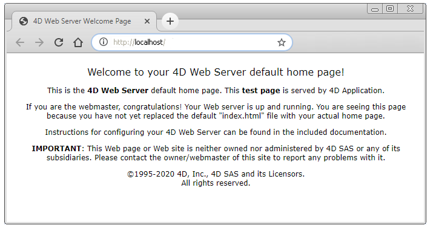

The 4D web server settings include security parameters, listening ports, defaults paths, and various options covering all the server features. 4D provides default values for every settings.


## Where to configure settings?

There are different ways to configure the 4D web server settings, depending on the scope and the server you want to set:

|Setting location|Scope|Involved web server|
|---|----|---|
|[webServer object](webServerObject.md)|Temporary (current session)|Any web server, including component web servers|
|`WEB SET OPTION` or a `WEB XXX` command|Temporary (current session)|Main server|
|[**Settings** dialog box](../settings/web.md) (**Web** pages)|Permanent (all sessions, stored on disk)|Main server|

> Some settings are not available from all locations.  

## Cache  

|Can be set with|Name|Comments|
|---|---|---|
|Settings dialog box|[Options (I) page/Use the 4D Web cache](../settings/web.md#use-the-4d-web-cache)||
|Settings dialog box|[Options (I) page/Page Cache Size](../settings/web.md#page-cache-size)||

Enables and configures the web page cache. 

The 4D web server has a cache that allows you to load static pages, GIF images, JPEG images (<512 kb) and style sheets (.css files) in memory, as they are requested. Using the cache allows you to significantly increase the web server’s performance when sending static pages. The cache is shared between all the web processes. When the cache is enabled, the 4D Web server looks for any static page requested by the browser in the cache first. If it finds the page, it sends it immediately. If not, 4D loads the page from disk and places it in the cache.

You can modify the size of the cache in the **Pages Cache Size** area. The value you set depends on the number and size of your website’s static pages, as well as the resources that the host machines has at its disposal.

>While using your web database, you can check the performance of the cache by using the `WEB GET STATISTICS` command. If, for example, you notice that the cache’s rate of use is close to 100%, you may want to consider increasing the size that has been allocated to it. The [/4DSTATS] and [/4DHTMLSTATS] URLs allow you to also obtain information about the cache’s state. 


## Certificate folder

|Can be set with|Name|Comments|
|---|---|---|
|webServer object|`certificateFolder`|Text property but can be a [`4D.Folder`](API/FolderClass.md) object when used with the *settings* parameter of the `start()` function.

Folder where the TLS certificate files for the web server are located. 

By default with 4D or 4D Server, these files must be placed next to the [project folder](Project/architecture.md#project-folder). 

With 4D in remote mode, these files must be located in the local resources folder of the database on the remote machine (see `4D Client Database Folder` paragraph of the `Get 4D folder` command). You must copy these files manually on the remote machine.

> TLS certificate files are *key.pem* (document containing the private encryption key) and *cert.pem* (document containing the certificate). 


## Character Set

|Can be set with|Name|Comments|
|---|---|---|
|webServer object|`characterSet`|MIBEnum integer or Name string|
|`WEB SET OPTION`|`Web character set`|MIBEnum integer or Name string|
|Settings dialog box|[Options (II) page/Standard Set](../settings/web.md#standard-set)|Pop up menu|

Defines the set of characters to be used by the 4D web server. The default value actually depends on the language of the OS. 

>This setting is also used for generating Quick Reports in HTML format .


## Cipher list

|Can be set with|Name|Comments|
|---|---|---|
|webServer object|[`cipherSuite`](API/WebServerClass.md#ciphersuite)|Text|

Cipher list used for the secure protocol; sets the priority of ciphering algorithms implemented by the web server. Can be a sequence of strings separated by colons (for example "ECDHE-RSA-AES128-..."). See the [ciphers page](https://www.openssl.org/docs/manmaster/man1/ciphers.html) on the OpenSSL site.

> The default cipher list used by 4D can be modified for the session using the `SET DATABASE PARAMETER` command, in which case the modification applies to the entire 4D application, including the web server, SQL server, client/server connections, as well as the HTTP client and all the 4D commands that make use of the secure protocol. 

## CORS Settings

|Can be set with|Name|Comments|
|---|---|---|
|webServer object|[`CORSSettings`](API/WebServerClass.md#corssettings)|Collection of objects (List of allowed hosts and methods for the CORS service)|
|`WEB SET OPTION`|`Web CORS settings`|Collection of objects (List of allowed hosts and methods for the CORS service)|
|Settings dialog box|[Options (II) page/Domain names and HTTP methods allowed](../settings/web.md#domain-names-HTTP-methods-allowed)|Click on the [+] button to add an allowed domain name and its method(s)|

List of allowed hosts and methods for the CORS service. 

#### Domain names (host property)

Domain name or IP address from where external pages are allowed to send data requests to the Server via CORS. Multiple domain attributes can be added to create a white list. Several syntaxes are supported:

- 192.168.5.17:8081
- 192.168.5.17
- 192.168.*
- 192.168.*:8081
- http://192.168.5.17:8081
- http://*.myDomain.com
- http://myProject.myDomain.com
- *.myDomain.com
- myProject.myDomain.com
- \*


#### HTTP methods allowed (methods property)

Accepted HTTP method(s) for the corresponding CORS host. The following HTTP methods are supported:

- GET
- HEAD
- POST
- PUT
- DELETE
- OPTIONS
- TRACE
- PATCH

Separate each method with a ";" (e,g,: "post;get"). If methods is empty, null, or undefined, all methods are enabled.

#### See also

[Enable CORS Service](#enable-cors-service)


## Debug log

|Can be set with|Name|Comments|
|---|---|---|
|webServer object|`debugLog`|number|
|`WEB SET OPTION`|`Web debug log`|number|

Status of the HTTP request log file of the web server ([*HTTPDebugLog_nn.txt*](../Debugging/debugLogFiles.md#httpdebuglogtxt), stored in the "Logs" folder of the application -- nn is the file number). It is useful for debugging issues related to the Web server. It records each request and each response in raw mode. Whole requests, including headers, are logged; optionally, body parts can be logged as well. 

|Value|Constant|Description|
|---|---|---|
|0|wdl disable|Web HTTP debug log is disabled|
|1|wdl enable without body|Web HTTP debug log is enabled without body parts (body size is provided in this case)|
|3|wdl enable with response body|Web HTTP debug log is enabled with body part in response only|
|5|wdl enable with request body|Web HTTP debug log is enabled with body part in request only|
|7|wdl enable with all body parts|Web HTTP debug log is enabled with body parts in response and request|


## Default Home page

|Can be set with|Name|Comments|
|---|---|---|
|webServer object|[`defaultHomepage`](API/WebServerClass.md#defaulthomepage)|Text|
|`WEB SET HOME PAGE`||Can be different for each web process|
|Settings dialog box|[Configuration page/Default Home Page](../settings/web.md#default-home-page)||

Designate a default home page for the web server. This page can be static or [semi-dynamic].

By default, when the web server is launched for the first time, 4D creates a home page named "index.html" and puts it in the HTML root folder. If you do not modify this configuration, any browser connecting to the web server will obtain the following page:



You can designate another default home page by entering its pathname. 

- The path is relative to the [default HTML root folder](#root-folder).
- The path is expressed with the POSIX syntax (folders are separated by a slash ("/"))
- The path must neither start not end with a slash.

For example, if you want the default home page to be "MyHome.htm", and it is located in the "Web" folder (itself located in the default HTML root folder), use "Web/MyHome.htm".

If you do not specify any default home page, the `On Web Connection` database method is called. It is up to you to process the request procedurally.

## Enable CORS Service

|Can be set with|Name|Comments|
|---|---|---|
|webServer object|[`CORSEnabled`](API/WebServerClass.md#corsenabled)|Boolean, true to enable the CORS (false by default)|
|`WEB SET OPTION`|`Web CORS enabled`|0 (disabled, default) or 1 (enabled)|
|Settings dialog box|[Options (II) page/Enable CORS](../settings/web.md#enable-cors)|Unchecked by default|

The 4D web server implements cross-origin resource sharing (CORS) to allow specific Web pages served from another domain to access the current Web application's resources via XHR calls, e.g., using REST. For security reasons, "cross-domain" requests are forbidden at the browser level by default. When enabled, XHR calls (e.g. REST requests) from Web pages outside the domain can be allowed in your application (you need to define the list of allowed addresses in the CORS domain list, see CORS Settings below). In this case, if a non-allowed domain or method sends a cross site request, it is rejected with a "403 - forbidden" error response.

When disabled (default), all cross site requests sent with CORS are ignored. 

For more information about CORS, please refer to the [Cross-origin resource sharing page](http://en.wikipedia.org/wiki/Cross-origin_resource_sharing) on Wikipedia.

#### See also
[CORS Settings](#cors-settings)

## Enable HTTP

|Can be set with|Name|Comments|
|---|---|---|
|webServer object|[`HTTPEnabled`](API/WebServerClass.md#httpenabled)|boolean|
|`WEB SET OPTION`|`Web HTTP enabled`||
|Settings dialog box|[Configuration page/Enable HTTP](../settings/web.md#enable-http)||

Indicates whether or not the web server will accept non-secure connections. 


## Enable HTTPS 

|Can be set with|Name|Comments|
|---|---|---|
|webServer object|[`HTTPSEnabled`](API/WebServerClass.md#httpsenabled)|boolean|
|`WEB SET OPTION`|`Web HTTPS enabled`||
|Settings dialog box|Configuration page/Enable HTTPS||

Status for communication over HTTPS. This option is described in [this section](Admin/tls.md).


## Enable HSTS

|Can be set with|Name|Comments|
|---|---|---|
|webServer object|[`HSTSEnabled`](API/WebServerClass.md#hstsenabled)|Boolean, true to enable HSTS (default is false)|
|`WEB SET OPTION`|`Web HSTS enabled`|0 (disabled, default) or 1 (enabled)|

HTTP Strict Transport Security (HSTS) status. 

When [HTTPS is enabled](#enable-https), keep in mind that if [HTTP is also enabled](#enable-http), the browser can still switch between HTTPS and HTTP (for example, in the browser URL area, the user can replace "https" by "http"). To forbid http redirections, you can [disable HTTP](#enable-http), however in this case an error message is displayed to client HTTP requests.

HSTS allows the 4D web server to declare that browsers should only interact with it via secure HTTPS connections. Once activated, the 4D web server will automatically add HSTS-related information to all response headers. Browsers will record the HSTS information the first time they receive a response from the 4D web server, then any future HTTP requests will automatically be transformed into HTTPS requests. The length of time this information is stored by the browser is specified with the Web **HSTS max age** setting.

> HSTS requires that [HTTPS is enabled](#enable-https) on the server. [HTTP](#enable-http) must also be enabled to allow client initial connections.

> You can get the current connection mode using the `WEB Is secured connection` command.


## HSTS Max Age

|Can be set with|Name|Comments|
|---|---|---|
|webServer object|[`HSTSMaxAge`](API/WebServerClass.md#hstsmaxage)|number in seconds|
|`WEB SET OPTION`|`Web HSTS max age`|number in seconds|

Specifies the maximum length of time (in seconds) that HSTS is active for each new client connection. This information is stored on the client side for the specified duration.
Default value is 63072000 (2 years)

> **Warning:** Once HSTS is enabled, client connections will continue to use this mechanism for the specified duration. When you are testing your applications, it is recommended to set a short duration to be able to switch between secured and non-secured connection modes if necessary.


## HTTP Compression Level

|Can be set with|Name|Comments|
|---|---|---|
|webServer object|[`HTTPCompressionLevel`](API/WebServerClass.md#httpcompressionlevel)||
|`WEB SET OPTION`|`Web HTTP compression level`|Applies to Web and Web Service |

Compression level for all compressed HTTP exchanges for the 4D web server (client requests or server replies). This setting lets you optimize exchanges by either privileging speed of execution (less compression) or the amount of compression (less speed). The choice of a value depends on the size and type of data exchanged. 

Pass 1 to 9 as value where 1 is the fastest compression and 9 the highest. You can also pass -1 to get a compromise between speed and rate of compression. By default, the compression level is 1 (faster compression).

## HTTP Compression Threshold

|Can be set with|Name|Comments|
|---|---|---|
|webServer object|[`HTTPCompressionThreshold`](API/WebServerClass.md#httpcompressionthreshold)||
|`WEB SET OPTION`|`Web HTTP compression threshold`||

In the framework of optimized HTTP exchanges, size threshold for requests below which exchanges should not be compressed. This setting is useful in order to avoid losing machine time by compressing small exchanges.

Pass the size expressed in bytes as value. By default, the compression threshold is set to 1024 bytes.


## HTTP Port

|Can be set with|Name|Comments|
|---|---|---|
|webServer object|[`HTTPPort`](API/WebServerClass.md#httpport)|number|
|`WEB SET OPTION`|`Web port ID`||
|Settings dialog box|[Configuration page/HTTP Port](../settings/web.md#http-port)||

Listening IP (TCP) port number for HTTP. By default, 4D publishes a web application on the regular Web HTTP Port (TCP port), which is port 80. If that port is already used by another web service, you need to change the HTTP Port used by 4D for this database. 

> In macOS, modifying the HTTP port allows you to start the 4D web server without being the root user of the machine (see [macOS HelperTool](#macos-helpertool)).

From a web browser, you need to include the non-default HTTP port number into the address you enter for connecting to the web application. The address must have a suffix consisting of a colon followed by the port number. For example, if you are using the HTTP port number 8080, you will specify "123.4.567.89:8080".

>**Warning**: If you use TCP port numbers other than the default numbers (80 for standard HTTP and 443 for HTTPS), be careful not to use port numbers that are defaults for other services that you might want to use simultaneously. For example, if you also plan to use the FTP protocol on your web server machine, do not use the TCP port 20 and 21, which are the default ports for that protocol. Ports numbers below 256 are reserved for well known services and ports numbers from 256 to 1024 are reserved for specific services originated on the UNIX platforms. For maximum security, specify a port number beyond these intervals (for example, in the 2000's or 3000's).

If you specify 0, 4D will use the default HTTP port number 80. 


## HTTP Trace

|Can be set with|Name|Comments|
|---|---|---|
|webServer object|[`HTTPTrace`](API/WebServerClass.md#httptrace)|Boolean, default = false |
|`WEB SET OPTION`|`Web HTTP TRACE`|Integer, default = 0 (disabled)|

HTTP TRACE method activation in the 4D web server. For security reasons, by default the 4D web server rejects HTTP TRACE requests with an error 405. If necessary, you can enable the HTTP TRACE method, in which case the 4D Web server replies to HTTP TRACE requests with the request line, header, and body.


## HTTPS Port

|Can be set with|Name|Comments|
|---|---|---|
|webServer object|[`HTTPSPort`](API/WebServerClass.md#httpsport)|number|
|`WEB SET OPTION`|`Web HTTPS port ID`||
|Settings dialog box|[Configuration page/HTTPS Port](../settings/web.md#https-port)||

Listening IP port number for HTTPS connections via TLS. By default, the value is 443 (standard value). See also [HTTP Port](#http-port) for information on port numbers. 


## Inactive Process Timeout

|Can be set with|Name|Comments|
|---|---|---|
|webServer object|[`inactiveProcessTimeout`](API/WebServerClass.md#inactiveprocesstimeout)||
|`WEB SET OPTION`|`Web inactive process timeout`||
|Settings dialog box|[Options (I) page/Inactive Process Timeout](../settings/web.md#inactive-process-timeout)|Slider|

Life duration (in minutes) of inactive processes associated with legacy sessions. At the end of the timeout, the process is killed on the server, the `On Web Legacy Close Session` database method is called, then the session context is destroyed.

Default: 480 minutes (pass 0 to restore the default value)


## Inactive Session Timeout

|Can be set with|Name|Comments|
|---|---|---|
|webServer object|[`inactiveSessionTimeout`](API/WebServerClass.md#inactivesessiontimeout)||
|`WEB SET OPTION`|`Web inactive session timeout`||

Life duration (in minutes) of inactive sessions (duration set in cookie). At the end of this period, the session cookie expires and is no longer sent by the HTTP client.

Default: 480 minutes (pass 0 to restore the default value)


## IP Address to listen

|Can be set with|Name|Comments|
|---|---|---|
|webServer object|[`IPAddressToListen`](API/WebServerClass.md#ipaddresstolisten)||
|`WEB SET OPTION`|`Web IP address to listen`||
|Settings dialog box|[Configuration page/IP Address](../settings/web.md#ip-address)|Pop up menu|

IP address strings on which the 4D web server will receive HTTP requests (4D local and 4D Server).

By default, no specific address is defined (**Any** value in the Settings dialog box), which means that the server responds to all IP addresses. When you designate a specific address, the server only responds to requests sent to this address. This feature is designed for 4D web servers located on machines with multiple TCP/IP addresses. It is, for example, frequently the case of most host providers. 

Possible values: IP address string. Both IPv6 string formats (e.g. "2001:0db8:0000:0000:0000:ff00:0042:8329") and IPv4 string formats (e.g. "123.45.67.89") are supported.

#### About IPv6 support

*	**No warning when TCP port is occupied**<br/>
When the server is set to respond on "Any" IP addresses, if the TCP port is being used by another application, this is not indicated when the server is started. In fact, 4D server does not detect any error in this case because the port remains free on the IPv6 address. However, it is not possible to access it using the IPv4 address of the machine, nor by means of the local address: 127.0.0.1.

If your 4D server does not seem to be responding on the port defined, you can test the address [::1] on the server machine (equivalent to 127.0.0.1 for IPv6, add [:portNum] to test another port number). If 4D responds, it is likely that another application is using the port in IPv4.

*	**IPv4-mapped IPv6 addresses**<br/>
To standardize processing, 4D provides a standard hybrid representation of IPv4 addresses in IPv6. These addresses are written with a 96-bit prefix in IPv6 format, followed by 32 bits written in the dot-decimal notation of IPv4. For example, ::ffff:192.168.2.34 represents the IPv4 address 192.168.2.34.

*	**Indication of port numbers**<br/>
Since IPv6 notation uses colons (:), adding port numbers may lead to some confusion, for example:

```code4d
	2001:0DB8::85a3:0:ac1f:8001 // IPv6 address
	2001:0DB8::85a3:0:ac1f:8001:8081 // IPv6 address with port 8081
```

To avoid this confusion, we recommend using the [ ] notation whenever you combine an IPv6 address with a port number, for instance:

```code4d
	[2001:0DB8::85a3:0:ac1f:8001]:8081 //IPv6 address with port 8081
```

## Keep Session

|Can be set with|Name|Comments|
|---|---|---|
|webServer object|[`keepSession`](API/WebServerClass.md#keepsession)||
|`WEB SET OPTION`|`Web keep session`||
|Settings dialog box|[Options (I) page/Legacy sessions (single process sessions)](../settings/web.md#legacy-sessions-single-process-sessions)|only in converted projects|

Legacy session management enabling status for the 4D web server (deprecated). 

> When this option is checked, the "Reuse Temporary Contexts" option is automatically checked (and locked).


## Log Recording

|Can be set with|Name|Comments|
|---|---|---|
|webServer object|[`logRecording`](API/WebServerClass.md#logrecording)||
|`WEB SET OPTION`|`Web log recording`||
|Settings dialog box|[Log (type) page](../settings/web.md#log-format)|Pop up menu|

Starts or stops the recording of requests received by the 4D web server in the *logweb.txt* file and sets its format. By default, requests are not recorded (0/No Log File). When enabled, the *logweb.txt* file is automatically placed in the Logs folder. 

This setting allows you to select the format of this file. Available values are:

|Value|Format name|Description|
|---|---|---| 
|0|No Log File|Default|
|1|Record in CLF format|Common Log Format - Each line of the file represents a request, such as: `host rfc931 user [DD/MMM/YYYY:HH:MM:SS] "request" state length` - Each field is separated by a space and each line ends by the CR/LF sequence.|
|2|Record in DLF format|Combined Log Format - Similar to CLF format but adds two additional HTTP fields at the end of each request: Referer and User-agent.|
|3|Record in ELF format|Extended Log Format - To be customized in the Settings dialog box|
|4|Record in WLF format|WebStar Log Format - To be customized in the Settings dialog box|

> Formats 3 and 4 are custom formats whose contents must be set beforehand in the [Settings dialog box](../settings/web.md#log-format). If you use one of these formats without any of its fields having been selected on this page, the log file will not be generated.


## Maximum Concurrent Web Processes 

|Can be set with|Name|Comments|
|---|---|---|
|webServer object|[`maxConcurrentProcesses`](API/WebServerClass.md#maxconcurrentprocesses)||
|`WEB SET OPTION`|`Web max concurrent processes`||
|Settings dialog box|[Options (I) page/Maximum Concurrent Web Processes](../settings/web.md#maximum-concurrent-web-processes)||

Strictly high limit of concurrent web processes that can be simultaneously open on the server when **no sessions** or **legacy sessions** are used (**scalable sessions** support an [unlimited number](sessions.md) of preemptive processes). This parameter allows prevention of server saturation as the result of massive number of requests. When the maximum number of concurrent Web processes (minus one) is reached, 4D no longer creates new processes and sends the HTTP status `503 - Service Unavailable` to all new requests.

By default, the value is 100. You can set the number anywhere between 10 and 32000.


## Maximum Request Size 

|Can be set with|Name|Comments|
|---|---|---|
|webServer object|[`maxRequestSize`](API/WebServerClass.md#maxrequestsize)||
|`WEB SET OPTION`|`Web maximum requests size`||

Maximum size (in bytes) of incoming HTTP requests (POST) that the web server is authorized to process. By default, the value is 2 000 000, i.e. a little less than 2 MB. Passing the maximum value (2 147 483 648) means that, in practice, no limit is set.

This limit is used to avoid web server saturation due to incoming requests that are too large. When a request reaches this limit, the 4D web server rejects it.

Possible values: 500 000 to 2 147 483 648.


## Maximum Session Number

|Can be set with|Name|Comments|
|---|---|---|
|webServer object|[`maxSessions`](API/WebServerClass.md#maxsessions)||
|`WEB SET OPTION`|`Web max sessions`||

Maximum number of simultaneous legacy sessions. When you reach the limit set, the oldest legacy session is closed (and `On Web Legacy Close Session` database method is called) if the Web server needs to create a new one. The number of simultaneous legacy sessions cannot exceed the [maximum number of Web processes](#maximum-concurrent-web-processes) (100 by default). 

Default value: 100 (pass 0 to restore the default value).


## Minimum TLS Version

|Can be set with|Name|Comments|
|---|---|---|
|webServer object|[`minTLSVersion`](API/WebServerClass.md#mintlsversion)|number|

Minimum TLS version accepted for connections. Connection attempts from clients supporting only versions below the minimum will be rejected.

Possible values:

- 1 = TLSv1_0
- 2 = TLSv1_1
- 3 = TLSv1_2 (default)
- 4 = TLSv1_3

If modified, the server must be restarted to use the new value.

> The minimum TLS version used by 4D can be modified for the session using the `SET DATABASE PARAMETER` command, in which case the modification applies to the entire 4D application, including the web server, SQL server and client/server connections.

 
## Name

|Can be set with|Name|Comments|
|---|---|---|
|webServer object|[`name`](API/WebServerClass.md#name)||


Name of the web server application. Useful when component web servers are started. 

## OpenSSL Version

|Can be set with|Name|Comments|
|---|---|---|
|webServer object|[`openSSLVersion`](API/WebServerClass.md#opensslversion)|Read-only|

Version of the OpenSSL library used.


## Perfect Forward Secrecy

|Can be set with|Name|Comments|
|---|---|---|
|webServer object|[`perfectForwardSecrecy`](API/WebServerClass.md#perfectforwardsecrecy)|Boolean, read-only|

True if PFS is available on the web server (see [TLS](Admin/tls.md#perfect-forward-secrecy-pfs) section).


## Reuse temporary contexts (in remote mode)  

|Can be set with|Name|Comments|
|---|---|---|
|Settings dialog box|[Options (I) page/Reuse Temporary Contexts](../settings/web.md#reuse-temporary-contexts)||

> This option is only available when **No sessions** option is checked. 

Allows you to optimize the operation of the 4D Web Server in remote mode by reusing web processes created for processing previous web requests. In fact, the web server in 4D needs a specific web process for the handling of each web request; in remote mode, when necessary, this process connects to the 4D Server machine in order to access the data and database engine. It thus generates a temporary context using its own variables, selections, etc. Once the request has been dealt with, this process is killed.

When the **Reuse Temporary Contexts** option is checked, in remote mode 4D maintains the specific web processes and reuses them for subsequent requests. By removing the process creation stage, web server performance is improved.

In return, you must make sure in this case to systematically initialize the variables used in 4D methods in order to avoid getting incorrect results. Similarly, it is necessary to erase any current selections or records defined during the previous request.

> This option only has an effect with a 4D web server in remote mode. With a 4D in local mode, all web processes (other than session processes) are killed after their use.


## Robots.txt 

Certain robots (query engines, spiders...) scroll through web servers and static pages. If you do not want robots to be able to access your entire site, you can define which URLs they are not allowed to access.

To do so, put the ROBOTS.TXT file at the server's root. This file must be structured in the following manner:

```4d
   User-Agent: <name>
   Disallow: <URL> or <beginning of the URL>
```
   
For example:

```4d
   User-Agent: *
   Disallow: /4D
   Disallow: /%23%23
   Disallow: /GIFS/
```
   
*	“User-Agent: *” - all robots are affected.
*	“Disallow: /4D” - robots are not allowed to access URLs beginning with /4D.
*	“Disallow: /%23%23” - robots are not allowed to access URLs beginning with /%23%23.
*	“Disallow: /GIFS/’ - robots are not allowed to access the /GIFS/ folder or its subfolders.

Another example:

```code4d
   User-Agent: *
   Disallow: /
```

In this case, robots are not allowed to access the entire site.


## Root Folder

|Can be set with|Name|Comments|
|---|---|---|
|webServer object|[`rootFolder`](API/WebServerClass.md#rootfolder)|Text property but can be a [`4D.Folder`](API/FolderClass.md) object when used with the *settings* parameter of the `start()` function|
|`WEB SET ROOT FOLDER`|||
|Settings dialog box|[Configuration page/Default HTML Root](../settings/web.md#default-html-root)||

Path of web server root folder, i.e. the folder in which 4D will search for the static and semi-dynamic HTML pages, pictures, etc., to send to the browsers. The path is formatted in POSIX full path. The web server will need to be restarted in order for the new root folder to be taken into account.

Moreover, the HTML root folder defines, on the web server hard drive, the hierarchical level above which the files will not be accessible. If a requested URL or a 4D command tries to access a file located above the HTML root folder, an error is returned indicating that the file has not been found.

By default, 4D defines a HTML Root folder named **WebFolder**. If it does not already exist, the HTML root folder is physically created on disk at the moment the Web server is launched for the first time. The root folder is created:
- with 4D (local) and 4D Server, at the same level as the [Project folder](Project/architecture.md#project-folder). 
- with 4D in remote mode, in the local resources folder.

You can designate another default HTML root folder by entering its pathname. 

- The path is relative to the [Project folder](Project/architecture.md#project-folder) (4D local and 4D Server) or to the folder containing the 4D application or software package (4D in remote mode).
- The path is expressed with the POSIX syntax (folders are separated by a slash ("/"))
- To "go up" one level in the folder hierarchy, enter “..” (two periods) before the folder name
- The path must not start with a slash (except if you want the HTML root folder to be the Project or 4D remote folder, but for access to the folders above to be forbidden, in which case you can pass "/" as the root folder). 

For example, if you want the HTML root folder to be the "Web" subfolder in the "MyWebApp" folder, enter "MyWebApp/Web".

> When the HTML root folder is modified, the cache is cleared so as to not store files whose access is restricted. 


## Scalable Sessions

|Can be set with|Name|Comments|
|---|---|---|
|webServer object|[`scalableSession`](API/WebServerClass.md#scalablesession)||
|`WEB SET OPTION`|`Web scalable session`||
|Settings dialog box|[Options (I) page/Scalable sessions (multi-process sessions)](../settings/web.md#scalable-sessions-multi-process-sessions)||

Scalable session management enabling status for the 4D web server. Web server sessions are detailed in the [Web sessions](sessions.md) page.


## Session Cookie Domain

|Can be set with|Name|Comments|
|---|---|---|
|webServer object|[`sessionCookieDomain`](API/WebServerClass.md#sessioncookiedomain)||
|`WEB SET OPTION`|`Web session cookie domain`||

Value of the "domain" field of the session cookie. Useful for controlling the scope of the session cookies. If you set, for example, the value "/*.4d.fr" for this selector, the client will only send a cookie when the request is addressed to the domain ".4d.fr", which excludes servers hosting external static data.


## Session Cookie Name

|Can be set with|Name|Comments|
|---|---|---|
|webServer object|[`sessionCookieName`](API/WebServerClass.md#sessioncookiename)||
|`WEB SET OPTION`|`Web session cookie name`||

Name of the cookie used for saving the session ID. Default = "4DSID".


## Session Cookie Path

|Can be set with|Name|Comments|
|---|---|---|
|webServer object|[`sessionCookiePath`](API/WebServerClass.md#sessioncookiepath)||
|`WEB SET OPTION`|`Web session cookie path`||

"path" field of the session cookie. Used to control the scope of the session cookies. If you set, for example, the value "/4DACTION" for this selector, the client will only send a cookie for dynamic requests beginning with 4DACTION, and not for pictures, static pages, etc.

## Session Cookie SameSite

|Can be set with|Name|Comments|
|---|---|---|
|webServer object|[`sessionCookieSameSite`](API/WebServerClass.md#sessioncookiesamesite)||

Value of the `SameSite` attribute value of the session cookie. This attribute allows you to declare if your cookie should be restricted to a first-party or same-site context, as a protection from some cross-site request forgery ([CSRF](https://developer.mozilla.org/en-US/docs/Glossary/CSRF)) attacks.

> For a detailed description of the `SameSite` attribute, please refer to the [Mozilla documentation](https://developer.mozilla.org/en-US/docs/Web/HTTP/Headers/Set-Cookie/SameSite) or [this web.dev page](https://web.dev/samesite-cookies-explained/).

Three values are available:

- "Strict" (default `SameSite` attribute value for 4D session cookies): cookies will only be sent in the first-party context, i.e. context matching the domain of the current site, and never to third-party websites. 
- "Lax": Cookies are not sent on cross-site subrequests (for example to load images or frames into a third-party site), but are sent when a user is navigating to the origin site (i.e. they follow a link).
- "None": Cookies are sent in all contexts, i.e in responses to both first-party and cross-origin requests. When "None" value is used, the cookie `Secure` attribute must also be set (or the cookie will be blocked).

The `Secure` attribute value of the session cookie is automatically set to "True" if the connection is HTTPS (whatever the `SameSite` attribute value). 

> It is not recommended to set `SameSite=None` on a HTTP server since the `Secure` attribute will be missing (used in HTTPS only) and cookies will be blocked. 


## Use preemptive processes

|Can be set with|Name|Comments|
|---|---|---|
|Settings dialog box|[Options (I) page/Use Preemptive Processes](../settings/web.md#use-preemptive-processes)||

This option enables the preemptive mode for your application's web server code when **No sessions** option is selected (the preemptive mode is always enabled with **scalable sessions**). When this option is checked in this context, the 4D compiler will automatically evaluate the thread-safety property of each piece of [web-related code](preemptiveWeb.md#thread-safety-of-4d-web-code) and return errors in case of incompatibility.


## Deprecated Settings

The following settings are still supported but rely on deprecated features or technologies. It is usually recommended to keep default values. 

#### Allow database access through 4DSYNC URLs

This option controls the support of HTTP synchronization requests containing deprecated */4DSYNC* URLs. 

#### Session IP Address Validation

> This option is not not available in [scalable sessions mode](WebServer/sessions.md) (there is no validation).

IP address validation status for session cookies. For security reasons, by default the 4D web server checks the IP address of each request containing a session cookie and rejects it if this address does not match the IP address used to create the cookie. In some specific applications, you may want to disable this validation and accept session cookies, even when their IP addresses do not match. For example when mobile devices switch between Wifi and 4G/5G networks, their IP address will change. In this case, you must pass 0 in this option to allow clients to be able to continue using their Web sessions even when the IP addresses change. Note that this setting lowers the security level of your application. When it is modified, this setting is effective immediately (you do not need to restart the HTTP server).


#### Send Extended Characters Directly  

When this option is checked, the web server sends extended characters “as is” in semi-dynamic pages, without converting them into HTML entities. This option has shown a speed increase on most foreign operating systems (especially the Japanese system).


#### Keep-Alive Connections  

The 4D Web Server can use keep-alive connections. The keep-alive option allows you to maintain a single open TCP connection for the set of exchanges between the web browser and the server to save system resources and to optimize transfers.

The **Use Keep-Alive Connections** option enables or disables keep-alive TCP connections for the web server. This option is enabled by default. In most cases, it is advisable to keep this option check since it accelerates the exchanges. If the web browser does not support connection keep alive, the 4D Web Server automatically switches to HTTP/1.0.

The 4D Web Server keep-alive function concerns all TCP/IP connections (HTTP, HTTPS). Note however that keep-alive connections are not always used for all 4D web processes.

In some cases, other optimized internal functions may be invoked. Keep-alive connections are useful mainly for static pages.

Two options allow you to set how the keep-alive connections work:

*	**Number of requests by connection**: Allows you to set the maximum number of requests and responses able to travel over a connection keep alive. Limiting the number of requests per connection allows you to prevent server flooding due to a large number of incoming requests (a technique used by hackers).<p>
The default value (100) can be increased or decreased depending on the resources of the machine hosting the 4D Web Server.</p>

*	**Timeout**: This value defines the maximum wait period (in seconds) during which the web server maintains an open TCP connection without receiving any requests from the web browser. Once this period is over, the server closes the connection.<p>
If the web browser sends a request after the connection is closed, a new TCP connection is automatically created. This operation is not visible for the user.</p>

