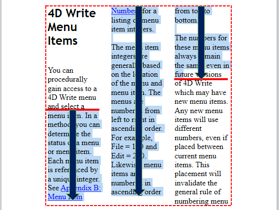

<!--REF #_command_.WP Get position.Syntax-->**WP Get position** ( *targetObj* {; *layout*} ) : Object<!-- END REF-->
<!--REF #_command_.WP Get position.Params-->
| Parameter | Type |  | Description |
| --- | --- | --- | --- |
| targetObj | Object | &#8594;  | Range or element or 4D Write Pro document |
| layout | Integer | &#8594;  | 4D Write Pro document layout used for evaluation: 0 (default)=4D Write Pro layout, 1=HTML WYSIWYG |
| Function result | Object | &#8592; | Position information |

<!-- END REF-->

#### Description 

<!--REF #_command_.WP Get position.Summary-->The **WP Get position** command returns an object describing the current position of *targetObj*.<!-- END REF-->

In the *targetObj* parameter, you can pass:

* a range, or
* an element (table / row / paragraph / body / header / footer / picture / section / subsection / text box), or
* a 4D Write Pro document

The command returns the position information in an object with the following properties:

| **Property name** | **Type** | **Description**                                                                                                                                                                                                                                            |
| ----------------- | -------- | ---------------------------------------------------------------------------------------------------------------------------------------------------------------------------------------------------------------------------------------------------------- |
| section           | Number   | Number of the first section which intersects *targetObj*                                                                                                                                                                                                   |
| page              | Number   | Number of the first page which intersects *targetObj*                                                                                                                                                                                                      |
| column            | Number   | Index of the first column which intersects *targetObj* (1-based)                                                                                                                                                                                           |
| line              | Number   | Index of the first line which intersects *targetObj* (relative to the column - or page if none column - 1-based)                                                                                                                                           |
| position          | Number   | Position in the line of the first character of *targetObj* (1-based)                                                                                                                                                                                       |
| bounds            | Object   | Coordinates of the bounding rectangle of the *targetObj*, expressed in current document unit and relatively to the top left corner of the *page*. Padding and border sizes (if any) are taken into account; margins and rulers are not taken into account. |
| top               | Number   | Top coordinate of the rectangle                                                                                                                                                                                                                            |
| left              | Number   | Left coordinate of the rectangle                                                                                                                                                                                                                           |
| bottom            | Number   | Bottom coordinate of the rectangle                                                                                                                                                                                                                         |
| right             | Number   | Right coordinate of the rectangle                                                                                                                                                                                                                          |
| rangeHeight       | Number   | Height of the bounding rectangle of the *targetObj*. This value can be different from *bounds.bottom-bounds.top* if the *targetObj* extends over several columns (see example 4)                                                                           |

If *targetObj* is an empty range, **WP Get position** returns the position information at range start. Note that in case of an empty range of the default type (text), the range height (*rangeHeight* or *bounds.bottom*\-*bounds.top*) is the cursor height and the range width (*bounds.right*\-*bounds.left*) is 1 pixel.   
If *targetObj* is text in a header or footer, **WP Get position** returns the position information where the header and footer is displayed in the first section/page.  
If *targetObj* is an anchored image (that can be replicated on several pages), **WP Get position** returns the position information where the image is anchored in the first section/page.  
If *targetObj* is a subsection, **WP Get position** returns the position information of the first page of the parent section.

The optional *layout* parameter can be used to set the HTML wysiwyg view for the *targetObj* evaluation. You can pass one of the following constants from the "4D Write Pro" theme:

| Constant               | Type    | Value | Comment                                                                                                                                         |
| ---------------------- | ------- | ----- | ----------------------------------------------------------------------------------------------------------------------------------------------- |
| wk 4D Write Pro layout | Integer | 0     | Standard 4D Write Pro layout, which can include some specific style attributes                                                                  |
| wk html wysiwyg        | Integer | 1     | In this layout, any 4D Write Pro advanced attributes which are not compliant with all browsers are removed (e.g. columns, double underlines...) |

If *layout* is omitted, the 4D Write Pro layout is used by default.

**Notes about performance**

* The same viewing settings as for the [WP PRINT](wp-print.md) command are used with **WP Get position**:  
   * headers: visible  
   * footers: visible  
   * expressions: computed and displayed  
   * page mode: page or draft (HTML wysiwyg view as defined by the command)  
If *targetObj* is displayed in a 4D Write Pro form area, make sure that viewing settings of the area match the command viewing settings to get consistent information. Note also that if these settings are different in the area, 4D Write Pro will have to "clone" the document to calculate the layout at each call of the command, which can be time consuming. For performance reasons, it is recommended in this case to build the document offline and to copy it to the form object area only when the build is complete.
* This command should not be called within events that are frequently generated (such as On After Edit) since *result.rangeHeight* for example could require time consuming rendering calculations that have to be done at each event call.

#### Example 1 

You want to know the page number of a range:

```4d
 var $range;$rangePosition : Object
 $range:=WP Text range(WParea) //range from user selection
 $rangePosition:=WP Get position($range;wk 4D Write Pro layout)
 ALERT("First page number in selection is "+String($rangePosition.page))
```

#### Example 2 

You want to set to blue color the text in the first and last pages of the document:

```4d
 var $nbPages : Integer
 var $body : Object
 var $_paragraphs : Collection
 
 $nbPages:=WP Get page count([DOC]Sample)
 $body:=WP Get body([DOC]Sample)
 $_paragraphs:=WP Get elements($body;wk type paragraph)
 For each($paragraph;$_paragraphs)
    $info:=WP Get position($paragraph)
    If($info.page=1)|($info.page=$nbPages) //first and last page paragraphs in blue
       WP SET ATTRIBUTES($paragraph;wk text color;"blue")
    Else //other pages paragraphs in black
       WP SET ATTRIBUTES($paragraph;wk text color;"black")
    End if
 End for each
```

#### Example 3 

While building a document, you want to avoid paragraph splits:

```4d
 var WParea;$body : Object
 var $_paragraphs : Collection
 WParea:=WP New
 
 $body:=WP Get body([DOC]Sample)
 $_paragraphs:=WP Get elements($body;wk type paragraph)
 
 For each($paragraph;$_paragraphs)
    $insert:=WP New($paragraph)
 
  //memorize current range and page number
    $rangeBefore:=WP Text range(WParea;wk end text;wk end text)
    $info:=WP Get position($rangeBefore)
    $memoPage:=$info.page
 
  //insert the contents, keep the range untouched
    WP INSERT DOCUMENT($rangeBefore;$insert;wk append;wk exclude from range)
 
  //check the position after insertion
    $rangeAfter:=WP Text range(WParea;wk end text;wk end text)
    $info:=WP Get position($rangeAfter)
 
    If($memoPage#$info.page) // if the page has changed, insert a page break
       WP INSERT BREAK($rangeBefore;wk page break;wk replace)
    End if
 
 End for each
```

#### Example 4 

The following examples illustrate the returned bounding rectangle coordinates, depending on the *targetObj*.

```4d
 $default:=WP Text range(WPArea) //default (text) range
 $textCoordinates:=WP Get position($default) //red dotted line
 
 $paragraph:=WP Create paragraph range($default) //paragraph range
 $paraCoordinates:=WP Get position($paragraph) // green dotted line
```


*Red dotted line:* *$textCoordinates object values* 
*Green dotted line: $* *paraCoordinates object values* 

**Note:** In case of a display on several columns, the *rangeHeight* property (plain lines) could be larger than *bounds.bottom*\-*bounds.top* (dotted lines):



#### See also 

[WP PRINT](wp-print.md)  