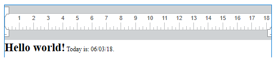

<!--REF #_command_.WP Get text.Syntax-->**WP Get text** ( *targetObj* {; *expressions*} ) : Text<!-- END REF-->
<!--REF #_command_.WP Get text.Params-->
| Parameter | Type |  | Description |
| --- | --- | --- | --- |
| targetObj | Object | &#8594;  | Range or element or 4D Write Pro document |
| expressions | Number | &#8594;  | Instructions for expression evaluation |
| Function result | Text | &#8592; | Text of targetObj |

<!-- END REF-->

#### Description 

<!--REF #_command_.WP Get text.Summary-->The **WP Get text** command retrieves text contents from a 4D Write Pro document within the specified *targetObj*.<!-- END REF-->

**WP Get text** returns plain text only. Any applied styles (bold, italics, etc.) will be ignored.

In the *targetObj* parameter, pass an object containing either:

* a range, or
* an element ( table / paragraph / body / header / footer / section / subsection), or
* a 4D Write Pro document

**Notes:** 

* If you pass a 4D Write Pro document in *targetObj*, the command only returns the text from the *body* element of the document.
* If you pass a subsection in *targetObj*, the command returns the text of the parent section.

The optional *expressions* parameter provides instructions for the evaluation of 4D expressions within the *targetObj* (for more information, refer to the *Managing formulas* page). The options are:

| Constant                 | Comment                                                                                           |
| ------------------------ | ------------------------------------------------------------------------------------------------- |
| wk expressions as source | The original string of 4D expression references is returned.                                      |
| wk expressions as space  | Each reference is returned as a non-breaking space character.                                     |
| wk expressions as value  | 4D expression references are returned in their evaluated form. (default if option if not passed). |

**Important**: Only plain text with wk expressions as space is consistent with text range indexes used by WP or ST commands, as WP and ST commands always assume the size of expression=1 character.

**Notes**: 

* If *targetObj* contains pictures, the pictures are ignored and returned as space characters (" ").
* If *targetObj* contains tables, the content of each cell is treated as individual paragraphs and returned as text separated by tabs. Rows are separated by carriage returns.

#### Example 

To retrieve the text in this document:



you can write:

```4d
 $range:=WP Text range(myDoc2;wk start text;wk end text)
 vText:=WP Get text($range;wk expressions as value) //returns "Hello world! Today is: 06/03/18."
 vText2:=WP Get text($range;wk expressions as source) //returns "Hello world! Today is: Current date."
 vText3:=WP Get text($range;wk expressions as space) //returns "Hello world! Today is:  ."
```

#### See also 

*Managing formulas*  
[WP SET TEXT](wp-set-text.md)  