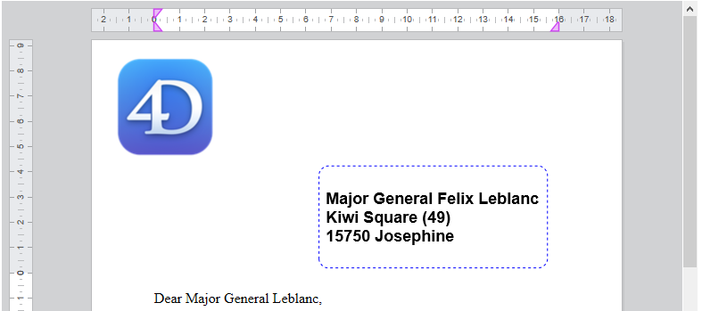

<!--REF #_command_.WP New text box.Syntax-->**WP New text box** ( *wpDoc* ; *pageNum* ) : Object<!-- END REF-->
<!--REF #_command_.WP New text box.Params-->
| Parameter | Type |  | Description |
| --- | --- | --- | --- |
| wpDoc | Object | &#8594;  | 4D Write Pro document |
| pageNum | Number | &#8594;  | Page number where to anchor the text box |
| Function result | Object | &#8592; | Text box object |

<!-- END REF-->

*This command is not thread-safe, it cannot be used in preemptive code.*


#### Description 

<!--REF #_command_.WP New text box.Summary-->The **WP New text box** command creates and returns a new text box object in the page *pageNum* of *wpDoc*.<!-- END REF-->

**Note:** For more information on text boxes, please refer to the *Handling text boxes* paragraph.

In the *wpDoc* parameter, pass a 4D Write Pro document. 

In *pageNum*, pass the page number to which the text box must be anchored. It pageNum < 0 the page number **1** is used (no error is generated). 

The command creates a new text box element with the following default attributes:

* width = 8 cm,
* height = auto,
* solid black border 1 pt,
* padding = 4 pt,
* margin = 0 pt,
* background color = white,
* id = "textBoxN" where N is a number,
* anchored in front of the body at the top left corner of the page rectangle (like an anchored picture, a text box can be anchored to embedded mode, or to a section, to all sections or to a subsection in page mode, and to the background or front layer.)

See the *4D Write Pro Attributes* section for detailed description of these attributes. . 

The new text box is rendered only on the page *pageNum,* so it may not be rendered if:

* there is no page with the passed page number
* the current display mode is embedded or draft

However, the text box still exists and is owned by the document even if not rendered. 

#### Example 1 

You want to create a default, empty text box:

```4d
 $textBox:=WP New text box(WParea;1)
```

Result:


#### Example 2 

In a template of a letter, you want to add a text box to display the address of the recipient (which is stored in the context):

```4d
  // #1 create the text box
 $textBox:=WP New text box(WParea;1)
 
  // #2 define some text box attributes
 WP SET ATTRIBUTES($textBox;wk id;"AddressArea")
 WP SET ATTRIBUTES($textBox;wk anchor origin;wk paper box)
 WP SET ATTRIBUTES($textBox;wk anchor horizontal align;wk left;wk vertical align;wk top)
 WP SET ATTRIBUTES($textBox;wk anchor horizontal offset;$form.offsetX.values[$form.offsetX.index])
 WP SET ATTRIBUTES($textBox;wk anchor vertical offset;$form.offsetY.values[$form.offsetY.index])
 WP SET ATTRIBUTES($textBox;wk width;$form.width.values[$form.width.index])
 WP SET ATTRIBUTES($textBox;wk height;$form.height.values[$form.height.index])
 WP SET ATTRIBUTES($textBox;wk padding;$form.padding.values[$form.padding.index]) // inside margins
 WP SET ATTRIBUTES($textBox;wk border style;wk dashed;wk border color;"Blue";wk border width;"1pt";wk border radius;"10pt")
 WP SET ATTRIBUTES($textBox;wk vertical align;wk center)
 
  // #3: define the formulas inside the text box
 WP INSERT FORMULA($textBox;Formula(This.data.fullName);wk append)
 WP INSERT BREAK($textBox;wk paragraph break;wk append)
 WP INSERT FORMULA($textBox;Formula(This.data.fullAddress);wk append)
 
  // #4: Style the content of the text box
 WP SET ATTRIBUTES($textBox;wk font;"Arial";wk font bold;wk true;wk font size;"18pt")
```

Result:



#### See also 

[WP DELETE TEXT BOX](wp-delete-text-box.md)  