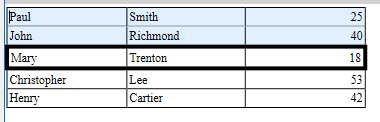

<!--REF #_command_.WP Table get rows.Syntax-->**WP Table get rows** ( *targetObj* ) | ( *tableRef* ; startRow | wk header rows {; *numRows*} )  : Object<!-- END REF-->
<!--REF #_command_.WP Table get rows.Params-->
| Parameter | Type |  | Description |
| --- | --- | --- | --- |
| targetObj | Object | &#8594;  | Range or element or 4D Write Pro document |
| tableRef | Object | &#8594;  | Table reference |
| startRow &#124; wk header rows | Integer, Text | &#8594;  | Position of first row OR wk header rows |
| numRows | Integer | &#8594;  | Number of rows to get |
| Function result | Object | &#8592; | New row range containing selected rows |

<!-- END REF-->

#### Description 

<!--REF #_command_.WP Table get rows.Summary-->The **WP Table get rows** command returns a new row range object containing a selection of rows from *targetObj* or *tableRef*.<!-- END REF--> 

Pass either:

* *targetObj:*  
   * a range, or  
   * an element (row / paragraph / body / header / footer / inline picture / section / subsection), or  
   * a 4D Write Pro document

If *targetObj* does not intersect with a table or text range where a selection of rows can be retrieved, the command returns Null.

**OR**

* *tableRef:* the reference of the table whose selection of rows you want to get.
* *startRow:* points to the first table row to return, and
* (optional) *numRows* \- specifies how many rows to return. If *numRows* is omitted, the single *startRow* row is returned.  
    
If *startRow* plus *numRows* exceeds the number of rows in *tableRef*, or if *startRow* is greater than the number of rows in *tableRef*, the returned range contains the maximum possible rows.

**OR**

* *tableRef:* the reference of the table whose header row(s) you want to get.
* *wk header rows:* to indicate that you want to get header rows  
    
In that case, the command returns a row range containing the repeated header rows (if passed, the *numRows* parameter is ignored). The command returns Null if there are no defined header rows.

#### Example 1 

You want to set a specific background color for the first two rows of a table, and modify the border of the third row:

```4d
 var $wpTable;$wpRange;$wpRow1;$wpRow2;$wpRow3;$wpRow4;$wpRow5;$rows;$rows2 : Object
 $wpRange:=WP Text range(WParea;wk start text;wk end text)
 
 $wpTable:=WP Insert table($wpRange;wk append)
 $wpRow1:=WP Table append row($wpTable;"Paul";"Smith";25)
 $wpRow2:=WP Table append row($wpTable;"John";"Richmond";40)
 $wpRow3:=WP Table append row($wpTable;"Mary";"Trenton";18)
 $wpRow4:=WP Table append row($wpTable;"Christopher";"Lee";53)
 $wpRow5:=WP Table append row($wpTable;"Henry";"Cartier";42)
 
 $rows:=WP Table get rows($wpTable;1;2)
 WP SET ATTRIBUTES($rows;wk background color;0x00E0F0FF)
 $rows2:=WP Table get rows($wpTable;3)
 WP SET ATTRIBUTES($rows2;wk border style;wk solid)
 WP SET ATTRIBUTES($rows2;wk border width;4)
```

  


#### Example 2 

To get a range of rows starting from the 10th to the end:

```4d
 WP Table get rows(tableRef;10;MAXLONG)
```

#### Example 3 

You want to retrieve the rows a user has selected:

```4d
 var $userSelection;$rows : Object
 
 $userSelection:=WP Selection range(myWPArea)
 
 $rows:=WP Table get rows($userSelection)
```

#### Example 4 

The following example:

1. Gets the first two rows of the first table in WParea.
2. Sets them as header rows.
3. Sets their text color to white and their background color to black.

```4d
 var $table;$range : Object
 
 $table:=WP Get elements(WParea;wk type table)[0]  // Select the first table in WParea
 
 WP SET ATTRIBUTES($table;wk header row count;2) // Set the first two rows as header rows
 
 $range:=WP Table get rows($table;wk header rows) // Get the header rows defined above
 
 WP SET ATTRIBUTES($range;wk text color;"white";wk background color;"#000") // Set text and background color for the header rows
 
```

#### See also 

[WP Insert table](wp-insert-table.md)  
[WP Table append row](../commands/wp-table-append-row.md)  
[WP Table get cells](wp-table-get-cells.md)  
[WP Table get columns](wp-table-get-columns.md)  