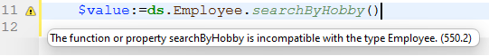

4D has a powerful built-in code editor that offers a wide set of features for highly productive code editing such as intelligent code completion, code navigation, debugging, searching, and more.


The Code Editor works much like a text editor. Writing a method or a class is usually a combination of typing text, selecting components, and dragging items from the Explorer or other windows. You can also use various type-ahead functions to create methods faster.

You can scroll through the contents of methods, classes and functions, which can include up to 32,000 lines of code or 2 GB of text.

The 4D Code Editor provides basic syntax error-checking. Additional error-checking is performed when the code executes. For more information on how to handle errors, see [Debugging](../Debugging/basics.md).

:::note

If you are used to coding with **VS Code**, you can also use this editor with 4D code after installing the [4D-Analyzer](https://github.com/4d/4D-Analyzer-VSCode) extension. 

:::

## Interface

### Toolbar

Each Code Editor window has a toolbar that provides instant access to basic functions related to code execution and editing.

| Element | Icon | Description |
|---|---|---|
| **Method execution** |  | When working with methods, each Code Editor window has a button that can be used to run the current method. Using the menu associated with this button, you can choose the type of execution:<ul><li> **Run new process**: Creates a process and runs the method in standard mode in this process.</li><li>**Run and debug new process**: Creates a new process and displays the method in the Debugger window for step by step execution in this process.</li><li>**Run in Application process**: Runs the method in standard mode in the context of the Application process (in other words, the record display window).</li><li>**Run and debug in Application process**: Displays the method in the Debugger window for step by step execution in the context of the Application process (in other words, the record display window).</li></ul>For more information on method execution, see [Calling Project Methods](../Concepts/methods.md#calling-project-methods). |
| **Find in method** |  | Displays the [*Search* area](#find-and-replace). |
| **Macros** |  | Inserts a macro at the selection. Click the dropdown arrow to display a list of available macros. For more information on how to create and instantiate macros, see [Macros](#macros). |
| **Expand all / Collapse all** |  | These buttons allow expanding or collapsing all the control flow structures of the code. |
| **Method information** |  | Displays the [Method Properties](../Concepts/methods.md#project-method-properties) dialog box (project methods only). |
| **Last clipboard values** |  | Displays the last values stored in the clipboard. |
| **Clipboards** |  | Nine clipboards available in the code editor. You can [use these clipboards](./write-class-method.md#multiple-copy-paste-and-numbering-of-clipboards) by clicking on them directly or by using keyboard shortcuts. You can use a [Preferences option](Preferences/methods.md#options-1) to hide them. |
| **Navigation dropdown** |  | Lets you navigate inside methods and classes with automatically tagged content or manually declared markers. See below |


### Editing area

This is where you write and edit your code. The editor automatically indents code text and colors the different syntax elements for clear code structure.

You can customize the display of the editing area. Any customization is automatically passed on to all the windows of the code editor:

| Option | Description | Set in... |
|---|---|---|
|**font** and **font size**| Sets the character font and size to be used in the editing area| **Preferences** > [**Methods**](../Preferences/methods.md) or **Method > View** > **Bigger Font** or **Smaller Font**
|**style and color of syntax elements**| assign a specific color and/or style to each type of element of the 4D language.  You can also change the different colors used in the interface of the editing area (highlighting, background, and so on).| Right-click on a language element (variable, keyword, etc.) > **Style** submenu. Or **Preferences** > [**Methods**](../Preferences/methods.md)|
|**spaces**| You can display the spaces between words using dots (.) instead of blank spaces. This option applies to all the code elements (command names, variables, comments, etc.). | **Method > View > White Spaces**
|**themes**| You can select the Dark or Light theme, or set a custom one | **Preferences** > [**Methods**](../Preferences/methods.md)
|**width of code indentations**| Set the width of code indentations| **Preferences** > [**Methods**](../Preferences/methods.md)

#### Change bars  

Colored bars instantly show you where lines of code were modified since the method was opened:


The change bars change colors to indicate whether or not the modifications were saved:

- yellow: Line was modified and method has not yet been saved.
- green: Line was modified and method has been saved.


### Lists area

The lists area lets you display one or more lists of elements necessary for writing methods and classes (commands, constants, forms, etc.). You can choose the number and contents of the lists displayed in the window.

By default, the Code Editor displays four lists. You can hide or show all lists by clicking on the icon at the botton right of the window. 

You can enlarge or reduce the relative width of each list area by dragging one of its partitions. It is also possible to adjust the size of the list area in relation to that of the editing area by dragging the dividing line between them.

- Double-clicking on an item in a list causes it to be inserted into the editing area, at the location of the cursor.
- To **modify the contents** of a list, click on the title area of the list concerned: a pop-up menu appears, enabling you to choose the type of item to be displayed.


- To add or remove a list, click in the title area of one of the lists and choose the corresponding command in the pop-up menu.
    The **Remove this list** command is disabled when you click on the last list. If you want to hide all the lists, you must either click on the **show or hide lists**  button at the bottom right of the window or hide them by default in the **Preferences**.

- You can hide the lists in all the windows in the following ways:
  - Select the **View > Lists** option in the **Method** menu (a check mark indicates whether lists are displayed)
  - Uncheck the **Preferences** > **Methods** > **Options** > **Show Lists** option. For the modifications made in the **Preferences** dialog box to be taken into account, any open methods, classes or functions must first be closed then reopened.

#### Available lists of items

You can display the following lists of items in the lists area of the Code Editor window:

- **All tables and fields**: Database table and field names in the form of a hierarchical list. When you insert a field name into the method by double-clicking on its name, 4D inserts it while respecting the syntax and adds the name of the table or subtable as the case may be.
- **Table** (submenu): Field names of the table selected using the submenu.
- **Current table**: Field names of the current table (available in triggers, form methods and object methods).
- **Project forms**: Database project form names. When you double-click on a project form name, 4D inserts its while respecting the syntax: the form name is inserted between quotes.
- **Table forms**: Database table and form names in the form of a hierarchical list. When you insert a form name into a method by double-clicking its name, 4D inserts it while respecting the syntax: the form name is inserted between quotes and is preceded by the name of the table and a semi-colon. For example: [Table];"Form".
- **Methods**: Database project method names.
- **All folders**: Names of object folders and subfolders set in the database displayed in the form of a hierarchical list. Folders can be used to organize objects in a customized manner. They are managed from the Home Page of the Explorer.
- **Folders** (submenu): Contents of the folder selected using the submenu.
- **Macros**: Macro names defined for the database (see [Creating and using macros](#creating-and-using-macros)).
- **Commands**: 4D language commands in alphabetical order.
- **Commands by themes**: 4D language commands classified by theme in the form of a hierarchical list.
- **Menu bars**: Names and numbers of menu bars [created with the 4D Menu bar editor](../Menus/creating.md).
- **Constants**: 4D constants and those of any plug-ins, classified by theme in the form of a hierarchical list.
- **Lists**: Names of lists.
- **All plug-in commands**: Commands for all the plug-ins installed in the database (if any), classified by theme in the form of a hierarchical list.
- **SQL Keywords**: set of keywords recognized by the 4D SQL syntax parser. This list includes commands (e.g. SELECT), clauses (e.g. WHERE) as well as functions (ABS).
- **SQL Functions**: 4D SQL functions.

**Note:** Except for the Macros element, all the lists are in alphabetical order.

#### Save as template

You can save the lists set in the Code Editor window in the form of a template. Once the template is saved, the parameters set in it will be used for each new Code Editor window that is opened.

The following parameters are stored in the template:

- Relative size of the editing and list areas
- Number of lists
- Location and contents of each list
- Relative width of each list

To save a Code Editor window as a template, choose **Method** > **Save As Template**. The template is saved immediately (no dialog box appears). It is stored in the **Preferences** of the 4D application. If a previous template already exists, it is replaced.

### Break points area

This area, located to the left of the editing area, allows you to display the line numbers and to insert break points directly next to specific instructions. Break points are useful during the debugging phase of your programming. They stop the execution of your code at specific locations and display the debugger.

For more information on break points, see the [Debugging](../Debugging/breakpoints.md#breakpoints) section.

You can display or hide the line numbers in the break points area for each window of the Code Editor.

- To enable or disable the display of line numbers by default,  choose **Preferences** > **Methods** > **Show line numbers**.
- To modify this display separately for each window of the Code Editor, choose **Method** > **View** > **Line Numbers**.

Displaying the line numbers makes it easier to find your way around in the window. The **Method** > **Go to Line Number...** command in the also lets you take advantage of this display.

This type of search is useful when used in conjunction with the [compiler](../Project/compiler.md), which flags runtime errors by the line number in which they occur.

### Status bar

The status bar located at the bottom right part of the editor window displays the position of the cursor at all times:


- **Ln**: Line number
- **Col**: Column number, i.e., the level in the hierarchy of programming structures. The first level is 0. The column number is useful for debugging since this information can be provided by the interpreter in the event of an error in the code.
- **Ch**: Location of character in the line.
- : Hide/display lists.

When you set the cursor in a command, function or parameter(s), the status bar displays the syntax of the command. If you write or select a parameter, the area shows the current parameter in **bold**:
    

### Navigation dropdown

The navigation dropdown helps you organize your code and navigate more easily inside your classes and methods:


Some tags are added automatically, and you can complement the dropdown list using [markers](#manual-tagging).

#### Code navigation

Click an item in the dropdown list to go to its first line in the code. You can also navigate with arrow-keys and press **Enter**.

#### Automatic tagging

Constructors, method declarations, functions and computed attributes are automatically tagged and added to the dropdown list.

When there is no tag in the class/method, the tool displays "No tag".

The following items are added automatically:

|Icon|Item|
|---|---|
||No tag|
||Class constructor or method declaration|
||Computed attribute (get, set, orderBy and query)|
||Class function name|

#### Manual tagging

By adding markers in your code, you can add the following tags to the dropdown:

|Icon|Item|
|---|---|
||MARK: tag|
||TODO: tag|
||FIXME: tag|  

You declare them by adding comments such as:

```4d
// FIXME: Fix following items
```

Declarations are not case-sensitive; writing `fixme:` has the same effect.

Adding a hyphen after the `MARK:` tag draws a separating line in the code editor and the dropdown menu. So writing this:


Results in this:


All markers located inside functions are indented in the dropdown list, except for the `MARK:` tags located at the end of functions and not followed by instructions. Those will appear at the first level.

#### Display order

Tags are displayed in their appearing order inside the method/class.

To display the tags of a method or class in alphabetical order, do one of the following:

- **right-click** the dropdown tool
- hold **Cmd** on macOS or **Alt** on Windows, and click the dropdown tool

> Tags inside functions move with their parent items.


### Shortcuts  

Multiple features of 4D's Code Editor are available through default keyboard shortcuts.

:::info macOS

Under macOS, use the **Command** key instead of the **Ctrl** key mentioned (Windows).

:::

| **Shortcut** | **Action** |
|---|---|
|**Selection and navigation**||
| Double-click | Select a language element name|
| [Alt]+Double-click | Select a language element name contaning spaces (constant, method, etc.) |
| [Shift]+[right arrow] | Create and enlarge the selection, character by character, to the right, or Reduce the selection, character by character, from the left |
| [Shift]+[left arrow] | Reduce the selection, character by character, from the right or Create and enlarge the selection, character by character, to the left |
| [Shift]+[down arrow] | Create and enlarge a selection, line by line, from the top to the bottom |
| [Shift]+[up arrow] | Create and enlarge a selection, line by line, from the bottom to the top |
| [Ctrl]+[Shift]+[right arrow] | Create and enlarge the selection, word by word, from the right |
| [Ctrl]+[Shift]+[left arrow] | Reduce the selection, word for word, from the right, or create and enlarge the selection, word by word, from the left |
| [Ctrl]+[right arrow] | Move the insertion point, word by word, from left to right |
| [Ctrl]+[left arrow] | Move the insertion point, word by word, from right to left |
| [Alt]+[down arrow] | Move the line(s) where the cursor is to the bottom  |
| [Alt]+[up arrow] | Move the line(s) where the cursor is to the top |
| [Home] | Place the insertion point at the beginning of the line |
| [End] | Place the insertion point at the end of the line |
| [Ctrl]+[Home] | Place the insertion point at the beginning of the method |
| [Ctrl]+[End] | Place the insertion point at the end of the method |
| [Shift]+[Home] | Select all the characters in the line that are to the left of the cursor |
| [Shift]+[End] | Select all the characters in the line that are to the right of the cursor |
| [PgUp] | Scroll the contents of the method, page by page, from the bottom to the top (doesn't modify the insertion point) |
| [PgDn] | Scroll the contents of the method, page by page, from the top to the bottom (doesn't modify the insertion point) |
|[**Introspection**](#goto-definition)||
| [Ctrl]+K or [Alt]+double-click | Same as [**Goto definition**](#goto-definition) command |
| [Ctrl] (Windows) or [Alt] (macOS)+hovering over a token|Underline the token (identified language element). Click on the underlined token = same as [**Goto definition**](#goto-definition) command |
|[**Find and replace**](#find-and-replace)||
|[Ctrl]+F|Find|
|[Ctrl]+G|Find Next|
|[Ctrl]+[Shift]+G|Find Previous|
|[Ctrl]+E|Find Same Next|
|[Ctrl]+[Shift]+E|Find Same Previous|
|[Ctrl]+[Alt]+F|Replace|
|[Ctrl]+[Alt]+G|Replace Next|
|[Ctrl]+[Alt]+[Shift]+G|Replace Previous|
|[**Clipboards**](#clipboards)||
|[Shift]+click or [Alt]+click on clipboard icon|Copy selected text to a clipboard|
|[Ctrl]+[Shift]+number key|Copy selected text to the number clipboard|
|[Ctrl]+click on clipboard icon|Paste contents of a clipboard at cursor location|
|[Ctrl]+number key|Paste contents of the number clipboard at cursor location|

:::tip

Most of these shortcuts can be customized in the [4D Preferences](../Preferences/shortcuts.md) dialog box.

:::


## Editing Code

4D uses standard text editing techniques for typing and editing in the Code Editor.

The Code Editor uses display conventions (style, color) for the syntax elements. You can [customize these conventions](#customizing-the-editing-area). As you type, when you validate your entry, 4D evaluates the text of the line and applies the appropriate display format. 4D also indents each line to its proper level in relation to the preceding line when you use programming structures (If, End if...).

You can use the arrow keys to move from line to line quickly. Using the arrow keys to move across several lines is quicker than clicking because the editor delays evaluating the line for errors.

Under Windows, the code editor includes an Input Code Editor (IME) to facilitate code editing on Japanese or Chinese systems.

The Code Editor includes numerous [navigation shortcuts](#shortcuts).

#### Using the backslash

The backslash character (`\`) has a specific support in the 4D language:

- inserted at the end of lines, it allows to write a single statement on [several lines](../Concepts/quick-tour.md#code-on-several-lines).
- it allows to define [escape sequences](../Concepts/quick-tour.md#escape-sequences).


:::caution

The backslash character (`\`) is used as a separator in [pathnames under Windows](../Concepts/paths.md#windows). In general, 4D will correctly interpret Windows pathnames entered in the Code Editor by replacing the single backslash with a double backslash. For instance, `C:\MyDocuments` will become `C:\\MyDocuments`. However, if you write `"C:\MyDocuments\New"`, 4D will display `"C:\\MyDocuments\New"`. In this case, the second backslash is interpreted incorrectly as `\N` (an existing [escape sequence](../Concepts/quick-tour.md#escape-sequences)). You must therefore enter a double backslash when you want to have a backslash in front of a character used in one of the escape sequences recognized by 4D.

:::


### Drag-and-drop

From the Explorer, you can drag and drop tables, fields, forms, project methods, constants, or 4D commands. When you drag and drop an element, 4D always uses the correct syntax. For example, if you drag the field name First Name from the `[People]` table, it appears in the Code Editor as `[People]First Name`. Similarly, if you drag the Form name Input from the People table, it appears in the Code Editor as `[People];"Input"`.

When you insert a command by dragging it from the **Commands** page of the Explorer, it appears with its syntax (which consists of all of its parameters) in the Code Editor. This feature simply reminds you of the parameters that the command expects. You can then use a syntax that better suits your usage.


You can also drag-and-drop within a method, class, function or between two different ones. In the Code Editor, the drag-and-drop mechanism is activated as soon as a portion of text is selected.
By default, the drag-and-drop mechanism **moves** the selected text. In order to **copy** it, hold down the **Ctrl** key (Windows) or the **Option** key (macOS) during the operation.


### Changing case  

You can automatically modify the case of selected characters using the commands in **Methods** > **Case** or the context menu of the editor:

- **Uppercase** / **Lowercase**: Switch the selected characters to uppercase or lowercase.
- **camelCase** / **CamelCase** : Switch the selected characters to "camel case". This consists in changing each first letter of a group of attached words to uppercase. This type of notation is often used for variable nomenclatures. hireDate and PurchaseDate are examples of two variants of camel case notation.

When you apply one of these commands to a text selection, the spaces and "_" characters are removed and the first letter of each word becomes uppercase.

### Swap expression  

The **Swap Expression** function can be used to reverse the arguments of an expression assigning a value. For instance,

`variable1:=variable2`

becomes

`variable2:=variable1`

This function is extremely useful for reversing a set of assignments used to get or set properties, or to correct input errors. To use this function, select the line(s) to be modified, then choose **Method** > **Swap Expression** or use the context menu of the area. Within the selection, only the lines assigning a value will be modified.

### Clipboards  

In addition to the standard copy-paste operation, 4D offers two additional functions that let you work with the contents of different clipboards:

- The program stores the last 10 "copy" or "cut" actions that were performed in the Code Editor in memory during the current session. Each of the different contents saved in this way can be reused at any time. To do this, use the **Clipboard History** command of the Code Editor context menu or the "Last Clipboard values" button of the toolbar:

    

    The first few words of the copied or cut items are displayed. Select an item to insert it at the current location of the cursor.

- Nine additional numbered clipboards are available and can be employed directly using the buttons of the Code Editor toolbar or [using keyboard shortcuts](#shortcuts):


### Moving lines  

You can move the line where the cursor is directly without selecting it first using the **Move Lines Up** and **Move Lines Down** commands in the **Method** menu. You can also do this using the **Alt/Option** + **Up Arrow** or **Down Arrow** [keyboard shorcut](#shortcuts).


### Autocomplete functions  

The Code Editor provides autocomplete functions. 4D automatically displays suggestions based on the first few characters typed.

In the example given below, typing the string "cop" causes the display of a blue triangle indicating that several suggestions are available:


When the characters you enter correspond to a single possibility, this suggested value appears greyed out (and is inserted if you hit the **Tab** key):
 ---> 

> If you checked the **Insert () and closing } ) ] "** option in the **Methods** page of the **Preferences**, 4D will also automatically add **()** after a 4D command, keyword or project method that requires one or more mandatory arguments (after accepting a suggestion or completion):
 -> 

Autocompletion also works with code structures (e.g. If..End if, For each...End for each): when you enter the first part of the structure, the Code Editor will automatically suggest the closing part:


If there are several suggestions available, 4D displays them in a pop-up list when you hit the **Tab** key:


The list is in alphabetical order. Choose the value by double-clicking it or scroll the list using the arrow keys of the keyboard and then hit **Enter**, **Carriage Return** or **Tab** to insert the selected value.

By default, you can also insert a suggested value by hitting one of the following delimiter `( ; : = < [ {` keys after selecting a value: the value inserted is then followed by the delimiter, ready for data entry.

  +  **(** key --> 

> You can disable the use of delimiters for inserting suggested values in **Preferences** > **Methods** > **Options**.

You can press the **Esc** key to close the pop-up list or you can continue typing while it is open. The values suggested in the pop-up list are updated as additional characters are typed.

If the characters typed correspond to different types of objects, the list displays them in their current style. The following types of objects can be displayed:

- 4D commands
- SQL commands
- User methods
- Table names
- Field names
- Constants
- Variables declared in the method
- Object property names
- Plug-in commands
- 4D keywords
- SQL keywords
- Macros (displayed between < >)

> For practical reasons, you can disable the automatic display of the list of suggestions for **constants**, **(local or interprocess) variables and object attributes**, **tables** and/or **prototypes**. These options are found in **Preferences** > **Methods** > **Options**

#### Object property names

4D automatically displays case-sensitive suggestions of all valid object property names in 4D code when you:

- type a dot "." after an object or
- use the Tab key after a dereferenced object pointer "->".


> The `length` property is always included for use with collections.

Once created, property names are stored in an internal global list and are available anytime a method/class/function is opened, closed or changes focus.


The list of suggestions is dynamically updated while you edit code. When switching between windows, new/edited property names are always added to the global list. The list is also updated when you preview a method, class or function in the Explorer.

When the database is restarted, the list is reinitialized.

> You can disable the automatic display of object properties in **Preferences** > **Methods** > **suggestions**.


## Find and replace


The Code editor has powerful **find and replace** features that apply to the current window.

A search and replace area can be displayed in the toolbar of any method window:


To display this area, click on the **Find in method** icon of the [toolbar](#toolbar) or select a find or replace function either through a [**shortcut**](#shortcuts) or a command from the **Edit > Find** submenu. You can close this area at any moment by clicking on the **x** button at the rightmost side of the toolbar.

:::tip

The **Find in Design** feature in the 4D toolbar or in the **Edit** menu is not specific to the Code editor but may be used to search for a value among all the methods and classes.

:::


### Find

Select **Find > Find...** in the **Edit** menu or type **Ctrl+F** (Windows)/**Cmd+F** (macOS) to display/enable the *Search* area.

The search defined in this area will be performed in the code located in the window.

The **find** entry area enables you to enter the string to be searched for. This area is a combo box that stores the last 10 strings that have been searched for or replaced during the session. If you highlight text before choosing the **Find...** command, it will appear in this area. You can then either use this text or replace it with another.

Once a string is entered or selected, all occurrences found in the opened window are highlighted and the right side of the area displays the total number of hits found. It also indicates the current position of the cursor among all hits.

Hit the **Enter** key to select closest occurrence to the cursor. You can also click on the **Next / Previous** buttons  to select all occurrences sequentially towards the beginning or end of the current method, starting from the initial location of the cursor, or use the **Find Next** and **Find Previous** commands of the [**Edit** menu](#shortcuts).


#### Options

- **Case Sensitive** : Take the case of characters as they were entered in the find area into account. This option also takes into account diacritic characters. For instance, a search for "MyVar" will not find "myVar"; a search for "dej" will not find "déjà".
- **Whole Word** : Limit the search to exact occurrences of the word being searched for. When this option is checked, for instance, a search for "client" will not find either "clients" or "myclient." By default, this option is not checked; therefore, a search for "var" will find "Myvar," "variation," etc.


### Replace  

Click on the **v** toggle button on the left side of the *Search* area to display/hide the *Replace* area. You can also select **Find > Replace...** in the **Edit** menu or type **Ctrl+Alt+F** (Windows)/**Cmd+Alt+F** (macOS) .

The *Replace* entry area is used to define the character string that will replace the one defined above.

Click the **Replace** button to launch the search with all defined options and replace the first occurrence found. 4D begins searching from the current text insertion point and continues to the end of the method. It is then possible to continue finding/replacing using the **Replace Next** and **Replace Previous** commands of the [**Edit** menu](#shortcuts).

Click the **Replace all** button to replace all the occurrences corresponding to the search criteria directly in the open method.


### Find Same

The **Find Same** command is used to find character strings identical to the one selected. This command is only active if you have selected at least one character in the Code Editor.

The search carried out is of the "Find Next" type in the current code editor window.

The **Find Same Next** and **Find Same Previous** commands are used to find character strings *strictly* identical to the ones selected. For example, the case must match.


### Bookmark All

The **Edit > Bookmark All** command is enabled when a search has already been specified in the find or replace dialog box. When you select this command, 4D puts a bookmark at each line that contains an item corresponding to the "current" search criteria. This makes it easy to spot all the search results. For more information about bookmarks, refer to [Bookmarks](#bookmarks).


## Warnings and errors

Thanks to the 4D Code Live Checker, the syntax, consistency, and structure of the entered code are automatically checked in order to prevent execution errors. For example, the Code Live Checker can detect that a right parenthesis is missing or that you used an unknown dataclass attribute.

The Code Live Checker is activated at three levels:

- when you write code in the code editor,
- when you [check the syntax](../Project/compiler.md#check-syntax) in the compiler,
- when you [compile](../Project/compiler.md) the project.

4D automatically checks the code syntax to see if it is correct. If you enter text or select a component that is not correct, 4D displays a symbol to indicate the incorrect expression.

Two kinds of symbols are displayed:

- **[warnings](../Project/compiler.md#warnings)** : Warnings are intended to draw your attention to statements that might lead to execution errors. They do not prevent compilation.
- **errors**: errors are anomalies that prevent the code from being executed correctly. They must be fixed, otherwise the project will not compile.

When you move the mouse over the symbol, a help tip displays the cause of the error:



The Code Live Checker is activated while you enter the code. When a line of a method, class or function is marked as having improper syntax, check and fix the entry. If the line becomes correct, 4D removes the error symbol. When you save or close the window, the entire method is validated.

You can format the current line (without advancing to the next line) by pressing the **Enter** key on the numeric keypad. 4D evaluates the line, formats it, marks any errors, and places the insertion point at the end of the line.  

The Code Live Checker checks for:

- basic syntax errors (wrong operators, misspellings and the like)
- the structure of statements (`If`, `End if` and so on)
- matching enclosing characters in the code such as parentheses or brackets (see tip below)
- the calls of attributes and functions according to your model (ORDA) and user class definitions. For example, the Code Live Checker generates an error when a call to a dataclass computed attribute is not compatible with the declared computed attribute type.

:::tip

When you type an enclosing character, 4D indicates the match by framing the start/end characters with gray rectangles by default:


You can modify the way 4D indicates matching enclosing characters or disable this feature in the [**Preferences**](../Preferences/methods.md#options-1).

:::

The Code Live Checker cannot detect some errors that only occur during execution. Execution errors are caught by 4D when the code is executed. However, keep in mind that the [compiler](../Project/compiler.md) also provides indispensable help for detecting errors.


## Help tips

The Code Editor provides various contextual information using help tips. They appear when you mouse over an object.

:::tip

The [status bar](#status-bar) also provides contextual information.

:::

- **Errors**: When you mouse over the symbol indicating an error to the left of the editing area, a help tip displays the cause of the error (see [Syntax errors](#syntax-errors)).

- **4D command documentation**: When you move the mouse over a 4D command or function, a help tip provides its syntax along with a brief description of how it works.
    

- **Variable type and description**: When you mouse over a variable, a help tip shows its type (if it has been explicitly defined in the method) and associated comment, if any.
    

- **Project methods or functions**: When you mouse over a project method or class function, a help tip displays:

  - either the comments specified in the Explorer.
  - or the first few lines of the method or class function if it includes comments (lines beginning with // or /*...*/ comment block). It is common practice to insert documentation for the method as well as its parameters in the form of comments at the beginning of the method. You can get this information directly in the help tip, just make sure to first remove any comments found in the Explorer.
        Comments at the beginning of a method:
        
        Help tip in another method:
          

- You can also create a **dedicated documentation file** named `<MethodName>.md` in the `<package>/documentation` folder. See [Viewing documentation in the code editor](../Project/documentation.md#viewing-documentation-in-the-code-editor)


## Comment / Uncomment  

The 4D language supports [comments](../Concepts/quick-tour.md#comments), which are inactive lines of code. The code editor does not apply any particular style within comments. The length of comments is limited to the maximum size of 32,000 characters per line.

There are two kinds of comments: `//comment` (single line comment) and `/*comment*/`(inline comments or multiline comment blocks).

Comments can be created by typing `/` characters. Or, the **Comment/Uncomment** command, found in the **Method** menu as well as in the Code Editor context menu is used to mark a group of selected lines of code as single line comments, or, on the contrary, to remove the single line comment characters from a selection. To use this command, select the code to be marked as commented, then select the **Comment/Uncomment** command:

 --> 

When the selection contains only active code, the **Comment** command is applied. When the selection includes both active code and commented lines, an additional pair of comment characters ( // ) is added to the latter; this way, they will retain their initial commented status if the line is subsequently "uncommented." When the selection contains only commented lines, the **Uncomment** command is applied.

> The **Comment/Uncomment** command only operates with full lines --- it cannot be used to comment only part of a line.


## Expand / Collapse  

4D code located inside loops and conditions can now be collapsed or expanded, in order to facilitate the reading of methods:

- Expanded code:
    

- Collapsed code:
    

If you place the mouse over the expand button [...], a help tip appears, displaying the first lines of the hidden code.

A collapsed portion of code can be selected, copied, pasted or deleted. All the lines included therein will be copied, pasted or deleted respectively. When a portion of code is pasted, it is automatically expanded.

There are several ways to expand and collapse code:

- Click on the expand/collapse icons ([+] and [-] under Windows) or on the opening button [...]
- Use the commands of the **Method > Collapse/Expand** submenu:

  - **Collapse Selection** / **Expand Selection**: collapses or expands all the code structures found in the text selection.
  - **Collapse Current Level** / **Expand Current Level**: collapses or expands the code structure at the level where the cursor is located. These commands are also available in the **context menu** of the editor.
  - **Collapse All** / **Expand All**: collapses or expands all the loops and conditions of a method. These commands are also available in the toolbar of the editor.


## Blocks  

Blocks can be defined by:

- Quotation marks
- Parentheses
- A logical structure (If/Else/End if, While/End while, Repeat/Until Case of/End case)
- Braces

### Select Enclosing Block

The **Select Enclosing Block** function is used to select the "enclosing block" of the code containing the insertion point.

If a block of text is already selected, the function selects the enclosing block of the next highest level and so on, until the entire method is selected.

Pressing **Ctrl+Shift+B** (Windows) or **Command+Shift+B** (macOS) enables you to reverse this operation and deselect the last enclosing block selected.

**Note:** If the insertion point is placed in an `If` or `Else` type structure, the enclosing block will be the one containing, respectively, the `If` or `Else` statement.


### Start of Block or End of Block  

Two commands make it easier to move around within code structures (e.g. `If...Else...End if`):

- **Start Of Block**: places the cursor at the start of the current structure, just before the initial keyword.
- **End Of Block**: places the cursor at the end of the current structure, just after the final keyword.

These commands are found in the **Method** menu as well as the context menu of the editor. You can also use the following shortcuts:

- Windows: **Ctrl + up arrow** or **Ctrl** + **down arrow**‚
- macOS: **Command** + **up arrow** or **Command** +**down arrow**.

## Bookmarks  

4D lets you associate bookmarks with certain lines in your methods. You can then browse quickly within the code by passing from one bookmark to another using specific commands.


A bookmark moves along with its original row if additional rows are inserted in the method. Bookmarks are saved with the methods.

Bookmarks are managed using the **Bookmarks** submenu of the **Method** menu:

- **Toggle**: Associates a bookmark with the current line (where the cursor is located) if it does not already have one or removes the existing bookmark if it does. This function is also available using the **Toggle Bookmark** command of the editor's context menu or using the **Ctrl+F3** (Windows) or **Command+F3** (macOS) keyboard shortcut.
- **Remove All**: Removes all bookmarks from the foreground window.
- **Goto Next** / **Goto Previous**: Enables browsing among bookmarks in the window. Selecting one of these commands places the cursor on the first character of the line associated with the bookmark concerned. You can also use the keyboard shortcuts **F3** (go to next) or **Shift+F3** (go to previous).

:::info

You can use bookmarks as markers for lines that contain an [item found by a search](#find). In this case, 4D automatically adds the bookmarks. For more information, refer to [Bookmark all](#bookmark-all).

:::

## Reveal in Explorer  

The **Reveal in Explorer...** command opens an Explorer window with the target element selected. To do this, place the cursor inside the element's name or select it, then choose **Method** > **Reveal in Explorer...** .


## Search Callers  

The **Search Callers** command in the **Method** menu is only enabled for project methods. It searches for all the objects (other methods or menus) that reference the project method.

**Note:** The **Search Callers...** command is also available in **Explorer** > **Methods**

This command displays its results in a new window.


## Goto Definition  

The **Goto Definition** command opens the definition of an element referenced in the Code Editor. To do this, place the cursor inside the object name or select it, and choose **Method** > **Goto Definition...** or use the context menu of the editor.

:::tip

This feature is also available through the keyboard shortcut **Ctrl+K** (Windows) / **Command+K** (macOS) or  **Alt+double-click**.

:::

The effect of the **Goto Definition...** command varies depending on the target element:

- with a project method, it displays the contents of the method in a new window of the Code Editor
- with a class name or class function, it opens the class in the the Code Editor
- with a built-in 4D command or function, it has the same effect as the [**Show documentation**](#show-documentation) command.

## Show documentation  

The **Show documentation...** command opens the documentation for the target element. To do this, place the cursor inside the element's name or select it, then choose **Method** > **Show documentation...** or use the contextual menu. The effect varies depending on the target element. For example:

- Selecting a project method or a user class and choosing **Show documentation...** selects the method in the Explorer and switches to the documentation tab
- Selecting a 4D command, function, or class name and choosing **Show documentation...** displays the online documentation.
- If no element is selected, the command opens the documentation of the method currently opened in the Code Editor, [if any](../Project/documentation.md).

:::tip

To display the documentation of a 4D "classic" language command, select the command name or simply place the cursor in the name and press **F1**. The documentation of the command is displayed in a new window of your default browser. 4D looks for the documentation depending on the settings made in the Preferences (see [Documentation location](../Preferences/general.md#documentation-location)).

:::


## Search References  

The **Search References...** command found in the **Method** menu or the context menu of the Code Editor finds all the objects (methods and forms) in the project where the current item of the method is referenced (used).

The current item is either the one selected or the one where the cursor is located. It can be a field name, variable name, command, string, and so on. For example, the following action looks for all the occurrences of the *vlNbCmd* variable in the database:


This command displays its results in a new window.


## Macros


You can use macro-commands in your methods. Using macro-commands saves a lot of time during code entry.

A macro-command is a section of 4D code that is permanently accessible and that can be inserted anywhere in your methods, whatever the type of database open. Macros can contain all types of 4D text, commands and constants, as well as special tags which are replaced at the time of macro insertion by values derived from the method context. For instance, a macro may contain the tag `<method_name/>;` at the time of macro insertion, this tag will be replaced by the name of the current project method.

Macros are stored in one or more XML format (text) file(s). They can be placed in a Code Editor list; they can also be called using the context menu of the editor or using the autocomplete function.

4D macros are written in XML format. You can use the 4D default macro file as is or modify it.

### Location of macros  

4D loads the macros from a folder named **Macros v2**. Macros must be in the form of one or more XML files that are placed in this folder.

The "Macros v2" folder can be located:

- In the active 4D folder of the machine. Macros are then shared for all the databases.
    **Note:** The location of the active 4D folder varies according to the operating system used. For more information, refer to the description of the [Get 4D folder](https://doc.4d.com/4Dv19R4/4D/19-R4/Get-4D-folder.301-5739515.en.html) command in the 4D *Language Reference* manual.
- Next to the database structure file. Macros are only loaded for this structure.
- For components: in the **Components** folder of the database. Macros are then only loaded if the component is installed.

These three locations can be used simultaneously: it is possible to install a "Macros v2" folder in each location. The macros will be loaded in the following order: 4D folder, structure file, component 1... component X.

### Default macros  


4D offers a set of default macros containing, for example, control flow keywords. These macros are included in the default "*Macros.xml*" file, placed in the "Macros v2" folder that is created in the active 4D folder of the machine during the initial startup of 4D.

You can modify this file or the contents of the folder subsequently as desired (see the following paragraph). In the event of problems with this folder, it can be deleted and 4D will re-create it on the next startup.

### Adding customized macros  

You can add customized macros in the "Macros.xml" file using a standard text editor or by programming. You can also add XML files of customized macros in this folder.

In local mode, the macros file can be open while using 4D. The list of available macros is updated on each event activating 4D. For instance, it is possible to bring the text editor to the foreground, modify the macro file, then return to the method: the new macro is then available in the Code Editor.

Empty or erroneous macros are not displayed.

#### Checking the syntax of customized macros  

The macro-command files of 4D must be in conformity with the XML standard. This means more particularly that XML declaration `<?xml version="1.0" ...?>` and document declaration `<!DOCTYPE macros SYSTEM "http://www.4d.com/dtd/2007/macros.dtd">` statements are mandatory at the beginning of a macro file in order for it to be loaded. The different types of XML encoding are supported. However, it is recommended to use encoding that is Mac/PC (UTF-8) compatible. 4D provides a DTD that can be used to validate the macro files. This file is found in the following location:

- Windows: \Resources\DTD\macros.dtd
- Mac OS: :Contents:Resources:DTD:macros.dtd

If a macros file does not contain the declaration statements or cannot be validated, it is not loaded.

#### Syntax of 4D macros  

4D macros are built using customized XML tags called "elements."

Some tags indicate the start and end of the definition (double tags of the type `<tag> </tag>`), others are replaced by insertion context values (`<tag/>`).

In conformity with XML specifications, some element tags can include attributes. Unless otherwise indicated, these attributes are optional and a default value is used when they are omitted. The syntax of elements with attributes is as follows:

- Double tags: `<tag attribute="value"> </macro>`
- Single tags: `<tag attribute="value"/>`

If the element accepts several attributes, you can group them in the same line of command, separated by a space:
`\<tag attribute1="value" attribute2="value" attribute3="value"... >`

Here is the list of tags and their mode of use:

| **Element tags** | **Description** |
|--|--|
| `<macros> </macros>` | Start and end of macro file (mandatory tag). |
| `<macro> </macro>` | Start and end of the definition of a macro and its attributes. |
|  | *Attributes*: |
|  | - name: Name**of macro as it appears in menus and Code Editor lists (mandatory attribute). |
|  | - type_ahead_text: Character string** to be entered to call the macro using the type-ahead (aka autocomplete) function*. |
|  | - in_menu: Boolean indicating whether the macro can be called using the context menu*. Values = "true" (default) or "false." |
|  | - type_ahead: Boolean indicating whether the macro can be called using the type-ahead (aka autocomplete) function*. Values = "true" (default) or "false." |
|  | - method_event: Used to trigger the automatic calling of the macro depending on the current handling phase of each method (creation, closing, and so on). Values = "on_load": The macro is triggered on the opening of each method, "on_save": The macro is triggered when each method is saved (closing of a modified method or saving using the File>Save command, "on_create": The macro is triggered when each method is created, "on_close": The macro is triggered when each method is closed. |
|  | "on_save" and "on_close" can be used jointly --- in other words, both of these events are generated when a modified method is closed. On the other hand, "on_create" and "on_load" are never generated in a consecutive manner. This attribute can be used, for example, to preformat methods when they are created (comments in header area) or to record information such as the date and time when they are closed. |
|  | - version: Used to activate the new mode of supporting text selections for the macro (see the "About the `<method>` Tag" section below). To activate this new mode, pass the value "2". If you omit this attribute or pass version="1", the former mode is kept. |
|  | - in_toolbar: Boolean indicating if the macro must be present in the menu of the Macro button of the toolbar. Values= "true" (default) or "false". |
| `<selection/>` | Tag replaced by the selected text when the macro is inserted. The selection may be empty. |
| `<text> </text>` | Start and end of code that must be inserted in the method. A carriage return will be added before and after the code. |
| `<method> </method>` | Start and end of the name of the project method and its (optional) parameter. The method is executed when the macro is called. You can pass a parameter in the form ("param1;param2;..."). This parameter will be received in the method using the variables $1, $2, etc. For additional information about this tag, refer to the "About the `<method>` Tag" section below. |
| `<caret/>` | Location of the insertion point in the code after the macro has been inserted. |
| `<user_4D/>` | Tag replaced by the name of the current 4D user. |
| `<user_os/>` | Tag replaced by the current system user name. |
| `<method_name/>` | Tag replaced by the current method name. |
| `<method_path/>` | Tag replaced by path syntax (as returned by [`METHOD Get path`](https://doc.4d.com/4dv19R/help/command/en/page1164.html) of the current method. |
| `<date/>` | Tag replaced by the current date. |
|  |*Attribute*: |
|  | - format: 4D format used to display the date. If no format is set, the default format is used. Values = number of 4D format (0 to 8). |
| `<time/>` | Tag replaced by the current time. |
|  |*Attribute*: |
|  | - format: 4D format used to display the time. If no format is set, the default format is used. Values = number of 4D format (0 to 6). |
| `<clipboard/>` | Tag replaced by the contents of the clipboard. |
|  |*Attribute*: |
|  | - index: Clipboard to be pasted. Values = number of the clipboard (0 to 9). |

- Macros can be called using the context menu of the Code Editor or using the type-ahead function (see the following section).

- If you want to conform to XML language specifications, you must not use extended characters (accented characters, quotation marks, etc.).

Here is an example of a macro definition:

| **Content of macro** | **Comments** |
| --| --|
| `<?xml version="1.0"...?>`| XML declaration |
| `<!DOCTYPE macros SYSTEM>` | Document declaration |
| `<macros>` | Start of macros XML file |
| `<macro name="RecordLoop">` | Start of macro definition and name |
| `<text>` | Start of macro code |
| For($i;1;Records in selection(`<Selection/>`)) | The `<Selection/>` tag will be replaced by the selected code in the 4D method at the time of macro insertion (for instance, a table name) |
| SAVE RECORD(`<Selection/>`)    |
| NEXT RECORD(`<Selection/>`)    |
| End for |
| `</text>` | End of macro code |
| `</macro>` | End of macro definition |
| `</macros>` | End of macros XML file |

#### About the `<method>` tag  

The `<method>` tag allows you to generate and use macro-commands that execute 4D project methods. This allows developers to create sophisticated functions that can be distributed via macro-commands which are associated with components. For example, the following macro will cause the *MyMethod* method to be executed with the name of the current method as parameter:

`<method>MyMethod("<method_name/>")</method>`

The code of a called method is executed in a new process. This process is killed once the method is executed.

> The structure process remains frozen until the called method execution is completed. You must make sure that the execution is quick and that there is no risk of it blocking the application. If this occurs, use the **Ctrl+F8** (Windows) or **Command+F8** (Mac OS) command to "kill" the process.

### Calling macros  

By default, macros can be called using the context menu or toolbar of the Code Editor, the autocomplete function, or a specific list at the bottom of the Code Editor window.

Note that for each macro it is possible to restrict the possibility of calling it using the context menu and/or the autocomplete function.

#### Context menu and toolbar  

By default, all macros can be called via the context menu of the Code Editor (using the **Insert macro** hierarchical command) or the **Macros** button of the toolbar.

The *in_menu* attribute of the `<macro>` tag is used to set whether or not the macro appears in this menu.

In the context menu, macros are displayed in the order of the "Macros.xml" file and any additional XML files. It is thus possible to change the order by modifying these files.

#### Autocomplete  

By default, all macros are accessible using the autocomplete (aka type-ahead) function (see [Writing a method](./write-class-method.md)). The *type_ahead* attribute of the `<macro>` tag can be used to exclude a macro from this type of operation.

**Note:** If the macro contains the `<selection/>` tag, it will not appear in the autocomplete pop-up window.

#### Code Editor list  

You can display your macros in a list of the Code Editor (see [Writing a method](./write-class-method.md)). Simply double-click on the name of a macro in the list in order to call it. It is not possible to exclude a specific macro from this list.

### Compatibility notes  

Macro support can change from one version of 4D to another. In order to keep the different versions compatible while maintaining your customizations, 4D does not remove any previous versions. If you want to use the latest features available, you must adapt your version accordingly.

#### Text selection variables for methods  

It is recommended to manage text selections using the [GET MACRO PARAMETER](https://doc.4d.com/4dv19/help/command/en/page997.html) and [SET MACRO PARAMETER](https://doc.4d.com/4dv19/help/command/en/page998.html) commands. These commands can be used to overcome the partitioning of the host project/component execution spaces and thus allow the creation of components dedicated to the management of macros. In order to activate this mode for a macro, you must declare the Version attribute with the value 2 in the Macro element. In this case, 4D no longer manages the predefined variables _textSel,_textReplace, etc. and the [GET MACRO PARAMETER](https://doc.4d.com/4dv19/help/command/en/page997.html) and [SET MACRO PARAMETER](https://doc.4d.com/4dv19/help/command/en/page998.html) commands are used. This attribute must be declared as follows:

`<macro name="MyMacro" version="2">`<br/>
`--- Text of the macro ---`<br/>
`</macro>`

If you do not pass this attribute, the previous mode is kept.

#### Incompatibilities related to the XML standard  

Strict syntax rules must be observed in order for macros files to respect the XML standard. This may lead to incompatibilities with the code of macros created with previous versions and prevent the loading of XML files. The following are the main sources of malfunctioning:

- Comments of the "// my comment" type, allowed inside `<macro>` elements in previous versions of 4D, are not compatible with the XML syntax. The lines of comments must respect the standard `"<!-- my comment -->"` form.
- The `<>` symbols used more particularly for interprocess object names must be encoded. For example, the `<>params` variable must be written `&lt;>params`.
- The initial `<macros>` declaration tag could be omitted in previous versions of 4D. It is now mandatory; otherwise, the file will not be loaded.
