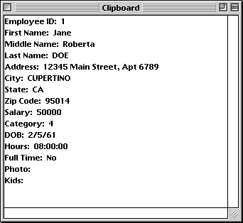

<!--REF #_command_.APPEND DATA TO PASTEBOARD.Syntax-->**APPEND DATA TO PASTEBOARD** ( *dataType* ; *data* )<!-- END REF-->
<!--REF #_command_.APPEND DATA TO PASTEBOARD.Params-->
| Parameter | Type |  | Description |
| --- | --- | --- | --- |
| dataType | Text | &#8594;  | Type of data to be added |
| data | Blob | &#8594;  | Data to append to the pasteboard |

<!-- END REF-->

#### Description 

<!--REF #_command_.APPEND DATA TO PASTEBOARD.Summary-->The APPEND DATA TO PASTEBOARD command appends to the pasteboard the data contained in the BLOB *data* under the data type specified in *dataType*.<!-- END REF-->

**Note:** In the case of copy/paste operations, the pasteboard is equivalent to the Clipboard. 

In *dataType*, pass a value specifying the type of data to be added. You can pass a 4D signature, a UTI type (Mac OS), a format name/number (Windows), or a 4-character type (compatibility). For more information about these types, please refer to the *Managing Pasteboards* section. 

**Note for Windows users:** When the command is used with Text type data (*dataType* is "TEXT", com.4d.private.text.native or com.4d.private.text.utf16), the string contained in the BLOB parameter *data* must end with the NULL character under Windows. 

Usually, you will use the APPEND DATA TO PASTEBOARD command to append multiple instances of the same data to the pasteboard or to append data that is not text or a picture. To append new data to the pasteboard, you must first clear the pasteboard using the [CLEAR PASTEBOARD](clear-pasteboard.md) command.

If you want to clear and append:

* text to the pasteboard, use the [SET TEXT TO PASTEBOARD](set-text-to-pasteboard.md) command,
* a picture to the pasteboard, use the [SET PICTURE TO PASTEBOARD](set-picture-to-pasteboard.md) command.
* a file pathname (drag and drop), use the [SET FILE TO PASTEBOARD](set-file-to-pasteboard.md) command.

However, note that if a BLOB actually contains some text or a picture, you can use the APPEND DATA TO PASTEBOARD command to append a text or a picture to the pasteboard.

#### Example 

Using Pasteboard commands and BLOBs, you can build sophisticated Cut/Copy/Paste schemes that deal with structured data rather than a unique piece of data. In the following example, the two project methods SET RECORD TO PASTEBOARD and GET RECORD FROM PASTEBOARD enable you to treat a whole record as one piece of data to be copied to or from the pasteboard.

```4d
  // SET RECORD TO PASTEBOARD project method
  // SET RECORD TO PASTEBOARD ( Number )
  // SET RECORD TO PASTEBOARD ( Table number )
 
 var $1;$vlField;$vlFieldType : Integer
 var $vpTable;$vpField : Pointer
 C_STRING(255;$vsDocName)
 var $vtRecordData;$vtFieldData : Text
 var $vxRecordData : Blob
 
  // Clear the pasteboard (it will stay empty if there is no current record)
 CLEAR PASTEBOARD
  // Get a pointer to the table whose number is passed as parameter
 $vpTable:=Table($1)
  // If there is a current record for that table
 If((Record number($vpTable->)>=0)|(Is new record($vpTable->)))
  //Initialize the text variable that will hold the text image of the record
    $vtRecordData:=""
  // For each field of the record:
    For($vlField;1;Last field number($1))
  //Get the type of the field
       GET FIELD PROPERTIES($1;$vlField;$vlFieldType)
  // Get a pointer to the field
       $vpField:=Field($1;$vlField)
  // Depending on the type of the field, copy (or not) its data in the appropriate manner
       Case of
          :(($vlFieldType=Is alpha field)|($vlFieldType=Is text))
             $vtFieldData:=$vpField->
          :(($vlFieldType=Is real)|($vlFieldType=Is integer)|($vlFieldType=Is longint)|($vlFieldType=Is date)|($vlFieldType=Is time))
             $vtFieldData:=String($vpField->)
          :($vlFieldType=Is Boolean)
             $vtFieldData:=String(Num($vpField->);"Yes;;No")
          Else
  // Skip and ignore other field data types
             $vtFieldData:=""
       End case
  // Accumulate the field data into the text variable holding the text image of the record
       $vtRecordData:=$vtRecordData+Field name($1;$vlField)+":"+Char(9)+$vtFieldData+CR
  // Note: The method CR returns Char(13) on Macintosh and Char(13)+Char(10) on Windows
    End for
  // Put the text image of the record into the pasteboard
    SET TEXT TO PASTEBOARD($vtRecordData)
  // Name for scrap file in Temporary folder
    $vsDocName:=Temporary folder+"Scrap"+String(1+(Random%99))
  // Delete the scrap file if it exists (error should be tested here)
    DELETE DOCUMENT($vsDocName)
  // Create scrap file
    SET CHANNEL(10;$vsDocName)
  // Send the whole record into the scrap file
    SEND RECORD($vpTable->)
  // Close the scrap file
    SET CHANNEL(11)
  // Load the scrap file into a BLOB
    DOCUMENT TO BLOB($vsDocName;$vxRecordData)
  // We longer need the scrap file
    DELETE DOCUMENT($vsDocName)
  // Append the full image of the record into the pasteboard
  // Note: We use arbitrarily "4Drc" as data type
    APPEND DATA TO PASTEBOARD("4Drc";$vxRecordData)
  // At this point, the pasteboardcontains:
  // (1) A text image of the record (as shown in the screen shots below)
  // (2) A whole image of the record (Picture, Subfile and BLOB fields included)
 End if
```

While entering the following record:


If you apply the method SET RECORD TO PASTEBOARD to the \[Employees\] table, the pasteboard will contain the text image of the record, as shown, and also the whole image of the record.



You can paste this image of the record to another record, using the method GET RECORD FROM PASTEBOARD, as follows:

```4d
  // GET RECORD FROM PASTEBOARD method
  // GET RECORD FROM PASTEBOARD( Number )
  // GET RECORD FROM PASTEBOARD( Table number )
 var $1;$vlField;$vlFieldType;$vlPosCR;$vlPosColon : Integer
 var $vpTable;$vpField : Pointer
 C_STRING(255;$vsDocName)
 var $vxPasteboardData : Blob
 var $vtPasteboardData;$vtFieldData : Text
 
  // Get a pointer to the table whose number is passed as parameter
 $vpTable:=Table($1)
  // If there is a current record
 If((Record number($vpTable->)>=0)|(Is new record($vpTable->)))
    Case of
  // Does the pasteboard contain a full image record?
       :(Pasteboard data size("4Drc")>0)
  //  If so, extract the pasteboard contents
          GET PASTEBOARD DATA("4Drc";$vxPasteboardData)
  // Name for scrap file in Temporary folder
          $vsDocName:=Temporary folder+"Scrap"+String(1+(Random%99))  
  // Delete the scrap file if it exists (error should be tested here)
          DELETE DOCUMENT($vsDocName)
  // Save the BLOB into the scrap file
          BLOB TO DOCUMENT($vsDocName;$vxPasteboardData)
  // Open the scrap file
          SET CHANNEL(10;$vsDocName)
  // Receive the whole record from the scrap file
          RECEIVE RECORD($vpTable->)
  // Close the scrap file
          SET CHANNEL(11)
  // We longer need the scrap file
          DELETE DOCUMENT($vsDocName)
  // Does the pasteboard contain TEXT?
       :(Pasteboard data size("TEXT")>0)
  // Extract the text from the pasteboard
          $vtPasteboardData:=Get text from pasteboard
  // Initialize field number to be increment
          $vlField:=0
          Repeat
  // Look for the next field line in the text
             $vlPosCR:=Position(CR;$vtPasteboardData)
             If($vlPosCR>0)
  // Extract the field line
                $vtFieldData:=Substring($vtPasteboardData;1;$vlPosCR-1)
  // If there is a colon ":"
                $vlPosColon:=Position(":";$vtFieldData)
                If($vlPosColon>0)
  // Take only the field data (eliminate field name)
                   $vtFieldData:=Substring($vtFieldData;$vlPosColon+2)
                End if
  // Increment field number
                $vlField:=$vlField+1
  // Pasteboard may contain more data than we need...
                If($vlField<=Last field number($vpTable))
  // Get the type of the field
                   GET FIELD PROPERTIES($1;$vlField;$vlFieldType)
  // Get a pointer to the field
                   $vpField:=Field($1;$vlField)
  // Depending on the type of the field, copy (or not) the text in the appropriate manner
                   Case of
                      :(($vlFieldType=Is alpha field)|($vlFieldType=Is text))
                         $vpField->:=$vtFieldData
                      :(($vlFieldType=Is real)|($vlFieldType=Is integer)|($vlFieldType=Is longint))
                         $vpField->:=Num($vtFieldData)
                      :($vlFieldType=Is date)
                         $vpField->:=Date($vtFieldData)
                      :($vlFieldType=Is time)
                         $vpField->:=Time($vtFieldData)
                      :($vlFieldType=Is Boolean)
                         $vpField->:=($vtFieldData="Yes")
                      Else
  // Skip and ignore other field data types
                   End case
                Else
  // All fields have been assigned, get out of the loop
                   $vtPasteboardData:=""
                End if
  // Eliminate text that has just been extracted
                $vtPasteboardData:=Substring($vtPasteboardData;$vlPosCR+Length(CR))
             Else
  // No delimiter found, get out of the loop
                $vtPasteboardData:=""
             End if
  // Repeat as long as we have data
          Until(Length($vtPasteboardData)=0)
       Else
          ALERT("The pasteboard does not any data that can be pasted as a record.")
    End case
 End if
```

#### System variables and sets 

If the BLOB data is correctly appended to the pasteboard, OK is set to 1; otherwise OK is set to 0 and an error may be generated.

#### See also 

[CLEAR PASTEBOARD](clear-pasteboard.md)  
[SET PICTURE TO PASTEBOARD](set-picture-to-pasteboard.md)  
[SET TEXT TO PASTEBOARD](set-text-to-pasteboard.md)  

#### Properties

|  |  |
| --- | --- |
| Command number | 403 |
| Thread safe | &cross; |
| Modifies variables | OK |


