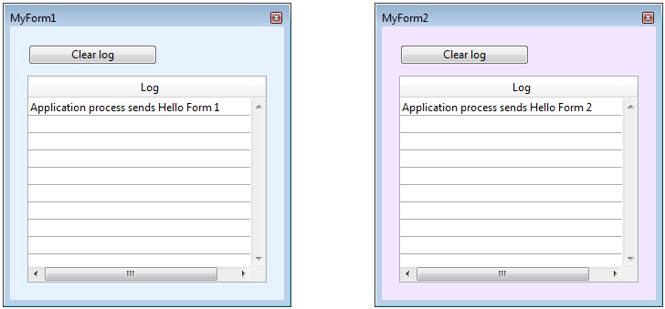

<!--REF #_command_.CALL FORM.Syntax-->**CALL FORM** ( *window* ; *formula* {; *param*}{; *param2* ; ... ; *paramN*} )<!-- END REF-->
<!--REF #_command_.CALL FORM.Params-->
| Parameter | Type |  | Description |
| --- | --- | --- | --- |
| window | Integer | &#8594;  | Window reference number |
| formula | Object, Text | &#8594;  | Formula object or Name of project method |
| param | Expression | &#8594;  | Parameter(s) passed to formula |

<!-- END REF-->

#### Error management 

<!--REF #_command_.CALL FORM.Summary-->The **CALL FORM** command executes the 4D code designated in *formula* with the optional *param*(s) in the context of a form displayed in a *window*, regardless of the process owning the window.<!-- END REF-->

Just like in the worker-based interprocess communication feature (see *About workers*), a message box is associated with the window and can be used when the window displays a form (after the On Load form event). **CALL FORM** encapsulates the formula and its arguments in a message that is posted in the window's message box. The form then executes the message in its own process. The calling process can be cooperative or preemptive, thus this feature allows a preemptive process to exchange information with forms.

In *window*, you pass the window reference number of the window displaying the called form.

In *formula*, you designate the 4D code to be executed in the context of the *window* parent process. You can pass either:

* a **formula object** (see *Formula Objects*). Formula objects can encapsulate any executable expressions, including functions and project methods;
* a **string** containing the name of a project method.

You can also pass parameters to the formula using one or more *param* parameters. You can use *sequential parameters* or, if the formula expression is a function or a project method, *named parameters*. Upon starting execution in the context of the form, the process formula receives the parameter values either in the named parameters, or in *$1*, *$2*, and so on. Remember that arrays cannot be passed as parameters. Furthermore, in the context of the **CALL FORM** command, the following additional considerations need to be taken into account:

* Pointers to tables or fields are allowed.
* Pointers to variables, particularly local and process variables, are not recommended since these variables may be undefined at the moment they are being accessed by the process method.
* If you pass an Object or a Collection type parameter, 4D creates a copy of the object or the collection in the destination process (instead of a reference) if the form is in a process different from the one calling the **CALL FORM** command.

#### Example 1 

You can use the **CALL FORM** command to pass custom settings to a form, for example configuration values, without having to use process variables:

```4d
 $win:=Open form window("form")
 CALL FORM($win;Formula(configure);param1;param2)
 DIALOG("form")
```

#### Example 2 

You want to open two different dialog windows from the same form, but with different background colors and different messages. You also want to send messages afterwards and display them in each dialog window.

In the main form, a button opens the two dialogs:

```4d
  //Object method to create forms
  //First window
 formRef1:=Open form window("FormMessage";Palette form window;On the left)
 SET WINDOW TITLE("MyForm1";formRef1)
 DIALOG("FormMessage";*)
 SHOW WINDOW(formRef1)
 
  //Second window
 formRef2:=Open form window("FormMessage";Palette form window;On the left+500)
 SET WINDOW TITLE("MyForm2";formRef2)
 DIALOG("FormMessage";*)
 SHOW WINDOW(formRef2)
 
  //Send colors
 CALL FORM(formRef1;"doSetColor";0x00E6F2FF)
 CALL FORM(formRef2;"doSetColor";0x00F2E6FF)
  //Create messages
 CALL FORM(formRef1;"doAddMessage";Current process name;"Hello Form 1")
 CALL FORM(formRef2;"doAddMessage";Current process name;"Hello Form 2")
```

The *doAddMessage* method only adds a row in the list box in the "FormMessage" form:

```4d
 var $1 : Text //Caller name
 var $2 : Text //Message to display
  //Receive message from $2 and log the message in the list box
 $p:=OBJECT Get pointer(Object named;"Column1")
 INSERT IN ARRAY($p->;1)
 $p->{1}:=$1+" sends "+$2
```

At runtime, you get the following result:



You can then add other messages by executing the **CALL FORM** command again:

```4d
 CALL FORM(formRef1;"doAddMessage";Current process name;"Hello 2 Form 1")
 CALL FORM(formRef2;"doAddMessage";Current process name;"Hello 2 Form 2")
```


#### See also 

  
[CALL WORKER](call-worker.md)  
[DIALOG](../commands/dialog.md)  

#### Properties

|  |  |
| --- | --- |
| Command number | 1391 |
| Thread safe | &check; |


