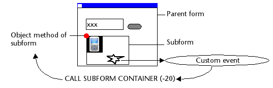

<!--REF #_command_.CALL SUBFORM CONTAINER.Syntax-->**CALL SUBFORM CONTAINER** ( *event* )<!-- END REF-->
<!--REF #_command_.CALL SUBFORM CONTAINER.Params-->
| Parameter | Type |  | Description |
| --- | --- | --- | --- |
| event | Integer | &#8594;  | Event to be sent |

<!-- END REF-->

#### Description 

<!--REF #_command_.CALL SUBFORM CONTAINER.Summary-->The CALL SUBFORM CONTAINER command lets a subform instance send the *event* to the subform object that contains it.<!-- END REF--> The subform object can then process the *event* in the context of the parent form. 

This command must be placed in the form method of the subform or in the object method of one of the subform objects. The event will only be received in the object method of the subform container. 

In *event*, you can pass any predefined form event of 4D (you can use the constants of the "*Form Events*" theme) or any value corresponding to a custom event. In the first case, the event must be checked for the subform. In the case of a custom event, it is recommended to pass a negative value in *event* in order to avoid the risk of interfering with existing or future 4D event numbers.

*Example of execution of the* CALL SUBFORM CONTAINER *command:*

#### See also 

[Form event code](../commands/form-event-code.md)  
[GOTO OBJECT](goto-object.md)  

#### Properties

|  |  |
| --- | --- |
| Command number | 1086 |
| Thread safe | &cross; |

