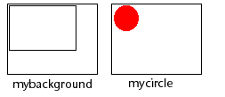
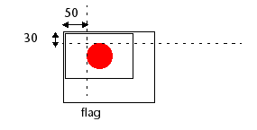

<!--REF #_command_.COMBINE PICTURES.Syntax-->**COMBINE PICTURES** ( *resultingPict* ; *pict1* ; *operator* ; *pict2* {; *horOffset* ; *vertOffset*} )<!-- END REF-->
<!--REF #_command_.COMBINE PICTURES.Params-->
| Parameter | Type |  | Description |
| --- | --- | --- | --- |
| resultingPict | Picture | &#8592; | Picture resulting from combination |
| pict1 | Picture | &#8594;  | First picture to combine |
| operator | Integer | &#8594;  | Type of combination to be done |
| pict2 | Picture | &#8594;  | Second picture to combine |
| horOffset | Integer | &#8594;  | Horizontal offset for superimposition |
| vertOffset | Integer | &#8594;  | Vertical offset for superimposition |

<!-- END REF-->

#### Description 

<!--REF #_command_.COMBINE PICTURES.Summary-->The **COMBINE PICTURES** command combines the *pict1* and *pict2* pictures in *operator* mode in order to produce a third, *resultingPict*.<!-- END REF--> The resulting picture is of the compound type and keeps all the characteristics of the source pictures.

**Note:** This command extends the functionalities offered by the conventional [picture combination operators](../Concepts/dt_picture.md#picture-operators). 

In *operator*, pass the type of combination to be applied. Three types of combinations, which can be accessed via the constants of the “*Picture Transformation*” theme, are proposed:

* Horizontal concatenation (1): *pict2* is attached to *pict1*, the top left corner of *pict2* coincides with the top right corner of *pict1*.
* Vertical concatenation (2): *pict2* attached to *pict1*, the top left corner of *pict2* coincides with the lower left corner of *pict1*.
* Superimposition (3): *pict2* is placed over *pict1*, the top left corner of *pict2* coincides with the top left corner of *pict1*.  
If the optional *horOffset* and *vertOffset* parameters are used, a translation is applied to *pict2* before superimposition. The values passed in *horOffset* and *vertOffset* must correspond to pixels. Pass positive values for an offset to the right or towards the bottom and a negative value for an offset to the left or towards the top.

**Note:** Superimposition carried out by the **COMBINE PICTURES** command differs from the superimposition provided by the conventional & and |operators (exclusive and inclusive superimposition). While the **COMBINE PICTURES** command preserves the characteristics of each source picture in the resulting picture, the & and | operators process each pixel and generate a bitmap picture in all cases. These operators, originally intended for black and white pictures, are now obsolete.

#### Example 

Given the following pictures: 



```4d
 COMBINE PICTURES(flag;mybackground;Superimposition;mycircle;50;30)
```

Result:



#### See also 

[TRANSFORM PICTURE](transform-picture.md)  

#### Properties

|  |  |
| --- | --- |
| Command number | 987 |
| Thread safe | &check; |


