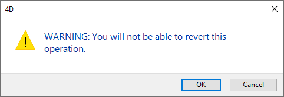
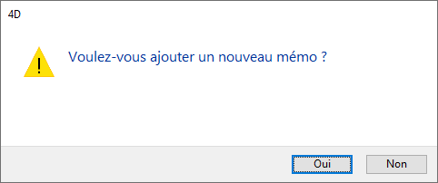

<!--REF #_command_.CONFIRM.Syntax-->**CONFIRM** ( *message* {; *okButtonTitle* {; *cancelButtonTitle*}} )<!-- END REF-->
<!--REF #_command_.CONFIRM.Params-->
| Parameter | Type |  | Description |
| --- | --- | --- | --- |
| message | Text | &#8594;  | Message to display in the confirmation dialog box |
| okButtonTitle | Text | &#8594;  | OK button title |
| cancelButtonTitle | Text | &#8594;  | Cancel button title |

<!-- END REF-->

#### Description 

<!--REF #_command_.CONFIRM.Summary-->The CONFIRM command displays a confirm dialog box composed of a note icon, a message, an OK button, and a Cancel Button.<!-- END REF-->

You pass the message to be displayed in the *message* parameter.

By default, the title of the OK button is “OK” and that of the Cancel button is “Cancel.” To change the titles of these buttons, pass the new custom titles into the optional parameters *okButtonTitle* and *cancelButtonTitle*. If necessary, the width of the buttons is resized toward the left, according to the width of the custom titles you pass.

The OK button has the [default button](../FormObjects/properties_Appearance.md#default-button) property. If the user clicks the OK button or presses Enter to accept the dialog box, the OK system variable is set to 1\. If the user clicks the Cancel button to cancel the dialog box, the OK system variable is set to 0.

**Tip:** Do not call the CONFIRM command from the section of a form or object method that handles the On Activate or On Deactivate form events; this will cause an endless loop.

#### Example 1 

The line:

```4d
 CONFIRM("WARNING: You will not be able to revert this operation.")
 If(OK=1)
    ALL RECORDS([Old Stuff])
    DELETE SELECTION([Old Stuff])
 Else
    ALERT("Operation canceled.")
 End if
```

will display the confirm dialog box (on Windows) shown here:



#### Example 2 

The line:

```4d
 CONFIRM("Do you really want to close this account?";"Yes";"No")
```

will display the confirm dialog box (on Windows) shown here:


#### Example 3 

You are writing a 4D application for the international market. You wrote your interface strings along with their target language translations in XLIFF files. In doing so, the code:

```4d
 var $title;$yes;$no : Text
 $title:=Localized string("add_Memo")
 $yes:=Localized string("yes")
 $no:=Localized string("no")
 CONFIRM($title;$yes;$no)
```

could display the French confirm dialog box (on Windows) shown here:



**Note:** For more information on xliff database localization, please refer to the *Appendix B: XLIFF architecture* section. 

#### Example 4 

The line:

```4d
 CONFIRM("WARNING: If your pursue this operation, some records will be "+"irremediably affected."+\
 Char(13)+"What do you want to do?";"Do NOT continue";"Continue")
```

will display the confirm dialog box (on Windows) shown here:


#### See also 

[ALERT](alert.md)  
[Request](request.md)  

#### Properties

|  |  |
| --- | --- |
| Command number | 162 |
| Thread safe | &check; |
| Modifies variables | OK |


