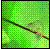
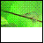

<!--REF #_command_.CREATE THUMBNAIL.Syntax-->**CREATE THUMBNAIL** ( *source* ; *dest* {; *width* {; *height* {; *mode* {; *depth*}}}} )<!-- END REF-->
<!--REF #_command_.CREATE THUMBNAIL.Params-->
| Parameter | Type |  | Description |
| --- | --- | --- | --- |
| source | Picture | &#8594;  | 4D picture field or variable to convert as a thumbnail |
| dest | Picture | &#8592; | Resulting thumbnail |
| width | Integer | &#8594;  | Thumbnail width in pixels, Default value = 48 |
| height | Integer | &#8594;  | Thumbnail height in pixels, Default value = 48 |
| mode | Integer | &#8594;  | Thumbnail creation mode Default value = Scaled to fit prop centered (6) |
| depth | Integer | &#8594;  | Obsolete, do not use |

<!-- END REF-->

#### Description 

<!--REF #_command_.CREATE THUMBNAIL.Summary-->The **CREATE THUMBNAIL** command returns a thumbnail from a given source picture.<!-- END REF--> Thumbnails are usually used for picture preview within multimedia software or Web sites.

You pass in the *source* parameter the 4D variable or field containing the picture to reduce to a thumbnail. You pass in the *dest* parameter the 4D picture field or variable which should host the resulting thumbnail.

The optional parameters *width* and *height* define the required thumbnail size (in pixels). If you omit these parameters, the thumbnail default size will be 48 x 48 pixels.

The optional parameter *mode* defines the thumbnail creation mode, i.e. the resizing mode. Three modes are available. The following predefined constants are provided by 4D in the “*Picture Display Formats*” constant theme:

| Constant                    | Type    | Value |
| --------------------------- | ------- | ----- |
| Scaled to fit               | Integer | 2     |
| Scaled to fit prop centered | Integer | 6     |
| Scaled to fit proportional  | Integer | 5     |

**Note:** Only these constants can be used with **CREATE THUMBNAIL**. The other constants in this theme cannot be applied to this command. 

If you do not enter any parameter, the “Scaled to fit prop centered” mode (6) is applied by default. Below is an illustration of the various modes:

Source picture   

Resulting thumbnails (48x48)

* Scaled to fit = 2  

* Scaled to fit proportional = 5  

* Scaled to fit prop centered = 6 (default mode)  

**Note:** With the “Scaled to fit proportional” and the “Scaled to fit prop centered”, the free space will be displayed in white. When these modes are applied to picture field or variable in 4D forms, the free space is transparent.

The *depth* parameter is ignored and must be omitted. The command always uses the current screen depth (number of colors). 

#### Properties

|  |  |
| --- | --- |
| Command number | 679 |
| Thread safe | &check; |

