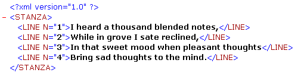

<!--REF #_command_.DOM GET XML ATTRIBUTE BY NAME.Syntax-->**DOM GET XML ATTRIBUTE BY NAME** ( *elementRef* ; *attribName* ; *attribValue* )<!-- END REF-->
<!--REF #_command_.DOM GET XML ATTRIBUTE BY NAME.Params-->
| Parameter | Type |  | Description |
| --- | --- | --- | --- |
| elementRef | Text | &#8594;  | XML element reference |
| attribName | Text | &#8594;  | Attribute name |
| attribValue | Variable | &#8592; | Attribute value |

<!-- END REF-->

#### Description 

<!--REF #_command_.DOM GET XML ATTRIBUTE BY NAME.Summary-->The DOM GET XML ATTRIBUTE BY NAME command gets the value of an attribute specified by name.<!-- END REF--> 

Pass the reference of an XML element in *elementRef* and the name of the attribute that you want to know the value of in *attribName*. The value is returned in the *attribValue* parameter. 4D attempts to convert the value obtained into the same type as that of the variable passed as parameter. If the variable type is not defined, the value is returned in text type by default. 

If no *attribName* attribute exists in the XML element, an error is returned. If several attributes of the XML element have the same name as that specified, only the value of the first attribute is returned.

#### Example 

This method is used to retrieve the value of an XML attribute using its name:

```4d
 var myBlobVar : Blob
 var $xml_Parent_Ref;$xml_Child_Ref : Text
 var $LineNum : Integer
 
 $xml_Parent_Ref:=DOM Parse XML variable(myBlobVar)
 $xml_Child_Ref:=DOM Get first child XML element($xml_Parent_Ref)
 DOM GET XML ATTRIBUTE BY NAME($xml_Child_Ref;"N";$LineNum)
```

If this method is applied to the example below, $LineNum contains the value 1:



#### System variables and sets 

If the command has been correctly executed, the system variable OK is set to 1\. If an error occurs, it is set to 0.

#### See also 

[DOM GET XML ATTRIBUTE BY INDEX](dom-get-xml-attribute-by-index.md)  
[DOM REMOVE XML ATTRIBUTE](dom-remove-xml-attribute.md)  

#### Properties

|  |  |
| --- | --- |
| Command number | 728 |
| Thread safe | &check; |
| Modifies variables | OK, error |


