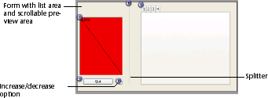
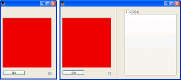

<!--REF #_command_.FORM SET SIZE.Syntax-->**FORM SET SIZE** ( {*object* ;} *horizontal* ; *vertical* {; *} )<!-- END REF-->
<!--REF #_command_.FORM SET SIZE.Params-->
| Parameter | Type |  | Description |
| --- | --- | --- | --- |
| object | Text | &#8594;  | Object name indicating form limits |
| horizontal | Integer | &#8594;  | If * passed: horizontal margin (pixels)If * omitted: width (pixels) |
| vertical | Integer | &#8594;  | If * passed: vertical margin (pixels)If * omitted: height (pixels) |
| * | Operator | &#8594;  | • If passed, use horizontal and vertical as form margins• If omitted, use horizontal and vertical as width and height of the form<br/>This parameter cannot be passed if the object parameter is passed. |

<!-- END REF-->

#### Description 

<!--REF #_command_.FORM SET SIZE.Summary-->The **FORM SET SIZE** command allows you to change the size of the current form by programming.<!-- END REF--> The new size is defined for the current process; it is not saved with the form.  
  
As in the Design environment, you can use this command to set the form size in three ways:

* Automatically — 4D determines the size of the form based on the notion that all objects must be visible — and possibly adding a horizontal and vertical margin,
* On the place where a form object is found, where a horizontal and vertical margin may be added,
* By entering “fixed” sizes (width and height).  
For more information on resizing forms, refer to the 4D *Design Reference* manual.
**Automatic size**

If you want the size of the form to be set automatically, you must use the following syntax: 

```4d
 FORM SET SIZE(horizontal;vertical;*)
```

In this case, you must pass the margins (in pixels) that you want to add to the right and bottom of the form in *horizontal* and *vertical*. 

**Object-based size**

If you want the form size to be based on an object, you must use the following syntax: 

```4d
 FORM SET SIZE(object;horizontal;vertical)
```

In this case, you must pass the margins (in pixels) that you want to add to the right and bottom of the object in *horizontal* and *vertical*. You cannot pass the *\** parameter.

**Fixed size**

In you want to have a fixed form size, you must use the following syntax: 

```4d
 FORM SET SIZE(horizontal;vertical)
```

In this case, you must pass the width and height (in pixels) of the form in *horizontal* and *vertical*. 

The **FORM SET SIZE** command changes the size of the form, but also takes into account the resizing properties. For example, if the minimum width of a form is 500 pixels and if the command sets a width of 400 pixels, the new form width will be 500 pixels.   
Also note that this command does not change the size of the form window (you can resize a form without changing the size of the window and vice versa). To change the size of the form window, refer to the [RESIZE FORM WINDOW](resize-form-window.md) command. 

#### Example 

The following example shows how an Explorer type window is set up. The following form is created in the Design environment :



The size of the form is “automatic”.

The window is displayed using the following code:

```4d
 $ref:=Open form window([Table 1];"Form1";Plain form window;Horizontally centered;Vertically centered;*)
 DIALOG([Table 1];"Form1")
 CLOSE WINDOW
```

The right part of the window can be displayed or hidden by clicking on the increase/decrease option:



The object method associated with this button is as follows:

```4d
 Case of
    :(FORM Event.code=On Load)
       var b1;<>collapsed : Boolean
       var margin : Integer
       margin:=15
       b1:=<>collapsed
       If(<>collapsed)
          FORM SET HORIZONTAL RESIZING(False)
          FORM SET SIZE("b1";margin;margin)
       Else
          FORM SET HORIZONTAL RESIZING(True)
          FORM SET SIZE("tab";margin;margin)
       End if
 
    :(FORM Event.code=On click)
       <>collapsed:=b1
       If(b1)
  //collapsed
          OBJECT GET COORDINATES(*;"b1";$l;$t;$r;$b)
          GET WINDOW RECT($lf;$tf;$rf;$bf;Current form window)
          SET WINDOW RECT($lf;$tf;$lf+$r+margin;$tf+$b+margin;Current form window)
          SET FORM HORIZONTAL RESIZING(False)
          SET FORM SIZE("b1";margin;margin)
 
       Else
  //expanded
          OBJECT GET COORDINATES(*;"tab";$l;$t;$r;$b)
          GET WINDOW RECT($lf;$tf;$rf;$bf;Current form window)
          SET WINDOW RECT($lf;$tf;$lf+$r+margin;$tf+$b+margin;Current form window)
          FORM SET HORIZONTAL RESIZING(True)
          FORM SET SIZE("tab";margin;margin)
       End if
 
 End case
```

#### See also 

[FORM SET HORIZONTAL RESIZING](form-set-horizontal-resizing.md)  
[FORM SET VERTICAL RESIZING](form-set-vertical-resizing.md)  

#### Properties

|  |  |
| --- | --- |
| Command number | 891 |
| Thread safe | &cross; |


