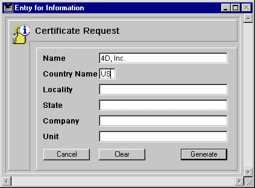

<!--REF #_command_.GENERATE CERTIFICATE REQUEST.Syntax-->**GENERATE CERTIFICATE REQUEST** ( *privKey* ; *certifRequest* ; *codeArray* ; *nameArray* )<!-- END REF-->
<!--REF #_command_.GENERATE CERTIFICATE REQUEST.Params-->
| Parameter | Type |  | Description |
| --- | --- | --- | --- |
| privKey | Blob | &#8594;  | BLOB containing the private key |
| certifRequest | Blob | &#8592; | BLOB receiving the certificate request |
| codeArray | Array integer | &#8594;  | Information code list |
| nameArray | Text array | &#8594;  | Name list |

<!-- END REF-->

#### Description 

<!--REF #_command_.GENERATE CERTIFICATE REQUEST.Summary-->The **GENERATE CERTIFICATE REQUEST** command generates a certificate request at the PKCS format which can be directly used by certificate authorities such as Verisign(R) .<!-- END REF--> The certificate plays an important part in the SSL secured protocol. It is sent to each browser connecting in SSL mode. It contains the “ID card” of the Web site (made from the information entered in the command), as well as its public key allowing the browsers to decrypt the received information. Furthermore, the certificate contains various information added by the certificate authority which guarantees its integrity.

**Note:** For more information on the SSL protocol use with 4D Web server, refer to the [WEB SERVICE SET PARAMETER](web-service-set-parameter.md) section. 

The certificate request uses keypairs generated with the [GENERATE ENCRYPTION KEYPAIR](generate-encryption-keypair.md) command and contains various information. The certificate authority will generate its certificate combining this request with other parameters.

Pass in *privKey* a BLOB containing the private key generated with the [GENERATE ENCRYPTION KEYPAIR](generate-encryption-keypair.md) command.

Pass in *certifRequest* an empty BLOB. Once the command has been executed, it contains the certificate request at the PKCS format encoded in base64\. You can store the contents directly in a text file suffixed .pem, for example using the [BLOB TO DOCUMENT](blob-to-document.md) command, to submit it to the certificate authority.

**Warning:** The private key is used to generate the request but should NOT be sent to the certificate authority.

The arrays *codeArray* (long integer) and *nameArray* (string) should be filled respectively with the code numbers and the information content required by the certificate authority. 

The required codes and names may change according to the certificate authority and the certificate use. However, within a normal use of the certificate (Web server connections via SSL), the arrays should contain the following items:

| **Information to provide** | **codeArray** | **nameArray (Examples)** |
| -------------------------- | ------------- | ------------------------ |
| CommonName                 | 13            | www.4D.com               |
| CountryName (two letters)  | 14            | US                       |
| LocalityName               | 15            | San Jose                 |
| StateOrProvinceName        | 16            | California               |
| OrganizationName           | 17            | 4D, Inc.                 |
| OrganizationUnit           | 18            | Web Administrator        |

The code and information content entering order does not matter, however the two arrays must be synchronized: if the third item of the *codeArray* contains the value *15* (locality name), the *nameArray* third item should contain this information, in our example San Jose.

#### Example 

A “Certificate request” form contains the six fields necessary for a standard certificate request. The **Generate** button creates a document on disk containing the certificate request. The “Privatekey.txt” document containing the private key (generated with the [GENERATE ENCRYPTION KEYPAIR](generate-encryption-keypair.md) command) should be on the disk:

  
  
Here is the **Generate** button method:

```4d
  // bGenerate Object Method
 
 var $vbprivateKey;$vbcertifRequest : Blob
 var $tableNum : Integer
 ARRAY LONGINT($tLCodes;6)
 ARRAY STRING(80;$tSInfos;6)
 
 $tableNum:=Table(Current form table)
 For($i;1;6)
    $tSInfos{$i}:=Field($tableNum;$i)->
    $tLCodes{$i}:=$i+12
 End for
 If(Find in array($tSInfos;"")#-1)
    ALERT("All fields should be filled.")
 Else
    ALERT("Select your private key.")
    $vhDocRef:=Open document("")
    If(OK=1)
       CLOSE DOCUMENT($vhDocRef)
       DOCUMENT TO BLOB(Document;$vbprivateKey)
       GENERATE CERTIFICATE REQUEST($vbPrivateKey;$vbcertifRequest;$tLCodes;$tSInfos)
       BLOB TO DOCUMENT("Request.txt";$vbcertifRequest)
    Else
       ALERT("Invalid private key.")
    End if
 End if
```

#### See also 

[GENERATE ENCRYPTION KEYPAIR](generate-encryption-keypair.md)  
[HTTP SET CERTIFICATES FOLDER](http-set-certificates-folder.md)  

#### Properties

|  |  |
| --- | --- |
| Command number | 691 |
| Thread safe | &check; |


