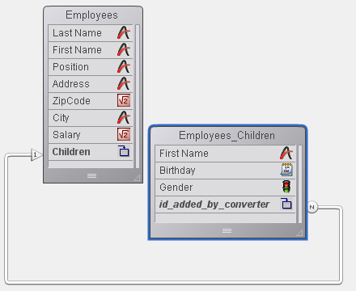

<!--REF #_command_.Get subrecord key.Syntax-->**Get subrecord key** ( *idField* ) : Integer<!-- END REF-->
<!--REF #_command_.Get subrecord key.Params-->
| Parameter | Type |  | Description |
| --- | --- | --- | --- |
| idField | Field | &#8594;  | "Subtable Relation" or "Longint" type field of a former subtable relation |
| Function result | Integer | &#8592; | Internal key of relation |

<!-- END REF-->

#### Description 

<!--REF #_command_.Get subrecord key.Summary-->The Get subrecord key command facilitates the migration of 4D code using converted subtables to standard code for working with tables.<!-- END REF-->Beginning with version 11 of 4D, subtables are not supported. When a older database is converted, any existing subtables are transformed into standard tables that are linked with the original tables by an automatic relation. The former subtable becomes the Many table and the original table is the One table. In the One table, the former subtable field is transformed into a special field of the "Subtable Relation" type and in the Many field, a special "Subtable Relation" type field is added named “id\_added\_by\_converter”. 

This allows converted databases to function but we strongly recommend that you replace any subtable mechanisms in your converted databases by those used for standard tables. 

The first step in this process consists in deleting the special automatic relations, which permanently disables the mechanisms inherited from subtables. After this you need to rewrite the associated code. The Get subrecord key command accompanies this rewriting by returning the internal ID used by the relation. This internal ID makes the actual relation unnecessary and you can then work with the selection of the former subtable even when the relation is no longer present. 

Let's look for example at the following converted structure: 



In 4D, the following code still works but it must be updated:

```4d
 ALL SUBRECORDS([Employees]Children)
 $total:=Records in subselection([Employees]Children)
 vFirstnames:=""
 For($i;1;$total)
    vFirstnames:=vFirstnames+[Employees]Children'FirstName+" "
    NEXT SUBRECORD([Employees]Children)
 End for
```

You can now replace this code with:

```4d
 QUERY([Employees_Children];[Employees_Children]id_added_by_converter=Get subrecord key([Employees]Children))
 $total:=Records in selection([Employees_Children])
 vFirstnames:=""
 For($i;1;$total)
    vFirstnames:=vFirstnames+[Employees_Children]FirstName+" "
    NEXT RECORD(Employees_Children)
 End for
```

**Note:** Get subrecord key returns 0 if there is no current recorded loaded when it is executed.

The second piece of code has the advantage of using standard 4D commands and it works the same way whether the relation is present or not. When you remove the relation, the command simply returns the key value stored in the Longint field. 

In the *idField* parameter, the command accepts either a field of the Subtable Relation type (if the relation still exists) or of the Longint type (if the relation has been removed). In any other case, an error is generated.

This lets you write the transition code. During the final stage of upgrading the application, you can remove the calls to this command. 

#### Assigning values to the id\_added\_by\_converter field 

Starting with 4D v14 R3, you can assign a value to the "id\_added\_by\_converter" field. Previously, this value could only be assigned by 4D itself, which forced developers to use obsolete commands such as *\_o\_CREATE SUBRECORD* to be able to add records into converted subtables.

Thanks to this possibility, you can convert former databases containing subtables progressively: at first, you can keep the special "Subtable relation", while adding or modifying related records as if they were standard ones. Then, once all your methods are up to date, you can replace this special relation with a standard one, without having to change your code. 

For example, with the structure above you can write:

```4d
 CREATE RECORD([Employees])
 [Employees]LastName:="Jones"
 CREATE RECORD([Employees_Children])
 [Employees_Children]FirstName:="Natacha"
 [Employees_Children]BirthDate:=!12/24/2013!
 [Employees_Children]id_added_by_converter:=Get subrecord key([Employees]Children)
 SAVE RECORD([Employees_Children])
 SAVE RECORD([Employees]
```

This code will work with either a special relation or a standard one.


#### Properties

|  |  |
| --- | --- |
| Command number | 1137 |
| Thread safe | &check; |


