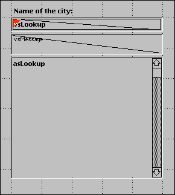

<!--REF #_command_.Keystroke.Syntax-->**Keystroke**  : Text<!-- END REF-->
<!--REF #_command_.Keystroke.Params-->
| Parameter | Type |  | Description |
| --- | --- | --- | --- |
| Function result | Text | &#8592; | Character entered by user |

<!-- END REF-->

#### Description 

<!--REF #_command_.Keystroke.Summary-->**Keystroke** returns the character entered by the user into a field or an enterable area.<!-- END REF--> 

Usually, you will call **Keystroke** within a form or object method while handling an On Before Keystroke or On After Keystroke form event. To detect keystroke events, use the command [Form event code](../commands/form-event-code.md). 

To replace the character actually entered by the user with another character, use the command [FILTER KEYSTROKE](filter-keystroke.md).

**Note:** The **Keystroke** function does not work in subforms.

**IMPORTANT NOTE:** If you want to perform some “on the fly” operations depending on the current value of the enterable area being edited, as well as the new character to be entered, remember that the text you see on screen is NOT YET the value of the data source field or variable for the area being edited. The data source field or variable is assigned the entered value after the data entry for the area is validated (e.g., tabulation to another area, click on a button, and so on). It is therefore up to you to “shadow” the data entry into a variable and then to work with this shadow value. You must do so if you need to know the current text value for executing any particular actions. You can also use the function [Get edited text](get-edited-text.md).

You will use the command **Keystroke** for:

* Filtering characters in a customized way
* Filtering data entry in a way that you cannot produce using data entry filters
* Implement dynamic lookup or autocomplete areas

#### Example 1 

See examples for the [FILTER KEYSTROKE](filter-keystroke.md) command.

#### Example 2 

When you process an On Before Keystroke event, you are dealing with the editing of the current text area (the one where the cursor is), not with the “future value” of the data source (field or variable) for this area. The Handle keystroke project method allows to shadow any text area data entry into a second variable, which you can use to perform the actions while entering characters into the area. You pass a pointer to the area’s data source as the first parameter and a pointer to the shadow variable as second parameter. The method returns the new value of the text area in the shadow variable, and returns **True** if the value is different from it what was before the last entered character was inserted.

```4d
  // Handle keystroke project method
  // Handle keystroke ( Pointer ; Pointer ) -> Boolean
  // Handle keystroke ( -> srcArea ; -> curValue ) -> Is new value
 
 var $1;$2 : Pointer
 var $vtNewValue : Text
 
  // Get the text selection range within the enterable area
 GET HIGHLIGHT($1->;$vlStart;$vlEnd)
  // Start working with the current value
 $vtNewValue:=$2->
  // Depending on the key pressed or the character entered,
  // Perform the appropriate actions
 Case of
 
  // The Backspace (Delete) key has been pressed
    :(Character code(Keystroke)=Backspace)
  // Delete the selected characters or the character at the left of the text cursor
       $vtNewValue:=Substring($vtNewValue;1;$vlStart-1-Num($vlStart=$vlEnd))
       +Substring($vtNewValue;$vlEnd)
 
  // An acceptable character has been entered
    :(Position(Keystroke;"abcdefghjiklmnopqrstuvwxyz -0123456789")>0)
       If($vlStart#$vlEnd)
  // One or several characters are selected, the keystroke is going to override them
          $vtNewValue:=Substring($vtNewValue;1;$vlStart-1)
          +Keystroke+Substring($vtNewValue;$vlEnd)
       Else
  // The text selection is the text cursor
          Case of
  // The text cursor is currently at the begining of the text
             :($vlStart<=1)
  // Insert the character at the begining of the text
                $vtNewValue:=Keystroke+$vtNewValue
  // The text cursor is currently at the end of the text
             :($vlStart>=Length($vtNewValue))
  // Append the character at the end of the text
                $vtNewValue:=$vtNewValue+Keystroke
             Else
  // The text cursor is somewhere in the text, insert the new character
                $vtNewValue:=Substring($vtNewValue;1;$vlStart-1)+Keystroke
                +Substring($vtNewValue;$vlStart)
          End case
       End if
 
  // An Arrow key has been pressed
  // Do nothing, but accept the keystroke
    :(Character code(Keystroke)=Left arrow key)
    :(Character code(Keystroke)=Right arrow key)
    :(Character code(Keystroke)=Up arrow key)
    :(Character code(Keystroke)=Down arrow key)
  `
    Else
  // Do not accept characters other than letters, digits, space and dash
       FILTER KEYSTROKE("")
 End case
  // Is the value now different?
 $0:=($vtNewValue#$2->)
  // Return the value for the next keystroke handling
 $2->:=$vtNewValue
```

After this project method is added to your application, you can use it as follows:

```4d
  // myObject enterable area object method
 Case of
    :(FORM Event=On Load)
       MyObject:=""
       MyShadowObject:=""
    :(FORM Event=On Before Keystroke)
       If(Handle keystroke(->MyObject;->MyShadowObject))
  // Perform appropriate actions using the value stored in MyShadowObject
       End if
 End case
```

Let’s examine the following part of a form:



It is composed of the following objects: an enterable area *vsLookup*, a non-enterable area *vsMessage*, and a scrollable area *asLookup*. While entering characters in *vsLookup*, the method for that object performs a query on a \[US Zip Codes\] table, allowing the user to find US cities by typing only the first characters of the city names. 

The *vsLookup* object method is listed here:

```4d
  // vsLookup enterable area object method
 Case of
    :(FORM Event=On Load)
       vsLookup:=""
       vsResult:=""
       vsMessage:="Enter the first characters of the city you are looking for."
       CLEAR VARIABLE(asLookup)
    :(FORM Event=On Before Keystroke)
       If(Handle keystroke(->vsLookup;->vsResult))
          If(vsResult#"")
             QUERY([US Zip Codes];[US Zip Codes]City=vsResult+"@")
             MESSAGES OFF
             DISTINCT VALUES([US Zip Codes]City;asLookup)
             MESSAGES ON
             $vlResult:=Size of array(asLookup)
             Case of
                :($vlResult=0)
                   vsMessage:="No city found."
                :($vlResult=1)
                   vsMessage:="One city found."
                Else
                   vsMessage:=String($vlResult)+" cities found."
             End case
          Else
             DELETE FROM ARRAY(asLookup;1;Size of array(asLookup))
             vsMessage:="Enter the first characters of the city you are looking for."
          End if
       End if
 End case
```

Here is the form being executed:


Using the interprocess communication capabilities of 4D, you can similarily build user interfaces in which Lookup features are provided in floating windows that communicate with processes in which records are listed or edited.

#### See also 

[FILTER KEYSTROKE](filter-keystroke.md)  
[Form event code](../commands/form-event-code.md)  
[Get edited text](get-edited-text.md)  

#### Properties

|  |  |
| --- | --- |
| Command number | 390 |
| Thread safe | &cross; |


