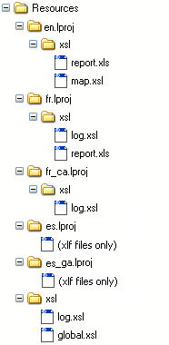

<!--REF #_command_.Localized document path.Syntax-->**Localized document path** ( *relativePath* ) : Text<!-- END REF-->
<!--REF #_command_.Localized document path.Params-->
| Parameter | Type |  | Description |
| --- | --- | --- | --- |
| relativePath | Text | &#8594;  | Relative pathname of document for which we want to obtain localized version |
| Function result | Text | &#8592; | Absolute pathname of localized document |

<!-- END REF-->

#### Description 

<!--REF #_command_.Localized document path.Summary-->The **Localized document path** command returns the complete (absolute) pathname of a document designated by *relativePath* and located in a xxx.<!-- END REF-->lproj folder.

This command must be used within a multi-language application architecture based on the presence of a **Resources** folder and *xxx.lproj* subfolders (where xxx represents a language). With this architecture, 4D automatically supports localized files of the .xliff type as well as pictures, but you may need to use the same mechanism for other types of files. 

Pass the relative pathname of the document to be searched for in *relativePath*. The path entered must be relative to the first level of the "xxx.lproj" folder of the database. The command will return a complete pathname using the "xxx.lproj" folder corresponding to the current language of the database. 

**Note:** The current language is either set automatically by 4D according to the contents of the **Resources** folder (see the [Get database localization](get-database-localization.md) command), or via the [SET DATABASE LOCALIZATION](set-database-localization.md) command).

You can express the contents of the *relativePath* parameter using a system or a POSIX syntax. For example:

* xsl/log.xsl (POSIX syntax: can be used under Mac OS or Windows)
* xsllog.xsl (Windows only)
* xsl:log.xsl (Mac OS only)

The absolute pathname returned by the command is always expressed in the system syntax. 

**4D Server:** In remote mode, the command returns the path of the **Resources** folder on the client machine if the command is called from a client process. 

4D looks for the file while respecting a sequence that allows all the cases of multi-language applications to be processed. At each step, 4D checks for the presence of *relativePath* in the folder corresponding to the language and returns the complete path when it succeeds. If *relativePath* is not found or if the folder does not exist, 4D passes to the next step. Here are the folders for each of the different search stages:

*Current language (e.g.: fr-ca)* 
 *Current language without region (e.g.: fr)* 
 *Language loaded by default on startup (e.g.: es-ga)* 
 *Language loaded by default on startup without region (e.g.: es)* 
 *First .lproj folder found (e.g.: en.lproj)* 
 *First level of Resources folder*

If *relativePath* is not found in any of these locations, the command returns an empty string. 

#### Example 

For the purpose of transforming an XML or HTML file, you want to use a "log.xsl" transformation file. This file differs depending on the current language. You therefore want to know which "log.xsl" file path to use.   
Here are the contents of the Resources folder:



To use a .xsl file adapted to the current language, you simply need to pass:

```4d
 $myxsl:=Localized document path("xsl/log.xsl")
```

If the current language is, for example, French Canadian (fr-ca), the command returns:

* under Windows: C:\\users\\…\\…\\…\\resources\\fr\_ca.lproj\\xsl\\log.xsl
* under Mac OS: "HardDisk:users:…:…:…:resources:fr\_ca.lproj:xsl:log.xsl"

#### See also 

[Get database localization](get-database-localization.md)  

#### Properties

|  |  |
| --- | --- |
| Command number | 1105 |
| Thread safe | &check; |


