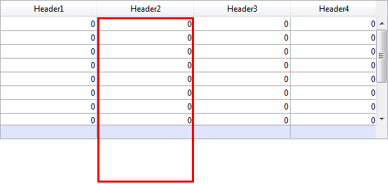

<!--REF #_command_.OBJECT GET COORDINATES.Syntax-->**OBJECT GET COORDINATES** ( {* ;} *object* ; *left* ; *top* ; *right* ; *bottom* )<!-- END REF-->
<!--REF #_command_.OBJECT GET COORDINATES.Params-->
| Parameter | Type |  | Description |
| --- | --- | --- | --- |
| * | Operator | &#8594;  | If specified = object is the name of the object (string) If omitted = object is a variable |
| object | any | &#8594;  | Object name (if * is specified) or Field or variable (if * is omitted) |
| left | Integer | &#8592; | Left coordinate of the object |
| top | Integer | &#8592; | Top coordinate of the object |
| right | Integer | &#8592; | Right coordinate of the object |
| bottom | Integer | &#8592; | Bottom coordinate of the object |

<!-- END REF-->

#### Description 

<!--REF #_command_.OBJECT GET COORDINATES.Summary-->The OBJECT GET COORDINATES command returns the coordinates *left*, *top*, *right* and *bottom* (in points) in variables or fields of the object(s) of the current form defined by the parameters *\** and *object*.<!-- END REF-->

If you pass the optional parameter *\**, it indicates that the object parameter is an object name (a string). If you don’t pass the optional parameter *\**, it indicates that object is a field or a variable. In this case, you don’t pass a string but a field or variable reference (only a field or variable of type object).

If you pass an object name to *object* and use the wildcard character (“@”) to select more than one object, the coordinates returned will be those of the rectangle formed by all the objects concerned. 

**Note:** Since 4D version 6.5, it is possible to set the interpretation mode of the wildcard character (“@”), when it is included in a string of characters. This option has an impact on the “Object Properties” commands. Please refer to the 4D Design Reference manual.

If the object doesn’t exist or if the command is not called in a form, the coordinates (0;0;0;0) are returned.

In the context of list boxes, the **OBJECT GET COORDINATES** command can return the coordinates of specific list box parts, i.e. columns, headers, or footers, and not just those of the list box parent object. In 4D versions prior to v14 R5, this command always returned the parent list box coordinates, regardless of the area passed as parameter. From now on, when the referenced *object* is a list box header, column, or footer sub-object, the coordinates returned are those of the designated list box sub-object. You can use this new feature, for example, to display a small icon in the list box header cell when it is hovered over, which a user can then click to display a context menu.  
For consistency, the reference frame used is the same when the object is a list box sub-object or a list box object: the origin is the upper-left corner of the form which contains the object. For list box sub-objects, the coordinates returned are theoretical; they take into account the scrolling state of the list box before any clipping occurs (i.e., the cutting carried out according to the coordinates of the parent list box). As a result, the sub-object may not be visible (or only partially so) at its coordinates, and these coordinates may be outside the form limits (or even negative). To find out whether the sub-object is visible (and which part of it is visible) you need to compare the coordinates returned with the list box coordinates, while considering the following rules: 

* All sub-objects are clipped to the coordinates of their parent list box (as returned by **OBJECT GET COORDINATES** on the list box).
* Header and footer sub-objects are displayed on top of column content: when the coordinates of a column intersect the coordinates of the header or footer rows, then the column is not displayed at this intersection.
* Elements of locked columns are displayed on top of elements of scrollable columns: when the coordinates of an element in a scrollable column intersect the coordinates of an element in a locked column, then it is not displayed at this intersection.

For example, consider the following graphic where the coordinates of the *Capital* column are symbolized by the red rectangle:


As you can see in the first picture, the column is larger than the list box, so its coordinates go beyond the lower limit of the list box, including the footer. In the second picture, the list box has scrolled, so the column has also been moved "under" the *Language* column and header area. In any case, in order to calculate the actual visible part (green area), you need to subtract the red areas.

#### Example 1 

Let’s assume that you want to obtain the coordinates of a rectangle formed by all the objects that begin with “button”:

```4d
 OBJECT GET COORDINATES(*;"button@";vLeft;vTop;vRight;vBottom)
```

#### Example 2 

For interface needs, you want to surround the clicked area with a red rectangle:


In the object method of the list box, you can write:

```4d
 OBJECT SET VISIBLE(*;"rectangleInfo";False) //initialize a red rectangle
 $ptr:=OBJECT Get pointer(Object current)
 OBJECT GET COORDINATES($ptr->;$x1;$y1;$x2;$y2)
 OBJECT SET VISIBLE(*;"RedRect";True)
 OBJECT SET COORDINATES(*;"RedRect";$x1;$y1;$x2;$y2)
 
 OBJECT GET COORDINATES(*;"LB1";$lbx1;$lby1;$lbx2;$lby2)
 If($lby1>$y1)|($lby2<$y2) // if the clicked area is outside the list box
    OBJECT SET VISIBLE(*;"Alert";True) //display a warning
 Else
    OBJECT SET VISIBLE(*;"Alert";False)
 End if
```

The method returns theoretical coordinates. In cases where the list box has been resized, you may need to calculate the clipping to know which part is visible:



#### See also 

[CONVERT COORDINATES](convert-coordinates.md)  
[LISTBOX GET CELL COORDINATES](listbox-get-cell-coordinates.md)  
[OBJECT MOVE](object-move.md)  
[OBJECT SET COORDINATES](object-set-coordinates.md)  

#### Properties

|  |  |
| --- | --- |
| Command number | 663 |
| Thread safe | &cross; |


