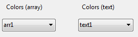
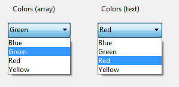

<!--REF #_command_.OBJECT SET LIST BY REFERENCE.Syntax-->**OBJECT SET LIST BY REFERENCE** ( {* ;} *object* {; *listType*}; *list* )<!-- END REF-->
<!--REF #_command_.OBJECT SET LIST BY REFERENCE.Params-->
| Parameter | Type |  | Description |
| --- | --- | --- | --- |
| * | Operator | &#8594;  | If specified, object is an object name (string)<br/>If omitted, object is a field or variable |
| object | any | &#8594;  | Object name (if * is specified) or<br/>Field or variable (if * is omitted) |
| listType | Integer | &#8594;  | Type of list: Choice list, Required list or Excluded list |
| list | Integer | &#8594;  | List reference number |

<!-- END REF-->

#### Description 

<!--REF #_command_.OBJECT SET LIST BY REFERENCE.Summary-->The **OBJECT SET LIST BY REFERENCE** command defines or replaces the list associated with the object(s) designated by the *object* and *\** parameters, with the hierarchical list referenced in the *list* parameter.<!-- END REF-->

Passing the optional *\** parameter indicates that the *object* parameter is an object name (string). If you do not pass this parameter, it indicates that the *object* parameter is a field or variable. In this case, you pass a field or variable reference instead of a string (field or variable object only).

By default, if you omit the *listType* parameter, the command defines a source choice list (choice of values) for the object. You can designate any type of list in the *listType* parameter. To do this, you just need to pass one of the following constants found in the "*Form Objects (Properties)*" theme:

| Constant      | Type    | Value | Comment                                                                                    |
| ------------- | ------- | ----- | ------------------------------------------------------------------------------------------ |
| Choice list   | Integer | 0     | Simple list of values to choose from ("Choice List" option in the Property List) (default) |
| Excluded list | Integer | 2     | Lists values not accepted for entry ("Excluded List" option in the Property List)          |
| Required list | Integer | 1     | Lists only values accepted for entry ("Required List" option in the Property List)         |

In *list*, pass the reference number of the hierarchical list that you want to associated with the object. This list must have been generated using the [Copy list](copy-list.md), [Load list](load-list.md) or [New list](new-list.md) command.

To end the association of a *list* with an *object*, you can just pass 0 in the *list* parameter for the type of list concerned. Removing a list association does not delete the list reference from memory. Remember to call the [CLEAR LIST](clear-list.md) command when you no longer need the list.

Existing list of values are replaced depending on how the list is associated to the form object:

* using a choice list: the list itself is replaced.
* using an array: the list is copied in array elements.
* using an object (*not supported in binary databases*): the list is copied as collection elements in the *values* property of the object.

This command is particularly interesting in the context of a drop-down or combo box associated with a variable or a field. In this case, the association is dynamic and any change in the list is copied to the form. When the object is associated with an array or an object, the list is copied into the array or the object and any changes to the list are not available automatically (see example 5).

#### Example 1 

Associating a simple choice list (default list type) to a text field:

```4d
 vCountriesList:=New list
 APPEND TO LIST(vCountriesList;"Spain";1)
 APPEND TO LIST(vCountriesList;"Portugal";2)
 APPEND TO LIST(vCountriesList;"Greece";3)
 OBJECT SET LIST BY REFERENCE([Contact]Country;vCountriesList)
```

#### Example 2 

Associating the "vColor" list as a simple choice list with the "DoorColor" pop-up/drop-down list:

```4d
 vColor:=New list
 APPEND TO LIST(vColor;"Blue";1)
 APPEND TO LIST(vColor;"Green";2)
 APPEND TO LIST(vColor;"Red";3)
 APPEND TO LIST(vColor;"Yellow";4)
 OBJECT SET LIST BY REFERENCE(*;"DoorColor";Choice list;vColor)
```

#### Example 3 

Now you want to associate the "vColor" list with a combo box named "WallColor". Since this combo box is enterable, you want to make sure certain colors, such as "black," "purple," etc., cannot be used. These colors are placed in the "vReject" list:

```4d
 OBJECT SET LIST BY REFERENCE(*;"WallColor";Choice list;vColor)
 vReject:=New list
 APPEND TO LIST(vReject;"Black";1)
 APPEND TO LIST(vReject;"Gray";2)
 APPEND TO LIST(vReject;"Purple";3)
 OBJECT SET LIST BY REFERENCE(*;"WallColor";Excluded list;vReject)
```

#### Example 4 

You want to remove the list associations:

```4d
 OBJECT SET LIST BY REFERENCE(*;"WallColor";Choice list;0)
 OBJECT SET LIST BY REFERENCE(*;"WallColor";Required list;0)
 OBJECT SET LIST BY REFERENCE(*;"WallColor";Excluded list;0)
```

#### Example 5 

This example illustrates the difference in how the command works when applied to a pop-up menu associated with a text array or one associated with a text variable. There are two pop-up menus in a form:



The contents of these pop-up menus is set using the *<>vColor* list (containing color values). The following code is executed when the form is loaded:

```4d
 ARRAY TEXT(arr1;0) //arr1 pop up
 var text1 : Text //text1 pop up
 OBJECT SET LIST BY REFERENCE(*;"arr1";<>vColor)
 OBJECT SET LIST BY REFERENCE(*;"text1";<>vColor)
```

During execution, both menus propose the same values:

  
(*Montage showing contents of menus simultaneously*)

Then you run the following code, for example by means of a button:

```4d
 APPEND TO LIST(<>vColor;"White";5)
 APPEND TO LIST(<>vColor;"Black";6)
```

Only the menu associated with the Text field is updated (by means of the dynamic reference):


In order to update the list associated with the pop-up managed by array, you need to call the **OBJECT SET LIST BY REFERENCE** command again to copy the contents of the list.

#### See also 

[OBJECT Get list reference](object-get-list-reference.md)  
[OBJECT SET LIST BY NAME](object-set-list-by-name.md)  

#### Properties

|  |  |
| --- | --- |
| Command number | 1266 |
| Thread safe | &cross; |


