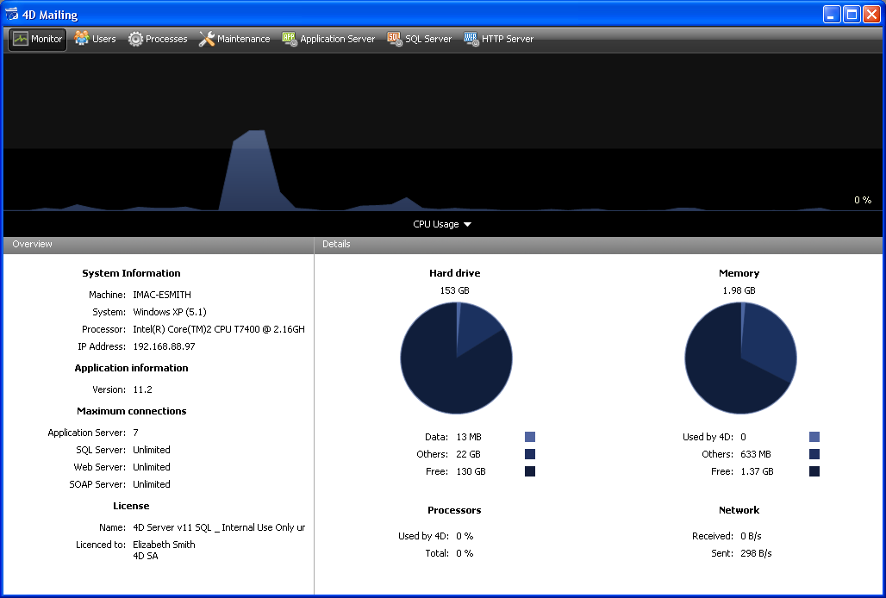

<!--REF #_command_.OPEN ADMINISTRATION WINDOW.Syntax-->**OPEN ADMINISTRATION WINDOW**<!-- END REF-->
<!--REF #_command_.OPEN ADMINISTRATION WINDOW.Params-->
| Does not require any parameters |  |
| --- | --- |

<!-- END REF-->

#### Description 

<!--REF #_command_.OPEN ADMINISTRATION WINDOW.Summary-->The **OPEN ADMINISTRATION WINDOW** command displays the server administration window on the machine that executes it.<!-- END REF--> The 4D Server administration window can be used to view the current parameters and to carry out various maintenance operations (see the 4D Server Reference Guide). Beginning with version 11 of 4D Server, this window can be displayed from a client machine: 



This command must be called in the context of a connected 4D application or a 4D Server. It does nothing if: 

* it is called in a 4D application in local mode,
* it is executed by a user other than the Designer or the Administrator (in this case, the error -9991 is generated, see the *Database Engine Errors (-10602 -> 4004)* section).

#### Example 

Here is the code for an administration button: 

```4d
 If(Application type=4D local mode)
    OPEN SECURITY CENTER
  // ...
 End if
 If(Application type=4D remote mode)
    OPEN ADMINISTRATION WINDOW
  // ...
 End if
 If(Application type=4D Server)
  // ...
    OPEN SECURITY CENTER
 End if
```

#### System variables and sets 

If the command has been executed correctly, the OK system variable is set to 1\. Otherwise, it is set to 0.

#### See also 

[OPEN SECURITY CENTER](open-security-center.md)  

#### Properties

|  |  |
| --- | --- |
| Command number | 1047 |
| Thread safe | &cross; |
| Modifies variables | OK, error |


