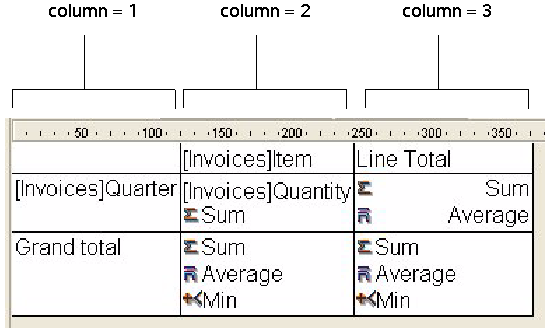

<!--REF #_command_.QR SET INFO COLUMN.Syntax-->**QR SET INFO COLUMN** ( *area* ; *colNum* ; *title* ; *object* ; *hide* ; *size* ; *repeatedValue* ; *displayFormat* )<!-- END REF-->
<!--REF #_command_.QR SET INFO COLUMN.Params-->
| Parameter | Type |  | Description |
| --- | --- | --- | --- |
| area | Integer | &#8594;  | Reference of the area |
| colNum | Integer | &#8594;  | Column number |
| title | Text | &#8594;  | Title of the column |
| object | Field, Variable | &#8594;  | Object assigned for that column |
| hide | Integer | &#8594;  | 0 = displayed, 1 = hidden |
| size | Integer | &#8594;  | Column size |
| repeatedValue | Integer | &#8594;  | 0 = not repeated, 1 = repeated |
| displayFormat | Text | &#8594;  | Format for the data |

<!-- END REF-->

#### Description 

<!--REF #_command_.QR SET INFO COLUMN.Summary-->##### List mode 

The **QR SET INFO COLUMN** command sets the parameters of an existing column.<!-- END REF--> 

*area* is the reference of the Quick Report area.

*colNum* is the number of the column to modify.

*title* is the title that will be displayed in the header of the column.

*object* is the actual object of the column (variable, field or formula).

*hide* specifies whether the column is shown or hidden:

* If *hide* is 1, the column is hidden;
* If *hide* is 0, the column is shown.

*size* is the size in pixels to assign to the column. If *size* is -1, the size is made automatic.

*repeatedValue* is the status for data repetition. For example, if the value for a field or variable does not change from one record to the other, it may or may not be repeated when they do not change. 

* If *repeatedValue* equals 0, values are not repeated.
* If *repeatedValue* equals 1, values are repeated.

*displayFormat* is the display format. Display formats are the 4D formats compatible with the data displayed.

The following statement sets the title of column #1 to Title, sets the contents of the body to Field2, makes the column visible with a width of 150 pixels and sets the format to ###,##.

```4d
 QR SET INFO COLUMN(area;1;"Title";"[Table 1]Field2";0;150;0;"###,##")
```

##### Cross-table mode 

The **QR SET INFO COLUMN** command allows you to set the same parameters but the reference of the areas to which it applies is different and varies depending on the parameter you want to set.   
First of all, the *title*, *hide*, and *repeatedValue* parameters are not used when this command is used in cross-table mode. The value to use for *colNum* varies depending on whether you want to set the column size or the data source and display format.

* Column size  
This is a “visual” attribute, therefore columns are numbered from left to right, as depicted below.



The following statement will set the size to automatic for all the columns in a cross-table report and will leave other elements unchanged:

```4d
 For($i;1;3)
    QR GET INFO COLUMN(qr_area;$i;$title;$obj;$hide;$size;$rep;$format)
    QR SET INFO COLUMN(qr_area;$i;$title;$obj;$hide;0;$rep;$format)
 End for
```

You will notice that since you want to alter only the column size, you have to use [QR GET INFO COLUMN](qr-get-info-column.md) to retrieve the column properties and pass them to **QR SET INFO COLUMN** to leave it unchanged, except for the column size.

* Data source (object) and display format  
In this case the numbering of columns operates as depicted below:


You will notice that not all cells can be addressed using the **QR SET INFO COLUMN** command, the cells that are not numbered above are addressed using [QR SET TOTALS DATA](qr-set-totals-data.md).

The following code assigns data sources to the three cells required for creating a basic cross-table report:

```4d
 QR SET REPORT TABLE(qr_area;Table(->[Invoices]))
 ALL RECORDS([Invoices])
 QR SET REPORT KIND(qr_area;2)
 QR SET INFO COLUMN(qr_area;1;"";->[Invoices]Item;1;-1;1;"")
 QR SET INFO COLUMN(qr_area;2;"";->[Invoices]Quarter;1;-1;1;"")
 QR SET INFO COLUMN(qr_area;3;"";->[Invoices]Quantity;1;-1;1;"")
```

This would be the resulting report area:


  
If you pass an invalid *area* number, the error -9850 will be generated.  
If you pass an invalid *colNum* value, the error -9852 will be generated.

#### See also 

[QR GET INFO COLUMN](qr-get-info-column.md)  
[QR Get info row](qr-get-info-row.md)  
[QR SET INFO ROW](qr-set-info-row.md)  

#### Properties

|  |  |
| --- | --- |
| Command number | 765 |
| Thread safe | &cross; |
| Modifies variables | error |


