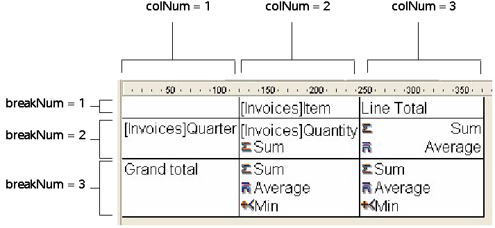

<!--REF #_command_.QR SET TOTALS DATA.Syntax-->**QR SET TOTALS DATA** ( *area* ; *colNum* ; *breakNum* ; operator | value )<!-- END REF-->
<!--REF #_command_.QR SET TOTALS DATA.Params-->
| Parameter | Type |  | Description |
| --- | --- | --- | --- |
| area | Integer | &#8594;  | Reference of the area |
| colNum | Integer | &#8594;  | Column number |
| breakNum | Integer | &#8594;  | Break number |
| operator &#124; value | Integer, Text | &#8594;  | Operator value for the cell or Cell content |

<!-- END REF-->

#### Description 

<!--REF #_command_.QR SET TOTALS DATA.Summary-->**Note:** This command cannot create a subtotal.<!-- END REF-->

##### List Mode 

The **QR SET TOTALS DATA** command sets the details of a specific break (total or subtotal). 

*area* is the reference of the Quick Report area.

*colNum* is the column number of the cell whose data is going to be set.

*breakNum* is the number of the break whose data will be set (subtotal or grand total). For a Subtotal, *breaknum* is the sort number. For the Grand total, *breaknum* equals -3 or the constant qr grand total of the *QR Operators* theme.

*operator* is an addition of all the operators present in the cell. You can use the constants of the *QR Operators* theme to set the value:

| Constant              | Type    | Value |
| --------------------- | ------- | ----- |
| qr average            | Integer | 2     |
| qr count              | Integer | 16    |
| qr max                | Integer | 8     |
| qr min                | Integer | 4     |
| qr standard deviation | Integer | 32    |
| qr sum                | Integer | 1     |

If *operator* is 0, there is no operator.

*value* is the text to be placed in the cell.

**Note:** Operator/value is mutually exclusive, so you either set an operator or a text.

You can pass the following values:  
\- # for the value that triggered the break or subtotal  
\- ##S will be replaced by the sum.  
\- ##A will be replaced by the Average.  
\- ##C will be replaced by the Count  
\- ##X will be replaced by the Max.  
\- ##N will be replaced by the Min.  
\- ##D will be replaced by the Standard deviation.  
\- ##xx, where xx is a column number. This will be replaced by that column’s value, using its formatting. If this column does not exist, then it will not be replaced. 

##### Cross-table Mode 

The **QR SET TOTALS DATA** command sets the details of a specific cell. 

*area* is the reference of the Quick Report area.

*colNum* is the column number of the cell whose data is going to be set.

*breakNum* is the row number of the cell whose data is going to be set.

*operator* is an addition of all the operators present in the cell. You can use the constants of the *QR Operators* theme to set the value (see above). 

*value* is the text to be placed in the cell.

Here is a depiction of how the parameters column and break have to be combined in cross-table mode:

##### Supported Types of Data 

The types of data that you can pass are of two basic kinds:

* Title  
A title is passed through the parameter *value*. The value is actually a string and can be passed only for the following cells: *colNum=3 breakNum=1* and *colNum=1* *breakNum=3*.
* Operator  
An operator or a combination of operators (as described above) can be passed for the following cells:  
*colNum*\=2, *breakNum*\=2  
*colNum*\=3, *breakNum*\=2  
*colNum*\=2, *breakNum*\=3  
Please note that these last two values affect the cell (Column 3; Row 3) as well. If a computation is defined in the cell (Column 2; Row 3), the contents of this cell (Column 2; Row 3) always define the contents of the cell (Column 3; Row 3).

If you pass an invalid *area* number, the error -9850 will be generated.  
If you pass an invalid *colNum* number, the error -9852 will be generated.  
If you pass an invalid *breakNum* number, the error -9853 will be generated.

#### See also 

[QR GET TOTALS DATA](qr-get-totals-data.md)  

#### Properties

|  |  |
| --- | --- |
| Command number | 767 |
| Thread safe | &cross; |
| Modifies variables | error |

