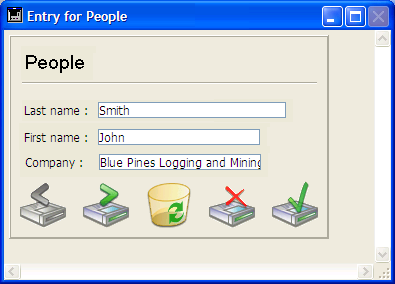
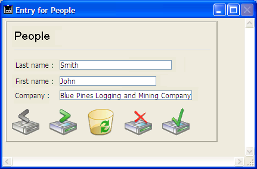

<!--REF #_command_.RESIZE FORM WINDOW.Syntax-->**RESIZE FORM WINDOW** ( *width* ; *height* )<!-- END REF-->
<!--REF #_command_.RESIZE FORM WINDOW.Params-->
| Parameter | Type |  | Description |
| --- | --- | --- | --- |
| width | Integer | &#8594;  | Pixels to add to or remove from the current form window width |
| height | Integer | &#8594;  | Pixels to add to or remove from the current form window height |

<!-- END REF-->

#### Description 

<!--REF #_command_.RESIZE FORM WINDOW.Summary-->The **RESIZE FORM WINDOW** command lets you change the size of the current form window.<!-- END REF--> 

Pass the number of pixels that you would like to add to the current window size in the *width* and *height* parameters. Pass 0 in either parameter if you do not wish to change the current size. To reduce the size, pass a negative value in the *width* and *height* parameters. 

This command produces the exact same result as a manual window resize using the resize box (if the window type allows it). As a result, the command takes into consideration resize properties for objects and size limitations defined in the form properties. If, for example, the command resizes a window to a size greater than what is allowed in the form, the command will have no effect. 

Please note that this behavior is different than that of the [SET WINDOW RECT](set-window-rect.md) command, which does not take form properties nor content into account when resizing the window. Also, note that this command does not necessarily modify the form size. To modify the size of a form by programming, please see the [FORM SET SIZE](form-set-size.md) command.

#### Example 

Given the following window (the fields and frame have the “Grow” property for horizontal resizing):



After execution of this line:

```4d
 RESIZE FORM WINDOW(25;0)
```

... the window appears as follows:



#### See also 

[FORM GET PROPERTIES](form-get-properties.md)  
[FORM SET SIZE](form-set-size.md)  
[SET WINDOW RECT](set-window-rect.md)  

#### Properties

|  |  |
| --- | --- |
| Command number | 890 |
| Thread safe | &cross; |


