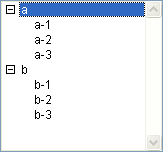

<!--REF #_command_.SELECT LIST ITEMS BY POSITION.Syntax-->**SELECT LIST ITEMS BY POSITION** ( {* ;} *list* ; *itemPos* {; *positionsArray*} )<!-- END REF-->
<!--REF #_command_.SELECT LIST ITEMS BY POSITION.Params-->
| Parameter | Type |  | Description |
| --- | --- | --- | --- |
| * | Operator | &#8594;  | If specified, list is an object name (string) If omitted, list is a list reference number |
| list | Integer, Text | &#8594;  | List reference number (if * omitted), or Name of list type object (if * passed) |
| itemPos | Integer | &#8594;  | Position of item in expanded/collapsed list(s) |
| positionsArray | Array integer | &#8594;  | Array of the positions in the expanded/collapsed list(s) |

<!-- END REF-->

#### Description 

<!--REF #_command_.SELECT LIST ITEMS BY POSITION.Summary-->The **SELECT LIST ITEMS BY POSITION** command selects the item(s) whose position is passed in *itemPos* and, optionally, in *positionsArray* within the list whose reference number or object name is passed in *list*.<!-- END REF-->

If you pass the first optional *\** parameter, you indicate that the *list* parameter is an object name (string) corresponding to a representation of the list in the form. If you do not pass this parameter, you indicate that the *list* parameter is a hierarchical list reference ([ListRef](# "A Longint reference to a hierachical list")). If you only use a single representation of the list, you can use either syntax. Conversely, if you use several representations of the same list, the syntax based on the object name is required since each representation can have its own expanded/collapsed configuration.

**Note:** If you use the @ character in the name of the list object and the form contains several lists that match with this name, the **SELECT LIST ITEMS BY POSITION** command will only apply to the first object whose name corresponds. 

The position of items is always expressed using the current expanded/collapsed state of the list and its sublists. You pass a position value between 1 and the value returned by [Count list items](count-list-items.md). If you pass a value outside this range, no item is selected.

If you do not pass the *positionsArray* parameter, the *itemPos* parameter represents the position of the item to be selected. 

The optional *positionsArray* parameter lets you select several items simultaneously within the *list*. In *positionsArray*, you must pass an array where each line indicates the position of an item to be selected. 

When you pass this parameter, the item designated by the *itemPos* parameter sets the new current item of the list among the resulting selection. It may or may not belong to the set of items defined by the array. The current item is, more particularly, the one that is edited if the [EDIT ITEM](edit-item.md) command is used. 

**Note:** In order for several items to be selected simultaneously in a hierarchical list (manually or by programming), the *multiSelections* property must have been enabled for this list. This property is set using the [SET LIST PROPERTIES](set-list-properties.md) command. 

#### Example 

Given the hierarchical list named *hList,* shown here in the Application environment:



After the execution of this code:

```4d
 SELECT LIST ITEMS BY POSITION(hList;Count list items(hList))
```

The last visible list item is selected:


After execution of the following lines of code:

```4d
 SET LIST PROPERTIES(hList;0;0;18;0;1)
  //It is imperative to pass 1 as the last parameter in order to allow multiple selections
 ARRAY LONGINT($arr;3)
 $arr{1}:=2
 $arr{2}:=3
 $arr{3}:=5
 SELECT LIST ITEMS BY POSITION(hList;3;$arr)
  //The 3rd item is designated as the current item
```

... the 2nd, 3rd and 5th items of the hierarchical list are selected:


#### See also 

[EDIT ITEM](edit-item.md)  
[SELECT LIST ITEMS BY REFERENCE](select-list-items-by-reference.md)  
[Selected list items](selected-list-items.md)  

#### Properties

|  |  |
| --- | --- |
| Command number | 381 |
| Thread safe | &cross; |


