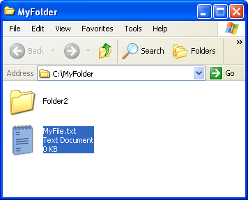

<!--REF #_command_.SHOW ON DISK.Syntax-->**SHOW ON DISK** ( *pathname* {; *} )<!-- END REF-->
<!--REF #_command_.SHOW ON DISK.Params-->
| Parameter | Type |  | Description |
| --- | --- | --- | --- |
| pathname | Text | &#8594;  | Pathname of item to show |
| * | Operator | &#8594;  | If the item is a folder, show its contents |

<!-- END REF-->

#### Description 

<!--REF #_command_.SHOW ON DISK.Summary-->The SHOW ON DISK command displays the file or folder whose pathname was passed in the *pathname* parameter in a standard window of the operating system.<!-- END REF-->  
In a user interface, this command lets you designate the location of a specific file or folder.

By default, if *pathname* designates a folder, the command displays the level of the folder itself. If you pass the optional *\** parameter, the command opens the folder and displays its contents in the window. If *pathname* designates a file, the *\** parameter is ignored. 

#### Example 

The following examples illustrate the operation of this command:

```4d
 SHOW ON DISK("c:\\MyFolder\\MyFile.txt") // Displays the designated file
```



```4d
 SHOW ON DISK("c:\\MyFolder\\Folder2") // Displays the designated folder
```


```4d
 SHOW ON DISK("c:\\MyFolder\\Folder2";*) // Displays the contents of the designated folder
```


#### System variables and sets 

The system variable OK is set to 1 if the command is executed correctly. 


#### Properties

|  |  |
| --- | --- |
| Command number | 922 |
| Thread safe | &check; |
| Modifies variables | OK, error |


