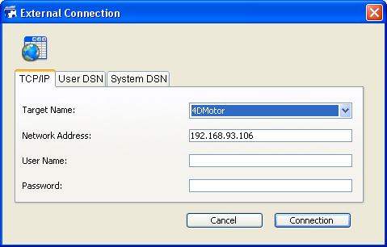

<!--REF #_command_.SQL LOGIN.Syntax-->**SQL LOGIN** {( *dataEntry* ; *userName* ; *password* ; * )}<!-- END REF-->
<!--REF #_command_.SQL LOGIN.Params-->
| Parameter | Type |  | Description |
| --- | --- | --- | --- |
| dataEntry | Text | &#8594;  | Publication name of 4D database or IP address of remote database or Name of the data source entry in the ODBC Manager or "" to display the selection dialog box |
| userName | Text | &#8594;  | Name of the user registered in the data source |
| password | Text | &#8594;  | Password of the user registered in the data source |
| * | Operator | &#8594;  | Applied to Begin SQL/End SQL If omitted: do not apply (local database); if passed: apply |

<!-- END REF-->

#### Description 

<!--REF #_command_.SQL LOGIN.Summary-->The **SQL LOGIN** command allows you to connect to an SQL data source specified in the *dataEntry* parameter.<!-- END REF--> It designates the target of the SQL queries executed subsequently in the current process: 

* via the [SQL EXECUTE](sql-execute.md) command,
* via code placed within the Begin SQL / End SQL tags (if the *\** parameter is passed).

The SQL data source can either be:

* an external 4D Server database that you access directly,
* an external ODBC source,
* the local 4D database (internal database).

In *dataEntry*, you can pass one of the following values: an IP address, a 4D database publication name, an ODBC data source name, an empty string or the SQL\_INTERNAL constant.

* **IP address**  
Syntax: **IP:<IPAddress>{:<TCPPort>}**  
In this case, the command opens a direct connection with the 4D Server database executed on the machine with the IP address specified. On the "target" machine, the SQL server must be started. If you pass a TCP port number, it must have been specified as the publication port of the SQL server in the "target" database. If you do not pass a TCP port number, the default port will be used (19812). The TCP port number of the SQL server can be modified on the "SQL" page of the Database Settings. Refer to examples 4 and 5.  
If you have enabled TLS for the "target" SQL server (option available in the Database Settings), you must add the ":ssl" keyword to the end of the IP address and TCP port number (mandatory in that case) in order for the server to be able to handle the request correctly (see example 6).
* **4D database publication name**  
Syntax: **4D:<Publication\_Name>**  
In this case, the command opens a direct connection with the 4D Server database whose publication name on the network corresponds to the name specified. The network publication name of a database is set on the "Client-Server" page of the Database Settings.  
Refer to example 4.  
**Note:** The TCP port number of the target 4D SQL server (that publishes the 4D database) and the TCP port number of the SQL server of the 4D application that opens the connection must be the same.
* **valid ODBC data source name**  
Syntax: **ODBC:<My\_DSN> or <My\_DSN>**  
In this case, the *dataEntry* parameter contains the name of the data source as it has been set in the ODBC driver manager.  
**Notes:**  
   * For compatibility with previous versions of 4D, it is possible to omit the "ODBC:" prefix. However, for better code readability, it is recommended to use this prefix.  
   Refer to example 2.  
   * Under Windows, the data source name is case sensitive. For example, if the data source was defined as "4D\_v16", passing the value "4D\_V16" will fail.  
   * Under Windows and Mac, the "ODBC:" prefix must be entered using uppercase letters. If you pass "odbc:", the connection will fail.
* **empty string**  
Syntax: *""*  
In this case, the command displays the connection dialog box so that the data source to be connected to can be entered manually:  
    
  
    
This dialog box includes several pages. The TCP/IP page includes the following elements:  
   * Target Name: This menu is built using two lists:  
         * The list of databases that have been opened recently in direct connection. The mechanism for updating this list is the same as that of the 4D application, except that the folder containing the .4DLink files is named "Favorites SQL vXX" instead of "Favorites vXX".  
         * The list of 4D Server applications whose SQL server is started and whose TCP port for SQL connections is the same as that of the source application. This list is dynamically updated on each new call to the **SQL LOGIN** command without the *dataEntry* parameter. If the "^" character is placed before a database name, this indicates that the connection has been made in secured mode via SSL.  
   * Network Address: This area displays the address and possibly the TCP port of the database selected in the Target Name menu. You can also enter an IP address in this area and then click on the Connection button in order to connect to the corresponding 4D Server database. You can also specify the TCP port by entering a colon (:) followed by the port number after the address. For example: 192.168.93.105:19855  
   * User Name and Password: These areas can be used to enter the con-nection identifiers.  
   * The User DSN and System DSN pages display, respectively, the list of user and system ODBC data sources specified in the ODBC driver of the machine. These pages can be used to select a data source and enter the identifiers in order to open a connection with an external ODBC data source.  
    
If the connection is established, the OK system variable is set to 1\. Otherwise, it is set to 0 and an error is generated. This error can be intercepted via an error-handling method installed by the [ON ERR CALL](on-err-call.md) command.
* **SQL\_INTERNAL constant**  
Syntax: SQL\_INTERNAL  
In this case, the command redirects subsequent SQL queries to the internal 4D database.

**Warning:** The prefixes used in the *dataEntry* parameter (IP, ODBC, 4D) must be written in uppercase. 

*userName* contains the name of the user authorized to connect to the external data source. For example, with Oracle®, the user name can be “Scott”.

*password* contains the password of the user authorized to connect to the external data source. For example, with Oracle®, the password can be “tiger”.

**Note:** In the case of a direct connection, if you pass empty strings in the *userName* and *password* parameters, the connection will only be accepted if 4D passwords are not activated in the target database. Otherwise, the connection will be refused.

The optional *\** parameter can be used to change the target of the SQL code executed within the Begin SQL/End SQL tags. If you do not pass this parameter, the code placed within the Begin SQL/End SQL tags will still be sent to the internal SQL engine of 4D, without taking the configuration specified by the **SQL LOGIN** command into account. If you do pass this parameter, the SQL code executed within the Begin SQL/End SQL tags will be sent to the source specified in the *dataEntry* parameter. 

To close the current connection and free the memory, simply execute the [SQL LOGOUT](sql-logout.md) command. All the SQL queries are then sent to the internal 4D SQL database.   
If you call **SQL LOGIN** again without having explicitly closed the current connection, it will be closed automatically. 

**Note:** In the case where an external connection attempt via **SQL LOGIN** fails, the internal 4D database automatically becomes the current data source.

These parameters are optional; if no parameters are passed, the command will bring up the ODBC Login dialog box that allows you to select the external data source. 

The scope of this command is per process; in other words, if you want to execute two distinct connections, you must create two processes and execute each connection in each process. 

**Warning:** It is not possible to open an ODBC connection in the contexts described below. These configurations lead to blocking of the application:

* connection via ODBC from the running application to itself
* connection via ODBC from a 4D application to 4D Server when a standard client/server connection is already open between these two applications.

#### Example 1 

This statement will bring up the ODBC Manager dialog box: 

```4d
 SQL LOGIN
```

#### Example 2 

Opening of a connection via the ODBC protocol with the "MyOracle" external data source. SQL queries executed via the [SQL EXECUTE](sql-execute.md "SQL EXECUTE") command and queries included within the [Begin SQL](begin-sql.md "Begin SQL")/[End SQL](end-sql.md "End SQL") tags will be redirected to this connection:

```4d
 SQL LOGIN("ODBC:MyOracle";"Scott";"tiger";*)
```

#### Example 3 

Open a connection with the 4D internal SQL kernel:

```4d
 SQL LOGIN(SQL_INTERNAL;$user;$password)
```

#### Example 4 

Opening of a direct connection with the 4D Server application executed on the machine having the IP address 192.168.45.34 and replying on the default TCP port. The SQL queries executed via the [SQL EXECUTE](sql-execute.md "SQL EXECUTE") command will be redirected to this connection; the queries included within the [Begin SQL](begin-sql.md "Begin SQL")/[End SQL](end-sql.md "End SQL") tags will not be redirected. 

```4d
 SQL LOGIN("IP:192.168.45.34";"John";"azerty")
```

#### Example 5 

Opening of a direct connection with the 4D Server application executed on the machine having the IP address 192.168.45.34 and replying on TCP port 20150\. The SQL queries executed via the [SQL EXECUTE](sql-execute.md "SQL EXECUTE") command and the queries included within the [Begin SQL](begin-sql.md "Begin SQL")/[End SQL](end-sql.md "End SQL") tags will be redirected to this connection. 

```4d
 SQL LOGIN("IP:192.168.45.34:20150";"John";"azerty";*)
```

#### Example 6 

Opening of a direct connection in TLS with the 4D Server application running on the machine with the IP address 192.168.45.34 and responding on the default TCP port. You must have enabled TLS for the SQL server on the 4D Server application:

```4d
 SQL LOGIN("IP:192.168.45.34:19812:ssl";"Admin";"sd156") // Note the ":ssl" after of the IP address and TCP port
```

#### Example 7 

Opening of a direct connection with the 4D Server application executed on the machine having the IPv6 address 2a01:e35:2e41:c960:dc39:3eb0:f29b:3747 and replying on the TCP port 20150\. The SQL queries executed via the [SQL EXECUTE](sql-execute.md) command will be redirected to this connection; the queries included within the [Begin SQL](begin-sql.md)/[End SQL](end-sql.md) tags will not be redirected.

```4d
 SQL LOGIN("IP:[2a01:e35:2e41:c960:dc39:3eb0:f29b:3747]:20150";"John";"qwerty")
```

#### Example 8 

Opening of a direct connection with the 4D Server application which publishes, on the local network, a database whose publication name is "Accounts\_DB." The TCP port used for the SQL server of both databases (set on the SQL page of the Database Settings) must be the same (19812 by default). The SQL queries executed via the [SQL EXECUTE](sql-execute.md "SQL EXECUTE") command will be redirected to this connection; the queries included within the [Begin SQL](begin-sql.md "Begin SQL")/[End SQL](end-sql.md "End SQL") tags will not be redirected. 

```4d
 SQL LOGIN("4D:Accounts_DB";"John";"azerty")
```

#### Example 9 

This example illustrates the connection possibilities provided by the SQL LOGIN command:   

```4d
 ARRAY TEXT(aNames;0)
 ARRAY LONGINT(aAges;0)
 SQL LOGIN("ODBC:MyORACLE";"Marc";"azerty")
 If(OK=1)
  //The following query will be redirected to the external ORACLE database
    SQL EXECUTE("SELECT Name, Age FROM PERSONS";aNames;aAges)
  //The following query will be sent to the local 4D database
    Begin SQL
       SELECT Name, Age
       FROM PERSONS
       INTO :aNames, :aAges;
    End SQL
  //The following SQL LOGIN command closes the current connection
  //with the external ORACLE database and opens a new connection
  //with an external MySQL database
    SQL LOGIN("ODBC:MySQL";"Jean";"qwerty";*)
    If(OK=1)
  //The following query will be redirected to the external MySQL database
       SQL EXECUTE("SELECT Name, Age FROM PERSONS";aNames;aAges)
  //The following query will also be redirected to the external MySQL database
       Begin SQL
          SELECT Name, Age
          FROM PERSONS
          INTO :aNames, :aAges;
       End SQL
       SQL LOGOUT
  //The following query will be sent to the local 4D database
       Begin SQL
          SELECT Name, Age
          FROM PERSONS
          INTO :aNames, :aAges;
       End SQL
    End if
 End if
```

#### System variables and sets 

If the connection is successful, the system variable OK is set to 1; otherwise, it is set to 0.

#### See also 

[Begin SQL](begin-sql.md)  
[End SQL](end-sql.md)  
[SQL LOGOUT](sql-logout.md)  

#### Properties

|  |  |
| --- | --- |
| Command number | 817 |
| Thread safe | &cross; |
| Modifies variables | OK |


